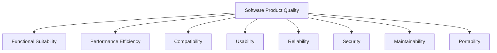
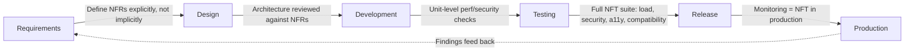

# Part 1: NFT Fundamentals & the ISO 25010 Quality Model

> **Study Guide for QA Professionals** — Non-Functional Testing, from first principles
> Difficulty Level: Intermediate to Advanced | Estimated Reading Time: 45 minutes

---

## Table of Contents

1. [What Is Non-Functional Testing, Really?](#11-what-is-non-functional-testing-really)
2. [Why NFT Gets Skipped — and What That Actually Costs](#12-why-nft-gets-skipped--and-what-that-actually-costs)
3. [Functional vs. Non-Functional: The Real Distinction](#13-functional-vs-non-functional-the-real-distinction)
4. [The ISO/IEC 25010 Quality Model](#14-the-isoiec-25010-quality-model)
5. [The Full NFT Landscape — A Map of This Course](#15-the-full-nft-landscape--a-map-of-this-course)
6. [NFT in the SDLC — When to Start](#16-nft-in-the-sdlc--when-to-start)
7. [Common Misconceptions](#17-common-misconceptions)
8. [📌 Fact Sheet — Part 1 in 60 Seconds](#-fact-sheet--part-1-in-60-seconds)
9. [Common Interview Questions](#common-interview-questions)

---

## 1.1 What Is Non-Functional Testing, Really?

Ask ten testers to define "non-functional testing" and you'll get ten answers, most of
them some version of "testing things that aren't features." That's not wrong, but it's
not useful either — it tells you what NFT *isn't*, not what it *is*.

Here's the sharper version: **functional testing asks "does it do the right thing?"
Non-functional testing asks "does it do the right thing *well enough, safely enough,
and reliably enough* — under conditions the happy-path demo never shows you?"**

A login form that authenticates the right user with the right password is functionally
correct. Whether it authenticates that user in 200ms or 20 seconds, whether it survives
50,000 people logging in at 9:00 AM sharp on results day, whether an attacker can brute
force it in an afternoon, whether a screen-reader user can actually operate it, whether
it renders correctly on a five-year-old Android phone on a 3G connection — none of that
is covered by "the login works." That's the entire territory of this course.

### A scene to set the stakes

On November 15, 2022, Ticketmaster opened general ticket sales for Taylor Swift's Eras
Tour. The functional path — search for a show, select seats, pay — worked exactly as
designed for every person who tested it beforehand. What nobody had tested at the
actual scale of the real event was **millions of fans hitting the same endpoints in the
same three-minute window**. The system didn't have a feature bug. It had a
**non-functional** one: nobody had proven it could survive its own popularity. The sale
collapsed, tickets were pulled, and it ended up in front of the U.S. Senate.

That's not a freak accident — it's a pattern. Flipkart's Big Billion Day sale has
crashed under launch-day traffic more than once. Major banks including Barclays and SBI
have had their apps go down during routine high-traffic hours, not exotic ones.
Healthcare.gov's 2013 launch let just 6 of the first 248 people who tried to enroll
actually succeed — a functional feature (enrollment) undone entirely by a
non-functional failure (the system couldn't handle real launch-day load). In every one
of these, QA almost certainly confirmed the feature "worked." Nobody confirmed it
worked **at the scale, under the conditions, and against the threats of the real
world** — which is the entire point of everything in this course.

> [!TIP]
> **🎭 Meme Break — Distracted Boyfriend**
>
> 🚶 *The release checklist, walking with:* **"All functional test cases: PASS"**  
> 👀 *Looking back at:* **"500,000 people about to hit this endpoint at the exact same
> second on launch day"**

🧠 <strong>Quick Check:</strong> A login feature authenticates the correct user 100% of the time in every functional test. Why isn't that enough to sign off the release?

Because "authenticates correctly" only proves the feature is *functionally* correct —
it says nothing about whether it stays correct under 50,000 concurrent logins, whether
it resists a credential-stuffing attack, whether it's fast enough not to feel broken,
or whether it's usable by someone on a screen reader. Ticketmaster's checkout flow was
functionally correct too, right up until real-world scale exposed the non-functional
gap nobody had tested for.

---

## 1.2 Why NFT Gets Skipped — and What That Actually Costs

Non-functional testing loses the prioritization fight constantly, for reasons that
sound reasonable in the moment and turn out to be expensive in hindsight:

| The reasoning | Why it's a trap |
|---|---|
| "We're behind schedule, let's ship and see how it performs in prod" | Production *is* the worst possible place to discover a load ceiling — it's also where your users are |
| "Security testing needs a specialist we don't have" | True for deep penetration testing; false for OWASP Top 10 fundamentals, which any QA engineer can learn (Part 4–5 of this course) |
| "Accessibility is a nice-to-have" | It's a legal requirement in many jurisdictions, and automated tools only catch 30–40% of WCAG violations anyway — skipping manual accessibility testing means shipping mostly untested |
| "It performed fine when I tested it" | One tester, one session, one browser, one network condition is not evidence of anything at scale |

The 1-10-100 cost curve you may already know from functional defects applies with
extra force here, because non-functional defects tend to be **systemic, not local**. A
functional bug is usually one broken button. A performance defect discovered in
production is often an architectural assumption that's wrong everywhere at once — and
by then, it's not a code review comment, it's an incident with a war room.

> [!WARNING]
> **🎭 Meme Break — "This Is Fine" Dog**
>
> 🔥 *The dashboard shows every functional test green.*
> 🔥 *The load test was "we'll do it before the next big sale."*
> 🔥 *This is fine.*

---

## 1.3 Functional vs. Non-Functional: The Real Distinction

| | Functional Testing | Non-Functional Testing |
|---|---|---|
| **Core question** | Does it do the right thing? | Does it do it well, safely, reliably? |
| **Source of requirements** | Business rules, user stories, acceptance criteria | Quality attributes — often unstated until something breaks |
| **Typical defect** | Wrong output, missing validation, broken flow | Slow under load, insecure, inaccessible, incompatible, unreliable |
| **When it's usually caught** | Before release, if tested at all | Often in production, if never explicitly planned for |
| **Example** | "Clicking 'Pay' charges the correct amount" | "Clicking 'Pay' still responds in under 2 seconds when 10,000 other people are also clicking Pay" |

A genuinely useful mental model: **functional requirements describe what the system
does; non-functional requirements describe the conditions under which it has to keep
doing it.** Both are equally "real" requirements — the difference is that functional
ones tend to get written down, and non-functional ones tend to get assumed.

🧠 <strong>Quick Check:</strong> A user story says "As a merchant, I can generate a settlement report." Write one functional and one non-functional requirement hiding inside that single sentence.

Functional: the report contains the correct transactions, totals, and date range for
the merchant who requested it. Non-functional: the report generates within an
acceptable time even when the merchant has 100,000 transactions in the period (a
**performance** requirement), and the report is only accessible to that merchant's
authorized users (a **security** requirement). Neither of those is in the original
sentence — both are real requirements the system has to meet anyway.

---

## 1.4 The ISO/IEC 25010 Quality Model

You don't need to memorize a standard to test software well, but ISO/IEC 25010 is
worth knowing because it's the closest thing the industry has to a **complete,
agreed-upon checklist** of what "quality" means beyond "does it work" — and this
entire course is organized around it.

### The original (2011) model — 8 characteristics

The version most QA material still teaches:

### The 2023 revision — 9 characteristics

ISO 25010 was updated in 2023, and the changes are worth knowing because you'll see
both versions in the wild:

- **Usability was renamed Interaction Capability** — broadened to explicitly include
  inclusivity and self-descriptiveness, pulling accessibility closer to the center of
  the model rather than treating it as a usability afterthought.
- **Portability was renamed Flexibility** — and gained emphasis on scalability
  (handling growth) as a named sub-characteristic, not just an implicit performance
  concern.
- **Safety was added as a new, standalone characteristic** — separating "won't harm
  people or property" from security's "won't be breached," which matters enormously
  for anything touching medical devices, autonomous systems, or financial harm.
- **Reliability's core sub-characteristic shifted from "maturity" to
  "faultlessness"** — a subtle but real shift in emphasis toward absence of defects
  over general system maturity.

| Characteristic (2023) | Plain-English question | Where it's covered in this course |
|---|---|---|
| Functional Suitability | Does it do the right thing? | *(Not this course — see the Manual Testing Playbook)* |
| Performance Efficiency | Is it fast and resource-efficient enough? | Parts 2–3 |
| Compatibility | Does it work with the other systems/environments it must share? | Part 8 |
| Interaction Capability | Can real people, including those with disabilities, actually use it? | Parts 6–7 |
| Reliability | Does it keep working, and recover well when it doesn't? | Part 9 |
| Security | Is it resistant to unauthorized access, misuse, and attack? | Parts 4–5 |
| Maintainability | Can it be understood, modified, and extended without excessive cost? | Part 10 |
| Flexibility | Can it be moved, scaled, and adapted to new contexts? | Part 10 |
| Safety | Can it avoid causing harm to people, property, or the environment? | Referenced throughout Parts 4–5, 9 |

> [!TIP]
> **🎭 Meme Break — Expanding Brain**
>
> 🧠 *Level 1: "Non-functional testing is just performance testing."*  
> 🧠🧠 *Level 2: "Oh, and security testing too."*  
> 🧠🧠🧠 *Level 3: "And usability, accessibility, compatibility, reliability..."*  
> 🧠🧠🧠🧠 *Level 4: There's an actual ISO standard with 9 named characteristics, and
> you're about to learn all of them properly, in 13 parts.*

🧠 <strong>Quick Check:</strong> A 2023-model characteristic renamed from "Usability" now explicitly bakes in inclusivity and self-descriptiveness. Why does folding accessibility into the core interaction model — rather than treating it as a separate checkbox — matter in practice?

Because when accessibility is a separate, optional checklist, it's the first thing cut
under deadline pressure — it reads as "extra," not "the feature." Renaming Usability to
Interaction Capability and building inclusivity into the definition itself is a
structural nudge: a screen-reader user failing to complete a flow isn't a *usability
edge case*, it's the same category of failure as a sighted user failing to complete it.
That's a meaningfully different starting assumption for how a team prioritizes fixes.

---

## 1.5 The Full NFT Landscape — A Map of This Course

Thirteen parts, organized around the ISO 25010 characteristics but grouped the way
you'll actually plan and execute this work on a real project:

| Part | Covers | ISO 25010 Characteristic(s) |
|---|---|---|
| 2 | Load & Stress Testing | Performance Efficiency |
| 3 | Spike, Soak, Scalability & Volume Testing | Performance Efficiency, Flexibility |
| 4 | Security Testing I — OWASP & Fundamentals | Security |
| 5 | Security Testing II — Pen Testing & DevSecOps | Security |
| 6 | Usability & Interaction Testing | Interaction Capability |
| 7 | Accessibility Testing | Interaction Capability |
| 8 | Compatibility Testing | Compatibility |
| 9 | Reliability, Availability & Recovery Testing | Reliability |
| 10 | Maintainability & Portability Testing | Maintainability, Flexibility |
| 11 | Compliance, Privacy & Localization Testing | Security, Flexibility |
| 12 | NFT Test Planning & Strategy | *(cross-cutting)* |
| 13 | NFT in CI/CD, Chaos Engineering & Modern Trends | *(cross-cutting)* |

Security gets two full parts in this course, not one — deliberately. It's the
characteristic with the highest blast radius when skipped (a performance miss is
embarrassing; a security miss can be existential), and the one most QA engineers get
the least hands-on practice with before being asked to own it.

---

## 1.6 NFT in the SDLC — When to Start

The honest answer: **earlier than feels natural.** Non-functional requirements are
architectural, which means the cost curve for fixing them late is even steeper than for
functional defects — you're not patching a screen, you're sometimes re-architecting a
data flow.

The practical version of "start early": when a user story says "merchants can view
their transaction history," a non-functional-aware team asks *right then* — how many
transactions, how fast does it need to load, who's allowed to see it, does it need to
work on a 2018 Android phone — instead of discovering the answers during a performance
test three days before release.

---

## 1.7 Common Misconceptions

> [!CAUTION]
> **🎭 Meme Break — Galaxy Brain**
>
> 🌌 *Small brain: "NFT is optional, we'll add it if there's time."*  
> 🌌🌌 *Glowing brain: "NFT is a separate phase after functional testing is done."*  
> 🌌🌌🌌 *Galaxy brain: NFT requirements shape the architecture before a single line
> of functional code is written — by the time you're "testing" performance, the ceiling
> was already decided months ago.*

- **"NFT is one phase at the end."** In practice it's continuous — security and
  performance regressions can be introduced by any change, which is exactly why Part
  13 covers wiring NFT into CI/CD rather than treating it as a pre-release gate only.
- **"Load testing and stress testing are the same thing."** They test different
  questions (expected load vs. breaking point) — Parts 2–3 draw this out precisely.
- **"Security testing means hiring a pentester."** Deep penetration testing does need
  specialists, but OWASP Top 10 fundamentals, input validation checks, and basic
  authentication/authorization testing are core QA skills — Parts 4–5.
- **"Automated accessibility scans mean we're WCAG compliant."** Automated tools catch
  roughly 30–40% of WCAG violations at best. The rest needs a human with a keyboard
  and a screen reader — Part 7.

---

## 📌 Fact Sheet — Part 1 in 60 Seconds

- **Functional testing asks "does it do the right thing?" Non-functional testing asks
  "does it keep doing it well, safely, and reliably under real-world conditions?"**
- Real, well-documented NFT failures — Ticketmaster's 2022 Eras Tour sale collapse,
  Flipkart's Big Billion Day crashes, Healthcare.gov's 2013 launch, repeated banking
  app outages under routine peak load — all involved functionally correct features
  that failed non-functionally at real-world scale.
- **ISO/IEC 25010** is the closest thing to an industry-agreed checklist for software
  quality beyond correctness. The original (2011) model has 8 characteristics; the
  2023 revision has 9.
- 2023 renames worth remembering: **Usability → Interaction Capability** (folds in
  inclusivity/accessibility), **Portability → Flexibility** (adds scalability),
  **Safety added as new** (harm-to-people/property, distinct from Security's
  breach-resistance).
- Non-functional defects tend to be **systemic and architectural**, not local — which
  is why the cost-of-late-discovery curve is even steeper than for functional bugs.
- This course dedicates **two full parts to Security** (4–5) — deliberately, because
  it has the highest blast radius when skipped and the least hands-on QA practice
  historically.
- **Automated accessibility tools only catch 30–40% of WCAG violations** — a fact
  worth remembering every time someone says "we ran the scanner, we're compliant."
- NFT should start at requirements time, not test-execution time — a story like
  "merchants can view transaction history" already contains unstated performance and
  security requirements the moment it's written.

---

## Common Interview Questions

### Question 1: What's the difference between functional and non-functional testing?

**Model Answer:**

"Functional testing verifies that the system does the right thing — correct outputs
for given inputs, correct business logic. Non-functional testing verifies the
conditions under which the system keeps doing that correctly — performance under
load, resistance to security threats, usability for real and disabled users,
compatibility across environments, and reliability over time. A feature can be 100%
functionally correct and still fail catastrophically in production if the
non-functional side was never tested — Ticketmaster's 2022 ticket sale is a textbook
example: the checkout flow worked perfectly in testing, but nobody had proven it could
survive the real-world concurrent load of the actual sale."

### Question 2: Why is ISO 25010 useful for a QA engineer who isn't pursuing certification?

**Model Answer:**

"It's a complete, standardized checklist of what 'quality' means beyond correctness —
performance, compatibility, usability/interaction, reliability, security,
maintainability, flexibility, and safety. Without a model like this, non-functional
test planning tends to default to 'whatever the last project needed,' which means
gaps get repeated. Using ISO 25010 as a planning checklist — even informally — is a
fast way to make sure a test strategy hasn't silently skipped an entire quality
dimension."

### Question 3: A stakeholder says "we don't have time for non-functional testing this release." How do you respond?

**Model Answer:**

"I'd reframe it as a risk conversation, not a testing-scope conversation: which
non-functional risks are we consciously accepting by not testing them? If this release
touches a payment flow, skipping security testing isn't 'saving time,' it's accepting
breach risk without evaluating it. I'd propose a risk-based cut — full NFT coverage
isn't realistic on every release, but a fast pass on the highest-risk characteristics
(usually security and performance on anything customer- or money-facing) is almost
always worth the hours it costs."
