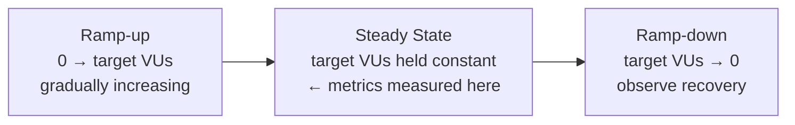

# Part 2: Performance Testing I — Load & Stress Testing

> **Study Guide for QA Professionals** — Performance Efficiency, from concurrent users to breaking points
> Difficulty Level: Intermediate to Advanced | Estimated Reading Time: 50 minutes

---

## Table of Contents

1. [Why Performance Testing Is Its Own Discipline](#21-why-performance-testing-is-its-own-discipline)
2. [Load Testing — Verifying the Expected](#22-load-testing--verifying-the-expected)
3. [The Metrics That Actually Matter](#23-the-metrics-that-actually-matter)
4. [Stress Testing — Finding Where It Breaks](#24-stress-testing--finding-where-it-breaks)
5. [Load vs. Stress — The Distinction That Keeps Getting Blurred](#25-load-vs-stress--the-distinction-that-keeps-getting-blurred)
6. [Performance Testing Vocabulary You Need Cold](#26-performance-testing-vocabulary-you-need-cold)
7. [The Tool Landscape — k6, JMeter, Gatling, Locust](#27-the-tool-landscape--k6-jmeter-gatling-locust)
8. [Designing a Load Test Plan That Means Something](#28-designing-a-load-test-plan-that-means-something)
9. [Two Real Load Tests, Narrated](#29-two-real-load-tests-narrated)
10. [📌 Fact Sheet — Part 2 in 60 Seconds](#-fact-sheet--part-2-in-60-seconds)
11. [Common Interview Questions](#common-interview-questions)

---

## 2.1 Why Performance Testing Is Its Own Discipline

Part 1 opened with Ticketmaster's 2022 Eras Tour collapse as the scene-setter for the
whole course. It's worth reopening here, because it's specifically a **load** failure,
and the sharper question this Part asks is: what test would actually have caught it?

Not a functional test — those all passed. Not even "some" performance testing — reports
afterward suggested Ticketmaster's systems had handled large on-sales before. The gap
was that nobody had modeled a load test at the *actual* shape of that specific event:
millions of fans, informed in advance of an exact start time, all converging on the same
few endpoints (queue entry, seat search, checkout) within the same three-minute window,
with bots amplifying the real number further. A load test built around "average daily
traffic times ten" would have passed comfortably and still said nothing useful, because
the real event wasn't average traffic scaled up — it was a coordinated spike shaped
nothing like organic growth.

That's the whole discipline in one sentence: **performance testing isn't one test, it's
a family of tests that each ask a different question about how the system behaves under
different traffic shapes.** This Part covers the two most foundational members of that
family — load and stress. Part 3 covers their siblings: spike, soak, and scalability
testing, which ask "what if it's sudden," "what if it's for days," and "what if we throw
more resources at it."

> [!TIP]
> **🎭 Meme Break — Drake Hotline Bling**
>
> ❌ *"We ran a performance test, we're good."*  
> ✅ *"We ran a **load** test at expected traffic, a **stress** test to find the
> ceiling, and we know the difference between the two questions we just answered."*

---

## 2.2 Load Testing — Verifying the Expected

**Load testing** verifies that a system behaves correctly and performs acceptably under
**expected, anticipated real-world load** — the traffic you actually plan for, not an
extreme. It answers a narrow, business-grounded question: *"When the number of
concurrent users and transactions per second we expect in production actually shows up,
does the system still meet its response-time, throughput, and error-rate targets?"*

The word doing the heavy lifting there is **expected**. Load testing is not about seeing
how far you can push a system — that's stress testing's job (Section 2.4). Load testing
is about proving the system does its job under the load you're contractually,
operationally, or reasonably obligated to handle: your busiest normal Monday morning,
your typical end-of-month settlement run, your usual concurrent merchant count — not a
worst-case flash-sale scenario unless a flash sale is genuinely part of your expected
traffic.

A load test plan is only as good as the load model behind it. "Expected load" for a
payment collection API isn't a single number — it's a **profile**: how many merchants
are typically active concurrently, how many transactions per second each generates
during peak hours (not average hours), and what the request mix looks like (mostly
collection-initiation calls, with some status polling and webhook traffic mixed in). Get
that profile wrong — model average traffic instead of peak traffic, or model peak
traffic but ignore the request mix — and a "passing" load test proves nothing about
production behavior.

🧠 <strong>Quick Check:</strong> A team runs a load test at "average daily traffic × 2" and it passes cleanly. Is that sufficient evidence the system is production-ready?

Not necessarily. "Average traffic × 2" is an arbitrary multiplier, not a load model
grounded in the system's actual expected peak. If the real peak — say, the first hour
after a billing cycle triggers, or the lunch-hour spike on a food-delivery platform — is
five times average rather than two times, the load test passed against the wrong
number. A meaningful load test models the *actual anticipated peak concurrency and
transaction rate*, ideally derived from real traffic analytics or a documented business
projection, not a round-number guess.

---

## 2.3 The Metrics That Actually Matter

A load test that reports "it passed" without numbers is not a load test — it's an
opinion. Four metric families do the real work:

### Response time percentiles

Averages lie. If 95 out of 100 requests return in 100ms and 5 take 10 seconds, the
*average* looks fine (~590ms) while 1 in 20 real users is having a terrible experience.
Percentiles fix this by describing the actual distribution:

| Percentile | What it means | Why it matters |
|---|---|---|
| **P50 (median)** | Half of all requests were faster than this | Describes the "typical" experience — but ignores the tail entirely |
| **P90** | 90% of requests were faster than this | A common SLA anchor — "most users" |
| **P95** | 95% of requests were faster than this | Tighter SLA anchor — catches more of the tail |
| **P99** | 99% of requests were faster than this | Exposes the worst 1-in-100 experience — often where real infrastructure problems hide (GC pauses, connection pool waits, cold caches) |

A system can have an excellent P50 and a catastrophic P99 at the same time — that gap is
usually the single most useful thing a load test report tells an engineering team,
because it points straight at *intermittent* problems (a connection pool that's fine
most of the time but occasionally exhausted, a downstream dependency with occasional
slow responses) rather than systemic ones.

### Throughput

Requests or transactions processed per unit time — usually expressed as **TPS**
(transactions per second) or **RPS** (requests per second) for API-heavy systems.
Throughput answers "how much work is the system actually getting done," which is a
different question from response time — a system can have fast response times and low
throughput (under-parallelized) or slow response times and high throughput (a queue
that's keeping up but making everyone wait).

### Error rate

The percentage of requests that failed — timeouts, 5xx responses, connection resets,
business-logic rejections caused by load (not by invalid input). A load test that
reports great response times but doesn't report error rate is hiding the easiest way a
struggling system cheats: it just starts failing requests fast instead of processing
them slow, which looks great on a latency graph and terrible for actual users.

### Resource utilization

CPU, memory, database connection pool usage, queue depth, disk I/O — measured
*alongside* the load, not after. Resource metrics are what turn "the system got slow
under load" into "the system got slow under load **because the database connection pool
saturated**" — the difference between an observation and a diagnosis.

> [!WARNING]
> **🎭 Meme Break — "This Is Fine" Dog**
>
> 🔥 *Average response time: 180ms. Looks great on the dashboard.*  
> 🔥 *P99 response time: 9.2 seconds. Nobody's looking at that chart.*  
> 🔥 *This is fine.*

🧠 <strong>Quick Check:</strong> Two load tests report the same average response time of 220ms. Test A has a P99 of 260ms. Test B has a P99 of 6,000ms. Are these equivalent results?

No — they describe very different systems despite matching averages. Test A's tight
spread (P50 close to P99) means performance is consistent across almost all requests.
Test B has a "long tail": most requests are fast, but a meaningful slice — the worst 1%
— take 27x longer, which for a system serving thousands of requests per second could
mean tens of real users per second having a multi-second wait. Averages alone would have
hidden that entirely; only the percentile breakdown reveals it.

---

## 2.4 Stress Testing — Finding Where It Breaks

Where load testing asks "does it work at the load we expect," **stress testing** asks a
deliberately different question: **"how far past expected load can this system go
before something breaks, and what does breaking actually look like?"**

Stress testing intentionally pushes traffic beyond anticipated peak — steadily
increasing concurrent users or transaction rate until the system's behavior degrades —
and the point isn't to prove the system survives (it usually won't, by design). The
point is to **characterize the failure**: does the system slow down gracefully and shed
load in a controlled way (returning 429 "too many requests," queuing excess work,
degrading a non-critical feature to protect a critical one), or does it fail
catastrophically (crash, corrupt data, cascade the failure into unrelated services, take
the database down with it)?

That distinction — **graceful degradation vs. catastrophic failure** — is the entire
value of a stress test. A system that gracefully degrades under stress is production-
ready even if its ceiling is lower than hoped, because operators know what happens at
the edge and can plan around it (autoscaling triggers, circuit breakers, rate limiting).
A system that fails catastrophically is a production incident waiting for a busy enough
day — the stress test just moved the discovery from 2 AM on a real incident to a
controlled test window where nobody's money or trust was on the line.

Revisit the fintech-connected-banking-platform load test from this angle for a moment
(narrated fully in Section 2.9): that test wasn't stopped because it hit a target and
finished cleanly — it was stopped **because the Redis queue backing the transaction
pipeline hit its memory ceiling and the team pulled the plug before the backlog could
cascade into failed transactions.** That's a stress-testing outcome hiding inside what
was labeled a load and stability test: the team found a real breaking point (Redis
memory, not application code, not the database, not CPU) and it degraded in a
containable way — latency spikes and a backlog, not corrupted transactions or a crash.
That's a "this is a capacity planning problem, not a software defect" result, which is
close to the best possible outcome a stress test can produce.

Contrast that with Healthcare.gov's 2013 launch, referenced in Part 1: that wasn't a
contained, graceful slowdown — it was closer to catastrophic failure, with only 6 of the
first 248 people able to complete enrollment. The system didn't shed load in a
controlled way; it just failed for nearly everyone trying to use it at once. The
difference between "we found the ceiling and it degrades safely" and "we found the
ceiling and it takes everyone down with it" is exactly the difference a stress test is
designed to surface **before** launch day, not during it.

> [!CAUTION]
> **🎭 Meme Break — Expanding Brain**
>
> 🧠 *Level 1: "We load tested it, ship it."*  
> 🧠🧠 *Level 2: "We load tested it AND stress tested it, ship it."*  
> 🧠🧠🧠 *Level 3: "We stress tested it, found the breaking point, and it degrades
> gracefully — we're comfortable with what happens at 2x expected peak."*  
> 🧠🧠🧠🧠 *Level 4: We stress tested it, found the breaking point was an infrastructure
> component nobody was watching (looking at you, Redis memory), and fixed the actual
> constraint before it became an incident.*

🧠 <strong>Quick Check:</strong> A stress test pushes a payment API to 3x expected peak load. Response times climb sharply and the system starts returning HTTP 429 (too many requests) instead of processing everything. Is this a failed stress test?

No — arguably it's a successful one. The goal of stress testing was never "prove the
system can handle 3x load without any impact." The goal was to find the breaking point
and observe *how* it fails. Returning 429s under extreme load is graceful degradation:
the system is protecting itself and shedding excess work in a controlled, recoverable
way rather than crashing, corrupting data, or silently dropping transactions. The test
succeeded at its actual job — characterizing the failure mode — and the failure mode it
found is a good one.

---

## 2.5 Load vs. Stress — The Distinction That Keeps Getting Blurred

Part 1 flagged "load testing and stress testing are the same thing" as a top
misconception worth naming explicitly. Here's the side-by-side that should make it
permanently un-confusable:

| | Load Testing | Stress Testing |
|---|---|---|
| **Core question** | Does it perform acceptably at *expected* load? | Where does it *break*, and how? |
| **Load level** | Anticipated real-world peak (or a defined multiple of it, if that's the documented expectation) | Deliberately beyond expected peak, increased until failure |
| **Expected outcome** | Pass — system meets SLA thresholds | Not necessarily a pass — the finding *is* the value |
| **What "success" looks like** | Response times, throughput, and error rate stay within target | The breaking point is identified and the failure mode is characterized (graceful vs. catastrophic) |
| **When you run it** | Before every release that touches load-sensitive paths | Periodically, and before events with anticipated traffic surges |
| **Typical follow-up action** | Ship, or optimize a specific bottleneck if thresholds were missed | Set capacity alerts/autoscaling triggers below the discovered ceiling, or fix the discovered single point of failure |

The one-line version, worth memorizing verbatim: **load testing proves the system
works where you expect it to operate; stress testing proves you know what happens when
it doesn't.** Both are necessary. Neither substitutes for the other — a system that
passes load testing at expected peak can still fail catastrophically the first time
real traffic exceeds that peak, which is precisely the scenario stress testing exists to
pre-empt.

---

## 2.6 Performance Testing Vocabulary You Need Cold

These terms show up in every tool, every report, and every interview question on this
topic — precise usage matters:

- **Virtual Users (VUs)** — simulated users a load-testing tool spins up to generate
  traffic. A VU isn't a thread 1:1 in every tool (k6's VUs are goroutines, JMeter's are
  closer to literal threads) but conceptually, each VU behaves like one real user
  executing a defined sequence of requests.
- **Ramp-up** — the period where load increases from zero (or a baseline) up to the
  target level, rather than slamming the target instantly. Real traffic rarely arrives
  as a step function, and ramping up also lets you observe *at what load level*
  degradation begins, not just whether it happens at the final target.
- **Steady state** — the period after ramp-up where load holds constant at the target
  level. This is where the metrics that matter (Section 2.3) are actually measured —
  metrics captured during ramp-up are contaminated by the system still "warming up."
- **Ramp-down** — load decreasing back toward zero at the end of the test, useful for
  observing whether the system recovers cleanly (releases connections, drains queues) or
  carries damage forward (memory not released, connections leaked).
- **Think time** — the pause a real user takes between actions (reading a page, deciding
  what to click) that a load test should model instead of firing requests back-to-back
  with zero delay. Omitting think time makes VUs behave like bots hammering an API,
  which produces an unrealistically aggressive load profile compared to real users.
- **Concurrency vs. throughput** — these are commonly conflated but measure different
  things. **Concurrency** is how many requests/users are active *at the same instant*.
  **Throughput** is how many requests complete *per unit of time*. A system can have
  high concurrency and low throughput (lots of users all waiting on a slow operation) or
  low concurrency and high throughput (a fast API where each request completes almost
  instantly, so few are "in flight" at once even at high request volume).

🧠 <strong>Quick Check:</strong> A load test script fires every virtual user's next request the instant the previous one returns, with zero pause in between. What's wrong with this design, and what term describes the missing ingredient?

It's missing **think time**. Real users pause between actions — reading a response,
deciding what to tap next — so a script with zero delay between requests generates load
far more aggressive than real traffic, closer to a bot attack than realistic user
behavior. Without think time, the test either overstates how much load the system will
truly see (making a passing result misleadingly reassuring... or, more often, making a
*failing* result misleadingly alarming when the real traffic pattern would never have
been that aggressive) — either way, it undermines the load model's realism.

---

## 2.7 The Tool Landscape — k6, JMeter, Gatling, Locust

Four tools dominate real-world load and stress testing conversations in 2026, and each
has a genuinely different architecture underneath, not just a different UI:

| Tool | Language / Model | Architecture | Strengths | Trade-offs |
|---|---|---|---|---|
| **k6** | JavaScript test scripts, Go runtime | Each virtual user runs as a lightweight Go goroutine, not an OS thread | Very resource-efficient — goroutines are far cheaper than threads, so a single load-generator machine can drive a much larger number of virtual users than a JVM-based tool at comparable hardware. CLI/code-first, scripts version well in git, strong CI/CD fit. | Newer ecosystem than JMeter; GUI/reporting is less built-in out of the box (commonly paired with Grafana for visualization, fittingly, given how often the two show up together in real reports) |
| **Apache JMeter** | Java, XML test plans (GUI-generated) | JVM-based; each virtual user is closer to a real OS/Java thread | The most widely adopted enterprise tool by a wide margin — huge plugin ecosystem, mature protocol support (HTTP, JDBC, JMS, SOAP and more), GUI-first so less coding-heavy to get started, deep institutional familiarity | Thread-per-VU is heavier than goroutine-per-VU, so driving very high virtual-user counts demands proportionally more load-generator hardware; XML test plans are harder to code-review than script-based tools |
| **Gatling** | Scala DSL (or a Java/Kotlin API in newer versions) | JVM-based, but built on an async, event-driven engine (Akka/Netty-style) rather than one thread per user | Strong reporting out of the box, code-first test definitions that version well, generally more efficient than classic JMeter threading despite sharing the JVM | Still JVM-based under the hood, so it doesn't match k6's goroutine-level efficiency for extreme virtual-user counts on a single machine; Scala DSL has a steeper learning curve for teams without JVM background |
| **Locust** | Python | Python, event-driven (gevent-based) with a "distributed swarm" model for scaling across machines | Test scripts are plain Python — very approachable for teams already comfortable there, easy to express complex user-behavior logic in familiar code, built-in web UI for watching a run live | Python's per-process concurrency ceiling is lower than k6's Go model, so pushing very high VU counts typically means running Locust in a distributed/multi-worker setup rather than a single beefy machine |

The honest summary, without inventing numbers nobody's confident in: **k6's Go-goroutine
model is the most resource-efficient of the four for driving large virtual-user counts
off a single machine, which is why it's become a common default for cloud-native,
CI/CD-integrated performance testing.** JMeter remains the most widely deployed tool in
large enterprises specifically *because* of its GUI-first approach and two-decade head
start on protocol support and institutional knowledge — the fintech load tests narrated
in Section 2.9 both used JMeter, which tracks with how common it still is in real
enterprise QA practice even as newer tools gain ground. Gatling sits architecturally
between the two — JVM-based like JMeter but async like k6 — and is popular with teams
that want code-first scripting without leaving the JVM ecosystem. Locust wins on
approachability for Python-fluent teams and on expressing genuinely complex, branching
user-behavior logic in a language most engineers already know.

> [!TIP]
> **🎭 Meme Break — Distracted Boyfriend**
>
> 🚶 *The QA team, walking with:* **"JMeter — it's what our whole enterprise already
> knows and every protocol we need is supported."**  
> 👀 *Looking back at:* **"k6 — same virtual user count, dramatically less load-generator
> hardware, and the test scripts live in git next to the code."**

🧠 <strong>Quick Check:</strong> A team needs to simulate 50,000 virtual users from a single load-generator machine with a fixed, modest hardware budget, and wants the scripts to live in version control alongside application code. Which of the four tools' architectural strengths line up best with that requirement, and why?

k6. Its virtual users run as lightweight Go goroutines rather than OS/JVM threads, which
means it can drive a substantially larger number of concurrent virtual users per unit of
hardware than JMeter or Gatling's JVM-based, heavier-per-user models, or Locust's
Python-process model. It's also script/code-first (JavaScript test files), which fits
naturally into a git-based, CI/CD-integrated workflow — unlike JMeter's GUI-generated
XML test plans, which are harder to diff and code-review.

---

## 2.8 Designing a Load Test Plan That Means Something

A load test plan built from good intentions and no method produces a number nobody can
act on. A plan worth trusting answers three questions in order, deliberately:

### 1. Which endpoints/flows actually matter?

Not "everything the API exposes" — the flows that carry real production traffic and
real business risk. For a payment platform, that's rarely the settings page and almost
always the transaction-initiation and status-check paths — the ones that, if slow or
failing, directly cost money or user trust. Prioritize by a combination of **traffic
volume** (what gets hit most) and **business criticality** (what hurts most if it's
slow), not by what's easiest to script.

### 2. What does "realistic load" actually look like?

Resist the instinct to just "hit it as hard as possible" — that's a stress test's job,
not a load test's. A realistic load model has three ingredients:

- **Concurrency shaped like real usage** — not a flat number, but a ramp-up that
  mirrors how traffic actually arrives (gradual over minutes for organic traffic, sharp
  for a scheduled event), held at a steady state that reflects genuine peak, not average.
- **A realistic request mix** — real users don't call one endpoint in a loop; they move
  through a flow (authenticate, browse, initiate, check status) with **think time**
  between actions, and different endpoints get hit at different relative rates.
- **Realistic, varied test data** — hammering the same merchant ID or the same cached
  record repeatedly can make a system look artificially fast (everything's warm in
  cache) or artificially slow (lock contention on one row) compared to real traffic
  spread across many accounts.

### 3. What are the pass/fail thresholds, and where did they come from?

A load test without a threshold isn't a test, it's an observation. Thresholds should
trace back to a real SLA or a real business constraint, not a round number picked
because it sounded reasonable: "P95 latency under 500ms" is only meaningful if 500ms is
actually what the product/business has committed to (a documented SLA, a UX research
finding about perceived responsiveness, a downstream system's own timeout). Good
threshold sets typically combine all four metric families from Section 2.3 — for
example: *P95 latency ≤ 500ms, error rate ≤ 0.1%, sustained throughput ≥ target TPS,
and CPU utilization staying below 80% at steady state* (headroom matters — a system
sitting at 95% CPU during a *load* test, before you've even tried to stress it, has no
runway left for the actual traffic spike that's coming).

🧠 <strong>Quick Check:</strong> A team sets a load test threshold of "average response time under 300ms" with no percentile targets and no error-rate target. What's the risk in signing off on a release based on that threshold alone?

Average-only thresholds hide exactly the problems that matter most, as covered in
Section 2.3 — a system could pass "average under 300ms" while its P99 sits at several
seconds, meaning a meaningful slice of real users have a terrible experience the average
never reveals. Worse, with no error-rate threshold, a system under load could start
silently failing or timing out a percentage of requests — which can actually *pull the
average down* for the requests that do succeed fast, making a genuinely degrading system
look healthier on that one metric. A trustworthy threshold set needs percentiles (at
minimum P95, ideally P99) and an explicit error-rate ceiling, not average latency alone.

---

## 2.9 Two Real Load Tests, Narrated

Theory is easier to hold onto with real numbers attached to it. Here are two real load
tests from this account's own portfolio — different products, different scale, same
underlying discipline.

### Scenario 1 — Multi-merchant UPI collection, exercised through a live simulation dashboard

Picture a payments QA engineer who needs to prove a Connected Banking UPI collection
integration can survive real concurrent merchant traffic, before it's ever exposed to a
real merchant base. Rather than scripting the load purely in a headless tool from day
one, the workflow starts with a purpose-built browser dashboard — a self-contained
sandbox that walks the exact three-step transaction lifecycle a real merchant
transaction goes through: get a Bearer auth token, initiate the UPI collection (with the
payload AES-256-GCM encrypted client-side using the merchant's own secret key before it
ever leaves the browser), then simulate the payment-status webhook callback
(Success/Failed/Deemed/Expired) coming back from the bank.

The interesting load-testing decision shows up in how the dashboard's Quick Test Runner
executes multiple runs. In **Sequential mode**, it fires one transaction at a time,
waiting a configurable delay (say 1000ms) between each, round-robining across every
configured merchant in the pool — useful for tracing individual requests but not
representative of real concurrent traffic. **Parallel mode** is where the real load
question gets asked: every run fires at the exact same moment using `Promise.allSettled`,
simulating a genuine concurrent burst across merchants — the actual shape a flash-sale
style traffic spike would take in production.

That parallel mode surfaced a real concurrency bug early, and it's a genuinely
instructive one: the platform issues Bearer tokens with a 5-minute TTL, and the first
version of the runner cached one token per merchant and reused it across that merchant's
concurrent runs. Under parallel execution, multiple simultaneous requests sharing the
same cached token started getting rejected by the bank's API — the backend didn't like
concurrent requests riding on one active session. The fix was architectural, not
cosmetic: every parallel run now fetches its **own fresh token** rather than sharing a
cached one. That's a textbook example of something a *sequential* test would never have
caught — one request at a time, the shared-token approach worked perfectly, because
there was never more than one live request per token at once. Only genuine concurrency
exposed the bug, which is precisely why load testing has to model real concurrent
traffic and not just "the same requests, one after another, faster."

→ Reference: <a href="https://github.com/ghanendra-sdet/payment-load-simulation-suite" target="_blank" rel="noopener noreferrer">payment-load-simulation-suite</a>

### Scenario 2 — 40 merchants, 180,000 transactions, a 3-hour soak inside a load test

Now picture the same discipline applied at real scale with Apache JMeter instead of a
browser dashboard: a Collection Engine team needs to prove their platform can sustain
**45 transactions per second** — their defined target throughput — not just hit it for a
moment, but *hold* it. The test plan simulates 40 merchants concurrently, generating
180,000 transactions total across a 3-hour sustained run, covering the flows that
actually matter in production: login, UPI collection initiation, transaction status
polling, dashboard refresh under concurrent merchant sessions, and settlement
calculation under load — not an arbitrary single endpoint hammered in isolation.

The result: stable throughput in the 42–45 TPS band for the full 3-hour steady state,
with a peak validated up to ~60 TPS, an error rate of just 0.01%, and — this is the part
that actually tells you something — a percentile breakdown of P90 at 95ms, P95 at 240ms,
and P99 at 900ms. Read that percentile spread the way Section 2.3 taught: the P50-to-P90
range is tight and fast, but the jump from P95 (240ms) to P99 (900ms) is nearly 4x —
that "long tail" is exactly the kind of signal a load test is supposed to surface, and
in this case the team traced it to its actual cause: **database connection pool
saturation** under sustained load, as concurrent settlement-calculation queries grew
during traffic spikes and the pool became the bottleneck before the application's own
processing capacity was anywhere near exhausted. The recommendation that came out of it
was equally concrete and non-generic: size the connection pool for peak-hour patterns,
not average throughput, and add connection-pool-utilization alerting *before* the pool
saturates, not after.

That's a load test doing its job precisely: it didn't just report "TPS target met" and
stop there — the percentile data and the resource-utilization data together turned a
pass/fail number into an actionable, specific finding about *where* the system's next
bottleneck will be when traffic grows further.

→ Reference: <a href="https://github.com/ghanendra-sdet/fintech-collection-engine" target="_blank" rel="noopener noreferrer">fintech-collection-engine</a>

### A third data point, for contrast — same discipline, very different scale

A related Connected Banking IMPS transaction-processing test, run separately from the
Collection Engine test above (different product, deliberately not blended together),
sustained **~80.2 TPS** (peaking near 100 TPS) across **405,067 transactions** over 1
hour 26 minutes, on deliberately constrained infrastructure — a single application core
with no auto-scaling, so the team could find *true* capacity limits instead of masking
them behind over-provisioned hardware. Percentiles told a similarly telling story: P90
at 82ms, P95 at 319ms, and P99 climbing to 1,500ms — again, a wide gap between the P95
and P99 numbers, and again traceable to an infrastructure component rather than
application code: this time a Redis queue backing the transaction pipeline that hit its
memory ceiling, causing the small backlog of latency spikes visible in that P99 number,
and eventually forcing the team to stop the test before the backlog could cascade
further (this is the stress-adjacent moment referenced back in Section 2.4 — a load test
that incidentally found a real breaking point). Error rate: 0.001%, roughly 4 failed
transactions out of over 400,000 — and the team's conclusion was exactly the right kind
of specific: this is a capacity-planning problem (Redis memory sizing), not an
application defect, not a database limitation, not a CPU or memory saturation issue at
the app layer, which CPU (peak ~76%) and memory (peak ~34%) metrics confirmed directly.

Set side by side, these two real tests make the point Section 2.3 makes abstractly: two
different systems, two different scales (45 TPS / 40 merchants vs. 80 TPS / 405K
transactions), and in both cases the percentile spread — not the average, not the
headline throughput number — is what pointed straight at the real bottleneck (a database
connection pool in one, a Redis queue in the other). That's not a coincidence. That's
what P99 is *for*.

→ Reference: <a href="https://github.com/ghanendra-sdet/fintech-connected-banking-platform" target="_blank" rel="noopener noreferrer">fintech-connected-banking-platform</a>

🧠 <strong>Quick Check:</strong> In the multi-merchant UPI dashboard's parallel-mode bug, why did the shared-token problem only appear under concurrent (parallel) execution and never under sequential execution?

Because in sequential mode, only one request per merchant was ever "in flight" at a
time — the runner waited for each transaction to fully complete before starting the
next, so a cached token was always used by exactly one active request at once, which the
bank's API accepted fine. In parallel mode, multiple runs for the same merchant fired
simultaneously using `Promise.allSettled`, meaning several concurrent requests tried to
ride the *same* cached Bearer token at the *same* instant — and the backend rejected
that as multiple concurrent requests sharing one active session. This is a direct,
real-world illustration of why load testing has to model genuine concurrency: a
sequential test, however many runs it executes, can never surface a bug that only exists
when multiple requests are simultaneously in flight.

---

## 📌 Fact Sheet — Part 2 in 60 Seconds

- **Load testing** verifies behavior at *expected* real-world traffic (concurrent
  users, TPS); **stress testing** deliberately pushes past that to find the breaking
  point and characterize the failure mode. Same family, different questions.
- The metric families that matter: **response time percentiles** (P50/P90/P95/P99 —
  never trust an average alone), **throughput** (TPS/RPS), **error rate**, and
  **resource utilization** (CPU, memory, connection pools, queue depth).
- A wide gap between P95 and P99 is one of the most useful signals in a load test — it
  usually points straight at an intermittent bottleneck (connection pool exhaustion,
  queue saturation) that an average would completely hide.
- **Graceful degradation vs. catastrophic failure** is the entire point of a stress
  test — a system that sheds load in a controlled way (429s, queuing) under extreme
  load is production-ready even with a lower ceiling than hoped; one that crashes or
  corrupts data is not.
- Key vocabulary: **ramp-up → steady state → ramp-down**, **virtual users (VUs)**,
  **think time**, and **concurrency ≠ throughput** — concurrency is what's active *at
  once*, throughput is what completes *per unit time*.
- Tool landscape: **k6** (Go goroutines, most VU-efficient per machine, code-first,
  CI/CD-native), **JMeter** (JVM/thread-based, GUI-first, the most widely deployed
  enterprise tool, huge protocol/plugin ecosystem), **Gatling** (JVM but async,
  code-first Scala DSL), **Locust** (Python, approachable, distributed-swarm scaling).
- A load test plan needs three things to mean anything: the right
  business-critical flows (not "everything"), a *realistic* load model (ramped
  concurrency, real request mix, varied test data, think time — not "hit it as hard as
  possible"), and pass/fail thresholds traced back to a real SLA.
- Real numbers from this portfolio: a Collection Engine JMeter test sustained
  **42–45 TPS across 180,000 transactions over 3 hours** with a **0.01% error rate**
  and P90/P95/P99 of 95ms/240ms/900ms — and traced its P99 tail to **database
  connection pool saturation**.
- A separate Connected Banking test sustained **~80.2 TPS across 405,067 transactions**
  with a **0.001% error rate**, P90/P95/P99 of 82ms/319ms/1,500ms — and traced its tail
  to a **Redis queue hitting its memory ceiling**, a real load test that incidentally
  found a genuine breaking point.
- A multi-merchant UPI dashboard's **parallel execution mode** (all runs firing at once
  via `Promise.allSettled`) surfaced a real concurrency bug — a shared cached Bearer
  token getting rejected under simultaneous requests — that sequential, one-at-a-time
  testing could never have found, because the bug only exists when multiple requests
  are genuinely in flight together.

---

## Common Interview Questions

### Question 1: What's the difference between load testing and stress testing?

**Model Answer:**

"Load testing verifies the system performs acceptably at *expected*, anticipated
real-world traffic — the concurrency and transaction rate the business actually plans
for — and the expected outcome is a pass against defined thresholds like P95 latency
and error rate. Stress testing deliberately pushes traffic beyond that expected level,
increasing it until the system breaks, and the goal isn't necessarily to pass — it's to
find the breaking point and see *how* the system fails: gracefully, by shedding load in
a controlled way like returning 429s, or catastrophically, by crashing or corrupting
data. I saw this distinction blur into the same test once in a real load-and-stability
report — the team ran a sustained load test that ended up incidentally becoming a
stress test finding, because a Redis queue hit its memory ceiling under load and forced
the test to stop. That's actually a good outcome: it found a real ceiling, it degraded
in a containable way, and it pointed at a capacity-planning fix rather than a code
defect."

### Question 2: Why are response time percentiles more useful than average response time?

**Model Answer:**

"Averages get pulled toward the bulk of fast requests and can completely hide a bad
tail. I've seen a real load test where P90 and P95 looked great — 95ms and 240ms — but
P99 jumped to 900ms, nearly a 4x increase from P95. That gap is exactly what pointed the
team at the real bottleneck: database connection pool saturation under sustained load,
happening specifically to the slice of requests unlucky enough to hit the pool when it
was exhausted. An average alone would have shown a healthy-looking number and completely
missed that a meaningful slice of real users — the P99 slice — were having a materially
worse experience for a diagnosable, fixable reason."

### Question 3: How would you design a load test for a new payment API endpoint, from scratch?

**Model Answer:**

"Three steps, in order. First, identify what actually matters — not every endpoint, but
the ones carrying real traffic volume and real business risk; for a payment API that's
almost always transaction initiation and status-check paths, not admin or settings
endpoints. Second, build a realistic load model instead of just hammering it as hard as
possible — that means a ramp-up shaped like real traffic arrival, a steady state held at
genuine expected peak concurrency (not average traffic), a realistic mix of requests
with think time between them instead of zero-delay back-to-back calls, and varied test
data so I'm not artificially warming one cache entry or contending on one database row.
Third, and most often skipped — set pass/fail thresholds that trace back to an actual
SLA or business constraint: P95 and P99 latency targets, an error-rate ceiling, a
throughput floor, and a CPU/resource headroom target, not just an average-latency number
picked because it sounds reasonable. Without that third step, I don't have a test, I
have an observation nobody can act on."
