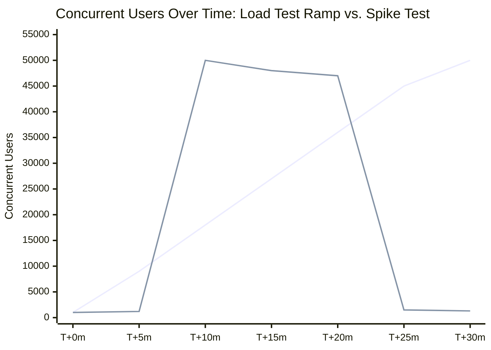

# Part 3: Performance Testing II — Spike, Soak & Scalability Testing

> **Study Guide for QA Professionals** — Non-Functional Testing, Performance Efficiency continued
> Difficulty Level: Intermediate to Advanced | Estimated Reading Time: 50 minutes

---

## Table of Contents

1. [Beyond Load and Stress: Four More Questions](#31-beyond-load-and-stress-four-more-questions)
2. [Spike Testing — Sudden Bursts, Not Gradual Ramps](#32-spike-testing--sudden-bursts-not-gradual-ramps)
3. [Soak / Endurance Testing — What Only Shows Up Over Time](#33-soak--endurance-testing--what-only-shows-up-over-time)
4. [Scalability Testing — Proving Growth Actually Works](#34-scalability-testing--proving-growth-actually-works)
5. [Volume / Capacity Testing — Data Scale, Not User Scale](#35-volume--capacity-testing--data-scale-not-user-scale)
6. [The Load Profile Difference — Spike vs. Ramp](#36-the-load-profile-difference--spike-vs-ramp)
7. [All Six Performance Testing Types, Side by Side](#37-all-six-performance-testing-types-side-by-side)
8. [Tooling: k6 vs. JMeter vs. Gatling vs. Locust](#38-tooling-k6-vs-jmeter-vs-gatling-vs-locust)
9. [📌 Fact Sheet — Part 3 in 60 Seconds](#-fact-sheet--part-3-in-60-seconds)
10. [Common Interview Questions](#common-interview-questions)

---

## 3.1 Beyond Load and Stress: Four More Questions

Part 2 covered the two performance tests most teams have at least heard of: **load testing**
(can the system handle expected traffic?) and **stress testing** (where does it actually break,
and how gracefully?). Those two alone leave real gaps, because they both assume a relatively
smooth, predictable traffic curve building toward a target. Real systems don't only fail that
way. They also fail:

- **Instantly**, when traffic goes from normal to enormous in seconds, not minutes — a **spike**.
- **Slowly**, when the system holds up fine for the first hour and then quietly degrades over the
  next twelve — a **soak** failure.
- **Structurally**, when "just add more servers" turns out not to actually add proportional
  capacity — a **scalability** failure.
- **Under weight**, when the system isn't overwhelmed by users at all, but by the sheer size of
  the data it's asked to move — a **volume** failure.

Each of these is a distinct question with a distinct test design, and — this is the part teams
miss — a distinct *failure signature*. A system that passes load, stress, and spike testing with
flying colors can still fall over eight hours into production because nobody ever ran it for
eight hours before shipping it. That's what this part is about.

> [!TIP]
> **🎭 Meme Break — Expanding Brain**
>
> 🧠 *Level 1: "We load tested it, we're good."*  
> 🧠🧠 *Level 2: "We stress tested it too, found the breaking point."*  
> 🧠🧠🧠 *Level 3: "We spike tested it — survives a sudden traffic cliff."*  
> 🧠🧠🧠🧠 *Level 4: We ran it for 12 hours straight and watched memory creep up 40MB every
> hour until the container OOM-killed itself at hour 9 — the test nobody had time for is the
> one that found the real bug.*

---

## 3.2 Spike Testing — Sudden Bursts, Not Gradual Ramps

**Spike testing** verifies system behavior when traffic jumps from normal to extreme **almost
instantly** — seconds to low minutes — rather than climbing gradually the way a load test ramps
up. The question it answers is narrow and specific: **can the system absorb a sudden vertical
jump in demand without collapsing, and does it recover cleanly once the spike passes?**

This distinction from load testing isn't academic. A gradual ramp gives auto-scalers time to
react, gives connection pools time to grow, gives caches time to warm. A spike gives them none
of that. Infrastructure that scales beautifully over ten minutes can be completely defenseless
against the same peak arriving in ten seconds, because the scaling *mechanism itself* — spinning
up a new container, provisioning a new database read replica, even a load balancer's health-check
interval — has a lag measured in seconds to minutes. A spike can be over before the system even
finishes reacting to it.

### Why Ticketmaster's Eras Tour collapse was specifically a spike-testing failure

Part 1 used Ticketmaster's November 2022 Eras Tour sale to set the stakes for this whole course.
It's worth returning to it here with more precision, because the way it failed maps almost
exactly onto the definition above. Ticketmaster's system wasn't handling a slow climb from
10,000 to 3.5 million interested fans over the course of a day — it was handling that entire
demand arriving inside the same few-minute window the "verified fan" presale opened. Bot traffic
compounded it further, but the core mechanic was the same one every spike test is designed to
catch: **the traffic curve went from a flat baseline to a near-vertical wall almost instantly**,
and every layer of the stack — queueing system, inventory service, payment gateway — had to
absorb that step function with no ramp-up runway to react to. Queuing systems that would have
smoothed a gradual ramp got the full spike in one shot, backed up, and cascaded into timeouts
across the checkout flow. A load test with a 30-minute ramp-up to the same peak concurrency
almost certainly would have passed. A spike test — hold at baseline, then jump straight to peak
in under a minute, and watch what happens in the first sixty seconds — is the only test design
that would have caught this failure mode before the real event did.

### Flipkart's Big Billion Day, told as a spike scenario

Picture the opening minute of Flipkart's Big Billion Day sale. For the days leading up to it,
traffic sits at a normal baseline — browsing, a trickle of purchases, nothing unusual. Then the
sale clock hits zero, and a promotion millions of people had bookmarked, set alarms for, and
opened browser tabs in advance for all fires at once. Within the same sixty seconds, catalog
search requests, "add to cart" calls, and checkout attempts for the same handful of deeply
discounted flagship items all converge on the same endpoints simultaneously. This is a
fundamentally different load shape than "traffic grew 5x over the morning" — it's "traffic grew
50x in under a minute, on purpose, because everyone was told to click at exactly this time."
Flipkart has had launch-day stability issues in past Big Billion Day events for precisely this
reason: a sale with a fixed start time creates the most extreme, most predictable spike pattern
in e-commerce, and the only test design that reproduces it is one that also jumps instantly
rather than ramping gradually toward the same peak number.

### What a spike test actually measures

A spike test typically holds a small number of specific metrics under close watch, all centered
on the moment of impact and the moments right after:

- **Time to first error** — how many seconds into the spike before the first failed request
  appears, and at what concurrency.
- **Recovery time** — once the spike subsides back to baseline, how long until response times
  and error rates also return to baseline. A system that "survives" a spike but takes twenty
  minutes to recover afterward has effectively extended the outage.
- **Auto-scaling reaction lag** — if the infrastructure is meant to scale automatically, does the
  new capacity arrive in time to matter, or does it arrive after the spike has already passed
  (and now you're paying for capacity you no longer need)?
- **Queue and connection pool behavior at the moment of impact** — does the system reject
  excess requests gracefully (a clear "try again" response) or does it accept everything into
  an unbounded queue that then chokes the whole service, the way Ticketmaster's did?

🧠 <strong>Quick Check:</strong> A team ran a load test that ramped from 0 to 50,000 concurrent users over 30 minutes and it passed cleanly. They conclude they're ready for a flash-sale launch that expects the same 50,000 concurrent users. What's wrong with that conclusion?

The peak number is the same, but the *shape* of the traffic curve is completely different, and
that shape is exactly what a load test doesn't exercise. A 30-minute ramp gives auto-scalers,
connection pools, and caches time to grow in step with demand. A flash sale delivers the same
50,000 users in a near-vertical jump over seconds, which gives none of those mechanisms time to
react — this is the same gap that let Ticketmaster's checkout flow pass ordinary testing and
still collapse on Eras Tour sale day. Only a dedicated spike test — baseline, then an
near-instant jump to peak — would validate readiness for the actual launch pattern.

---

## 3.3 Soak / Endurance Testing — What Only Shows Up Over Time

**Soak testing** (also called endurance testing) runs the system at a **normal, expected load
for an extended period** — hours, sometimes days — specifically to surface problems that don't
exist at minute five and are severe by hour eight. This is the performance test type most
frequently cut from release plans, for a reason that sounds completely reasonable: "we don't have
twelve hours to spare before this release." That reasoning is exactly backwards. Soak testing
finds a category of defect that a one-hour load test structurally cannot find, no matter how
high the concurrency, because the defect isn't about *how much* load — it's about *how long*.

### The failure modes unique to soak testing

- **Memory leaks** — a small amount of memory not released after each request is invisible in a
  short test and catastrophic in a long one, as the leak compounds request after request until
  the process is killed for exceeding its memory limit.
- **Connection pool exhaustion** — database or downstream-service connections that aren't
  released cleanly under sustained load slowly starve the pool, even when each individual
  transaction completes successfully.
- **Disk space fill-up** — temp files, uploaded assets, or cache artifacts that accumulate
  without cleanup can quietly fill a disk over many hours in a way no short test would ever
  detect.
- **Log file growth** — verbose logging that's harmless for an hour can fill a log partition
  overnight, and a full log partition can itself take an application down.
- **Session and cache degradation** — caches that grow unbounded, or session stores that never
  expire entries properly, slowly get slower and heavier the longer the system runs, even under
  perfectly steady load.

### A real soak test, narrated: the collection engine's three-hour run

A three-hour sustained-load test was run against a UPI collection engine, simulating 40
concurrent merchants continuously initiating collections, polling transaction status, refreshing
dashboards, and triggering settlement calculations — the kind of steady, unglamorous background
load a production system carries all day, every day, not a dramatic launch-hour peak. Over those
three hours the system pushed through 180,000 transactions at a stable 42–45 TPS, holding a P95
latency of 240ms and a P99 of 900ms, with an error rate of just 0.01% — numbers that would look
like an unqualified pass in a 15-minute load test.

But the test kept running past the point a shorter test would have called it a day, and that's
where the real finding showed up: as the three hours wore on, the **database connection pool**
began saturating under the cumulative weight of concurrent settlement-calculation queries. The
application layer itself never ran out of headroom — CPU and memory stayed comfortable the whole
time — but the connection pool, sized for average throughput rather than sustained peak-hour
demand, became the bottleneck exactly the way soak tests are designed to expose: not at the
start, but as the accumulated concurrent load built up over hours rather than minutes. The fix
wasn't a code change at all — it was sizing the connection pool for sustained peak patterns and
adding pool-utilization alerting before saturation, a purely capacity-planning conclusion that a
one-hour test would never have surfaced, because the pool hadn't had time to fill up yet.

→ Reference: <a href="https://github.com/ghanendra-sdet/fintech-collection-engine" target="_blank" rel="noopener noreferrer">fintech-collection-engine</a>

### A near-soak lesson from a shorter run: the connected-banking Redis story

A related but shorter test — one hour twenty-six minutes of continuous IMPS transaction load
at 25 concurrent threads against a connected-banking payment path — processed 405,067
transactions with excellent numbers throughout: P90 of 82ms, P95 of 319ms, a success rate of
99.99%, stable CPU averaging 43.6%, and stable memory averaging 25.3% for the entire run. By the
standards of a short load test, this is a clean pass with nothing left to investigate.

Except the test didn't end because it reached its planned duration — it ended because the
**Redis queue backing the transaction pipeline hit its memory ceiling**, backlog started
building, and latency spikes began appearing for a small number of transactions before the test
was deliberately stopped to avoid a cascading failure. That's a textbook soak-shaped finding
arriving inside a load test's timeframe: the application layer never showed a symptom on its own
dashboards (no CPU bottleneck, no memory leak pattern at the app layer), but a shared,
finite resource that both accumulates over time and isn't visible from application metrics quietly
filled up in the background the entire time the test was "passing." Had the test been stopped at
the 30-minute mark instead of running long enough to hit that ceiling, the Redis capacity issue
would have shipped straight to production and shown up during the platform's actual peak
transaction hours — worse, at a moment nobody was watching a test dashboard.

→ Reference: <a href="https://github.com/ghanendra-sdet/fintech-connected-banking-platform" target="_blank" rel="noopener noreferrer">fintech-connected-banking-platform</a>

> [!WARNING]
> **🎭 Meme Break — "This Is Fine" Dog**
>
> 🔥 *Hour 1 of the soak test: CPU 40%, memory 25%, latency stable. "See, it's fine."*  
> 🔥 *Hour 4: memory 31%. "Still fine, probably just warming caches."*  
> 🔥 *Hour 9: memory 78%, GC pauses lengthening, nobody's watching the dashboard anymore
> because the test was "supposed to be a formality."*

🧠 <strong>Quick Check:</strong> The connected-banking test above showed excellent CPU and memory numbers at the *application* layer for the entire run, right up until it was stopped. Why doesn't that mean the system had no capacity problem?

Because the bottleneck wasn't in the application layer at all — it was in the Redis queue behind
it, a shared resource that accumulates state over time and isn't reflected in the app's own
CPU/memory dashboards. A short test, or a test that only watches application-layer metrics, would
have called this a clean pass. Only running long enough for that queue to actually fill up — and
watching infrastructure metrics, not just app metrics — revealed the real constraint: an
infrastructure capacity issue, not a software defect, but a genuine production risk either way.

---

## 3.4 Scalability Testing — Proving Growth Actually Works

**Scalability testing** verifies that a system can handle growth by adding resources — and,
critically, that adding those resources actually produces a **proportional** improvement rather
than a diminishing or nonexistent one. "We added more servers" is not the same claim as "we added
more servers and throughput went up by roughly the amount we expected." Scalability testing is
what turns the first sentence into the second, with numbers.

### Horizontal vs. vertical scaling

| | Vertical Scaling (Scale Up) | Horizontal Scaling (Scale Out) |
|---|---|---|
| **What changes** | A bigger machine — more CPU, more RAM, on the same node | More machines — additional nodes running the same service |
| **Ceiling** | Hard ceiling — there's a biggest machine you can buy | Theoretically near-limitless, if the architecture supports it |
| **Complexity added** | Low — usually no application changes needed | Higher — requires load balancing, session handling, and often stateless service design |
| **Single point of failure** | Yes — one bigger box is still one box | Reduced — traffic spreads across multiple nodes |
| **What scalability testing must prove** | Does 2x the resources on one node produce close to 2x the throughput, or does the app hit an internal bottleneck (e.g. single-threaded logic, lock contention) first? | Does adding a second/third node produce close to linear throughput gains, or does a shared resource (database, cache, queue) cap the benefit regardless of node count? |

### The scalability question hiding inside the connected-banking soak test

The connected-banking load test referenced above ran against infrastructure explicitly described
as **one application core, no auto-scaling, three async workers, one central database with three
shards** — a deliberately constrained baseline chosen precisely so the test would reveal true
capacity limits instead of masking them behind over-provisioned hardware. That's a load and
stability test as designed, but it's also sitting right at the boundary of a scalability
question the report itself calls out: the recommendations explicitly flag "enable horizontal
scaling where applicable" and "define official capacity thresholds" as follow-up work. The
natural next test isn't another load test at the same fixed infrastructure — it's a scalability
test that reruns the same 25-thread, sustained-IMPS-load profile at two nodes, then four, and
checks whether throughput moves from ~80 TPS toward something proportionally higher, or whether
it plateaus because the real constraint (as the Redis finding already hinted) lives in a shared
resource that doesn't get bigger just because the app tier does.

### Scalability under seasonal load: the travel marketplace angle

A travel booking marketplace that resells flight, hotel, and package inventory from third-party
suppliers carries a scalability challenge that's structurally different from a typical
e-commerce catalog, because the platform doesn't fully control the resource it needs to scale.
Picture the run-up to a major holiday booking season: search volume climbs steadily for weeks as
travelers compare options, then compresses into sharp bursts around fare-sale announcements and
long-weekend planning windows. The platform's own application tier can scale horizontally well
enough — more search-service nodes, more API gateway capacity — but every search still ends in a
live call out to supplier inventory APIs (GDS systems, hotel aggregators) that the platform
doesn't own and can't scale on its own. Adding ten more application nodes doesn't help at all if
the bottleneck is a supplier's own rate limit, or if enough concurrent searches against the same
limited-inventory fare cause the platform's fare-lock mechanism to hold and release the same seat
for multiple travelers faster than the booking-confirmation logic can keep up. This is exactly
why the platform's QA approach treats **concurrent-booking race conditions and overbooking
prevention** as first-class scalability-adjacent scenarios, validated with k6-driven concurrency
tests specifically because sequential UI testing can never reproduce two travelers' fare locks
colliding on the same inventory unit at scale — the defect only exists when enough concurrent
load is present to create the race in the first place.

→ Reference: <a href="https://github.com/ghanendra-sdet/travel-marketplace-platform" target="_blank" rel="noopener noreferrer">travel-marketplace-platform</a>

> [!TIP]
> **🎭 Meme Break — Distracted Boyfriend**
>
> 🚶 *Infrastructure budget, walking with:* **"We added 4x the servers"**  
> 👀 *Looking back at:* **"Throughput went up 1.2x because the database connection pool and
> the third-party supplier's rate limit never got any bigger"**

🧠 <strong>Quick Check:</strong> A team doubles the number of application server nodes and measures throughput going from 80 TPS to only 95 TPS — not the ~160 TPS they expected. Is this a scalability test failure, and what should they check next?

Yes — it's exactly the failure scalability testing exists to catch: resources were added, but
the improvement wasn't proportional, which means the real bottleneck wasn't the application tier
at all. The next step is checking whatever shared resource *doesn't* scale just because the app
tier does — a database connection pool, a Redis queue, a downstream/third-party API rate limit
(as in the travel marketplace's supplier-dependency scenario). Adding more app nodes in front of
an unscaled shared resource just means more nodes competing for the same fixed capacity.

---

## 3.5 Volume / Capacity Testing — Data Scale, Not User Scale

Every test type covered so far — load, stress, spike, soak, scalability — is fundamentally about
**concurrent users or requests**. Volume testing (sometimes called capacity testing) asks a
different question entirely: **can the system handle a large volume of data**, independent of
how many users are hitting it at once? A single user, alone, generating one report against a
database with fifteen years and eighty million rows of transaction history can bring a poorly
indexed query to its knees just as effectively as ten thousand concurrent users can overwhelm an
under-provisioned server — it's a completely different mechanism of failure, and it needs a
completely different test design: seed a realistically enormous dataset, then measure whether
the *specific operations that touch that data* (searches, reports, exports, aggregations) still
perform acceptably.

### Where volume risk actually lives

- **Reports spanning long date ranges** — a merchant settlement report generated across a single
  day is trivial; the same report type generated across three years of transaction history for a
  high-volume merchant is a fundamentally different query.
- **Search and filter operations against large tables** — a search that's instant against 10,000
  rows in a test database can time out against the 80 million rows the same table holds in
  production, if an index was never added for the filter combination actually used.
- **Pagination and export** — "export all transactions" is a volume risk hiding inside what looks
  like a simple button; the underlying query and file-generation step both scale with row count,
  not with concurrent users.
- **Data-integrity checks at scale** — verifying that calculations remain correct isn't only a
  functional concern at high volume; it's also a performance one, because the *verification
  method itself* has to remain feasible against millions of rows rather than a handful of sample
  records.

### A real volume-adjacent check, narrated

As part of validating the connected-banking payment path under sustained load, the QA team
didn't stop at throughput and latency — they also verified **ledger balance correctness at the
database level** across multiple merchant records, checking that `availableBalance` matched
`balance` exactly, with zero cent-level rounding drift, even after hundreds of thousands of
transactions had been processed against those same ledgers during the test run. That's a
functional check on its face — "is the math right" — but it's a volume-shaped one underneath: the
real risk isn't whether one transaction rounds correctly, it's whether rounding, precision
handling, and calculation logic all still hold up exactly after a merchant's ledger has
accumulated hundreds of thousands of entries rather than a handful used in a typical functional
test. A defect that only manifests as a one-paisa drift after enough accumulated transactions is
invisible in a ten-row functional test and only surfaces once real volume has built up — which is
precisely why this check was run *against* the high-volume test data generated by the load run,
not against a small hand-picked sample.

→ Reference: <a href="https://github.com/ghanendra-sdet/fintech-connected-banking-platform" target="_blank" rel="noopener noreferrer">fintech-connected-banking-platform</a>

> [!CAUTION]
> **🎭 Meme Break — "Is This a Pigeon"**
>
> 🦋 *A single analyst, one browser tab, requesting a three-year settlement report against
> eighty million rows.*  
> 🧑 *The team, pointing:* **"Is this a load testing problem?"**

🧠 <strong>Quick Check:</strong> A single analyst, alone, requests a settlement report spanning three years of transaction history and the request times out. Is this a load, stress, or volume problem — and does it matter which term you use?

It's a volume problem, and the distinction matters because it points to a completely different
fix. There's no concurrency here — one user, one request — so scaling servers or tuning
connection pools (load/stress fixes) won't help at all. The bottleneck is the size of the data
the single query has to traverse: three years of rows, likely without an index that supports
that date-range filter efficiently. The fix is query optimization, indexing, or pre-aggregation —
not more infrastructure.

---

## 3.6 The Load Profile Difference — Spike vs. Ramp

The clearest way to see why spike testing needs its own test design is to look at the traffic
curve itself. A load test's ramp gives every layer of the system time to react as demand climbs.
A spike gives it almost none — the jump itself is the test.

Notice what the two lines actually test. The load-test line gives the system 30 minutes to climb
to 50,000 users — auto-scalers, connection pools, and caches all get to grow in step. The
spike-test line sits at a quiet baseline, jumps to essentially the same peak in the space of a
single interval (mirroring the flash-sale-clock-hits-zero pattern from Ticketmaster and Flipkart),
holds there just long enough to see whether the system survives the impact, and then drops back
to baseline — where the second half of the test, recovery time, actually begins. A system can
ace the first line and fail the second at the exact same peak concurrency, which is the entire
reason spike testing exists as a separate discipline rather than "load testing but with a steeper
graph."

---

## 3.7 All Six Performance Testing Types, Side by Side

Between Part 2 and this part, six distinct performance test types are now on the table. They all
sit under the same ISO 25010 characteristic — Performance Efficiency — but each answers a
question the others structurally cannot.

| Test Type | Question It Answers | Load Shape | Typical Duration | What It Catches | Real Example |
|---|---|---|---|---|---|
| **Load Testing** | Can the system handle *expected* peak traffic? | Gradual ramp to a defined target | Minutes to ~1 hour | Latency/throughput degradation at normal-to-peak concurrency | 40-merchant, 45 TPS target run *(Part 2)* |
| **Stress Testing** | Where does the system actually *break*, and how gracefully? | Ramp *past* expected peak until failure | Until breaking point reached | The true ceiling; whether failure is graceful or catastrophic | *(Part 2)* |
| **Spike Testing** | Can the system absorb a *sudden* jump in demand and recover cleanly? | Near-vertical jump, hold, drop back to baseline | Minutes (the jump + recovery window) | Auto-scaling lag, unbounded queues, cascading timeouts | Ticketmaster Eras Tour; Flipkart Big Billion Day |
| **Soak / Endurance Testing** | Does the system stay healthy at *normal* load over a *long* time? | Flat, sustained load at expected levels | Hours to days | Memory leaks, connection pool exhaustion, disk/log fill-up, cache/session decay | Collection engine's 3-hour, 180K-transaction run — connection pool saturation |
| **Scalability Testing** | Does adding resources deliver *proportional* improvement? | Same load profile, repeated at increasing resource levels | Repeated test runs, not one continuous run | Bottlenecks that don't move just because the app tier grows (shared DB, third-party rate limits) | Connected-banking's "1 core, no auto-scaling" baseline; travel marketplace's supplier dependency |
| **Volume / Capacity Testing** | Can the system handle *large data*, independent of concurrent users? | Often single-user, against an artificially large dataset | Varies — focused on specific data-heavy operations | Slow reports/exports/searches, precision drift at scale | Ledger balance verification across high-volume merchant records |

🧠 <strong>Quick Check:</strong> A stakeholder says "we already ran a load test, we don't need a separate soak test or spike test." What's the flaw in treating one performance test as coverage for all of them?

Each test type is designed to make a different failure mode observable, and a single test design
structurally cannot surface all of them. A load test's gradual ramp gives scaling mechanisms time
to react, which is exactly what hides a spike-shaped failure (auto-scaling lag, unbounded
queues). A load test's short duration means memory leaks, connection pool exhaustion, and log/disk
growth — all soak-shaped failures — never accumulate enough to become visible before the test
ends. Passing a load test is evidence the system handles *expected, gradual* traffic — it's not
evidence about instant bursts or long-running degradation, because those tests were never run.

---

## 3.8 Tooling: k6 vs. JMeter vs. Gatling vs. Locust

All four of these tools can technically run any of the six test types above — the difference is
which use case each one is actually built for, and that shows up fastest on spike, soak, and
scalability scenarios specifically.

| Tool | Scripting | Best Fit | Notes for Spike/Soak/Scalability Work |
|---|---|---|---|
| **k6** | JavaScript | Developer-friendly load/spike/scalability testing, strong CI/CD integration | Built-in `stages` config makes spike profiles (flat → vertical jump → flat) and scalability re-runs at different VU counts trivial to script and version-control |
| **Apache JMeter** | GUI + XML (Groovy for scripting) | Enterprise-standard, huge plugin ecosystem, strong for long-duration soak runs | The long-standing default for multi-hour soak tests in enterprise environments (as seen in both fintech load reports referenced in this part); heavier resource footprint on the load-generator machine itself over very long runs |
| **Gatling** | Scala DSL | High-throughput scenarios, detailed HTML reports out of the box | Async, non-blocking engine handles very high concurrent-user spike simulations efficiently with a comparatively small load-generator footprint |
| **Locust** | Python | Teams that want load-testing logic as plain Python code, distributed load generation | Easiest to hand to a team already comfortable in Python; distributed workers make it straightforward to generate genuinely large-scale spike traffic across multiple machines |

For soak testing specifically, tool choice matters less than **test-runner discipline**: a
12-hour run needs its own monitoring (so a crashed load generator doesn't get mistaken for a
system failure), log rotation on the test side, and a clear plan for what "stop the test early"
looks like — exactly the judgment call made in the connected-banking test when Redis queue
saturation triggered an early, deliberate stop rather than letting the test cascade into a
harder crash.

> [!TIP]
> **🎭 Meme Break — Galaxy Brain**
>
> 🌌 *Small brain: "We picked JMeter because that's what the last project used."*  
> 🌌🌌 *Glowing brain: "We picked k6 because our spike profiles fit neatly into `stages`."*  
> 🌌🌌🌌 *Galaxy brain: the tool matters less than whether anyone's watching the dashboard
> at hour 9 of a 12-hour soak run — the best tool in the world doesn't help if the test
> finishes at 3 AM and nobody reads the report until the next incident.*

---

## 📌 Fact Sheet — Part 3 in 60 Seconds

- **Spike testing** verifies survival of a *sudden, near-vertical* jump in traffic — fundamentally
  different from load testing's gradual ramp, because scaling mechanisms (auto-scalers,
  connection pools) don't get time to react.
- Ticketmaster's 2022 Eras Tour collapse is specifically a **spike-testing failure**: demand
  arrived as a step function inside a few-minute presale window, not a gradual climb — a
  30-minute-ramp load test at the same peak concurrency likely would have passed.
- Flipkart's Big Billion Day sale creates one of the most extreme, most *predictable* spikes in
  e-commerce — a fixed sale-start time means near-simultaneous demand from millions of
  pre-positioned shoppers.
- **Soak/endurance testing** runs expected load for hours to catch what only builds up over
  time: memory leaks, connection pool exhaustion, disk/log fill-up, session/cache degradation.
  It's the type most often cut for time — which is exactly why it catches what shorter tests miss.
- A real 3-hour, 180,000-transaction soak test on a collection engine passed on every
  application metric (CPU, memory, latency, error rate) but still surfaced a **database
  connection pool saturating** purely from accumulated sustained-load duration — a fix that
  short tests never would have revealed.
- A related connected-banking load test hit a **Redis queue memory ceiling** after 405,067
  transactions over 1h26m — a soak-shaped finding (a shared resource silently filling up) that
  never showed up in application-layer CPU/memory dashboards at all.
- **Scalability testing** proves that added resources deliver *proportional* gains — doubling
  servers should move throughput meaningfully, not just marginally; when it doesn't, the real
  bottleneck is a shared resource (database, queue, or a third-party API's rate limit) that
  didn't scale just because the app tier did.
- **Volume/capacity testing** is about data size, not concurrent users — a single user against
  years of transaction history can break a report the same way thousands of concurrent users
  break a server, just through a different mechanism (unindexed queries, not concurrency limits).
- **Six performance test types now covered (Parts 2–3):** Load, Stress, Spike, Soak/Endurance,
  Scalability, Volume — each answers a distinct question a passing result on the others cannot
  answer for it.
- **Tooling:** k6 (developer-friendly, CI-native, great for spike/scalability staging configs),
  JMeter (enterprise standard, strong for long soak runs), Gatling (high-throughput, async,
  efficient for large spike simulations), Locust (Python-native, distributed load generation).

---

## Common Interview Questions

### Question 1: What's the difference between a load test and a spike test, if they can reach the same peak concurrency?

**Model Answer:**

"They can hit the same peak number, but the shape of how they get there is the whole point. A
load test ramps up gradually, which gives auto-scalers, connection pools, and caches time to
grow in step with demand. A spike test jumps from baseline to peak almost instantly, which gives
those same mechanisms no reaction time. Ticketmaster's 2022 Eras Tour sale is the textbook
example — the traffic didn't climb, it arrived as a step function the moment the presale opened,
and a queuing system that would have absorbed a gradual ramp got the full spike in one shot and
cascaded into failures. A system can pass a load test and fail a spike test at the exact same
peak concurrency, which is why they need to be tested separately."

### Question 2: Why does soak testing get skipped so often, and what's the actual cost of skipping it?

**Model Answer:**

"It gets skipped because it's expensive in the resource teams have the least of before a
release — time. A 12-hour soak test doesn't fit into a sprint the way a 20-minute load test
does. But soak testing catches an entire category of defect — memory leaks, connection pool
exhaustion, disk and log fill-up, cache degradation — that literally cannot appear in a short
test, because those failures are defined by accumulation over time, not by concurrency. I've seen
a real example where a three-hour sustained-load test passed cleanly on every application metric
for the first two hours, and only surfaced a database connection pool saturating from accumulated
concurrent load in the final stretch. A one-hour version of that same test would have shipped
with a capacity landmine still in it."

### Question 3: A team doubles their server count and only sees a 20% throughput improvement instead of the expected 100%. How do you investigate this as a QA engineer?

**Model Answer:**

"I'd treat it as a scalability test finding, not a load test finding — the question isn't 'does
it handle load,' it's 'did adding resources actually help proportionally.' The first thing I'd
check is whether the bottleneck moved outside the layer that just doubled — a shared database
connection pool, a caching layer, or a downstream third-party API with its own rate limit are all
resources that don't get bigger just because the application tier does. I'd re-run the same load
profile at multiple resource levels (1x, 2x, 4x nodes) and plot throughput against each, which
usually makes the plateau point obvious — and once it's obvious, the fix is almost never 'add
more nodes,' it's fixing whatever didn't scale with them."

### Question 4: How is volume testing different from load testing, and can you give an example where load testing would completely miss the risk?

**Model Answer:**

"Load testing is about concurrent users; volume testing is about data size, and those are
independent risks. A report or search feature can be tested under heavy concurrent load with a
small seeded dataset and pass easily, while the same feature times out for a single user the
moment it's run against years of accumulated real data — an unindexed query against millions of
rows doesn't need any concurrency to be slow. A concrete example is settlement or ledger
reporting: verifying a merchant's balance calculation is correct is easy against ten sample
transactions, but the real risk — cent-level rounding drift — only has a chance to appear once a
ledger has accumulated hundreds of thousands of real entries, which is a volume condition, not a
concurrency one."
