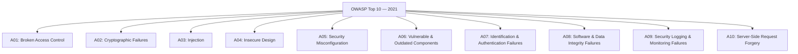
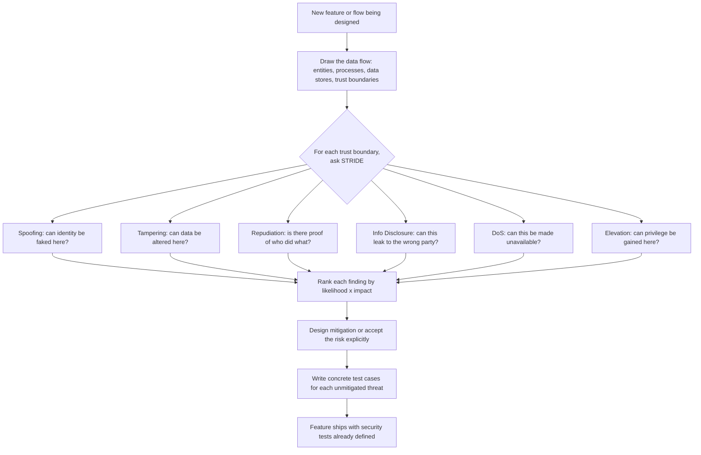

# Part 4: Security Testing I — OWASP & Fundamentals

> **Study Guide for QA Professionals** — Security Testing, from first principles
> Difficulty Level: Intermediate to Advanced | Estimated Reading Time: 75 minutes

---

## Table of Contents

1. [Why Security Testing Is Different From Every Other NFT Category](#41-why-security-testing-is-different-from-every-other-nft-category)
2. [The CIA Triad — The Foundation Everything Else Builds On](#42-the-cia-triad--the-foundation-everything-else-builds-on)
3. [The OWASP Top 10 (2021) — The Standard Reference](#43-the-owasp-top-10-2021--the-standard-reference)
4. [Authentication Testing](#44-authentication-testing)
5. [Authorization Testing](#45-authorization-testing)
6. [Input Validation & Injection Testing Fundamentals](#46-input-validation--injection-testing-fundamentals)
7. [Threat Modeling Basics — STRIDE](#47-threat-modeling-basics--stride)
8. [📌 Fact Sheet — Part 4 in 60 Seconds](#-fact-sheet--part-4-in-60-seconds)
9. [Common Interview Questions](#common-interview-questions)

---

## 4.1 Why Security Testing Is Different From Every Other NFT Category

Every other module in this course tests the system against a **passive condition**.
Load testing throws traffic at an endpoint — the traffic doesn't get smarter if the
first attempt fails. Accessibility testing checks whether a screen reader can operate
a form — the screen reader isn't trying to trick the form. Compatibility testing
checks rendering across browsers — the browsers aren't adversarial. In every one of
those categories, the "conditions" are fixed, and once you've tested the realistic
range of them, you're reasonably done.

Security testing breaks that model completely, because **the thing you're testing
against is an active, adaptive adversary, not a condition.** An attacker doesn't hit
your login form once and give up if it doesn't work — they try 10,000 password
combinations, then pivot to the password-reset flow, then check whether the API
behind the form has the same validation as the UI in front of it, then check whether
a slightly different HTTP verb bypasses the check entirely. A load test's "worst case"
is a number you can plan for — 10x expected traffic, say. A security test's "worst
case" is **whatever a motivated, resourced, patient human being can find**, which is
not a number, it's an open-ended search.

This is the mental model shift this module asks you to make: stop asking "does this
work under X condition" and start asking **"what is the worst thing someone could do
if they deliberately tried to misuse this, and would we even notice if they
succeeded?"** That second half — *would we even notice* — is not a throwaway phrase.
A huge share of real-world breaches aren't caught by a control stopping the attack;
they're caught (often months later) by someone noticing the aftermath. Security
testing has to cover both the "can they get in" question and the "would we know if
they did" question, and most testers only ever practice the first one.

### A scene to set the stakes

In 2017, Equifax — a credit bureau holding financial data on roughly 147 million
people — was breached through a known, publicly disclosed vulnerability in Apache
Struts that had a patch available for **over two months** before the breach began.
Nobody needed to discover a zero-day. The attacker just needed the org to be slow
patching a known issue, which is exactly the kind of gap a **Vulnerable and Outdated
Components** check (Section 4.3.6 below) is designed to catch before an attacker
finds it first. The breach exposed Social Security numbers, birth dates, addresses,
and in some cases driver's license numbers — for a company whose entire business
model is *being trusted with exactly that data*. It remains one of the clearest
illustrations in the industry of a simple, boring, well-known truth: most breaches
aren't exotic. They're a known gap nobody closed in time.

> [!WARNING]
> **🎭 Meme Break — "This Is Fine" Dog**
>
> 🔥 *"We ran a vulnerability scan six months ago, we're good."*
> 🔥 *A critical CVE was published for a library we use, three months ago.*
> 🔥 *Nobody's patched it because "nothing's broken."*
> 🔥 *This is fine.*

<details>
<summary>🧠 <strong>Quick Check:</strong> Why can't a security tester ever declare "we tested the realistic range of attacks" the way a load tester can declare "we tested the realistic range of traffic"?</summary>

Because traffic is a passive condition with a plannable ceiling — you can define "10x
expected peak" and that's a legitimate stopping point. An attacker is not a condition,
they're a goal-directed adversary who adapts when the first approach fails and actively
searches for the gap you didn't think to test. There is no equivalent to "10x peak" for
adversarial creativity — which is exactly why security testing leans on structured
frameworks like the OWASP Top 10 and STRIDE (Sections 4.3 and 4.7) instead of ad hoc
exploration alone: they're an attempt to bound an open-ended search with the categories
that account for the overwhelming majority of real-world breaches.

</details>

---

## 4.2 The CIA Triad — The Foundation Everything Else Builds On

Before OWASP, before STRIDE, before any specific technique — there's one model
underneath all of information security, and it's worth internalizing because every
vulnerability you'll ever test for is really just a way of breaking one of these
three properties:

| Property | Plain-English question | Broken looks like |
|---|---|---|
| **Confidentiality** | Can only authorized parties see this data? | A user views another user's data (IDOR); an attacker reads a database dump; an API leaks a field in its response that the UI happens to hide |
| **Integrity** | Can only authorized parties change this data, and can everyone trust it hasn't been tampered with? | A transaction amount is altered in transit; a signed software update is swapped for a malicious one; a user edits a hidden form field to change a price |
| **Availability** | Can authorized parties access the system when they need to? | A denial-of-service attack takes the system down; a resource-exhaustion bug lets one user lock out everyone else |

This is the model ISO 25010's **Security** characteristic is built on — Confidentiality
and Integrity map almost directly onto two of ISO 25010's named Security
sub-characteristics, and Availability is shared territory with the **Reliability**
characteristic covered in Part 9 (a successful denial-of-service attack is
simultaneously a security failure and an availability failure — the two categories
overlap by design, not by accident).

Every OWASP Top 10 item you're about to read maps onto one or more of these three.
Broken Access Control and IDOR are Confidentiality failures. SQL injection that lets
an attacker modify data is an Integrity failure. A poorly-rate-limited login endpoint
that an attacker floods until the whole auth service falls over is an Availability
failure. Keep this triad in your head while reading Section 4.3 — it's the "why does
this matter" underneath every "here's how to test it."

<details>
<summary>🧠 <strong>Quick Check:</strong> A user discovers they can change the URL from <code>/invoice/1042</code> to <code>/invoice/1043</code> and view a stranger's invoice. Which leg of the CIA triad does this break?</summary>

Confidentiality — an unauthorized party can see data they shouldn't be able to. Note
that it's *purely* a confidentiality break if the user can only view, not edit — if
they could also *change* that stranger's invoice, it would break Integrity too. This
exact scenario is the textbook shape of an IDOR vulnerability, worked through in full
in Section 4.5 using a consent-based banking platform as the concrete example.

</details>

---

## 4.3 The OWASP Top 10 (2021) — The Standard Reference

The **OWASP Top 10** is a community-driven ranking, published by the Open Web
Application Security Project, of the most critical web application security risks —
built from real vulnerability data contributed by security firms and bug bounty
programs, not opinion. The 2021 revision is still, as of 2026, the current and
industry-standard version — it hasn't been superseded, and it's the version referenced
in interviews, security tooling, and compliance frameworks alike. You do not need to
be a penetration tester to use it. You need to know what each category means well
enough to design test cases that probe for it, and to recognize the shape of each one
when you see it in a requirement or a code review.



### 4.3.1 A01 — Broken Access Control

The single most common category in the 2021 list, and consistently one of the most
severe. It covers any situation where the system fails to properly enforce **what an
authenticated user is and isn't allowed to do** — as opposed to authentication
failures (A07), which are about proving *who* someone is in the first place. Access
control failures happen *after* login: the user is legitimately who they say they are,
but the system lets them act outside their intended permissions anyway.

**Concrete testable scenario:** A merchant dashboard exposes an endpoint
`GET /api/merchant/{merchantId}/transactions`. A logged-in merchant with ID `4471`
edits the URL (or the request body, or an API call replayed through Burp Suite) to
`merchantId=4472` — a different merchant's ID — and the endpoint returns that other
merchant's transaction history anyway, because the backend trusted the ID in the
request instead of deriving it from the authenticated session. This is the most common
concrete shape Broken Access Control takes in practice, and it has a name of its own —
**IDOR (Insecure Direct Object Reference)** — which gets a full worked example, using
this account's own consent-based banking platform, in Section 4.5.

### 4.3.2 A02 — Cryptographic Failures

Previously called "Sensitive Data Exposure" in the 2017 list — renamed in 2021 to
correctly point at the *root cause* rather than the symptom. This category covers
data that should be protected by encryption but isn't, or is protected with broken,
outdated, or misapplied cryptography: passwords stored in plaintext or with a weak
hash (MD5, unsalted SHA-1), sensitive data sent over plain HTTP instead of TLS,
hardcoded encryption keys checked into source control, or a homegrown encryption
scheme instead of a vetted standard algorithm.

**Concrete testable scenario:** picture a UPI payment dashboard whose encryption
design uses **AES-256-GCM** — a strong, industry-standard algorithm — to encrypt every
payload before it leaves the browser, deriving the AES key by SHA-256-hashing each
merchant's Secret Key. That's a genuinely solid design on paper. But now picture the
same Secret Key serving **two jobs at once**: it authenticates the merchant to the
token endpoint *and* it's the key material for the payload encryption. A tester's job
here isn't to attack the AES-GCM math — that's a settled, vetted algorithm and not
where the risk lives. The risk lives in the **key management**: what happens if that
Secret Key is regenerated on one side but not updated on the other? What happens if
it ends up logged somewhere, or — worse — hardcoded directly into a README or a config
file committed to source control, which is a mistake so common it has its own line
item in nearly every real-world breach post-mortem? A strong algorithm wrapped around
a leaked or mismanaged key provides exactly zero protection. This is precisely why
Cryptographic Failures testing is less about "is the algorithm strong" and almost
entirely about "is the key handled safely everywhere it exists" — in transit, at rest,
in logs, and in version control.

> [!TIP]
> **🎭 Meme Break — Drake Hotline Bling**
>
> ❌ *"We use AES-256-GCM, we're secure."*  
> ✅ *"We use AES-256-GCM, AND the key is never logged, never committed to source
> control, rotated on a schedule, and different per environment — because the
> algorithm was never the weak point, key management always is."*

<details>
<summary>🧠 <strong>Quick Check:</strong> A payment dashboard uses AES-256-GCM to encrypt every payload — a strong, well-vetted algorithm. Why might a security tester still flag it as high-risk?</summary>

Because algorithm strength is only half the story — the other half is key management.
If the same secret key is used both to authenticate to an API and to derive the
encryption key, a leak of that one value compromises both authentication and
confidentiality simultaneously. A tester should check where that key lives: is it ever
logged in plaintext, committed to a repository, sent in a URL query string (which ends
up in server access logs and browser history), or shared across environments (UAT key
== production key)? A strong algorithm around a poorly handled key is a Cryptographic
Failure regardless of how strong the algorithm is.

</details>

### 4.3.3 A03 — Injection

Any flaw where untrusted input is interpreted as a *command* rather than *data* by an
interpreter — SQL, NoSQL, OS shell, LDAP, or an ORM query built by string
concatenation. Covered in full technical depth in Section 4.6, but the category
definition matters here: injection is fundamentally a **trust boundary failure** — the
system trusted that user input would only ever contain data, and an attacker proved
that assumption wrong.

**Concrete testable scenario:** a "search transactions by reference number" field
builds its query as `"SELECT * FROM transactions WHERE ref_no = '" + userInput + "'"`.
A tester enters `' OR '1'='1` as the reference number. If the query executes and
returns *every* transaction in the table instead of erroring or returning nothing,
the field is injectable — and depending on database permissions, the same flaw could
just as easily be used to modify or delete data, not just read it.

### 4.3.4 A04 — Insecure Design

New to the 2021 list, and deliberately distinct from A05 (Security Misconfiguration).
Misconfiguration is "the design was fine, the setup was wrong." **Insecure Design**
is "the design itself never accounted for the threat" — no amount of careful
configuration or bug-fixing saves an architecture that was never threat-modeled in the
first place. This is why threat modeling (Section 4.7) happens at design time, not
as a test pass at the end — Insecure Design bugs are usually only fixable by
re-architecting, which is expensive precisely because nobody asked "what could go
wrong" early enough.

**Concrete testable scenario:** a password-reset flow emails a reset link containing
a sequential, guessable token like `?resetId=88231`. No amount of "securing" the
email transport fixes this — the *design* assumed the token only needed to be
hard to stumble onto, not hard to guess deliberately. The fix isn't a patch, it's
redesigning the token to be a long, cryptographically random, single-use value. A
tester's job during design review is to ask exactly this kind of "what stops someone
from just incrementing this" question before the flow ships.

### 4.3.5 A05 — Security Misconfiguration

The most common root cause in this category is *inherited defaults nobody changed*:
default admin credentials left active, verbose error messages that leak stack traces
and internal file paths to end users, directory listing left enabled on a production
server, unnecessary services or ports left open, cloud storage buckets left publicly
readable, or overly permissive CORS headers that let any origin call an API meant
for one trusted frontend.

**Concrete testable scenario:** a tester deliberately submits a malformed request to
a production API and gets back a full stack trace revealing the internal framework
version, the file path of the handler, and a fragment of a SQL query — information
that costs an attacker nothing to obtain and hands them a head start on exactly the
kind of injection probing described in A03. A misconfigured error-handling setting
(showing detailed errors in production instead of a generic message) turned a
harmless test request into free reconnaissance.

### 4.3.6 A06 — Vulnerable and Outdated Components

Every dependency your application pulls in — libraries, frameworks, the OS, container
base images — is code you didn't write and are nonetheless responsible for. This
category is exactly what let the Equifax breach happen (Section 4.1): a component
with a known, publicly disclosed, patched vulnerability was left unpatched.

**Concrete testable scenario:** a QA engineer runs `npm audit` (or the equivalent for
the stack in use) against the project's dependency tree as part of a pre-release
checklist and finds a transitive dependency three levels deep with a published
critical CVE and an available patched version. This is not exotic penetration
testing — it's a five-minute command that a huge share of teams simply never run on a
schedule, which is exactly the gap that turned a routine Apache Struts CVE into one
of the largest data breaches in history.

### 4.3.7 A07 — Identification and Authentication Failures

Covers any weakness in confirming *who* a user is: weak or absent password policies,
no protection against credential-stuffing or brute-force attempts, session IDs
exposed in URLs, sessions that never expire, and missing or poorly implemented
multi-factor authentication. Gets a full dedicated section (4.4) below because
authentication testing is dense enough to need one.

### 4.3.8 A08 — Software and Data Integrity Failures

New to the 2021 list, covering integrity assumptions that break down: code or
infrastructure that relies on plugins, libraries, or CI/CD pipelines from untrusted
sources without verifying integrity (no checksum or signature validation), and
**insecure deserialization** — where an application deserializes untrusted data
without validating it, letting an attacker craft a malicious serialized object that
executes code on deserialization.

**Concrete testable scenario:** picture a reseller platform where commission
attribution is meant to be **lifetime and tamper-proof** — once a merchant is
attributed to a reseller, that link should only change via an explicit admin
reassignment, never silently. Now picture a request payload for an internal
reconciliation job that includes a `resellerId` field the client can influence,
because the backend re-derives the attribution from the request instead of from an
immutable, server-side record every time. If a tester can manipulate that field and
watch commission attribution shift to a different reseller without any admin action,
that's a Software and Data Integrity Failure — the system trusted a client-supplied
value for something that was supposed to be an authoritative, tamper-proof record.
This is precisely the kind of defect a data-isolation-focused regression suite is
built to catch, and it's exactly the class of test this account's own reseller
platform work treats as top priority — ahead of standard functional coverage,
specifically because a multi-tenant system's biggest risk is never "does the feature
work," it's "does the feature only ever work *within its own tenant's boundary*."

→ Reference: <a href="https://github.com/ghanendra-sdet/reseller-management-platform" target="_blank" rel="noopener noreferrer">reseller-management-platform</a>

### 4.3.9 A09 — Security Logging and Monitoring Failures

Ties directly back to the "would we even notice" question from Section 4.1. This
category covers systems where security-relevant events — failed logins, access-control
failures, high-value transactions, consent revocations, admin actions — either aren't
logged at all, are logged without enough detail to investigate later, or are logged
but nobody's alerting on them. The overwhelming majority of real-world breaches are
discovered by a third party or months after the fact, not by the victim's own
monitoring — which is the industry's clearest evidence that this category is
under-tested relative to how much damage its absence causes.

**Concrete testable scenario:** a tester intentionally triggers what should be a
loud, unambiguous security event — say, attempting to fetch a user's data after their
data-sharing consent has been explicitly revoked — and then checks two things, not
one: did the fetch get *blocked* (that's Broken Access Control territory), and
separately, was the *attempt itself logged* with enough detail (who, what, when, and
that it was denied) for someone to review later? A system that correctly blocks the
request but logs nothing about the attempt has a Security Logging and Monitoring
Failure sitting right next to a correctly-working access control — and it's the kind
of gap that only surfaces when a tester deliberately checks the audit trail instead
of just checking the response code.

### 4.3.10 A10 — Server-Side Request Forgery (SSRF)

Occurs when an application fetches a remote resource using a URL supplied (directly
or indirectly) by the user, without validating or restricting where that URL can
point. An attacker abuses this to make the *server* — which typically has network
access the attacker doesn't, including to internal-only services — issue requests on
their behalf.

**Concrete testable scenario:** a "webhook URL" configuration field lets a merchant
specify where payment status callbacks should be sent. A tester sets it to
`http://169.254.169.254/latest/meta-data/` — the address cloud providers use for
internal instance metadata, often containing credentials — instead of a real webhook
endpoint. If the server dutifully fetches that internal address and reflects the
response back anywhere the attacker can see it, that's a working SSRF: the attacker
just used the trusted server as a proxy into a network segment they could never reach
directly.

> [!CAUTION]
> **🎭 Meme Break — Expanding Brain**
>
> 🧠 *Level 1: "We validate the webhook URL is a valid URL format."*  
> 🧠🧠 *Level 2: "We validate it's HTTPS."*  
> 🧠🧠🧠 *Level 3: "We block URLs pointing at private/internal IP ranges."*  
> 🧠🧠🧠🧠 *Level 4: We maintain an allowlist of destinations the server is permitted
> to call at all, because "block the obviously bad ones" is a losing game against
> DNS rebinding and redirect tricks — SSRF defenses that only blocklist known-bad
> addresses get bypassed constantly.*

<details>
<summary>🧠 <strong>Quick Check:</strong> A tester finds that a "profile picture URL" field will fetch and display whatever image URL a user submits. Why is this worth testing as a potential SSRF, not just a feature check?</summary>

Because "fetch a URL the user supplied" is the exact mechanism SSRF exploits — the
server, not the attacker's own machine, is the one making the request, and the server
may have network access (to internal admin panels, cloud metadata endpoints, other
internal services) the attacker doesn't have directly. The test isn't "does a valid
image URL work" — it's "what happens if I point this at an internal address, a
non-image endpoint, or a redirect chain that ends somewhere internal." A feature that
looks purely cosmetic (show my profile picture) can be a live SSRF vector if the
fetch logic doesn't restrict destinations.

</details>

---

## 4.4 Authentication Testing

Authentication answers "are you who you say you are" — and it's tested across several
distinct dimensions, each with its own failure modes:

| Dimension | What to test | Real failure shape |
|---|---|---|
| **Password policy** | Minimum length/complexity enforced, common/breached passwords rejected, no meaningful upper bound that breaks password managers | A system that enforces complexity on signup but not on password-reset, letting an attacker downgrade a strong password to a weak one |
| **Session management** | Session tokens are random and unguessable, expire after inactivity, are invalidated server-side on logout (not just cleared client-side) | A "logout" button that clears the local token but the session is still valid server-side if the old token is replayed |
| **MFA (Multi-Factor Authentication)** | MFA can't be bypassed by directly hitting a post-MFA endpoint, backup codes are single-use, MFA enrollment itself is authenticated | An app that checks MFA on login but a directly-called API endpoint behind it never verifies the MFA step actually completed |
| **Brute-force / credential-stuffing resistance** | Account lockout or exponential backoff after repeated failures, rate limiting per IP and per account, CAPTCHA on suspicious patterns | A login endpoint with no rate limit at all — a script can attempt thousands of password guesses per minute with zero friction |
| **Token expiry & invalidation** | Tokens actually expire when claimed to, expired tokens are rejected (not just flagged client-side), revoking a token server-side actually blocks it immediately | A JWT with a 5-minute claimed TTL that the server never actually checks server-side — an attacker who captures one keeps using it indefinitely |

That last row isn't hypothetical — it's a direct, real design detail from this
account's own load-testing work on a UPI collection API: **Bearer tokens there have a
hard 5-minute TTL**, and the dashboard has to actively detect a `401` on an expired
token and silently refresh before retrying. That's the correct behavior from the
*client's* side. The equally important thing to verify from the *tester's* side —
and the check a functional walkthrough would never think to run — is what happens on
the **server**: does a token minted at minute 0 genuinely get rejected at minute 6, or
does the server accept it anyway because the TTL is only enforced by client-side
convention? A tester who only exercises the happy path (get a token, use it
immediately, everything works) never finds out. A tester who deliberately holds a
token past its claimed expiry and replays it is the one who catches a server that
silently never expires anything.

→ Reference: <a href="https://github.com/ghanendra-sdet/payment-load-simulation-suite" target="_blank" rel="noopener noreferrer">payment-load-simulation-suite</a>

There's a second, subtler token-handling risk visible in the same system: **parallel
mode deliberately fetches a fresh token per concurrent run**, specifically because the
API rejects concurrent requests sharing one token. That's a strong signal for a
tester to probe further — a system that behaves differently under concurrent token
reuse than under sequential reuse has session-management logic that's clearly
stateful in a way worth stress-testing directly: what exactly happens if two requests
race in with the *same* token at the *same* millisecond? Does the second one get
correctly rejected, or does a race condition let it slip through before the first
request's usage is recorded?

<details>
<summary>🧠 <strong>Quick Check:</strong> A UPI API issues Bearer tokens with a claimed 5-minute TTL. What's the one authentication test almost nobody runs, and why does it matter more than checking the happy-path token flow?</summary>

Holding a valid token past its claimed expiry (say, waiting 6 minutes) and then
replaying it against a protected endpoint, to confirm the *server* actually rejects
it — not just that the client-side code assumes it will. A TTL that's only enforced
by client convention (the dashboard refreshes proactively, but the server never
double-checks) means a captured token stays valid indefinitely from an attacker's
perspective, regardless of what the UI claims. The happy-path flow (get token, use
immediately) can pass 100% of the time while this exact gap sits underneath it
untested.

</details>

---

## 4.5 Authorization Testing

Where authentication asks "who are you," authorization asks **"what are you allowed
to do, now that we know who you are"** — and it's tested along three related but
distinct axes.

### Role-Based Access Control (RBAC) testing

Confirms that each role can only perform the actions and see the data its role
definition grants — nothing more. The core technique is straightforward but
easy to skip under time pressure: **enumerate every role in the system, and for every
sensitive action, test it from every role that shouldn't have it, not just confirm
it works from the role that should.** A test suite that only ever logs in as "Admin"
and confirms Admin can do admin things has tested zero authorization boundaries — it's
tested functionality, not access control.

### Privilege escalation — horizontal and vertical

| Type | What it means | Concrete test |
|---|---|---|
| **Horizontal** | A user accesses another user's data or actions *at the same privilege level* | Reseller A, logged in normally, attempts to view Reseller B's merchant list or revenue report by manipulating an ID or parameter — no privilege level changed, just tenant boundary crossed |
| **Vertical** | A lower-privileged user gains access to higher-privileged functions | A regular merchant user discovers that navigating directly to an admin-only URL (`/admin/reseller-approval`) renders the page — or worse, that the underlying API responds — because the check only lived in the frontend routing, not the backend |

Horizontal privilege escalation is the exact risk a **multi-tenant reseller platform**
is built around defending against — and it's worth narrating in full because it's the
clearest real illustration of why "the feature works" and "the feature is
authorization-safe" are two entirely separate claims. Picture a reseller platform
where each reseller manages their own portfolio of merchants and earns a lifetime
revenue share on everything those merchants transact. Every list, every search box,
every report in that dashboard is a shared view over data belonging to *many*
resellers at once — which means every single one of those UI elements is a place
where a scoping mistake turns into another reseller's merchant list, transaction
history, or revenue numbers leaking straight into a session that has no business
seeing them. A tester approaching this platform correctly doesn't just confirm
"Reseller A can see Reseller A's merchants" (that's functional testing wearing a
security costume) — they log in as Reseller A, capture the exact API calls the
dashboard makes for a merchant search, then deliberately swap the reseller-scoping
parameter (or the merchant ID) to a value known to belong to Reseller B, and replay
the request. If the API still returns Reseller B's data because the scoping filter
was applied in the frontend query-builder rather than enforced server-side against
the authenticated session's own reseller ID, that's a live horizontal privilege
escalation — and on a system whose entire business model depends on resellers trusting
that their book of merchants (and the revenue attached to it) is private, that's about
as severe as an authorization defect gets.

→ Reference: <a href="https://github.com/ghanendra-sdet/reseller-management-platform" target="_blank" rel="noopener noreferrer">reseller-management-platform</a>

### IDOR (Insecure Direct Object Reference) — a full worked example

IDOR is the most common concrete *mechanism* behind both Broken Access Control (A01)
and horizontal privilege escalation — it deserves its own worked example because it's
also the single easiest category of vulnerability for a QA engineer with zero security
specialization to find, with nothing more exotic than changing a number in a URL.

Picture a **consent-based Account Aggregator** — a platform where a user links their
bank accounts, and any app or lender they trust can only see that data through an
explicit, scoped, revocable consent, never through raw credentials. The entire product
promise is that data only ever flows exactly as far as the user explicitly allowed,
for exactly as long as they allowed it. Now picture the "My Linked Accounts" screen,
where a logged-in user views their own aggregated account data at a URL shaped like
`/api/accounts/{accountLinkId}/details`, with `accountLinkId` being a simple
sequential integer — `88231` for this user's linked account, say.

Here's the IDOR: a tester logged in as that user simply edits the URL to
`/api/accounts/88232/details` — the *next* sequential ID, almost certainly belonging
to some other user's linked account, discovered by nothing more sophisticated than
incrementing a number. If the backend returns that account's balance, transaction
history, and linked-bank details instead of a 403 Forbidden, the platform's entire
trust model — that data only flows under explicit, scoped consent — has been silently
broken by a single unauthenticated-in-spirit URL edit. Nobody phished anyone. Nobody
cracked a password. Nobody exploited a zero-day. A logged-in, entirely legitimate user
just typed a different number, and the system handed over a stranger's financial data
because the endpoint checked "does an account with this ID exist" instead of the only
question that actually matters: **"does an account with this ID exist, AND does it
belong to the person making this request, AND is there currently an active, unexpired
consent covering exactly this data?"**

The reason this scenario is especially severe on a consent-based platform specifically
(rather than any generic app) is that the product's single highest-severity risk
category, by the platform's own design, is the **window between "user revokes
consent" and "data sharing actually stops."** An IDOR is a more direct version of the
exact same underlying failure: it's not a timing gap where revocation is slow to take
effect, it's a total bypass where the consent check never runs at all for a
differently-shaped request. A regression suite built around this platform treats
consent-boundary integrity as its single highest-priority test category for exactly
this reason — and the correct IDOR test isn't a nice-to-have edge case, it's arguably
the first thing worth checking on any endpoint that takes an ID and returns
consent-governed financial data.

→ Reference: <a href="https://github.com/ghanendra-sdet/yobo" target="_blank" rel="noopener noreferrer">yobo</a>

> [!TIP]
> **🎭 Meme Break — "Is This a Pigeon"**
>
> 🦋 *A consent-based banking platform, watching a tester change `accountLinkId=88231`
> to `88232` in the URL and get back a stranger's bank balance:*  
> 🐦 *"Is this... still 'the user viewing their own data'?"*

There's a second, related scenario on the exact same platform worth narrating,
because it shows authorization testing isn't only about *reading* someone else's
data — it's also about *timing*. The platform's consent model promises that revoking
consent stops data sharing **immediately**. Picture a lender mid-way through fetching
a large batch of transaction history when the user, in a different browser tab, clicks
Revoke. The fetch was already in flight — already authorized at the moment it started.
Does the response that completes half a second *after* the revocation still get
delivered to the lender, or does the system correctly kill it? This in-flight-fetch
race condition is precisely the kind of scenario a consent-revocation-focused
regression suite treats as a first-class, highest-priority test case — not a
corner case, because for a product whose entire value proposition is "you can turn
this off any time," a data fetch that slips through *after* the user turned it off is
close to the worst possible defect the platform could ship.

<details>
<summary>🧠 <strong>Quick Check:</strong> A tester finds that <code>GET /api/accounts/88231/details</code> correctly returns a 403 when a different user requests it while logged in — but the tester never tried a request *without* any auth token at all. What's the gap?</summary>

Confirming a 403 under a *different authenticated user's* session proves the
authorization check is running for authenticated requests, but doesn't prove the
endpoint requires authentication in the first place — a separate, equally important
check. A tester should also try the same request with no token, an expired token, and
a malformed token, to confirm the endpoint fails closed (denies by default) in every
case rather than only correctly handling the one scenario that happened to be tested.
Authorization testing means testing every *absence* and *substitution* of proof, not
just one wrong-user case.

</details>

---

## 4.6 Input Validation & Injection Testing Fundamentals

Deep penetration testing of injection vulnerabilities — crafting exploit chains,
bypassing WAFs, writing custom payloads — genuinely needs a security specialist. But
the *fundamentals* of input validation testing are core QA skills, achievable with a
handful of manual payloads and free tools, and catch the overwhelming majority of
real-world injection defects long before a specialist would ever need to get involved.

### SQL Injection

Occurs when user input is concatenated directly into a SQL query instead of passed as
a parameterized value. The classic manual test payloads:

```
' OR '1'='1
'; DROP TABLE users; --
admin'--
1' UNION SELECT username, password FROM users--
```

**What a QA engineer can realistically test:** enter each payload into every text
input, search field, and URL/query parameter the application accepts, and watch for
three signals — a database error message leaking back to the UI (Section 4.3.5's
Security Misconfiguration overlap), a query returning more rows than it should
(the `' OR '1'='1` case), or a request behaving inconsistently between a clearly
invalid input and a syntactically "SQL-shaped" invalid input. Any of the three is
worth escalating, even without confirming full exploitability.

### Cross-Site Scripting (XSS)

Occurs when user-supplied input is rendered back into a page as executable HTML/JS
instead of escaped text. Three distinct flavors, each with a different test approach:

| Type | Where it lives | How to test |
|---|---|---|
| **Reflected** | The payload is in the request (URL param, form field) and immediately echoed back in the response, not stored | Submit `<script>alert(document.cookie)</script>` in a search box or URL parameter and check if it executes in the response page |
| **Stored** | The payload is saved server-side (a comment, a profile bio, a support ticket) and executes for *every* user who later views that stored content | Submit the same payload into any field that persists (comments, display names, support messages) and reload the page as a *different* user to confirm it doesn't fire for them too |
| **DOM-based** | The payload never touches the server at all — client-side JavaScript reads from the URL/DOM and writes it back into the page insecurely | Harder to spot by inspecting server responses; look for client-side code that reads `location.hash` or `document.URL` and inserts it into the page via `innerHTML` without escaping |

Stored XSS is the most severe of the three specifically because it doesn't require
tricking a specific victim into clicking a crafted link — it just sits there,
executing for anyone who views the poisoned content, including (in the worst case) an
admin reviewing a support queue or moderation panel with elevated session privileges.

### Command Injection

Occurs when user input reaches an operating-system shell call — far less common in
typical CRUD web apps, but shows up in file-upload processing, PDF/report generation,
or any feature that shells out to an external tool. Test payloads append shell
metacharacters to an otherwise valid input:

```
report_name; ls -la
report_name && whoami
report_name | cat /etc/passwd
```

If any of these cause an observably different response time, error, or output
compared to a clean input, the field is worth escalating for a specialist follow-up —
command injection is one category where a QA engineer's job is realistically limited
to **flagging the smell**, not confirming full exploitation, since a false positive
follow-up (running `ls -la` against a shared environment) can itself cause damage if
done carelessly.

> [!TIP]
> **🎭 Meme Break — Galaxy Brain**
>
> 🌌 *Small brain: "Injection testing needs a dedicated security specialist."*  
> 🌌🌌 *Glowing brain: "A QA engineer can manually test the top 3 SQLi/XSS payloads
> in every input field in twenty minutes."*  
> 🌌🌌🌌 *Galaxy brain: The specialist is for confirming and exploiting a finding
> safely — the QA engineer's job is noticing the smell in the first place, and that
> part doesn't need a certification, it needs a checklist and the discipline to
> actually run it on every field, not just the obvious ones.*

<details>
<summary>🧠 <strong>Quick Check:</strong> A tester submits <code>&lt;script&gt;alert(1)&lt;/script&gt;</code> into a "display name" field, reloads the page as the same user, and sees the alert fire. Is that reflected or stored XSS, and why does the distinction change how severe it is?</summary>

Stored — the payload persisted server-side (in the display name) and executed on a
later, separate page load, not immediately in the same response as the submission.
That makes it more severe than a reflected equivalent: a reflected XSS typically needs
the attacker to trick a specific victim into clicking a crafted URL, but a stored XSS
in a display name fires automatically for *every* user who views a page showing that
name — including, potentially, an admin or moderator with a higher-privilege session,
turning one poisoned field into a much wider blast radius with zero additional effort
from the attacker.

</details>

---

## 4.7 Threat Modeling Basics — STRIDE

Everything above is reactive — testing for known categories of vulnerability after a
feature exists. **Threat modeling** is the proactive counterpart: sitting down
*before* writing a single security test case (ideally before the feature is even
built) and systematically asking "what could go wrong here, on purpose, by someone
trying to make it go wrong?"

**STRIDE**, developed at Microsoft, is the most widely used framework for structuring
that question — it breaks "what could go wrong" into six concrete categories, each
mapping to a way an attacker could compromise the system:

| Letter | Threat category | Plain-English question | Maps to CIA triad leg |
|---|---|---|---|
| **S** | Spoofing | Can someone pretend to be a user or system they're not? | Confidentiality (via broken authentication) |
| **T** | Tampering | Can someone modify data or code they shouldn't be able to? | Integrity |
| **R** | Repudiation | Can someone deny having done something, because there's no proof they did it? | Integrity (via missing audit trail) |
| **I** | Information Disclosure | Can someone see data they shouldn't? | Confidentiality |
| **D** | Denial of Service | Can someone make the system (or part of it) unavailable to legitimate users? | Availability |
| **E** | Elevation of Privilege | Can someone gain permissions beyond what they were granted? | Confidentiality + Integrity |



Applying this to a real flow makes it concrete. Take a consent-based Account
Aggregator's account-linking journey — user links a bank, an FIU (a lender app)
requests a consent, the user approves, data flows for the approved scope and
duration. Running STRIDE against just the "consent artifact" step surfaces threats a
purely reactive OWASP-checklist approach might not:

- **Spoofing** — Could an FIU present a consent request while impersonating a
  different, more trusted FIU than the one actually requesting data?
- **Tampering** — Once the user approves a consent for "read balance, 30 days," can
  the scope or duration be silently widened afterward by any party?
- **Repudiation** — If a user later disputes having approved a consent, is there an
  immutable, timestamped log proving exactly what they agreed to?
- **Information Disclosure** — This is the IDOR scenario from Section 4.5 in STRIDE
  language — can account data leak to a party the consent never covered?
- **Denial of Service** — Can a flood of consent requests from a malicious FIU lock
  legitimate FIUs out of the consent queue?
- **Elevation of Privilege** — Could a standard FIU's data request somehow be
  processed with Platform Admin-level access to fields never exposed to FIUs?

Every one of those six questions produces a directly testable scenario — and notice
that none of them required reading a line of code. That's the point of threat
modeling: it's a thinking exercise that produces a test plan, done cheaply at design
time, instead of an expensive discovery made in production.

<details>
<summary>🧠 <strong>Quick Check:</strong> Where does STRIDE's "Repudiation" category fit for a consent-based banking platform, and why does it matter separately from Information Disclosure?</summary>

Repudiation is about *proof*, not *access* — even if data only ever flows exactly as
consented (no Information Disclosure problem at all), the platform still needs an
immutable, timestamped record of exactly what the user approved, so that if a user
later claims "I never agreed to share that," there's an audit trail settling the
dispute. This is precisely why the platform's admin functions include dedicated audit
log review as a named capability — it's not a Confidentiality control, it's a
Repudiation control, and the two require completely different tests: Information
Disclosure testing tries to *read* data that shouldn't be visible; Repudiation testing
tries to confirm a record *exists and can't be altered* after the fact.

</details>

---

## 📌 Fact Sheet — Part 4 in 60 Seconds

- **Security testing is fundamentally different from every other NFT category**
  because the adversary is active and adaptive, not a passive condition — the core
  question is "what's the worst someone could do on purpose, and would we notice?"
- The **CIA triad** — Confidentiality, Integrity, Availability — is the foundation
  every OWASP category and every STRIDE threat maps back onto.
- **OWASP Top 10 (2021)** is still the current, standard reference as of 2026:
  Broken Access Control, Cryptographic Failures, Injection, Insecure Design, Security
  Misconfiguration, Vulnerable & Outdated Components, Identification & Authentication
  Failures, Software & Data Integrity Failures, Security Logging & Monitoring
  Failures, and SSRF.
- **Broken Access Control** is the most common 2021 category — and its most concrete
  everyday shape is **IDOR**: changing an ID in a URL to see or act on someone else's
  data.
- Equifax's 2017 breach — 147 million people's data exposed via a known,
  **already-patched** Apache Struts vulnerability left unfixed for two months — is the
  clearest real-world case for why Vulnerable & Outdated Components checks matter.
- **Cryptographic Failures are almost always about key management, not algorithm
  strength** — a strong algorithm (AES-256-GCM) wrapped around a leaked, logged, or
  dual-purpose key provides no real protection.
- **Authentication testing** covers password policy, session management, MFA,
  brute-force/credential-stuffing resistance, and token expiry — and the token-expiry
  test almost nobody runs is holding a token past its claimed TTL and replaying it to
  confirm the *server*, not just the client, actually rejects it.
- **Authorization testing** covers RBAC, horizontal privilege escalation (same level,
  wrong tenant — the core risk on any multi-tenant platform), and vertical privilege
  escalation (lower role reaching higher-privilege functions).
- **IDOR is the single easiest vulnerability class for a non-specialist QA engineer to
  find** — often nothing more than incrementing an ID in a URL — and on a consent-based
  platform it's a direct bypass of the entire consent model, not a minor bug.
- **Injection fundamentals are core QA skills**: a handful of manual SQLi/XSS/command
  injection payloads run against every input field catch the large majority of
  real-world injection defects; deep exploitation needs a specialist, noticing the
  smell doesn't.
- **Stored XSS is more severe than reflected XSS** because it fires automatically for
  every viewer of the poisoned content, with no need to trick a specific victim into
  clicking a link.
- **STRIDE** (Spoofing, Tampering, Repudiation, Information Disclosure, Denial of
  Service, Elevation of Privilege) is the standard framework for threat modeling —
  applied *before* test-case writing, it turns "what could go wrong" into a concrete
  test plan at design time instead of a production discovery.
- **"Would we even notice?" is a security test in its own right** (Security Logging &
  Monitoring Failures) — a correctly-blocked attack that's never logged is still a
  gap, because most real breaches are discovered by a third party or months later, not
  by the victim's own monitoring.
- Part 5 continues directly from here into **penetration testing fundamentals and
  DevSecOps** — shifting security testing left, into the CI/CD pipeline itself.

---

## Common Interview Questions

### Question 1: What's the difference between authentication testing and authorization testing?

**Model Answer:**

"Authentication testing confirms *who* someone is — password policy strength, session
management, MFA, resistance to brute-force and credential-stuffing, and whether
tokens actually expire when they claim to. Authorization testing confirms *what
they're allowed to do once we know who they are* — role-based access control,
horizontal privilege escalation (accessing another user's or tenant's data at the same
privilege level), and vertical privilege escalation (a lower-privileged user reaching
higher-privileged functions). A system can have flawless authentication and still be
completely broken on authorization — a perfectly valid, correctly authenticated user
session that's able to view another user's data by changing an ID in a URL, an IDOR,
is an authorization failure with zero relation to how strong the login flow was."

### Question 2: How would you test for an IDOR vulnerability, and why is it considered high-severity?

**Model Answer:**

"I'd start by logging in as one legitimate user, capturing the exact API calls the
UI makes for viewing that user's own data, and identifying any identifier in that
request — an account ID, invoice number, or record ID — that looks sequential or
guessable. Then I'd log in as a *different* user, or simply replay the same request
with that identifier swapped to a value known to belong to someone else, and check
whether the response returns their data instead of a 403. It's high-severity because
it requires no special tooling or credentials to exploit — just changing a number —
and on a platform whose entire trust model depends on strict data boundaries, like a
consent-based Account Aggregator, an IDOR isn't a minor bug, it's a direct bypass of
the platform's core promise: that data only ever flows under an explicit, scoped
consent, not to whoever happens to guess the right ID."

### Question 3: A stakeholder asks why the team needs to threat-model before writing security test cases, instead of just running the OWASP Top 10 checklist against the finished feature.

**Model Answer:**

"The OWASP Top 10 is reactive — it tests a feature that already exists against known
categories of vulnerability, which is necessary but incomplete. Threat modeling with
STRIDE is proactive: it asks 'what could go wrong here, specifically, given this
feature's own data flow and trust boundaries' *before* the feature is built, which
catches design-level flaws — Insecure Design in OWASP terms — that no amount of
after-the-fact checklist testing fixes, because the problem isn't a missing check,
it's an architecture that never accounted for the threat. A password-reset token
that's sequential and guessable isn't fixed by better input validation; it's fixed by
redesigning the token generation, and that's a change that's cheap during design and
expensive after ship. Threat modeling is how you catch that class of defect while
it's still a diagram, not a production incident."
