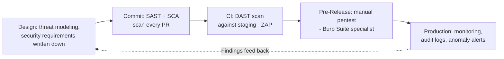

# Part 5: Security Testing II — Penetration Testing & DevSecOps

> **Study Guide for QA Professionals** — from OWASP fundamentals to hands-on pentesting and pipeline security
> Difficulty Level: Advanced | Estimated Reading Time: 50 minutes

---

## Table of Contents

1. [What Penetration Testing Actually Is](#51-what-penetration-testing-actually-is)
2. [The Real 2026 Tool Landscape: Burp Suite vs. OWASP ZAP](#52-the-real-2026-tool-landscape-burp-suite-vs-owasp-zap)
3. [SAST vs. DAST vs. SCA — Where Each One Catches What](#53-sast-vs-dast-vs-sca--where-each-one-catches-what)
4. [DevSecOps: What Shift-Left Security Actually Means](#54-devsecops-what-shift-left-security-actually-means)
5. [API Security Testing — Tokens, Rate Limits, and Broken Object-Level Authorization](#55-api-security-testing--tokens-rate-limits-and-broken-object-level-authorization)
6. [Vulnerability Management: CVSS, Triage, and Reporting a Finding](#56-vulnerability-management-cvss-triage-and-reporting-a-finding)
7. [Getting Started Without a Security Background](#57-getting-started-without-a-security-background)
8. [📌 Fact Sheet — Part 5 in 60 Seconds](#-fact-sheet--part-5-in-60-seconds)
9. [Common Interview Questions](#common-interview-questions)

---

## 5.1 What Penetration Testing Actually Is

Part 4 covered the OWASP Top 10 and the fundamental categories of security weakness —
injection, broken authentication, broken access control, and the rest. This part
assumes you already know *what* the vulnerabilities are, and moves to the harder
question: **how do you actually go find them, on a real running system, before
someone with worse intentions does?**

A penetration test ("pentest") is a structured, authorized attempt to break into a
system the way a real attacker would — not a checklist review, not a code read-through,
but an active attempt to exploit weaknesses and demonstrate real impact. "Authorized" is
doing a lot of work in that sentence: the difference between a pentest and a crime is a
signed scope document. Nobody — not even the most senior security engineer on a team —
attacks production systems without an agreed scope, timeframe, and rules of engagement.

### The three flavors, and why the labels matter

| Type | What the tester knows going in | What it simulates |
|---|---|---|
| **Black-box** | Nothing — no source code, no credentials, no architecture docs. Only what's publicly reachable. | An external attacker with zero insider knowledge |
| **White-box** | Everything — full source code access, architecture diagrams, sometimes even the ability to pair with developers | An insider threat, or the deepest possible audit before a high-stakes release |
| **Gray-box** | Partial — usually valid test credentials at one or two role levels, and general knowledge of the system's structure, but not the source code | A malicious or compromised *user* — the most common real-world attacker profile |

Black-box testing is the most "realistic" in theory, but it's also the slowest and
most expensive, because a huge fraction of the engagement is spent just mapping the
attack surface before any actual testing starts. White-box testing is the most
thorough, because nothing is hidden, but it requires a specialist comfortable reading
unfamiliar codebases under time pressure. **Gray-box sits in the middle, and it's
where almost all practical, ongoing QA-driven security testing actually lives.**

### Why QA engineers do gray-box, not full pentests

This is worth being explicit about, because the terms get conflated constantly: **a
QA engineer running security test cases is not "doing a pentest,"** and pretending
otherwise oversells what's happening. A full penetration test is typically:

- Performed by a certified specialist (OSCP, CEH, or equivalent) or a licensed
  external firm
- Scoped, time-boxed, and covered by a signed engagement letter and legal
  authorization
- Reported with a formal findings document, executive summary, and remediation
  timeline, often required for compliance (PCI-DSS, SOC 2) purposes

What a QA engineer does — and should do, continuously, not once a year — is
**gray-box security testing woven into regular functional and regression testing**:
logging in as a low-privilege test user and trying to reach another user's data by
editing an ID in a URL or API payload, checking whether an expired or revoked token
still works, verifying that a "customer" role can't reach an "admin" endpoint just
by guessing the URL, fuzzing input fields with the OWASP Top 10 categories in mind.
This is real, valuable security testing — it just isn't a pentest, and shouldn't be
reported or sold as one. The honest framing to give a stakeholder: *"our QA process
includes continuous gray-box security testing using the access level of a real user;
a full black-box/white-box pentest by a certified specialist is a separate, periodic
engagement, usually before a major release or annually for compliance."*

> [!TIP]
> **🎭 Meme Break — Distracted Boyfriend**
>
> 🚶 *The team, walking confidently past:* **"We do security testing, we've never
> been hacked"**  
> 👀 *Looking back at:* **"A gray-box regression suite that checks role-based access
> on 6 endpoints, versus the 200 endpoints actually in production"**

🧠 <strong>Quick Check:</strong> A QA engineer logs in as a "Merchant" test user, then edits a beneficiary ID in an API request to see if they can view a different merchant's beneficiary details. Is this a pentest? What type of testing is it?

No — this is gray-box **security testing**, not a formal penetration test. The tester
has partial knowledge (valid credentials at one role level, general system structure)
but isn't operating under a signed pentest engagement, isn't necessarily certified,
and isn't producing a formal pentest report. It's exactly the right kind of test for
a QA engineer to be running continuously — checking for Broken Object-Level
Authorization (BOLA) using legitimate access — but calling it "a pentest" to a
stakeholder overstates its scope and could create a false sense of compliance
coverage where a real, periodic pentest is actually still required.

---

## 5.2 The Real 2026 Tool Landscape: Burp Suite vs. OWASP ZAP

These are the two tools that dominate hands-on web/API security testing, and they
solve overlapping but genuinely different problems. Treating them as interchangeable
is a common beginner mistake — the honest 2026 picture is that mature teams tend to
run **both**, for different reasons, at different points in the delivery pipeline.

| | Burp Suite (PortSwigger) | OWASP ZAP |
|---|---|---|
| **License model** | Community (free, limited), Professional (paid, industry standard), Enterprise | Fully free and open-source |
| **Primary strength** | Manual, hands-on interception and exploitation — the intercepting proxy professional pentesters live in all day | Automation-first — built to be scripted and run unattended |
| **Who reaches for it** | Professional pentesters, security consultants, bug bounty hunters | DevOps/QA engineers wiring security into CI/CD |
| **Feature depth** | Richer: Intruder (automated attack payload fuzzing), Repeater (manual request replay/tampering), Collaborator (out-of-band interaction testing), extension marketplace (BApp Store) | Solid core proxy + active/passive scanner, automation framework (ZAP Automation Framework, YAML-driven), REST API for scripting |
| **CI/CD fit** | Possible (Enterprise tier), but not its natural home | Purpose-built — official Docker images, GitHub Action, and a `zap-baseline.py` / `zap-full-scan.py` script made specifically for pipeline gates |
| **Cost at scale** | Professional license per seat adds up for a whole QA team | Free at any scale — a real factor for teams that want a security gate on every single PR, not just a few licensed seats |

**How each is actually used in practice, not just on a feature list:**

A professional pentester doing a pre-release deep assessment lives inside Burp Suite
Professional. They intercept every request the app makes, send interesting ones to
Repeater to manually tamper with parameters and headers, use Intruder to fuzz a login
form with a curated payload list, and use Collaborator to catch out-of-band
vulnerabilities (like blind SSRF) that never show up in a normal HTTP response. This
is slow, deliberate, expert-driven work — and it's exactly why it doesn't scale to
"run this before every merge." A single focused Burp Suite session by someone who
knows the app can surface findings that no scanner would ever catch, because the
tester is thinking like an attacker, not executing a fixed rule set.

OWASP ZAP earns its place for the opposite reason: it's free, scriptable, and happy
to run unattended, headless, in a pipeline, against every pull request or nightly
build, without anyone paying per-seat or babysitting it. A `zap-baseline.py` scan
against a staging URL takes a few minutes, produces a pass/fail report, and can be
wired to fail a build the same way a broken unit test would. It won't catch the
subtle, context-specific vulnerabilities a skilled human tester would — but it will
reliably catch the "we forgot a security header," "this cookie isn't marked
`HttpOnly`," or "this endpoint reflects unsanitized input" class of issue on *every
single change*, which a human simply cannot do at that frequency.

**The mature setup for a growing team** is genuinely both, used for their different
strengths rather than one displacing the other: **ZAP runs automatically as a
continuous gate** — baseline scans on every PR against a staging environment, full
active scans nightly or weekly — catching regressions the moment they're introduced.
**Burp Suite is reserved for a specialist** (an internal security champion, or an
external pentester) doing a periodic deep assessment — before a major release, after
a significant architecture change, or as an annual compliance requirement. Neither
tool replaces the other; ZAP is the smoke detector that never sleeps, Burp is the
fire marshal who does the thorough inspection.

> [!TIP]
> **🎭 Meme Break — Expanding Brain**
>
> 🧠 *Level 1: "We should buy Burp Suite licenses for the whole QA team."*  
> 🧠🧠 *Level 2: "Actually, ZAP is free — let's just use that everywhere."*  
> 🧠🧠🧠 *Level 3: "Wait, they're not actually substitutes for each other."*  
> 🧠🧠🧠🧠 *Level 4: ZAP gates every PR automatically for free; one Burp Suite seat
> for a security champion doing quarterly deep-dives costs less than one incident.*

🧠 <strong>Quick Check:</strong> A team wants a security scan to run automatically on every pull request, blocking the merge if critical issues are found. Burp Suite or OWASP ZAP — and why?

OWASP ZAP. It's free at any scale (no per-seat licensing pain for gating hundreds of
PRs a month), has official Docker images and a CI-ready baseline scan script designed
exactly for this use case, and is built to run unattended without a human driving it.
Burp Suite Professional is the better tool for a human-led, deep manual assessment —
but its workflow (Repeater, Intruder, an expert interpreting results) assumes a
person is actively using it, which doesn't fit an automated PR gate.

---

## 5.3 SAST vs. DAST vs. SCA — Where Each One Catches What

Three acronyms that get thrown around interchangeably in job postings but test
completely different things. Understanding what each one *can't* see is as
important as what it can.

| | SAST (Static) | DAST (Dynamic) | SCA (Software Composition Analysis) |
|---|---|---|---|
| **What it examines** | Source code, without running it | A running application, from the outside, black-box style | Third-party/open-source dependencies and their known vulnerabilities |
| **Finds** | Hardcoded secrets, SQL injection patterns, insecure crypto usage, unsafe deserialization — issues visible *in the code* | Issues only visible when the app is actually running: misconfigured headers, session handling, actual exploitable injection, authentication bypass | Known CVEs in libraries/packages the app depends on, license-compliance issues, outdated versions |
| **When it runs** | On every commit/PR — fast enough to run inline | Against a deployed build — staging or a review environment, since it needs a live target | On every dependency change (`package.json`, `pom.xml`, etc.) |
| **Example tools** | SonarQube, Semgrep, Checkmarx, GitHub CodeQL | OWASP ZAP, Burp Suite (Enterprise), Nikto | Snyk, OWASP Dependency-Check, GitHub Dependabot |
| **Blind spot** | Can't see runtime behavior — misses issues that only appear when the app actually executes with real data/config | Can't see the code — misses vulnerabilities buried in logic it never happens to exercise during the scan | Only as good as its vulnerability database — brand-new (zero-day) CVEs in a dependency won't show up until the database catches up |

The practical takeaway: **none of the three is sufficient alone.** SAST would never
catch a library with a known CVE sitting in `node_modules` — that code isn't "yours,"
it's a black box to a source scanner. SCA would never catch a SQL injection your own
developer wrote — that's not a dependency issue. DAST would never catch a hardcoded
API key sitting in a source file that's never actually exercised by a running scan.
A pipeline with only one of the three has a systematic blind spot, not just reduced
coverage — which is exactly why DevSecOps pipelines (next section) run all three at
different stages rather than picking one.

🧠 <strong>Quick Check:</strong> A team runs only SAST in their pipeline and considers their security testing "covered." What's the gap?

Two real gaps. First, SCA: SAST scans the team's own code, not the third-party
libraries it depends on — a known CVE sitting in an outdated dependency would go
completely undetected. Second, DAST: SAST can't see runtime behavior, so
vulnerabilities that only manifest when the app is actually running with real
configuration — a misconfigured security header, a session token that doesn't expire
properly, an authentication bypass reachable only through the live API — would also
go undetected. "SAST only" means visibility into roughly one of three genuinely
different vulnerability classes.

---

## 5.4 DevSecOps: What Shift-Left Security Actually Means

"Shift-left" gets used as a buzzword so often that it's worth being concrete about
what it actually changes in practice. **It does not mean "run a security scanner in
CI."** That's one piece of it — a necessary but insufficient piece. Shift-left
security means moving the *entire* security conversation earlier in the lifecycle,
not just moving the scan earlier in the pipeline.

**What actually changes, stage by stage:**

- **At design time**, before a line of code is written: security requirements get
  written down explicitly, the same way functional requirements do. "Merchants can
  view their own transaction history" gets a design-time follow-up: *who else must
  never be able to view it, and how is that enforced at the API layer, not just the
  UI?* This is threat modeling done early, when changing the design costs a
  conversation instead of a re-architecture.
- **On every commit**, automated SAST and SCA/dependency scanning run inline —
  fast enough that a developer sees a failed check in the same feedback loop as a
  failed unit test, not three weeks later in a pentest report.
- **In CI, against a deployed build**, automated DAST (OWASP ZAP baseline/full scans)
  runs against staging on every meaningful deploy — catching the class of runtime
  issue SAST structurally cannot see.
- **Before a major release**, a human specialist runs a deeper manual assessment
  (Burp Suite session, or a full external pentest) — the periodic, expert-driven
  layer that automation can't replace.
- **In production**, monitoring and logging continue the story — an intrusion
  detection system, anomaly alerts on authentication patterns, and audit trails are
  themselves a form of continuous security testing, catching what pre-release testing
  missed.

The reason this matters isn't abstract. A vulnerability found at design time costs a
sentence in a review comment. The same class of vulnerability found by a pentester
two days before a release costs a scramble, a possible release delay, and a fix
under pressure. The same one found by an attacker in production costs an incident,
possibly a breach disclosure, and a very different kind of scramble. This is the
security-specific version of the 1-10-100 cost curve Part 1 introduced — and it's
why "we'll do a pentest before we ship" is a real practice worth keeping, but a
catastrophically incomplete security strategy if it's the *only* security testing
that happens.

> [!WARNING]
> **🎭 Meme Break — "This Is Fine" Dog**
>
> 🔥 *Security requirements: never written down, assumed obvious.*  
> 🔥 *SAST/SCA: "we'll add that eventually."*  
> 🔥 *The only security testing that happens is one pentest, three days before a
> major release, on a system that's been changing daily for six months.*  
> 🔥 *This is fine.*

🧠 <strong>Quick Check:</strong> A team says "we do shift-left security — we run OWASP ZAP in our CI pipeline." Is that actually shift-left, in full?

Partially — it's one real piece (DAST automated in CI), but not the full practice.
Genuine shift-left also means: security requirements defined at design time (not
just tested for after the fact), SAST and SCA scanning on every commit (not just a
dynamic scan later in CI), and a periodic manual pentest before major releases feeding
findings back into the design conversation. A team running only a CI-stage DAST scan
has automated one gate — useful, but it's still catching issues after the code
already exists, which is exactly the "moved the scan, not the conversation" version
of shift-left the term is meant to move past.

---

## 5.5 API Security Testing — Tokens, Rate Limits, and Broken Object-Level Authorization

Modern applications are mostly APIs wearing a UI. Every category of vulnerability
covered in Part 4 has an API-specific angle, and API security testing deserves its
own focused attention because the API often has weaker enforcement than the UI sitting
in front of it — the UI hides a button; the API endpoint behind that button may not
check anything at all.

**Auth token testing** goes well beyond "does login work." A QA engineer testing API
security should routinely check: does an expired token still get accepted? Does a
token issued for one role work against an endpoint meant for a higher-privileged
role, just because nobody checks scope server-side? Does logging out actually
invalidate the token server-side, or does the old token keep working until it
naturally expires? Is the token itself exposed somewhere it shouldn't be — a URL
query parameter that ends up in server logs and browser history, instead of a header?

**Rate limiting** is security testing that looks like performance testing and gets
skipped by both teams for that reason. Without a rate limit, a login endpoint becomes
a brute-force target, an OTP-verification endpoint becomes guessable within minutes,
and a "check if this email is registered" endpoint becomes a way to enumerate every
user in the system one request at a time. Testing this is straightforward: script a
loop hitting the same endpoint with the same or varying credentials and confirm the
system starts rejecting or throttling requests well before an attacker could
realistically succeed by brute force — and confirm the lockout applies per account
or per IP appropriately, not in a way that lets an attacker lock out a legitimate
user as a denial-of-service side effect.

**Broken Object-Level Authorization (BOLA)** — the API manifestation of the IDOR
(Insecure Direct Object Reference) concept from Part 4 — is consistently the single
most common real-world API vulnerability class, and it's also the easiest for a QA
engineer with zero specialist security background to actually test for. The pattern
is always the same: an authenticated, legitimate user changes an ID in a request —
a beneficiary ID, a transaction ID, an order ID, a document reference — to point at
a resource that belongs to someone else, and checks whether the server actually
enforces "this ID belongs to *you*" or just checks "is this ID valid at all."

### A real narrated scenario: the beneficiary approval bypass

Picture a payout platform where a merchant adds a new bank beneficiary before paying
them — and that beneficiary has to clear an approval step first, precisely so a
compromised account or a rushed employee can't route real money to an unvetted
account. The UI does this correctly: the "Pay" button is disabled, greyed out, until
the beneficiary shows an "Approved" badge. Somewhere during regression testing, a
tester bypasses the UI entirely and calls the payout-initiation API directly against
a beneficiary still sitting in "Pending Approval" — and the payout goes through
anyway. The UI was never actually the security control; it was a decoration in front
of an API that enforced nothing. This is a textbook example of security enforcement
living in the wrong layer — the check has to exist at the service/API boundary, on
every entry point, not just the one the design mockups happened to draw a button for.
It's also exactly the kind of finding that a gray-box API test — not a UI click-test
— is the only way to catch, because the UI itself never showed anything wrong.

→ Reference: <a href="https://github.com/ghanendra-sdet/fintech-payout-engine/blob/main/sample-defect-report.md" target="_blank" rel="noopener noreferrer">Fintech Payout Engine — sample-defect-report.md</a>

### A real narrated scenario: retry idempotency as a security-adjacent flaw

Not every security-relevant defect gets filed under "Security" — some of the most
serious ones live under "Reliability" or "Payments" and are security-adjacent because
of what's actually at stake: real money, moved without an attacker doing anything at
all. Picture a payout that actually completes successfully on the bank's side, but
the confirmation message back to the platform is delayed or dropped — so the
platform's own records show the transfer as `FAILED`, even though the beneficiary
already has the money. Someone — an operator, or an automated retry job — sees
"Failed" and triggers a retry. If the retry logic trusts the platform's own local
status instead of re-checking the authoritative source (the bank rail) before
resubmitting, the same beneficiary gets paid twice. No attacker, no exploit, no
malicious actor required — just a system that didn't verify ground truth before
acting a second time. It's worth testing this exact pattern the way a security tester
would think about a **replay attack**: idempotency isn't just a reliability property,
it's a control against a state where the same authorized action fires more than once
and causes real, hard-to-reverse financial harm. This is why retry idempotency gets
treated as the single highest-priority test scenario in a payout module — it sits at
the intersection of reliability testing and security-grade financial integrity, and
it deserves a Blocker-severity classification precisely because "recovering an
overpayment from an external party" is dramatically harder than fixing the code that
allowed it.

→ Reference: <a href="https://github.com/ghanendra-sdet/fintech-payout-engine/blob/main/sample-defect-report.md" target="_blank" rel="noopener noreferrer">Fintech Payout Engine — sample-defect-report.md</a>

### A real narrated scenario: BOLA risk in a shared, permissioned AI layer

Now picture a very different shape of API surface: a single AI operations engine
sitting across six separate connected products — collection, payout, connected
banking, bill-payment, reseller management, and an account-aggregator product — with
permissioned read access to transactions, settlements, KYC records, commercials, and
audit logs across all of them, specifically so it can answer a merchant's question
like "why is my payout stuck?" or a reseller's question like "why did my commission
change?" conversationally, without a human agent digging through six separate admin
panels. This is exactly the kind of architecture that deserves the most rigorous
BOLA-style testing in the whole platform, for a structural reason: a single
authorization mistake in one shared engine doesn't cost one product a data leak, it
potentially exposes the same class of mistake across all six products
simultaneously, because they all route through the identical underlying access layer.

The testing angle worth narrating: a merchant in a support conversation asks the AI
"why is my settlement lower this month?" — a legitimate, in-scope question the AI is
supposed to answer using that merchant's own data. The security test is what happens
when the *same conversational surface* is prodded to reach past its own account
boundary — referencing another merchant's transaction ID, or phrasing a request in a
way that could trick a permissioned data-reading system into treating cross-account
data as in-scope for the current session. This is BOLA testing adapted to a
conversational AI attack surface rather than a classic REST endpoint, and it's a
genuinely new category of testing that didn't exist for QA engineers a few years ago:
verifying that an AI system with broad, permissioned, cross-product read access
enforces the *same* per-account authorization boundary a traditional API would,
regardless of how creatively a request is phrased. The platform's own design
already reflects this risk being taken seriously — every high-risk action (a refund,
a beneficiary approval, a merchant block, a settlement creation) the AI could
theoretically take is required to stop at a human-confirmation step rather than
executing autonomously, and every proposed action is audit-logged regardless of
whether a human approved, rejected, or never reviewed it — which is exactly the
control a security tester should independently verify holds under adversarial
conversation, not just under the happy-path conversation the demo shows.

→ Reference: <a href="https://github.com/ghanendra-sdet/ai-dispute-resolution-engine" target="_blank" rel="noopener noreferrer">AI Dispute Resolution Engine</a>

> [!CAUTION]
> **🎭 Meme Break — Is This a Pigeon**
>
> 🦋 *A UI "Pay" button that's disabled until a beneficiary is approved*  
> 🧑 *A QA engineer calling the payout API directly, bypassing the button entirely*  
> ❓ *"Is this... a security control?"*

🧠 <strong>Quick Check:</strong> The payout platform's UI correctly blocks paying an unapproved beneficiary, but the underlying API accepts the same request directly. Why is testing only through the UI insufficient to catch this?

Because UI-only testing never exercises the API on its own terms — the disabled
button prevents the *UI* from sending the request, but says nothing about whether the
*server* would reject it if asked directly. This is exactly the BOLA/broken-access-
control pattern: the enforcement lived only in the client layer, which any direct API
call, a modified mobile app, or an attacker with basic tooling (Postman, Burp
Repeater) can simply skip. Real API security testing has to call the endpoint
directly, independent of the UI, with a payload that should be rejected, to confirm
the server itself — not just the button — enforces the rule.

---

## 5.6 Vulnerability Management: CVSS, Triage, and Reporting a Finding

Finding a vulnerability is half the job. Communicating it in a way that gets it
prioritized and fixed — rather than lost in a backlog behind forty "nice to have" UI
tickets — is the other half, and it's a skill most functional-testing training
never covers.

### CVSS: what the score actually communicates

The Common Vulnerability Scoring System (CVSS) produces a 0.0–10.0 severity score
from a set of standardized metrics — not a gut feeling, a repeatable calculation.
The metrics that matter most to understand, even without memorizing the formula:

- **Attack Vector** — can this be exploited remotely over a network, or does it
  require local/physical access? Network-exploitable scores higher.
- **Attack Complexity** — does exploitation require special conditions or
  significant attacker effort, or does it just work reliably?
- **Privileges Required** — does the attacker need to already be authenticated at
  some level, or can anyone unauthenticated exploit it?
- **User Interaction** — does a victim have to do something (click a link), or does
  the attacker need nothing from anyone else?
- **Impact (Confidentiality / Integrity / Availability)** — what actually happens if
  it's exploited: data exposure, data tampering, or service disruption — and how
  much of each?

| Score range | Severity | What it means in practice |
|---|---|---|
| 9.0 – 10.0 | Critical | Remote, low-effort, often unauthenticated, high impact — fix immediately, often same-day |
| 7.0 – 8.9 | High | Serious impact, may require some conditions to exploit — fix before next release, often faster |
| 4.0 – 6.9 | Medium | Real but constrained — some privilege or interaction required, or partial impact — scheduled fix |
| 0.1 – 3.9 | Low | Limited impact or very hard to exploit — tracked, fixed opportunistically |

Applying this lens to the beneficiary-approval-bypass scenario above: an
unauthenticated attacker can't exploit it directly (it needs a valid merchant-level
API credential), but a *legitimately authenticated but low-trust* user can trigger it
with zero special conditions, and the impact is direct, hard-to-reverse financial
loss. That combination — low privileges required, low complexity, high integrity/
availability impact on money movement — lands solidly in **High to Critical**
territory (roughly CVSS 8.0+ depending on the exact authentication model), which
matches the "Critical" severity the defect was actually logged at. The retry-
idempotency duplicate-payment issue scores even higher in practice, because it
requires *no* attacker at all — just a normal operational retry — which some CVSS
practitioners handle by scoring it as a reliability/integrity issue with an
equivalent business-impact framing rather than a strict CVSS calculation, since CVSS
technically models adversarial exploitation, not accidental self-inflicted harm. The
practical lesson either way: **severity should track business impact and ease of
occurrence, not just "is there a malicious hacker involved."**

### Triage: what happens after a finding lands

A vulnerability report doesn't get fixed just because it exists — it competes for
engineering time against every other ticket, which means triage matters as much as
discovery:

1. **Validate and reproduce** — confirm the finding is real, not a scanner false
   positive (SAST/DAST tools produce plenty of noise; a human should confirm exploitability before it goes further).
2. **Score it** — apply CVSS (or an internal equivalent) so severity is comparable
   across unrelated findings instead of "whoever shouted loudest gets fixed first."
3. **Assess blast radius** — is this one endpoint, or a pattern repeated across the
   codebase (like the BOLA-across-six-products scenario above)? A single Critical
   finding that turns out to be systemic changes the remediation plan entirely.
4. **Assign an SLA by severity** — Critical findings typically get a same-day or
   24-48 hour fix commitment; High within the current sprint; Medium/Low scheduled
   normally. Writing this down in advance, before findings exist, avoids ad hoc
   negotiation under pressure.
5. **Track to closure, and re-test** — a vulnerability ticket isn't done when a fix
   merges; it's done when the original exploit is re-attempted and confirmed blocked.

### How a QA engineer reports a security finding differently from a functional bug

A functional bug report says "here's what's broken." A security finding needs an
extra layer of judgment, because the report itself can become a risk:

- **Frame severity by exploitability and impact, not by how visually dramatic the
  bug is.** A misaligned button is more *visible* than a broken authorization check,
  but the authorization check is the one that costs real money or data if it ships.
- **Don't over-share the exploit publicly.** A functional bug report can live in an
  open team channel with full repro steps; a live, exploitable vulnerability in a
  production or near-production system generally shouldn't — restrict it to the
  people who need to fix it, the same instinct behind responsible disclosure norms
  used industry-wide, applied internally rather than to the outside world. Practically,
  that means: file it in a restricted-visibility ticket type if your tracker supports
  one, don't paste working exploit payloads into a wide Slack channel, and don't leave
  proof-of-concept scripts sitting in a public repo.
- **State impact in business terms, not just technical terms** — "an authenticated
  low-privilege user can trigger a duplicate payout to any beneficiary" lands with a
  release manager in a way that "retry doesn't re-verify bank status before
  resubmitting" alone does not. Both belong in the report; lead with the former.
- **Propose remediation, don't just report the break.** The best security findings
  suggest the fix boundary (as the sample defect report format does — "enforce this
  check at the service/API layer, not only in the UI") because it shortens the gap
  between report and resolution.

🧠 <strong>Quick Check:</strong> Two findings land in the same sprint: a misaligned button on a settings page, and an authorization gap letting a low-privilege user trigger a duplicate payout via direct API call. A stakeholder asks which is "worse" because the button bug has three duplicate reports from users. Volume of reports isn't the right signal here — what is?

CVSS-style impact and exploitability, not report volume. The button bug is visible
and annoying, which is why it generates duplicate reports — but its business impact
is cosmetic. The authorization gap requires no special skill to exploit (any
authenticated low-privilege user, low attack complexity), and its impact is direct,
hard-to-reverse financial loss — that combination puts it in High/Critical CVSS
territory regardless of how many people happened to notice and report the button.
Severity should be driven by what happens if it's exploited and how easily, not by
how many people were annoyed enough to file a ticket.

---

## 5.7 Getting Started Without a Security Background

Most QA engineers are handed security testing responsibility without a security
background, a certification, or formal training — and told to "make sure it's
secure" with no further guidance. Here's a concrete, ordered starting point, not
vague encouragement:

1. **Install OWASP ZAP and run it against a staging environment you're already
   allowed to test.** Not production, not someone else's app — your own team's
   staging URL, which you already have legitimate authorization to test. Run a
   baseline scan, read every finding it produces, and look up anything unfamiliar.
   This alone teaches more of the OWASP Top 10 in a hands-on way than reading about
   it ever will.
2. **Install Burp Suite Community Edition** and configure it as your browser's proxy
   for a day of normal manual testing. Just watching every request and response flow
   through the proxy — headers, cookies, tokens, payloads — builds an intuition for
   "what does this app actually send" that reading API docs never gives you.
3. **Work through the OWASP Web Security Testing Guide (WSTG) checklist, one item
   at a time, against your own application.** It's a free, structured checklist
   maintained by OWASP specifically so testers don't have to invent a methodology
   from scratch — treat it the way you'd treat a functional test-case checklist.
4. **Practice on <a href="https://portswigger.net/web-security" target="_blank" rel="noopener noreferrer">PortSwigger's Web Security Academy</a>**
   — free, hands-on labs (built by the makers of Burp Suite) that walk through
   exploiting real vulnerability classes in a safe, legal, purpose-built environment.
   This is the single highest-value free resource for building practical exploitation
   intuition without a security certification.
5. **Add BOLA/IDOR checks to your existing regression suite, today, not as a
   separate initiative.** For every API endpoint your automation already covers that
   takes an ID parameter, add one negative test: authenticate as User A, request
   User B's resource by ID, assert it's rejected. This is the highest-value,
   lowest-effort security testing a QA engineer can add immediately, and it directly
   mirrors the real defect narrated in section 5.5.
6. **Learn to read a CVSS score before you learn to calculate one.** You don't need
   to memorize the full formula to correctly interpret "this is a 9.1" versus "this
   is a 3.2" when triaging a scanner report — official CVSS calculators exist online
   for the rare case you need to score something yourself.
7. **Find or become a security champion.** Many teams designate one engineer per
   squad as a security point of contact who gets slightly deeper training (sometimes
   a Burp Suite Professional seat) and acts as the bridge to a central security team.
   Volunteering for this role is one of the fastest ways to build real depth, because
   it comes with actual mentorship and real findings to work through, not just
   self-study.

> [!TIP]
> **🎭 Meme Break — Drake Hotline Bling**
>
> ❌ *Waiting until you're "qualified enough" to start security testing.*  
> ✅ *Running a free ZAP baseline scan against your own team's staging URL this
> afternoon, and reading every single finding it produces.*

---

## 📌 Fact Sheet — Part 5 in 60 Seconds

- **Pentest types**: black-box (zero knowledge, simulates an external attacker),
  white-box (full source/architecture access, deepest audit), gray-box (partial
  access, usually valid low-privilege credentials — simulates a malicious or
  compromised *user*, and is what most QA-driven security testing actually is).
- **QA engineers do gray-box security testing continuously, not full pentests** —
  a formal pentest is a certified specialist's periodic, scoped, legally-authorized
  engagement; conflating the two oversells your coverage to stakeholders.
- **Burp Suite vs. OWASP ZAP (2026)**: Burp is the richer, manual, expert-driven tool
  professional pentesters live in (Repeater, Intruder, Collaborator); ZAP is free,
  scriptable, and built for CI/CD automation. The mature setup runs **both** — ZAP as
  a continuous automated gate on every PR, Burp for periodic deep assessments by a
  specialist before major releases.
- **SAST, DAST, and SCA each have a structural blind spot the others cover**: SAST
  reads your own code (misses dependencies and runtime behavior), DAST tests a
  running app from outside (misses code never exercised), SCA scans dependency CVEs
  (misses your own custom code entirely). A pipeline needs all three.
- **Shift-left security means moving the whole conversation earlier**, not just
  running a scanner in CI: security requirements at design time, SAST/SCA on every
  commit, DAST in CI against staging, manual pentest before major releases,
  monitoring in production feeding findings back to design.
- **BOLA (Broken Object-Level Authorization)** is the API version of IDOR and the
  single most common real-world API vulnerability — test it by changing an ID in an
  authenticated request to point at someone else's resource and confirming the
  server (not just the UI) rejects it.
- Real narrated example: a payout platform's UI correctly blocked paying an
  unapproved beneficiary, but the underlying API accepted the same request directly
  — the enforcement lived only in the client layer, a textbook broken-access-control
  finding, logged at Critical severity.
- Real narrated example: a retry mechanism that trusted local `FAILED` status
  instead of re-verifying with the bank rail resulted in a beneficiary being paid
  twice — a security-adjacent, replay-like integrity failure with no attacker
  required, logged at Blocker severity.
- Real narrated example: a shared AI operations layer with permissioned read access
  across six connected fintech products carries a structural BOLA risk — one
  authorization mistake in the shared engine has a 6x blast radius versus a
  single-product bug, which is why every high-risk action it could take stops at a
  human-confirmation step and every proposal is audit-logged regardless of outcome.
- **CVSS (0.0–10.0)** communicates severity from attack vector, complexity,
  privileges required, user interaction, and confidentiality/integrity/availability
  impact — not a gut feeling. 9.0+ is Critical (fix immediately); under 4.0 is Low.
- **Triage a security finding like any other, but with an SLA by severity decided in
  advance**: validate/reproduce, score it, assess blast radius (is it systemic?),
  assign a fix SLA, and re-test to confirm the exploit is actually blocked before
  closing.
- **Report security findings differently from functional bugs**: lead with business
  impact, don't broadcast working exploit payloads in open channels, and propose a
  remediation boundary — don't just report the break.
- **Getting started with zero security background**: run OWASP ZAP against your own
  staging environment, proxy your own traffic through Burp Suite Community for a day,
  work the OWASP WSTG checklist, practice on PortSwigger's Web Security Academy, and
  add one BOLA negative test to your existing regression suite today.

---

## Common Interview Questions

### Question 1: What's the difference between a penetration test and the security testing a QA engineer does day-to-day?

**Model Answer:**

"A formal penetration test is typically performed by a certified specialist under a
signed scope and legal authorization, black-box or white-box, producing a formal
findings report — often required for compliance purposes like PCI-DSS or SOC 2. What
I do as a QA engineer is gray-box security testing woven into regular functional and
regression testing: using valid test credentials at a given role level to check
things like whether I can access another user's data by changing an ID in a request,
whether an expired token still works, or whether role-based access is actually
enforced server-side. It's real, valuable, continuous testing — but I'm careful not
to call it a pentest to stakeholders, because it doesn't replace the periodic,
specialist-led engagement that compliance and deep architectural risk actually
require."

### Question 2: When would you use OWASP ZAP versus Burp Suite, and why not just pick one?

**Model Answer:**

"They solve different problems. ZAP is free, scriptable, and built for automation —
I'd run it as a continuous gate in CI/CD, baseline-scanning every PR against staging
so regressions get caught the moment they're introduced, without per-seat licensing
limiting how broadly it can run. Burp Suite Professional is the richer, manual tool
— Repeater, Intruder, Collaborator — that a specialist uses for a deep, expert-driven
assessment, which doesn't scale to 'run on every commit' because it assumes a human
is actively driving it. The mature setup I'd advocate for is both: ZAP automated on
every change, Burp Suite reserved for a security champion or external pentester doing
periodic deep assessments before major releases."

### Question 3: How would you explain CVSS severity to a product manager who wants to know why a security bug is being prioritized over ten functional bugs?

**Model Answer:**

"I'd translate the CVSS components into business terms rather than quoting the score
alone: does exploiting this require special access or skill, or can any logged-in
user trigger it with no special conditions? What actually happens if it's exploited —
does someone see data they shouldn't, or can they cause real financial harm? A finding
that any authenticated user can trigger, with no special effort, that results in
direct financial loss — like an authorization gap letting a low-privilege user push
a payout to an unapproved beneficiary — sits in High-to-Critical territory precisely
because it's both easy to trigger and severe in impact, which is a fundamentally
different risk profile than ten cosmetic UI bugs, regardless of how many tickets each
one generated."
