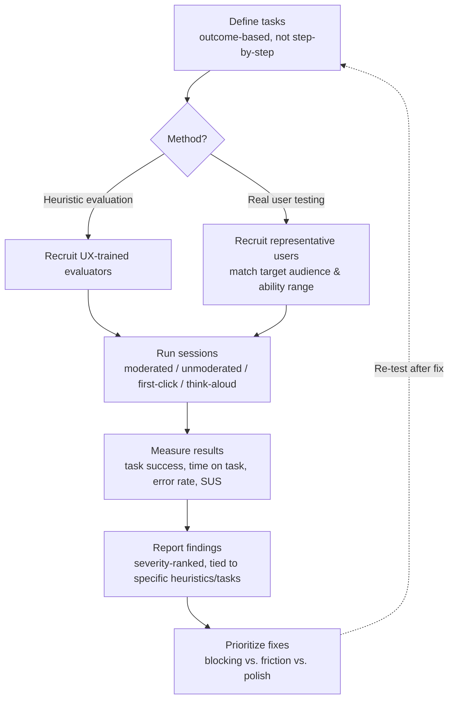

# Part 6: Usability & Interaction Testing

> **Study Guide for QA Professionals** — Non-Functional Testing, from first principles
> Difficulty Level: Intermediate to Advanced | Estimated Reading Time: 45 minutes

---

## Table of Contents

1. [What Usability Testing Actually Measures](#61-what-usability-testing-actually-measures)
2. [Nielsen's 10 Usability Heuristics](#62-nielsens-10-usability-heuristics)
3. [Usability Testing Methods](#63-usability-testing-methods)
4. [Writing a Usability Test Script and Measuring Results](#64-writing-a-usability-test-script-and-measuring-results)
5. [Self-Descriptiveness — Interaction Capability's Newer Emphasis](#65-self-descriptiveness--interaction-capabilitys-newer-emphasis)
6. [The Usability Testing Process, End to End](#66-the-usability-testing-process-end-to-end)
7. [📌 Fact Sheet — Part 6 in 60 Seconds](#-fact-sheet--part-6-in-60-seconds)
8. [Common Interview Questions](#common-interview-questions)

---

## 6.1 What Usability Testing Actually Measures

Part 1 already told you where this module sits: **Usability was renamed Interaction
Capability in the 2023 revision of ISO/IEC 25010**, broadened to fold in inclusivity
and self-descriptiveness rather than treating them as bolt-ons. This part covers the
"can a real person actually get the task done" half of that characteristic; Part 7
covers the "can a person with a disability get it done too" half. They overlap on
purpose — a self-descriptive interface helps everyone, and a screen-reader user
failing a flow is a usability failure, not a separate category of problem — but they're
tested with different tools and different rigor, which is why they're split.

The classic framing, still the backbone of every usability test plan written today,
comes from **ISO 9241-11**, and it defines usability as the extent to which a product
can be used by specified users to achieve specified goals with:

- **Effectiveness** — can users actually complete the task, accurately and completely?
- **Efficiency** — how much effort (time, clicks, cognitive load) does completing it
  correctly cost them?
- **Satisfaction** — how comfortable, confident, and positive do users feel while doing
  it?

Notice what's *not* in that list: "does it look nice." Usability testing is not a
design-taste exercise — it's an empirical measurement exercise. A screen can be visually
gorgeous and fail effectiveness (users can't find the button), fail efficiency (it takes
11 clicks to do a 2-click task), and fail satisfaction (users describe it as
"frustrating") simultaneously. All three are measurable, which is what separates
usability testing from a stakeholder saying "I don't like how this looks" in a design
review.

**Interaction Capability broadens this in a specific, deliberate direction.** Where
classic usability testing asks "can the target user complete the task," Interaction
Capability adds two structural questions that used to live only in accessibility
checklists: *can a user figure out what to do without external help* (self-descriptiveness,
covered in depth in section 6.5), and *can a user who doesn't match the "typical" user
profile — different device, different ability, different context — still succeed*
(inclusivity). The practical effect for a QA engineer: a 2026 usability test plan that
only recruits five able-bodied users on a laptop with a fast connection is testing the
old, narrower Usability. A test plan that also asks "would this task description alone
be enough for someone who's never seen this screen before" is testing Interaction
Capability the way the current standard actually defines it.

> [!TIP]
> **🎭 Meme Break — Drake Hotline Bling**
>
> ❌ *"The design team approved it, it looks great, ship it."*  
> ✅ *"Five real users tried to complete the actual task, and here's exactly where,
> how often, and why they got stuck."*

🧠 <strong>Quick Check:</strong> A checkout flow is visually polished, on-brand, and every stakeholder loves the design. Why might it still fail a usability test?

Because visual polish and brand approval say nothing about effectiveness, efficiency,
or satisfaction under ISO 9241-11 — a gorgeous screen can still bury the "Place Order"
button below the fold, require re-entering information the system already had, or use
labels that don't match how real users think about the task. Usability is measured by
watching real users attempt real tasks, not by a design review.

---

## 6.2 Nielsen's 10 Usability Heuristics

Jakob Nielsen's ten heuristics, first published in 1994, are still the single most
useful checklist in usability testing precisely because they're not tied to any one
UI trend — they describe recurring failure patterns that show up in every era of
software. Each one below comes with a concrete, testable example so this stays a QA
tool, not a design-school lecture.

**1. Visibility of system status.** The system should always keep users informed about
what's happening, through appropriate feedback within reasonable time. *Testable
example:* click "Save" on a form with a slow backend and watch what happens for the
next three seconds. If there's no spinner, no disabled-button state, and no
confirmation message, a real user will click Save again — and now you may have a
double-submission bug that started as a usability gap.

**2. Match between system and the real world.** The system should speak the users'
language, with familiar words and concepts, following real-world conventions.
*Testable example:* does an HR system's leave-balance screen say "12.5 days remaining"
or does it expose a raw internal field like `leaveBalanceDelta: 12.5`? The first
matches how an employee actually thinks about their own leave; the second leaks
implementation detail into the UI.

**3. User control and freedom.** Users need a clearly marked "emergency exit" to leave
an unwanted state without going through an extended process — undo and redo are the
canonical examples. *Testable example:* start a multi-step wizard (e.g. a course
enrollment flow), get to step 3, and try to go back to step 1 without losing what you
entered on step 2. If backing up wipes the form, that's a control-and-freedom failure.

**4. Consistency and standards.** Users shouldn't have to wonder whether different
words, situations, or actions mean the same thing — follow platform and internal
conventions. *Testable example:* if "Submit" saves and advances on one screen but
"Submit" only saves (without advancing) on another screen in the same product, that's
an inconsistency a usability pass should catch before a confused support ticket does.

**5. Error prevention.** Even better than a good error message is a careful design that
prevents a problem from occurring in the first place. *Testable example:* a date-of-
birth field that accepts free text will eventually get "13/45/2026" typed into it; a
constrained date picker prevents the error class entirely rather than catching it after
the fact.

**6. Recognition rather than recall.** Minimize the user's memory load by making
elements, actions, and options visible, rather than requiring them to remember
information from one part of the interface to another. *Testable example:* an
assessment screen that shows "Question 7 of 20" and a visible progress indicator lets
learners recognize where they are; one that only shows the current question forces them
to recall how far they've gotten.

**7. Flexibility and efficiency of use.** Accelerators — unseen by novice users — can
speed up interaction for expert users, so the system can cater to both inexperienced
and experienced users. *Testable example:* a power-user HR admin who processes 50 leave
approvals a day should have a bulk-approve action; a first-time employee submitting one
leave request shouldn't be forced to learn that shortcut to get through the basic flow.

**8. Aesthetic and minimalist design.** Interfaces shouldn't contain irrelevant or
rarely needed information that competes with the relevant information and diminishes
its visibility. *Testable example:* a course-content page with the actual lesson video
squeezed into a corner surrounded by promotional banners is measurably harder to use —
this is testable via first-click testing (section 6.3), which will show users clicking
the banner instead of the "Start Lesson" button.

**9. Help users recognize, diagnose, and recover from errors.** Error messages should
be expressed in plain language, precisely indicate the problem, and constructively
suggest a solution. *Testable example:* "Error 500" tells a user nothing actionable;
"We couldn't save your changes — check your connection and try again" tells them what
happened and what to do about it.

**10. Help and documentation.** Even though it's better if the system can be used
without documentation, it may be necessary to provide help — and it should be easy to
search, focused on the user's task, and not too large. *Testable example:* a complex
field like "Mastery Score threshold" on an assessment-authoring screen benefits from an
inline tooltip explaining what it controls, rather than forcing the instructor to leave
the screen and search external documentation to understand a field they're looking
straight at.

> [!TIP]
> **🎭 Meme Break — Expanding Brain**
>
> 🧠 *Level 1: "Usability testing means asking if the UI looks nice."*  
> 🧠🧠 *Level 2: "Usability testing means running one user through the happy path."*  
> 🧠🧠🧠 *Level 3: "Usability testing means checking against Nielsen's 10 heuristics."*  
> 🧠🧠🧠🧠 *Level 4: A heuristic evaluation catches the patterns you already know to
> look for — real user testing catches the failure you never would have thought to
> check for. You run both.*

🧠 <strong>Quick Check:</strong> An HR admin bulk-approving 50 leave requests a day has no shortcut and must open and approve each one individually, exactly like a first-time employee submitting a single request. Which heuristic does this violate, and why does the same design choice not bother the first-time employee?

This violates **Flexibility and efficiency of use** (heuristic 7). The single-item flow
is fine for the novice, first-time user — it's simple and doesn't overwhelm them — but
it actively costs the expert, high-volume user real time every single day. The
heuristic doesn't say "make it simple" or "make it powerful" — it says the system
should accommodate both without forcing either group through the other's optimal path.

---

## 6.3 Usability Testing Methods

There's no single "correct" way to run a usability test — different methods answer
different questions, and a mature test strategy usually combines several.

**Moderated vs. unmoderated testing.** In a **moderated** session, a facilitator sits
with the participant (in person or via video), gives them tasks one at a time, and can
ask follow-up questions in the moment — "you paused there, what were you expecting to
happen?" This produces the richest qualitative data but doesn't scale past a handful of
sessions. In **unmoderated** testing, participants complete tasks on their own time
through a tool that records their screen, clicks, and think-aloud audio, and results
are reviewed afterward. This scales to dozens of participants cheaply but loses the
ability to probe *why* something happened in real time — you see that a user got stuck,
not necessarily what they were thinking.

**A/B testing.** Two (or more) variants of a flow are shipped to different segments of
real production traffic, and success is measured by an actual behavioral metric —
conversion rate, task-completion rate, drop-off point — rather than by asking users
their opinion. This is the only method on this list that measures real behavior at real
scale rather than a small, possibly unrepresentative sample, but it requires an existing
live user base and enough traffic to reach statistical significance, which makes it
unsuitable for testing a brand-new flow before any real users have touched it.

**First-click testing.** Participants are shown a static screen or prototype and asked
"where would you click to do X?" — nothing further happens after the click. This
isolates a single, powerful signal: research consistently shows that if a user's first
click is correct, they're far more likely to complete the full task successfully; if
the first click is wrong, task success drops sharply, even if they eventually
self-correct. It's cheap, fast, and doesn't require a working prototype — a static
mockup is enough.

**The think-aloud protocol.** Participants are asked to verbalize their thoughts
continuously while attempting a task — "I'm looking for a way to change my email, I'd
expect it under a Profile menu, I don't see one, let me try this gear icon." This
surfaces the *mental model* driving a user's clicks, not just the clicks themselves,
which is exactly the data a heuristic checklist alone can't give you: it tells you not
just that a user failed, but what they expected instead of what they got.

**Heuristic evaluation vs. actual user testing — and why you need both.** A heuristic
evaluation has a small panel of usability-trained evaluators (not real end users)
systematically review an interface against a checklist like Nielsen's 10, flagging
violations. It's fast, cheap, doesn't need recruiting real users, and reliably catches
*known* failure patterns — inconsistent labeling, missing error prevention, poor
system-status visibility. What it structurally cannot catch is the failure nobody on
the evaluation panel thought to check for, because the evaluators already understand
the product's own mental model — they're not naive to it the way a first-time real user
is. That's exactly what real user testing catches instead: the click a real employee
makes that no evaluator predicted, because the evaluator already knew where the button
was.

> [!WARNING]
> **🎭 Meme Break — "This Is Fine" Dog**
>
> 🔥 *"We ran a heuristic evaluation, all ten checkboxes passed, we're good."*  
> 🔥 *A heuristic evaluation panel of three trained UX engineers who already know
> exactly where every button is.*  
> 🔥 *Meanwhile a real first-time user is stuck on step one because the "Continue"
> button is a ghost-styled outline button that doesn't read as clickable — a pattern
> no checklist item flagged, because none of the evaluators were seeing the screen for
> the first time.*

🧠 <strong>Quick Check:</strong> A team runs a heuristic evaluation, fixes every flagged issue, and ships. In the first week of real usage, support tickets spike because new users can't find where to start a course. Was the heuristic evaluation a waste of time?

No — it wasn't wasted, it was incomplete by design. A heuristic evaluation reliably
catches known patterns (inconsistent labels, missing feedback, poor error prevention),
and fixing those genuinely reduces defects. But it's run by evaluators who already
understand the product, so it structurally can't catch the specific confusion a
first-time real user brings — which is exactly the "where do I start a course" gap
that surfaced. This is precisely why both heuristic evaluation and real user testing
belong in a mature usability strategy: one is fast and catches the known patterns, the
other is slower but catches what the known patterns don't cover.

---

## 6.4 Writing a Usability Test Script and Measuring Results

A usability test script is not a list of instructions telling the user which buttons
to click — that would just be a demo, not a test. It's a list of **task goals** stated
in the user's own language, with a facilitator who resists the urge to help.

A well-formed task line looks like: *"You just got back from a family trip and need
three days off next month approved by your manager. Do that now."* Not: *"Click the
Leave menu, then click Apply Leave, then select the date range and click Submit."* The
second version tests whether the user can follow instructions; the first tests whether
they can complete the actual task — which is the thing usability testing exists to
measure.

Each script should specify, before the session starts:

- **The starting state** (logged in, on which screen)
- **The task goal**, stated as an outcome, not a set of steps
- **The success condition** — precisely, so two different observers would agree on
  whether the participant succeeded
- **A time budget**, used to flag when a task has gone on long enough that continuing
  would just be frustrating the participant for no additional data

**How results get measured:**

| Metric | What it captures | How it's typically reported |
|---|---|---|
| **Task success rate** | Effectiveness — did the user complete the task correctly, unaided? | % of participants who succeeded, often split into full success / success with difficulty / failure |
| **Time on task** | Efficiency — how long did the correct path actually take a real user? | Median time, compared against a target benchmark |
| **Error rate** | How many wrong turns happened en route, even if the user eventually recovered? | Count of errors per task, per participant |
| **System Usability Scale (SUS)** | Satisfaction — a validated, standardized subjective questionnaire | A single score from 0–100 from a 10-item Likert-scale survey completed after the session |

The **System Usability Scale** deserves a specific callout because it's the one
metric on this list a QA engineer doesn't design from scratch — it's a fixed,
industry-standard 10-question survey (alternating positively and negatively worded
statements, each rated 1–5) that produces a single comparable score. A SUS score above
68 is considered above average; scores are most useful compared *against a previous
version of the same product*, not as an absolute pass/fail gate, because "average" SUS
varies meaningfully by product category.

The combination matters more than any single number. A flow with a 100% task success
rate but a high error rate and a below-average SUS score tells you something real:
users are getting there, but the path is more painful than it should be — a defect
that a success-rate-only report would completely hide.

🧠 <strong>Quick Check:</strong> A usability test shows a 100% task success rate for a course-enrollment flow. Why might that number alone still hide a serious usability problem?

Task success rate only captures effectiveness — whether users eventually got there.
It says nothing about efficiency (how many extra clicks or how much time it took) or
satisfaction (how frustrating it felt along the way). A flow with 100% success, a high
error rate, and a below-average SUS score means users are grinding through a painful
path rather than using a good one — a real usability defect that success rate alone
would completely hide.

---

## 6.5 Self-Descriptiveness — Interaction Capability's Newer Emphasis

Part 1 flagged that the 2023 ISO 25010 revision explicitly built self-descriptiveness
into Interaction Capability rather than leaving it as an implicit "good design" nicety.
**Self-descriptiveness asks a precise, testable question: can a user understand what to
do, and what just happened, without needing external help** — a manual, a support
ticket, a colleague looking over their shoulder — **at the moment they need to know it?**

This is distinct from Nielsen's heuristic 10 ("help and documentation") in an important
way: heuristic 10 is about the *quality* of help when a user goes looking for it.
Self-descriptiveness is about *whether the user needs to go looking at all*. A field
labeled "Mastery Score threshold" with no inline explanation might have excellent
documentation elsewhere in the product — but if an instructor has to leave the screen
and search for it, the interface itself has already failed self-descriptiveness, even
though "help and documentation" as a heuristic is technically satisfied elsewhere.

**How self-descriptiveness connects to, but is distinct from, Accessibility (Part 7):**
a screen that a sighted user can figure out by visual context alone — icons positioned
near related fields, color-coded status, spatial grouping — can still fail
self-descriptiveness for a screen-reader user if none of that context is exposed
programmatically (no `aria-label`, no accessible name tying an icon to its field). The
two failures often coexist on the same screen, which is exactly why Interaction
Capability folds them into one characteristic rather than two — but they're tested
differently: self-descriptiveness is evaluated by watching whether *any* first-time
user, disabled or not, needs external help to proceed; accessibility (Part 7) is
evaluated with assistive technology specifically, checking whether the *mechanism* for
understanding the screen (screen reader output, keyboard focus order, color contrast)
is actually present and correct.

**Testable example:** a leave-request form that shows a field labeled "Half Day" next
to a checkbox, with no further explanation, is ambiguous — does checking it mean the
whole request is for a half day, or does it apply only to the selected date range if
multiple dates are chosen? A self-descriptive version either disables the checkbox when
it's not applicable, or adds a one-line inline clarification the moment the ambiguity
would arise — rather than making the user guess, submit, and find out from the result.

> [!CAUTION]
> **🎭 Meme Break — "Is This a Pigeon"**
>
> 🦋 *A screen with an icon-only button, no label, no tooltip, no `aria-label`.*  
> 🧑 *The design team, looking at it:* **"Is this self-descriptive?"**

---

## 6.6 The Usability Testing Process, End to End

Putting the whole thing together, a usability test — whether it's a heuristic
evaluation or real-user testing — follows the same overall shape:

The loop back at the end is deliberate: usability testing is not a one-time gate before
release, it's a cycle. A fix for one friction point can introduce a new one elsewhere
in the same flow, which is exactly why the highest-maturity teams re-test rather than
assume a fix worked because it looked right in a code review.

### Scenario 1 — A first-click test on the HRMS ESS Personal Details form

Picture the Employee Self-Service "MyInfo" module: a real employee, logging in for the
first time, needs to update their contact phone number after switching carriers. The
form mixes read-only, HR-managed fields (Employee ID, Date of Birth) with genuinely
employee-editable ones (Nickname, Marital Status, and — critically — contact details),
all rendered with the same visual weight on one long form. A first-click test shows
participants a static screenshot of the form and asks: "where would you click to update
your phone number?" Several participants' first click lands on the "Employee ID" field
— it's positioned near the top, styled like every other text box on the form, and
nothing visually signals it's disabled until the participant actually tries to click
into it and nothing happens. That's a heuristic 4 (consistency and standards) and
heuristic 1 (visibility of system status) failure in one: a disabled field that looks
identical to an editable one gives no status signal at all, and the first click — the
single strongest predictor of whether the rest of the task succeeds — is already wrong
before the employee has done anything incorrect. The fix costs almost nothing: a
visually distinct disabled state (greyed background, a small lock icon, a "Managed by
HR" microcopy label) turns an ambiguous field into a self-descriptive one, and a
retest would be expected to show first clicks landing correctly on the editable phone
field instead.

### Scenario 2 — A heuristic evaluation finding on the LMS course progress UI

The LMS platform's completion model has a genuinely subtle rule baked into it: a lesson
only counts as complete when a learner genuinely plays through required checkpoints —
seeking straight to the end of a video does **not** mark it complete, because a
certificate is a credential and the platform has to be able to prove real engagement,
not just that a progress bar visually reached 100%. That backend rule is exactly
correct and worth protecting (Scenario 3 below covers the defect it once caught). But a
heuristic evaluation of the *learner-facing* progress screen — run by UX-trained
evaluators checking against Nielsen's heuristics before any real learner ever touches
it — flags heuristic 6 (recognition rather than recall) against the progress
indicator itself: it shows a single generic "In Progress" label with no visible
explanation of what's still required. A learner who skipped ahead sees a progress bar
that looks nearly full and a status that hasn't changed, with no visible cue connecting
the two — the interface enforces the correct rule but never *communicates* it, so the
learner is left recalling (or more likely, not recalling) what the platform expects
rather than recognizing it directly on screen. The evaluators' recommendation: surface
the specific gating reason inline — "Continue watching from 4:32 to mark this lesson
complete" — so the correct backend rule is legible at the exact moment a learner would
otherwise conclude the platform is simply broken.

### Scenario 3 — Where real user testing catches what the heuristic evaluation didn't

The heuristic evaluation in Scenario 2 was run entirely by evaluators who already knew
the seek-vs-genuine-playback rule existed — they were checking whether it was
communicated well, not discovering it fresh. Real, unmoderated user testing with actual
first-time learners surfaced a different problem entirely: several participants,
thinking aloud, described dragging the video's seek bar to skip an introduction they'd
already sat through in a previous session, and were then confused when the lesson
*never* completed even after watching the entire remaining content start to finish —
because the single seek past the checkpoint had already broken the "genuine playback"
condition for that viewing, and the system gave no way to recover except restarting the
lesson from zero. That's not a labeling problem heuristic evaluation could have caught,
because none of the trained evaluators had a legitimate reason to re-watch content —
it's a real edge case a first-time learner actually hit, exactly the kind of gap
section 6.3 describes real user testing catching that a heuristic checklist structurally
can't. The eventual fix paired the correct enforcement with an explicit recovery path:
a visible "Restart from checkpoint" action the moment a seek invalidates progress,
rather than silent, unexplained non-completion. This pairs with the LMS platform's own
tracked history of catching a *related but distinct* defect earlier in its life — a
scoring bug where an unanswered assessment question was excluded from the denominator
and inflated the reported score — both born from the same root discipline: treating
completion and scoring integrity as first-class, highest-severity usability and
correctness risks for a platform whose entire output is a credential.

→ Reference: <a href="https://github.com/ghanendra-sdet/hrms-platform" target="_blank" rel="noopener noreferrer">hrms-platform</a>, <a href="https://github.com/ghanendra-sdet/lms-platform" target="_blank" rel="noopener noreferrer">lms-platform</a>

🧠 <strong>Quick Check:</strong> The LMS heuristic evaluation and the LMS real-user test both examined the same course progress screen but surfaced completely different findings. Why didn't the heuristic evaluation catch the seek-then-confused-learner scenario?

Because the heuristic evaluators already understood the seek-vs-genuine-playback rule
going in — they were auditing whether it was *communicated* clearly, not experiencing
it fresh the way a real learner would. None of them had a natural reason to re-watch
already-seen content and seek past it, so the specific edge case — a legitimate skip
invalidating an entire viewing with no recovery path — never appeared in their session.
That gap is structural, not a lapse in evaluator skill, which is exactly why real user
testing stays necessary even after a clean heuristic pass.

---

## 📌 Fact Sheet — Part 6 in 60 Seconds

- Usability testing measures three things per **ISO 9241-11**: **effectiveness** (task
  completed?), **efficiency** (how much effort?), **satisfaction** (how did it feel?) —
  not visual polish or stakeholder taste.
- **Interaction Capability** (the 2023 ISO 25010 rename of Usability) broadens this with
  **self-descriptiveness** (can users understand what to do without external help) and
  **inclusivity** — connected to, but distinct from, Accessibility (Part 7).
- **Nielsen's 10 heuristics** are a durable, tool-agnostic checklist: visibility of
  system status, match with the real world, user control and freedom, consistency and
  standards, error prevention, recognition over recall, flexibility and efficiency,
  aesthetic/minimalist design, error recognition/diagnosis/recovery, and help/documentation.
- **Moderated** testing gets rich qualitative "why," **unmoderated** scales cheaply;
  **A/B testing** measures real production behavior at scale; **first-click testing**
  isolates the single strongest predictor of task success; the **think-aloud protocol**
  surfaces the mental model behind a click, not just the click itself.
- **Heuristic evaluation** (trained evaluators, no real users) reliably catches *known*
  patterns fast and cheap; it structurally cannot catch what evaluators don't think to
  check, because they already understand the product — that's what real user testing
  is for. Run both.
- A usability test script states **outcomes in the user's language** ("get three days
  off approved"), never a click-by-click instruction list — the latter tests
  instruction-following, not usability.
- Key metrics: **task success rate** (effectiveness), **time on task** and **error
  rate** (efficiency), and the **System Usability Scale** — a validated 10-item survey
  producing a 0–100 score, most useful compared against a prior version of the same
  product, not as an absolute pass/fail line (68 is roughly "above average").
- A first-click test on an HRMS Employee Self-Service form can reveal that a disabled,
  HR-managed field (like Employee ID) is visually indistinguishable from an editable
  one — a consistency and system-status failure that costs almost nothing to fix once
  found.
- On an LMS platform, a heuristic evaluation can flag that a progress indicator doesn't
  explain *why* a lesson isn't marked complete, while real, unmoderated user testing
  can separately catch a scenario no evaluator would naturally hit — a legitimate seek
  past a checkpoint invalidating an entire viewing with no visible recovery path. Same
  screen, two different testing methods, two different real findings.
- Both accessibility and self-descriptiveness can fail on the same screen for different
  reasons — visual-only context (icon proximity, color coding) fails self-descriptiveness
  for a screen-reader user even when a sighted user reads it fine, which is exactly why
  ISO 25010 groups them under one characteristic while this course still tests them
  with different tools (Parts 6 and 7).

---

## Common Interview Questions

### Question 1: What's the difference between a heuristic evaluation and real usability testing, and why would you run both?

**Model Answer:**

"A heuristic evaluation has trained evaluators systematically review an interface
against a known checklist — like Nielsen's 10 heuristics — without involving real end
users. It's fast, cheap, and reliably catches known failure patterns: inconsistent
labeling, poor system-status feedback, missing error prevention. What it structurally
can't catch is the failure nobody on the panel thought to check for, because the
evaluators already understand the product's own mental model. Real user testing fills
exactly that gap — on an LMS course-progress screen I worked with, a heuristic
evaluation correctly flagged that the progress indicator didn't explain a completion
rule, but it took real, first-time learners in an unmoderated test to surface that a
legitimate video seek could invalidate an entire viewing with no visible way to
recover — an edge case no evaluator, already familiar with the platform, had a natural
reason to hit. Neither method is a substitute for the other; a mature usability
strategy runs both."

### Question 2: How do you measure the results of a usability test beyond "the user finished the task or didn't"?

**Model Answer:**

"Task success rate alone only captures effectiveness. I'd also track time on task and
error rate to capture efficiency — how much friction was on the correct path even when
users eventually succeeded — and I'd run a System Usability Scale survey afterward to
capture satisfaction as a validated, comparable score rather than an anecdote. All four
together tell a much more honest story: a flow can hit 100% task success with a high
error rate and a below-average SUS score, which means users are grinding through a
painful path rather than using a good one — a real usability defect a success-rate-only
report would completely hide."

### Question 3: What does "self-descriptiveness" mean under the 2023 ISO 25010 model, and how is it different from just having good documentation?

**Model Answer:**

"Self-descriptiveness asks whether a user can understand what to do, or what just
happened, without needing to go find external help — a manual, a tooltip search, a
colleague. That's different from Nielsen's 'help and documentation' heuristic, which
is about the quality of help *once a user goes looking for it*. Self-descriptiveness is
about whether they need to go looking at all. On an HRMS leave-request form, a 'Half
Day' checkbox with no inline explanation of what it applies to fails
self-descriptiveness even if the product has excellent help documentation elsewhere —
the user would have to leave the screen to resolve an ambiguity the screen itself
created. It connects to accessibility because the same ambiguity can fail differently
for different users — a sighted user might infer meaning from layout that a
screen-reader user never receives at all — which is exactly why the 2023 model folds
both under Interaction Capability, even though they're tested with different tools."
