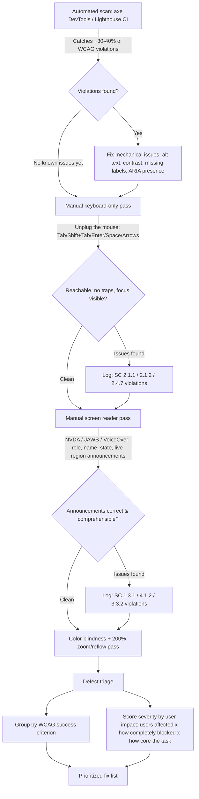

# Part 7: Accessibility Testing

> **Study Guide for QA Professionals** — Non-Functional Testing, from first principles
> Difficulty Level: Intermediate to Advanced | Estimated Reading Time: 45 minutes

---

## Table of Contents

1. [Why Accessibility Testing Isn't Optional](#71-why-accessibility-testing-isnt-optional)
2. [WCAG: The Standard Everything Else Points Back To](#72-wcag-the-standard-everything-else-points-back-to)
3. [Success Criteria Worth Knowing by Name](#73-success-criteria-worth-knowing-by-name)
4. [Automated Testing: axe DevTools vs. Google Lighthouse](#74-automated-testing-axe-devtools-vs-google-lighthouse)
5. [Manual Testing: Where the Other 60-70% Lives](#75-manual-testing-where-the-other-60-70-lives)
6. [Writing an Accessibility Defect Report](#76-writing-an-accessibility-defect-report)
7. [The Accessibility Testing Workflow](#77-the-accessibility-testing-workflow)
8. [📌 Fact Sheet — Part 7 in 60 Seconds](#-fact-sheet--part-7-in-60-seconds)
9. [Common Interview Questions](#common-interview-questions)

---

## 7.1 Why Accessibility Testing Isn't Optional

Start with the number this whole course has already promised you twice: **automated
accessibility scanners catch roughly 30-40% of WCAG violations.** That's not a knock
on the tools — axe-core and Lighthouse are genuinely excellent at what they check. It's
a statement about what a computer can and cannot verify by reading a DOM tree. A
scanner can tell you an `` tag has no `alt` attribute. It cannot tell you whether
the `alt="image123.png"` text someone *did* add is actually useful to a blind user, or
whether a custom-built dropdown announces its selected value to a screen reader, or
whether the tab order on a checkout form makes any human sense. Those questions need a
human. That single fact is the organizing principle of this entire module — everything
below either explains what the 30-40% covers, or teaches you how to do the 60-70% that
doesn't automate.

### The legal case

Accessibility testing stopped being a "nice to have" argument a long time ago in most
markets that matter commercially:

- **United States — ADA (Americans with Disabilities Act) Title III.** Courts have
  increasingly applied Title III — originally about physical spaces like ramps and
  doorways — to websites and mobile apps as "places of public accommodation." ADA
  digital-accessibility lawsuits have climbed year over year for a decade straight,
  numbering in the thousands annually, and they don't just target giant retailers —
  regional banks, universities, restaurants, and healthcare providers all get sued
  routinely. There's no formal US federal statute that says "your website must be
  WCAG 2.1 AA," but WCAG AA is what courts and settlement agreements consistently cite
  as the de facto bar, because it's the only widely recognized technical standard to
  point to.
- **European Union — EN 301 549 and the European Accessibility Act.** EN 301 549 is
  the EU's harmonized accessibility standard for ICT products and services, and it
  incorporates WCAG 2.1 Level AA as its core web-content requirement. The European
  Accessibility Act extended mandatory compliance to private-sector consumer products
  and services — e-commerce, banking, transport ticketing — with enforcement dates
  that have already passed in most member states as of 2026, meaning nonconformity is
  no longer a future risk for EU-facing products, it's a present one.
- **The general trend, regardless of jurisdiction:** accessibility lawsuits and
  regulatory enforcement actions are rising, not leveling off. The financial exposure
  isn't limited to statutory damages either — plaintiffs' lawyers increasingly bundle
  accessibility claims because a single unremediated site can generate dozens of
  near-identical suits, and settlement costs plus mandated remediation timelines are
  routinely more expensive than testing would have been.

### The moral case

Strip away the legal exposure entirely and the case doesn't get weaker — it gets more
direct. The World Health Organization estimates over a billion people live with some
form of disability. A significant share of that population interacts with software
every day the same way everyone else does: to work, to learn, to pay bills, to talk to
their doctor. When a site is inaccessible, that's not a bug affecting an edge case —
it's the software actively deciding that a real, sizeable group of paying users and
working employees don't get to use it. A blind learner who can't complete an online
course because a quiz widget has no ARIA labels isn't hitting a corner case; they're
being told, functionally, "this course isn't for you." That framing — accessibility
bugs as exclusion, not edge cases — is the one worth carrying into every test session
in this module.

> [!TIP]
> **🎭 Meme Break — Drake Hotline Bling**
>
> ❌ *"We ran axe DevTools, zero violations found, we're WCAG compliant."*  
> ✅ *"We ran axe DevTools, fixed what it found, then unplugged the mouse and tried
> to actually use the product — because the scanner just told us we're 30-40% done."*

🧠 <strong>Quick Check:</strong> A stakeholder says "our automated accessibility scan came back clean, we're WCAG AA compliant, ship it." What's wrong with that conclusion?

A clean automated scan means the ~30-40% of WCAG violations that are mechanically
detectable (missing alt text, insufficient contrast ratios, missing form labels, etc.)
weren't found — it says nothing about the 60-70% that require human judgment: whether
alt text is actually meaningful, whether a screen reader can operate a custom widget,
whether the tab order makes sense, whether a keyboard user can escape every modal. "The
scanner is clean" and "WCAG AA compliant" are not the same claim, and treating them as
equivalent is exactly the misconception that gets companies sued.

---

## 7.2 WCAG: The Standard Everything Else Points Back To

**WCAG (Web Content Accessibility Guidelines)**, published by the W3C, is the technical
standard that ADA lawsuits, EN 301 549, and virtually every corporate accessibility
policy ultimately point back to. Knowing its structure well enough to reference it by
name is a core QA skill for this module, the same way knowing OWASP Top 10 categories
by name is a core skill for security testing.

### The four principles — POUR

Every WCAG success criterion falls under one of four principles, easy to remember as
**POUR**:

| Principle | Plain-English question | Example failure |
|---|---|---|
| **Perceivable** | Can users perceive the content, through *some* sense — sight, hearing, touch? | An image with no alt text is invisible information to a screen-reader user |
| **Operable** | Can users operate the interface, through *some* input method — mouse, keyboard, switch device, voice? | A dropdown that only responds to mouse hover can't be operated by a keyboard-only user |
| **Understandable** | Is the content and the interface's behavior comprehensible? | An error message that just says "Error 400" with no explanation of what to fix |
| **Robust** | Does the content work reliably across current and future assistive technologies? | A custom-built button using a `
` with no ARIA role — a screen reader has no idea it's a button at all |

### Conformance levels — A, AA, AAA

WCAG success criteria are graded into three conformance levels, and the level matters
because it defines the bar you're actually testing against:

- **Level A** — the minimum. Failing Level A criteria represents the most severe,
  fundamental barriers (e.g., content that's entirely unusable without a mouse).
- **Level AA** — the level virtually every legal standard, regulation, and corporate
  policy actually requires. When someone says "we need to be WCAG compliant" without
  specifying a level, they mean **AA** — this is the practical target for almost every
  real project you'll test.
- **Level AAA** — the highest, most stringent level. Not usually required project-wide
  (the W3C itself notes it isn't recommended as a general policy for entire sites,
  because some AAA criteria aren't achievable for all types of content), but individual
  AAA criteria are sometimes adopted selectively for especially high-stakes contexts.

**What "AA" actually means in practice**, since that's the number you'll be held to on
almost every real engagement: it means color contrast of at least 4.5:1 for normal
text, every interactive element reachable and operable by keyboard alone, meaningful
alt text on informative images, form fields programmatically associated with their
labels, a logical heading structure, visible focus indicators, and no content that
flashes in a way that could trigger seizures — among roughly 50 testable criteria at
Level A and AA combined. It is a real, checkable bar — not a vague aspiration — which
is exactly why it's testable and exactly why it shows up in legal settlements as the
named target.

🧠 <strong>Quick Check:</strong> A custom-built dropdown widget looks fine visually and passes a color-contrast check, but a screen reader user has no idea it's a dropdown, can't tell what's selected, and can't open it with the keyboard. Which POUR principle(s) does this fail?

Primarily **Operable** (can't be opened via keyboard) and **Robust** (a screen reader
can't correctly interpret what the control is or its state — probably because it's
built from `
`s with no ARIA role, state, or keyboard handling rather than a native
`<select>` or a properly ARIA-annotated custom widget). It likely also fails
**Perceivable**, since the selected value isn't announced. Passing a contrast check
only proves one narrow Perceivable criterion was met — it says nothing about the other
three principles.

---

## 7.3 Success Criteria Worth Knowing by Name

You don't need to memorize all ~50 A/AA success criteria, but you should be able to
name and test these on sight — they're the ones that show up constantly in real audits
and real lawsuits, and naming the criterion number in a defect report (Section 7.6)
is what separates a professional accessibility bug from "this feels wrong."

| Success Criterion | Principle | What it requires | How to test it |
|---|---|---|---|
| **1.1.1 Non-text Content** | Perceivable | Every image, icon, and non-text element has a text alternative | Inspect every `` for `alt` text; check it's *descriptive*, not just present (`alt="icon"` fails in spirit even if it passes a scanner) |
| **1.4.3 Contrast (Minimum)** | Perceivable | Text has a contrast ratio of at least **4.5:1** against its background (3:1 for large text, 18pt+/14pt+bold) | Use a contrast-ratio checker (built into axe DevTools, Lighthouse, and browser DevTools color pickers) on every text/background combination, especially placeholder text and disabled-state text, which fail this constantly |
| **2.1.1 Keyboard** | Operable | All functionality is operable through a keyboard interface, with no exceptions requiring specific timing | Unplug the mouse; complete every core flow using only Tab, Shift+Tab, Enter, Space, and arrow keys |
| **2.1.2 No Keyboard Trap** | Operable | If keyboard focus can move *into* a component, it must be able to move *out* using only the keyboard | Tab into every modal, dropdown, and embedded widget; confirm Escape or continued Tab/Shift+Tab gets you back out |
| **2.4.7 Focus Visible** | Operable | Any keyboard-operable UI has a visible indicator showing which element currently has focus | Tab through the page and confirm you can always see, visually, exactly which element is focused — a common failure is CSS that strips the default focus outline (`outline: none`) without providing a replacement |
| **1.3.1 Info and Relationships** (covers ARIA labels/landmarks) | Perceivable/Robust | Structure and relationships conveyed visually are also conveyed programmatically — via semantic HTML or ARIA roles/labels/landmarks | Inspect the accessibility tree (browser DevTools "Accessibility" pane) to confirm headers, nav regions, and custom widgets expose the right role, name, and state |
| **3.3.2 Labels or Instructions** (form label association) | Understandable | Every form input has a programmatically associated label | Click directly on a field's visible label text — if focus jumps to the input, `<label for>`/`id` (or `aria-labelledby`) is wired correctly; if nothing happens, it isn't, and a screen reader will announce the field with no name at all |
| **1.3.1 / 2.4.6 Heading hierarchy** | Perceivable/Operable | Headings (`h1`-`h6`) form a logical, non-skipping outline of the page | Check the heading structure in DevTools — screen reader users frequently navigate a page *by heading list alone*, jumping straight from h1 to h1 to h2; a page that skips from h1 to h4 or uses headings purely for visual size breaks that navigation model entirely |

> [!WARNING]
> **🎭 Meme Break — "This Is Fine" Dog**
>
> 🔥 *The alt text on every product image is `alt="image.jpg"`.*
> 🔥 *The scanner doesn't flag it — technically, `alt` is present.*
> 🔥 *A screen reader reads "image dot jay peg" forty times on one page. This is fine.*

🧠 <strong>Quick Check:</strong> An automated scanner reports zero violations for "1.1.1 Non-text Content" on a product listing page. Does that guarantee the page is accessible to blind users for that criterion?

No. The scanner can only verify that an `alt` attribute *exists* on every image — it
cannot judge whether the text inside it is meaningful. `alt="IMG_4821.jpg"` or
`alt="image"` on every product photo will pass the automated check while providing
zero useful information to a screen-reader user trying to know what product they're
looking at. This is the textbook example of why 1.1.1 needs a human reviewing the
actual alt text content, not just its presence.

---

## 7.4 Automated Testing: axe DevTools vs. Google Lighthouse

Both tools are worth knowing well, and they're more related than most people realize —
understanding that relationship helps you pick the right one for the right job instead
of treating them as competitors.

**axe-core**, built by Deque Systems, is the open-source rules engine underneath both
tools most people think of as "separate" accessibility scanners. Google Lighthouse's
accessibility category runs on axe-core rules. Microsoft's Accessibility Insights runs
on axe-core rules. When people say "we ran an accessibility scan," there's a very good
chance axe-core did the actual rule evaluation somewhere in that pipeline, even if the
branded tool on screen was something else.

| | **axe DevTools** (and axe-core) | **Google Lighthouse** |
|---|---|---|
| **What it is** | A dedicated accessibility rules engine + browser extension, built by Deque | A broader auditing tool (performance, SEO, best practices, PWA — accessibility is one category among several) |
| **Underlying engine** | Is the engine — axe-core is the source of truth | Uses axe-core for its accessibility category |
| **CI/CD integration** | Purpose-built for it — integrates directly with Cypress (`cypress-axe`), Selenium/WebDriver (`@axe-core/webdriverjs`), Jenkins, and GitHub Actions as a first-class part of a test suite | Scriptable via **Lighthouse CI**, which can gate a build on a minimum accessibility score, but it's a heavier, whole-page-audit tool by design |
| **Where you'd typically run it** | Inside your existing automated test suite, per page/component, as part of the same run as your functional Playwright/Selenium/Cypress tests | Already built into Chrome DevTools ("Lighthouse" tab) for ad hoc audits; Lighthouse CI for repeatable pipeline gating |
| **Depth of accessibility-specific detail** | Deeper — since accessibility is its sole focus, its violation messages, WCAG criterion mapping, and remediation guidance tend to be more actionable | Good enough for a fast health check, but as one category among five, it's less specialized |
| **2026 practical takeaway** | The better fit when accessibility testing needs to live *inside* the automated regression suite, run on every PR | The better fit for a quick, no-setup sanity check during development, or for tracking an aggregate accessibility score trend over time in CI |

In a mature CI/CD pipeline, the common real-world pattern is both, at different
points: `cypress-axe` or `@axe-core/playwright` runs as an assertion inside the same
automated tests that already exercise a page functionally (catching regressions on
every PR), while Lighthouse CI runs as a periodic or pre-release gate checking the
whole-page accessibility score alongside performance and SEO.

**Restated, because it's worth repeating a third time in this module:** neither tool,
run alone or together, catches more than roughly 30-40% of actual WCAG violations. Both
tools are excellent at what's mechanically detectable — missing alts, contrast ratios,
missing form labels, missing landmark roles, duplicate IDs. Neither can tell you
whether your tab order makes sense, whether your screen reader announcements are
comprehensible, or whether your custom widget's ARIA state updates correctly when a
user interacts with it. That's not a tooling gap that'll close with a future version —
it's a structural limit of what static analysis of a DOM can ever determine about
human comprehension. Manual testing isn't the "extra thoroughness" step. It's the
majority of the actual testing effort, and any accessibility test plan that budgets it
as an afterthought is budgeting for 30-40% coverage.

> [!TIP]
> **🎭 Meme Break — Expanding Brain**
>
> 🧠 *Level 1: "We don't do accessibility testing."*  
> 🧠🧠 *Level 2: "We ran Lighthouse once, score was 92, good enough."*  
> 🧠🧠🧠 *Level 3: "We wired axe-core into our Cypress suite, it runs on every PR."*  
> 🧠🧠🧠🧠 *Level 4: All of that is real progress on the 30-40% — and someone on the
> team still unplugs their mouse and runs a screen reader before every release, because
> that's where the other 60-70% lives.*

🧠 <strong>Quick Check:</strong> Why does it matter, practically, that Lighthouse's accessibility audit runs on axe-core under the hood?

It means running both Lighthouse and axe DevTools on the same page and expecting two
independent opinions is largely an illusion — for the rules axe-core defines, you'll
get overlapping, not additive, coverage. The practical decision isn't "which tool finds
more violations" (they'll find a very similar set), it's "which integration fits my
workflow" — axe for wiring directly into an existing Cypress/Selenium suite per PR,
Lighthouse CI for a broader whole-page score gate. Neither answers the deeper question
of manual coverage, which is a separate, non-optional effort regardless of which
automated tool (or both) you choose.

---

## 7.5 Manual Testing: Where the Other 60-70% Lives

Four techniques cover the bulk of what automated tools structurally cannot check.
None of them require expensive tooling — they require discipline and, for the first
one, literally unplugging a peripheral.

### 1. Keyboard-only navigation testing

Unplug the mouse. Not figuratively — actually disconnect it, or at minimum commit to
not touching it, and complete every core user journey using only Tab, Shift+Tab,
Enter, Space, and arrow keys. What you're checking:

- Can you reach *every* interactive element — every link, button, form field, custom
  widget — in a logical order?
- Is focus always visible (SC 2.4.7)? If you lose track of where you are on the page,
  a keyboard user has too.
- Can you get *out* of everything you get into — every modal, every dropdown, every
  embedded widget (SC 2.1.2, no keyboard trap)?
- Does Tab order follow the visual/logical reading order, or does it jump around
  unpredictably because of CSS positioning or a missing `tabindex` strategy?

### 2. Screen reader testing

The tools: **NVDA** (free, Windows, the most common open-source choice for testing),
**JAWS** (paid, Windows, still an enterprise standard in many industries), and
**VoiceOver** (built into macOS and iOS, free, the default choice for Apple-platform
testing). You don't need deep screen-reader-power-user skill to test effectively — you
need to know what to listen for:

- Does every interactive element announce its **role** ("button", "link", "checkbox,
  not checked"), its **name** (what it does or contains), and its **state** (selected,
  expanded, disabled)? A `
` styled to look like a button announces
  as nothing — the screen reader has no idea it's interactive at all.
- Does form field navigation announce the label, not just "edit text"?
- Do dynamic updates — a validation error appearing, a cart total changing, a "saved"
  confirmation — get announced automatically (via an ARIA live region), or does the
  screen reader user have to go hunting for what changed?
- Is the reading order sensible when navigating linearly, independent of visual layout?

### 3. Color-blindness simulation

Roughly 1 in 12 men and 1 in 200 women have some form of color vision deficiency —
common enough that "the error state is shown in red text" alone, with no icon or
label change, fails a meaningful fraction of users outright. Browser DevTools (Chrome's
Rendering tab has a built-in vision-deficiency emulator) and dedicated simulators let
you check: is any information conveyed by color alone? Status badges, chart legends,
required-field indicators, and pass/fail states are the classic failure spots — the
fix is almost always "add a shape, icon, or text label alongside the color," not
"pick different colors."

### 4. Zoom / reflow testing

Set browser zoom to **200%** and confirm content reflows into a single column with no
horizontal scrolling required to read it (this is WCAG SC 1.4.10 Reflow). This matters
for low-vision users who rely on zoom rather than a screen reader — a page that
technically has good contrast and proper alt text but forces horizontal scrolling at
200% zoom is still a real barrier. Watch specifically for: fixed-width containers,
tables that don't reflow, and sticky headers/footers that eat an increasing share of
the viewport as zoom increases.

> [!CAUTION]
> **🎭 Meme Break — "Is This a Pigeon"**
>
> 🦋 *A tester who ran axe DevTools once and closed zero violations.*  
> 🧑 *QA lead, pointing:* **"Is this WCAG AA compliant?"**

🧠 <strong>Quick Check:</strong> A page passes every automated contrast check and every automated ARIA-attribute check. Name two manual techniques that could still find real accessibility defects on it, and what each would look for.

Keyboard-only navigation testing — checking whether every interactive element is
reachable, has visible focus, and has no keyboard trap, none of which "correct ARIA
attributes" alone guarantees if the JavaScript behind them doesn't actually respond to
keyboard events. And screen reader testing — checking whether the *announced* role,
name, and state of each element actually make sense in context and in sequence, since
an automated tool can confirm an `aria-label` attribute exists without being able to
judge whether the text inside it is meaningful or whether dynamic changes get
announced via a live region at all.

---

## 7.6 Writing an Accessibility Defect Report

An accessibility defect report needs two things a typical functional bug report
doesn't: a **named WCAG success criterion**, and a **severity judged by user impact**,
not by how technically small the code fix looks.

- **Reference the specific success criterion by number and name** — "2.1.2 No Keyboard
  Trap," not "keyboard issue." This does three things: it proves the defect is a real,
  standards-based finding rather than a subjective preference; it tells the developer
  exactly what correct behavior looks like without further discussion; and it's the
  language legal/compliance teams and auditors expect to see, which matters when the
  same defect list may end up supporting a compliance claim.
- **Severity is about user impact, not implementation size.** A one-line CSS fix
  (`outline: none` removed) that restores a visible focus indicator across an entire
  site is a *high-severity* defect, even though the code change is trivial — because
  its absence makes the entire site unusable for every keyboard-only user, not because
  the diff is large. Conversely, a cosmetically ugly-but-functional alt text on one
  minor icon might be genuinely low severity. Score by "how many users, how completely
  blocked, on how core a task" — the same framing a payments team would use to judge
  a defect that lets 1% of transactions silently double-charge versus one that
  mis-aligns a footer by 2px.
- **Include exactly how you found it** — which assistive technology and version (e.g.
  "NVDA 2025.3 + Firefox," "keyboard only, no mouse"), because accessibility defects
  are notoriously inconsistent across AT/browser combinations and reproduction steps
  need that context to be reproducible at all.
- **Describe the actual experience, not just the technical cause** — "screen reader
  announces the field as 'edit text' with no label, so the user cannot tell what
  information is being requested" communicates the real-world impact in a way "missing
  `<label>` element" alone doesn't, especially to a non-technical stakeholder deciding
  priority.

### Scenario 1 — the LMS quiz widget with no ARIA labels

Picture a blind learner enrolled in a mandatory compliance course, working through the
final assessment that gates certification. The quiz uses a custom-built multiple-choice
widget — visually polished, built from styled `
` elements instead of native
`<input type="radio">` controls, because the design team wanted pixel-perfect control
over the selected-state styling. A sighted user clicks an option and sees it highlight.
The screen reader user tabs to the question, and NVDA announces... nothing useful. No
role ("radio button"), no name (which answer this option represents), no state
(whether it's currently selected). The learner has no way to know which answer, if
any, is currently chosen, because the widget never exposed that information to the
accessibility tree — it only expressed selection through a CSS class controlling
background color. They can technically click through the quiz using a screen reader's
click-simulation shortcut and get *a* result, but they cannot verify what they
answered before submitting, on an assessment that gates a compliance certificate their
employer requires. This is a Level A failure under 1.3.1 (Info and Relationships) and
4.1.2 (Name, Role, Value) — and it would sail through an automated scan clean, because
axe-core checks for the *presence* of ARIA attributes, not whether a hand-rolled widget
correctly implements the accessible-selection-state pattern the native `<input
type="radio">` would have given the team for free. The fix, and the one worth
remembering, is almost always "use the native HTML control unless you have a very
specific reason not to" — a real `<input type="radio">` with a properly associated
`<label>` gets role, name, and state announced correctly with zero custom ARIA work at
all.

### Scenario 2 — the HRMS keyboard trap in the profile-picture upload modal

An HRMS ESS module lets every employee, regardless of ability, update their profile
picture through a modal dialog — pick a file, preview it, confirm. A keyboard-only
user (whether from a motor disability or simply someone who's faster on a keyboard and
never touches the mouse — a very real, very common testing population) tabs into the
"Upload Photo" button and presses Enter, which opens the modal. Inside the modal, they
try to Tab to the "Choose File" input, then to "Cancel," then to "Confirm" — but the
modal was implemented without a focus trap that's actually *complete*: Tab moves focus
correctly for two fields, then on the third Tab press, focus jumps out of the modal
entirely and lands back on page elements behind it, which are still technically
visible-but-covered underneath the modal overlay. The user is now tabbing through a
page they can't see, with a modal still open on top of it, unable to reach Cancel or
Confirm, and Escape doesn't close it either because no keydown handler was wired up for
it. They're stuck — not stuck in the sense of "confused," stuck in the literal sense
of SC 2.1.2's name: keyboard focus entered a component and cannot get back out using
the keyboard. For an ESS form every employee in the company is required to use — this
isn't a corner-case bug affecting a handful of power users, it's a routine task
(uploading a photo, and by the same broken pattern, likely every other modal in the
app, including the leave-request confirmation dialog) becoming completely unusable for
an entire category of employees.
→ Reference: <a href="https://github.com/ghanendra-sdet/hrms-platform" target="_blank" rel="noopener noreferrer">hrms-platform</a>

### Scenario 3 — the LMS progress dashboard that only uses color

The LMS platform's course status model has five distinct states — Not Started, In
Progress, Assessment Pending, Completed, Certified — each of which is visually
distinguished primarily by badge color (grey, blue, amber, green, green-with-a-star).
A learner with red-green color blindness looking at their Progress Dashboard sees
"Completed" and "Certified" as close to indistinguishable, and "In Progress" and
"Assessment Pending" render as similar enough mid-tones that they can't reliably tell,
at a glance, whether they still owe an assessment on a course they thought they'd
finished. This one doesn't block task completion outright the way the previous two
do — the learner can still click into a course to check its real status — but it fails
SC 1.4.1 (Use of Color) and creates real friction and real risk of a learner believing
they're certified when they're only content-complete, on a platform whose entire value
proposition is that a certificate is a trustworthy credential. The fix — adding a
distinct icon or label text alongside each color, not just relying on hue — is cheap
and is exactly the kind of finding automated tooling won't flag, because axe-core has
no way to know that two of your five status colors are perceptually close for a
meaningful fraction of your actual learners.
→ Reference: <a href="https://github.com/ghanendra-sdet/lms-platform" target="_blank" rel="noopener noreferrer">lms-platform</a>

🧠 <strong>Quick Check:</strong> In the HRMS keyboard-trap scenario, why is this rated high severity even though "add a focus trap and an Escape handler" sounds like a small fix?

Because severity for accessibility defects is scored by user impact, not implementation
size. The defect completely blocks task completion — not degrades it, blocks it — for
every keyboard-only user attempting a routine, company-wide task (photo upload, and
likely every other modal following the same broken pattern, including leave-request
confirmation). A small code diff can still represent total exclusion for an entire
category of users on a core flow, which is exactly the situation that makes "this is
only a few lines of CSS/JS" the wrong lens to size the defect through.

---

## 7.7 The Accessibility Testing Workflow

A practical accessibility test pass, whether it's a first audit or a per-release
regression check, follows the same rough shape: automated first (fast, catches the
mechanical 30-40%), then manual keyboard, then manual screen reader, then triage
everything found by WCAG criterion and real user impact.

The reason automated runs first, not last, is purely efficiency — no point spending
manual screen-reader time on a page that's still missing basic alt text and form
labels a scanner would have caught in seconds. The reason manual keyboard testing
comes before screen reader testing is dependency: a screen reader user is, by
definition, also a keyboard user in the vast majority of real-world usage, so a
keyboard trap will block a screen-reader tester from ever reaching the content beyond
it anyway.

> [!TIP]
> **🎭 Meme Break — Galaxy Brain**
>
> 🌌 *Small brain: "We'll do accessibility testing right before launch."*  
> 🌌🌌 *Glowing brain: "We run axe-core in CI on every PR."*  
> 🌌🌌🌌 *Galaxy brain: axe-core in CI catches the mechanical 30-40% continuously,
> and a scheduled human keyboard-and-screen-reader pass runs every release — because
> the workflow only works end to end, not as whichever single stage is easiest to
> automate.*

🧠 <strong>Quick Check:</strong> In the workflow diagram, why does the manual keyboard pass happen before the screen reader pass, rather than the other way around or in parallel?

Because screen reader users are, in practice, also keyboard users — a screen reader
session that hits a keyboard trap partway through a flow can't get past it to test
anything downstream, the same way a manual functional tester can't test checkout if
they're blocked on the cart page. Clearing keyboard-navigability issues first means the
screen reader pass isn't wasted rediscovering the same blocking issue by a different
method, and it can actually reach and evaluate the announcements on every part of the
flow instead of stopping at the first trap.

---

## 📌 Fact Sheet — Part 7 in 60 Seconds

- Accessibility testing is legally non-optional in most commercial markets: **ADA
  Title III** lawsuits in the US have climbed for a decade and now number in the
  thousands annually; the EU's **EN 301 549**, built on WCAG 2.1 AA, backs the
  European Accessibility Act, with enforcement dates already passed in most member
  states as of 2026.
- **WCAG** is organized around four principles — **POUR**: Perceivable, Operable,
  Understandable, Robust — and three conformance levels, **A / AA / AAA**, with
  **AA** the de facto legal and industry standard almost every real project is held to.
- Success criteria worth knowing by name and testing directly: **1.1.1** (alt text),
  **1.4.3** (4.5:1 contrast for normal text), **2.1.1** (keyboard operability),
  **2.1.2** (no keyboard trap), **2.4.7** (visible focus indicator), **1.3.1** (info
  and relationships / ARIA), **3.3.2** (form label association), heading hierarchy.
- **axe-core** (Deque) is the open-source rules engine underneath both axe DevTools
  *and* Google Lighthouse's accessibility category (and Microsoft Accessibility
  Insights) — they're not fully independent opinions, they largely overlap.
- axe integrates directly into automated suites — **Cypress, Selenium/WebDriver,
  Jenkins, GitHub Actions**; Lighthouse is scriptable via **Lighthouse CI** and is
  already built into Chrome DevTools for ad hoc checks.
- **No automated tool catches more than 30-40% of WCAG violations** — repeated three
  times in this module deliberately, because manual testing isn't supplementary, it's
  the majority of the real testing effort.
- Four core manual techniques: **keyboard-only navigation** (literally unplug the
  mouse), **screen reader testing** (NVDA/JAWS/VoiceOver — listen for role, name,
  state, and live-region announcements), **color-blindness simulation** (never convey
  status by color alone), **200% zoom/reflow testing** (no horizontal scrolling
  required).
- An accessibility defect report needs a **named WCAG success criterion** (not "looks
  like an accessibility issue") and severity scored by **user impact**, not by how
  small the technical fix looks — a one-line CSS fix restoring focus indicators
  site-wide can be a high-severity defect.
- The practical workflow: **automated scan → manual keyboard pass → manual screen
  reader pass → color/zoom checks → defect triage by WCAG criterion and user impact**
  — automated first for efficiency, keyboard before screen reader because a keyboard
  trap blocks the screen reader tester too.

---

## Common Interview Questions

### Question 1: What's the difference between WCAG conformance levels A, AA, and AAA, and which one do most projects actually need to meet?

**Model Answer:**

"WCAG success criteria are graded into three levels of increasing strictness. Level A
covers the most fundamental barriers — content that's flatly unusable without certain
accommodations. Level AA is the practical, real-world target: it's what ADA lawsuit
settlements, the EU's EN 301 549, and virtually every corporate accessibility policy
actually cite, so when someone says 'we need to be WCAG compliant' with no level
specified, AA is what they mean. Level AAA is the highest bar, but the W3C itself
doesn't recommend it as a blanket site-wide requirement since some AAA criteria aren't
achievable for every content type — it gets adopted selectively for specific
high-stakes elements rather than applied wholesale."

### Question 2: Why isn't running axe DevTools or Lighthouse enough to call a product accessible?

**Model Answer:**

"Because both tools — and it's worth knowing Lighthouse's accessibility audit actually
runs on the same axe-core rules engine axe DevTools uses — can only catch what's
mechanically detectable in the DOM: missing alt attributes, contrast ratios, missing
form labels, missing ARIA attribute presence. Neither can judge whether an alt text
string is actually meaningful, whether a custom widget's keyboard behavior works,
whether a screen reader's announcements make sense in sequence, or whether users can
escape every modal. That's a structural limit, not a tooling gap that improves with a
new version. In practice, no automated tool catches more than about 30-40% of real
WCAG violations, which is why manual keyboard and screen reader testing has to be
budgeted as the majority of the testing effort, not an optional add-on."

### Question 3: Walk me through how you'd test a newly built modal dialog for accessibility.

**Model Answer:**

"First, an automated pass — axe or Lighthouse will flag anything mechanically obvious,
like a missing accessible name on the close button. Then manual keyboard testing: tab
into the modal and confirm focus moves logically through its contents, confirm I can't
tab out to the page behind it while it's open, and confirm Escape (or a visible Cancel
control) reliably closes it and returns focus to wherever it was before the modal
opened — that's the classic keyboard-trap check, SC 2.1.2. Then a screen reader pass:
does opening the modal get announced at all, is its role communicated as a dialog, and
is focus actually moved into it programmatically rather than just visually? I'd
specifically test what happens on the field where focus lands after the second-to-last
tab stop, since incomplete focus-trap implementations often leak exactly there — I've
seen a real case in an HRMS profile-photo-upload modal where focus escaped after
exactly two tab presses and left the keyboard user stuck behind a modal they couldn't
reach or close."
