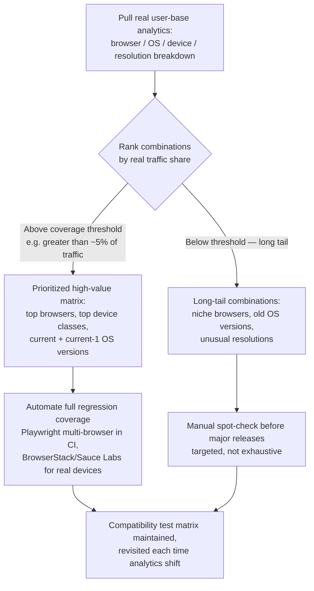

# Part 8: Compatibility Testing

> **Study Guide for QA Professionals** — Non-Functional Testing, from first principles
> Difficulty Level: Intermediate to Advanced | Estimated Reading Time: 40 minutes

---

## Table of Contents

1. [What Is Compatibility Testing, Really?](#81-what-is-compatibility-testing-really)
2. [Cross-Browser Testing](#82-cross-browser-testing)
3. [Cross-Device & Responsive Testing](#83-cross-device--responsive-testing)
4. [Backward & Forward Compatibility Testing](#84-backward--forward-compatibility-testing)
5. [Interoperability Testing](#85-interoperability-testing)
6. [Building a Compatibility Test Matrix](#86-building-a-compatibility-test-matrix)
7. [📌 Fact Sheet — Part 8 in 60 Seconds](#-fact-sheet--part-8-in-60-seconds)
8. [Common Interview Questions](#common-interview-questions)

---

## 8.1 What Is Compatibility Testing, Really?

Here's the one-line version, and it's worth memorizing because it's the exact question
an interviewer will ask you to draw: **compatibility testing proves your system works
correctly *within* and *alongside* a given environment — the browsers, devices,
operating systems, and external systems it has to coexist with right now.** It is not
about whether the system can be *moved* somewhere new; that's **portability**, and
we cover it properly in Part 10 alongside maintainability. Compatibility asks "does it
work here, today, next to everything else that's already here?" Portability asks "can
it be picked up and dropped somewhere else entirely?"

That distinction matters more than it sounds like it should, because the two get
conflated constantly in casual conversation and it leads to scope confusion in test
plans. A payment platform that runs correctly on Chrome, Safari, and Firefox, on both
iOS and Android, and correctly talks to three different banking partner APIs — that's
compatibility. The same platform being re-deployed from AWS to a different cloud
provider, or a desktop app being ported from Windows to macOS — that's portability. One
is about coexistence in a fixed environment; the other is about relocation to a new
one. Keep that line sharp and you'll never misfile a bug again.

Compatibility testing itself splits into four overlapping dimensions:

| Dimension | The question it answers |
|---|---|
| **Cross-browser** | Does the UI render and behave identically (or acceptably) across Chrome, Firefox, Safari, Edge? |
| **Cross-device** | Does it work correctly on phones, tablets, and desktops, across screen sizes and input methods? |
| **Cross-OS** | Does it behave correctly on Windows, macOS, Linux, iOS, Android — and across their versions? |
| **Interoperability** | Does it correctly integrate with the other systems and API versions it depends on, or that depend on it? |

A system can pass every functional test case and still be broken for a meaningful slice
of its real user base, simply because nobody opened it in Safari, or because one
specific external partner's API returns a field in a format your parser doesn't expect.
Compatibility bugs are unusually sneaky because they're invisible on the machine the
developer is using — "works on my machine" is, almost by definition, a compatibility
gap nobody has gone looking for yet.

> [!TIP]
> **🎭 Meme Break — Drake Hotline Bling**
>
> ❌ *"It works" (tested once, on Chrome, on a MacBook, on office Wi-Fi).*  
> ✅ *"It works" (tested on Chrome, Safari, and Firefox; on a mid-range Android phone
> over throttled 4G; and against a third-party API that returns malformed JSON about
> once a week for reasons nobody has ever fully explained).*

🧠 <strong>Quick Check:</strong> A team says "we're moving our booking platform from a self-hosted data center to AWS — that's a compatibility test." Are they right?

No — that's a **portability** concern, covered in Part 10. Compatibility testing
verifies the system works correctly within a *given, current* environment (this
browser, this OS, this set of integrated partner APIs) — not whether it can be
relocated to a new one. The AWS migration would need portability testing: does the
system install/configure/run correctly in the new environment, and can data be migrated
without loss. If, after the migration, they then ask "does it still render correctly in
Safari and still talk correctly to the payment gateway" — that's compatibility testing,
applied again in the new environment.

---

## 8.2 Cross-Browser Testing

Browsers are not interchangeable render targets. Three failure classes show up
constantly, and it's worth being able to name each one precisely because they need
different fixes:

- **Rendering differences** — the same CSS produces visually different layouts.
  Flexbox and Grid gaps, `position: sticky` behavior, scrollbar styling, and font
  fallback rendering are classic offenders. A layout that looks pixel-perfect in
  Chrome can have an overlapping button in Safari because of a vendor-prefix gap or a
  default margin Safari doesn't reset the same way.
- **JavaScript engine differences** — Chrome runs V8, Firefox runs SpiderMonkey,
  Safari runs JavaScriptCore. Most modern JS behaves identically across all three, but
  edge cases around `Intl` formatting, `Date` parsing, async timing, and newer
  language features landing at different paces per engine can produce silently
  different behavior rather than an obvious crash — the worst kind of bug, because
  nothing throws an error, the output is just quietly wrong.
- **CSS feature-support differences** — a CSS property fully supported in Chromium
  browsers can be partially supported, prefixed, or entirely missing in Safari, and
  `caniuse.com` is a genuinely essential bookmark for any QA engineer signing off a UI
  feature before checking it isn't relying on something Safari hasn't shipped yet.

### Tools that actually matter here

| Tool | What it's for | Notes |
|---|---|---|
| **BrowserStack** | Real-device and real-browser cloud testing | Runs on actual browser binaries and real mobile devices, not simulators — the gold standard when a bug is suspected to be genuinely device-specific |
| **Sauce Labs** | Same category as BrowserStack | Strong CI/CD integration, parallel test execution at scale, widely used for automated cross-browser regression suites |
| **Playwright** | Automated multi-browser testing, built in | Ships with Chromium, Firefox, and WebKit engines out of the box — a single test spec can run against all three with a config change, no separate driver installs. This is directly relevant to this account's own automation stack, where the same Playwright suite can be pointed at all three engines in CI without maintaining three separate test codebases |

The practical workflow most teams land on: use Playwright's multi-browser runs (or an
equivalent) for fast, automated regression coverage of the core flows on every commit,
and reserve BrowserStack or Sauce Labs for the harder cases — real mobile Safari quirks,
older browser versions still in your analytics, or a bug report that only reproduces on
a specific device nobody on the team owns.

> [!WARNING]
> **🎭 Meme Break — "This Is Fine" Dog**
>
> 🔥 *The release note says "tested in Chrome."*  
> 🔥 *18% of the user base is on Safari.*  
> 🔥 *The checkout button has a 2px rendering bug that makes it look disabled.*  
> 🔥 *This is fine.*

🧠 <strong>Quick Check:</strong> A booking flow's countdown timer for a fare-lock hold window looks correct in Chrome but appears to run fast in Safari. Which of the three cross-browser failure classes is this, and how would you confirm it?

This points at a **JavaScript engine difference**, most likely around `Date`/timer
precision or async scheduling behavior differing between V8 (Chrome) and
JavaScriptCore (Safari) — not a rendering or CSS issue, since the visual layout of the
timer itself is fine, only its counted value is wrong. To confirm, you'd log the raw
timestamps the countdown logic is computing against in both browsers and compare —
if the discrepancy is in the JS-computed remaining time rather than in how it's painted
to the screen, that isolates it to the engine layer, not the stylesheet.

---

## 8.3 Cross-Device & Responsive Testing

Responsive testing is often reduced to "resize the browser window and see if it looks
okay," which catches maybe half the real problem. A genuinely thorough cross-device
approach checks three separate things:

1. **Viewport breakpoints** — does the layout hold together at the actual breakpoints
   your CSS defines (commonly around 320–480px for phones, 768px for tablets, 1024px+
   for desktop), not just "does it look fine at some arbitrary window width." Test the
   breakpoint boundary itself — one pixel before and after a media query threshold is
   where layout bugs hide.
2. **Touch vs. mouse interaction differences** — hover states don't exist on touch
   devices, so any UI that relies on `:hover` to reveal information (a tooltip, a
   dropdown, a "show more" affordance) is simply unreachable on a phone unless there's
   a tap-equivalent. Touch targets also need to be physically large enough for a
   finger, not just a cursor — a 24px icon button that's easy to click with a mouse
   can be a genuine usability failure to tap accurately.
3. **Real device testing vs. emulation** — this is the gap that catches teams out most
   often. A browser's device emulator (Chrome DevTools' device toolbar, for instance)
   changes the *viewport dimensions* and reports a mobile user-agent string — and
   that's genuinely useful for quick layout checks. But it does not reproduce **real
   touch latency**, **real GPU rendering constraints** on a mid-range or older phone,
   or **real network conditions** on an actual cellular connection with real jitter and
   packet loss, not a simulated throttle profile. A page that scrolls smoothly in an
   emulator at 60fps because it's actually running on a developer's desktop GPU can
   visibly stutter on the 2-year-old mid-range Android phone that a meaningful chunk of
   your actual user base owns. Emulation is a fast first pass, never the final signoff
   for anything performance- or interaction-sensitive.

> [!TIP]
> **🎭 Meme Break — Expanding Brain**
>
> 🧠 *Level 1: "I resized my browser window, responsive testing done."*  
> 🧠🧠 *Level 2: "I used Chrome DevTools' device emulator too."*  
> 🧠🧠🧠 *Level 3: "I tested touch targets and hover-dependent UI on an emulator."*  
> 🧠🧠🧠🧠 *Level 4: I tested on a real mid-range Android phone on real 4G, because
> emulation can fake the viewport but it can't fake the GPU or the network.*

🧠 <strong>Quick Check:</strong> A team ships a "swipeable" hotel image gallery on a booking results page. It passed QA using Chrome's device emulator. Real users on Android report the swipe feels laggy and sometimes skips images. What did emulation miss?

Emulation changes the viewport size and simulates touch *events*, but it's still
executing on the developer machine's real CPU/GPU and real (fast, wired) network — it
does not reproduce the actual touch-input latency, rendering performance ceiling, or
frame budget of a real mid-range Android device. The lag and skipped frames are a real
device constraint (GPU/CPU under real load) that an emulator running on a powerful
desktop simply can't surface. This is exactly why real-device testing — via a lab like
BrowserStack or a physical device in hand — is not optional for interaction-heavy
mobile UI, only supplemented by emulation for quick early checks.

---

## 8.4 Backward & Forward Compatibility Testing

Compatibility isn't only about *today's* spread of browsers and devices — it's also
about time, in both directions:

- **Backward compatibility** means the system still works correctly for users on
  *older* browser or OS versions who haven't upgraded, and often can't — a hospital
  workstation locked to an old OS build for compliance reasons, a user on a budget
  phone that never got a promised Android update, or simply someone who's three major
  browser versions behind because auto-update quietly failed. Before dropping support
  for an old browser version, real analytics data on how many active users are still
  on it should drive the decision, not a guess.
- **Forward compatibility** — more precisely **backward-compatible API design** from
  the system's own side — means a new version of *your* API, SDK, or integration
  contract doesn't silently break the integrations already built against the previous
  version. This shows up constantly in systems that expose APIs to partners: adding a
  new required field to a request payload, renaming a response field, or changing a
  status code's meaning are all classic ways to break an integration partner's system
  without ever touching their code — because you changed the contract underneath them.
  The safe pattern is additive, versioned change: new fields optional with sane
  defaults, breaking changes shipped behind a new API version, and the old version kept
  alive for a defined deprecation window with partners notified well ahead of the
  cutoff.

🧠 <strong>Quick Check:</strong> A platform renames a field in its bill-fetch API response from <code>dueAmount</code> to <code>amountDue</code> in a routine update, without a version bump. What kind of compatibility failure is this, and for whom?

This is a **forward compatibility failure on the system's own side** — it breaks
**backward compatibility for every integration partner already consuming the old field
name**. Any biller-side or downstream consumer parsing the old `dueAmount` field will
now silently receive `undefined`/missing data instead of an error, which is worse than
a hard failure because it can slip through unnoticed until someone questions why fetched
bill amounts have started showing as blank. The fix isn't "don't ever rename fields" —
it's "never make a breaking response change without a version bump and a deprecation
window," so consumers can migrate on their own schedule instead of breaking on your
deploy.

---

## 8.5 Interoperability Testing

Interoperability testing is compatibility's most operationally painful corner, because
it's the one where **you don't control the other side.** You can pin your own browser
support matrix, you can lock your own API versioning discipline — but when your system
depends on an external partner's API, you're testing against behavior, uptime, and data
quality that can change on their schedule, not yours, and often without notice.

This is precisely the shape of the problem in a **travel booking marketplace** that
resells inventory it doesn't own. The platform's search screen doesn't hold its own
flight and hotel data — it fans a single search out to multiple third-party supplier
inventory APIs (GDS systems for flights, individual hotel-chain or aggregator APIs for
hotels) and stitches the results into one unified results page. Every one of those
supplier calls is a live, real-time dependency the platform's own QA has zero control
over.

**Scenario one — the malformed-supplier response.** Picture a traveler searching for
hotels in Goa for a weekend in December. The platform fans that search out to four
different hotel suppliers simultaneously. Three come back clean within the timeout
window — correct room types, correct nightly rates, correct availability counts. The
fourth supplier, though, returns a response with its currency field missing entirely
because of a bug on *their* side that started that morning and nobody on the platform
team was notified about. A naive implementation that assumes every supplier response is
well-formed will either throw an unhandled exception that takes down the *entire*
search results page — hiding the three suppliers that worked fine along with the one
that didn't — or worse, silently display a hotel card with a blank or `NaN` price,
which a traveler could genuinely try to book. The correct behavior, and the thing
interoperability testing exists to prove before it happens in production: the platform
validates each supplier's response independently, silently drops the malformed one from
the results set, logs it for the ops team to chase with that specific supplier, and
still renders the three suppliers that came back clean. One supplier having a bad day
should degrade the results page by one supplier's worth of listings, not take down the
whole search.

**Scenario two — the fare-lock race against a supplier that changes its mind.** A
traveler selects a flight, and the platform's fare lock holds that price and seat for a
short window while the traveler pays. But the price and inventory ultimately belong to
the airline's own GDS, not the platform — so interoperability testing has to cover what
happens when the *supplier's* price silently changes, or the seat sells through a
different channel, *during* that hold window, before the platform's own hold has
expired on its side. A platform that blindly charges the fare-locked price without
re-validating against the supplier at the payment step risks either charging a traveler
a price the supplier no longer honors (a booking that then fails downstream, after the
traveler has already been charged), or worse, confirming a seat that the supplier has
already sold to someone else through their own direct channel. The correct pattern —
and the one worth explicitly testing — is a final re-validation call to the supplier at
the moment of payment, with a clear, honest failure message ("this fare is no longer
available, please re-search") if the supplier's side has moved, rather than trusting a
price quoted minutes earlier as if it were still guaranteed.

**Scenario three — the biller that answers differently every time.** A BBPS-style bill
payment platform faces the same shape of problem from a different angle. It integrates
with dozens of billers — electricity boards, water utilities, gas providers, DTH and
telecom operators — each exposing its own bill-fetch API, and critically, each biller's
API was very likely built by a different vendor, to a slightly different interpretation
of the "standard" integration spec, at a different point in time. Picture a user
selecting their electricity biller during a month-end billing cycle, exactly the window
when that biller's own backend is under the heaviest load reconciling the month's
accounts. The fetch call to that biller times out — not because the platform did
anything wrong, but because the biller's system is straining under its own end-of-month
batch job. Meanwhile, a different user fetching their DTH recharge amount at the same
moment gets an instant, correct response, because that biller's infrastructure isn't
under the same seasonal load. Interoperability testing here means deliberately
simulating a biller timeout in isolation — mocking one biller's endpoint to hang or
error while every other biller integration continues responding normally — and
confirming the platform shows a clear, specific "unable to fetch your electricity bill
right now, please try again shortly" message, rather than either hanging the whole bill
categories screen or, worse, falling back to a stale cached amount and letting the user
pay yesterday's figure as if it were current. The regression checklist principle stated
plainly in that platform's own documentation is exactly this: **no stale amount is ever
charged** — if the fetch fails, the fix is a clear error, never a guess.

> [!CAUTION]
> **🎭 Meme Break — Distracted Boyfriend**
>
> 🚶 *The interoperability test plan, walking with:* **"Test against the partner's
> staging environment, which always returns clean data."**  
> 👀 *Looking back at:* **"What happens when the real biller's production API times
> out during their own month-end load spike, which staging never simulates."**

🧠 <strong>Quick Check:</strong> In the hotel-search scenario, why is "drop the one malformed supplier's results and keep the other three" the right behavior, rather than either failing the whole page or trying to auto-correct the missing currency field?

Failing the whole page punishes the traveler for a problem entirely on one external
supplier's side, when three-quarters of the requested data was perfectly fine — that's
an availability failure caused by a dependency you don't control, cascading into a
total outage of a feature that mostly works. Auto-correcting the missing field (guessing
a currency, defaulting to zero) is worse: it converts a visible, loggable data-quality
problem into an invisible one that could let a traveler book a hotel at a nonsensical or
wrong price. Isolating and dropping only the failing supplier's contribution, while
serving everything that validated correctly, is the pattern that keeps the feature
useful for the user and keeps the specific integration failure visible to the team that
needs to chase it with that supplier.

---

## 8.6 Building a Compatibility Test Matrix

The naive approach to compatibility testing is "test every browser × every device ×
every OS version" — and it is a trap. The combinatorics explode instantly (a handful of
browsers × a handful of OS versions × a handful of device form factors is already in the
hundreds of combinations), and most of those combinations represent close to zero real
users. The actual skill here — the one that's genuinely underdeveloped across a lot of
QA teams — is **prioritizing the matrix using real usage data**, not intuition or "what
we happen to have lying around to test on."

The practical build process:

1. **Pull real analytics.** Google Analytics, or whatever product analytics platform is
   in place, will show the actual browser, OS, device, and screen-resolution breakdown
   of real traffic — not a guess. This is the single most underused input in
   compatibility planning; teams frequently test what's convenient (whatever's on the
   QA engineer's own laptop) instead of what's actually out there.
2. **Rank by real traffic share**, and set an explicit coverage threshold — a common,
   defensible line is "automate full regression coverage for anything representing
   more than roughly 5% of traffic," which usually resolves to the top 2-3 browsers,
   the top 2-3 device classes, and current-minus-one OS versions.
3. **Automate the high-priority matrix.** This is where Playwright's built-in
   multi-browser support earns its keep — the same automated suite runs against
   Chromium, Firefox, and WebKit in CI on every relevant change, with zero incremental
   authoring cost per browser once the spec is written.
4. **Manually spot-check the long tail.** The browsers and devices below the automation
   threshold — an older Safari version, an unusual screen resolution, a niche Android
   OEM skin — still deserve *some* coverage, just not full automated regression on
   every build. A manual smoke pass before major releases, run through a lab like
   BrowserStack against the specific long-tail combinations analytics shows still exist
   in the real user base, is the right level of investment: proportionate to the actual
   risk, not exhaustive for its own sake.

The matrix isn't a one-time artifact either — analytics shift. A browser that was 12% of
traffic two years ago can fall to 2% today, and a device class nobody tested for can
climb into relevance after a market shift. Revisiting the matrix against fresh analytics
on a regular cadence (quarterly is a reasonable default) keeps the automated coverage
pointed at where the real users actually are, instead of drifting toward whatever
combination happened to matter when the suite was first written.

> [!TIP]
> **🎭 Meme Break — Galaxy Brain**
>
> 🌌 *Small brain: "Test on every browser and device combination that exists."*  
> 🌌🌌 *Glowing brain: "Test on the browsers and devices the team happens to own."*  
> 🌌🌌🌌 *Galaxy brain: pull real analytics, automate the combinations covering the
> real majority of users, and spend the remaining manual-testing budget on the specific
> long-tail combinations that data shows still exist — not the ones that are merely
> easy to imagine.*

🧠 <strong>Quick Check:</strong> A QA lead proposes automating full regression coverage for Internet Explorer 11 because "some enterprise clients might still use it." Analytics show IE11 at 0.3% of traffic and falling. What's the right call, and why?

Automated full-regression coverage for a 0.3%-and-falling browser is very likely not
worth the ongoing maintenance cost — every automated browser target adds real,
recurring upkeep (flaky-test triage, selector maintenance, CI runtime) that scales with
however many targets are in the automated matrix. The data-driven call is to treat IE11
as long-tail: no automated regression suite dedicated to it, but a manual spot-check
before major releases if a specific enterprise client contract genuinely requires it —
proportionate to the real, measured risk rather than a hypothetical one. If a named
client explicitly contracts for IE11 support, that becomes a documented exception with
its own lighter-weight manual process, not a reason to fully automate for 0.3% of
traffic.

---

## 📌 Fact Sheet — Part 8 in 60 Seconds

- **Compatibility** = works correctly *within and alongside* a given environment
  (browsers, devices, OS, integrated systems) *today*. **Portability** = can be *moved*
  to a new environment entirely — that's Part 10. Don't conflate the two.
- Cross-browser bugs fall into three classes: **rendering differences** (CSS/layout),
  **JS engine differences** (V8 vs. SpiderMonkey vs. JavaScriptCore — silent wrong
  output, not crashes), and **CSS feature-support differences** (check
  caniuse.com before shipping).
- Real tools: **BrowserStack** and **Sauce Labs** for real-device/real-browser cloud
  testing; **Playwright** ships Chromium, Firefox, and WebKit built in — one spec, three
  engines, no extra driver setup, directly relevant to this account's automation stack.
- Responsive testing needs three checks, not one: **viewport breakpoints** (test the
  boundary, not just "does it look fine somewhere"), **touch vs. mouse** (hover-only UI
  is unreachable on touch devices; touch targets need real finger-sized hit areas), and
  **real device vs. emulation** — an emulator changes viewport size but fakes neither
  real GPU constraints, real touch latency, nor real network conditions.
- **Backward compatibility**: still works for users on older browser/OS versions in
  your real analytics. **Forward compatibility**: your new API version doesn't silently
  break integrations already built against the old one — additive, versioned changes
  with a deprecation window, never a silent breaking rename.
- **Interoperability testing** is the corner where you don't control the other side —
  external supplier/partner APIs can change behavior, uptime, or data quality on their
  own schedule. Design and test for graceful, isolated degradation, not a system-wide
  crash when one dependency misbehaves.
- A travel marketplace fanning search out to multiple hotel suppliers should drop one
  malformed supplier's results and still serve the three that returned clean data —
  never fail the whole page, never silently guess at missing fields.
- A fare-locked flight price has to be **re-validated against the supplier at the
  payment step**, not trusted as still-guaranteed just because it was quoted minutes
  earlier — the supplier's own inventory can move independently of your hold window.
- A BBPS-style platform must show a **clear fetch-failure error**, never a stale cached
  bill amount, when one specific biller's API times out under its own load (classically,
  during month-end reconciliation) while every other biller integration is fine.
- Building a compatibility matrix starts with **real analytics data**, not guesswork —
  rank browser/device/OS combinations by actual traffic share, automate full coverage
  for the combinations above a defensible threshold (commonly ~5%+ of traffic), and
  manually spot-check the long tail before major releases rather than testing it
  exhaustively.
- Revisit the matrix on a regular cadence — analytics shift, and a matrix frozen at
  launch drifts away from where real users actually are.

---

## Common Interview Questions

### Question 1: What's the difference between compatibility testing and portability testing?

**Model Answer:**

"Compatibility testing verifies the system works correctly within and alongside a fixed
environment it already operates in — the browsers, devices, OS versions, and external
systems it currently has to coexist with. Portability testing verifies the system *can
be moved* to a new environment — a different OS, a different cloud provider, a
different database — and still install, run, and migrate its data correctly. They're
related but distinct: a system can be perfectly compatible with everything in its
current environment and still be poorly portable if moving it elsewhere requires a
rewrite, and vice versa."

### Question 2: How would you decide which browser/device combinations to automate versus test manually?

**Model Answer:**

"I'd start from real analytics — actual browser, OS, device, and resolution breakdown
of live traffic, not assumption. Combinations above a defensible traffic threshold,
commonly around 5% or more, get full automated regression coverage, ideally using
something like Playwright's built-in multi-browser support so the same suite covers
Chromium, Firefox, and WebKit without separate authoring cost per browser. Everything
below that threshold — the long tail — gets a manual spot-check before major releases
rather than full automation, because the ongoing maintenance cost of an automated
target scales with how many targets you're carrying, and it's not worth paying that
cost for combinations that represent a fraction of a percent of real usage. I'd also
revisit the matrix periodically, because traffic composition shifts over time."

### Question 3: A third-party API your system depends on starts intermittently returning malformed data. How do you approach testing for this kind of risk, and what's the right system behavior?

**Model Answer:**

"This is interoperability testing, and the key mindset is that you don't control the
other side's behavior or uptime, so the system has to defend itself rather than assume
well-formed input. I'd deliberately simulate the failure — mock that one dependency to
return malformed or missing fields while every other dependency responds normally — and
verify the system validates each response independently, isolates and drops or flags
only the bad one, logs it for the team to chase with that specific partner, and
continues serving everything that came back clean. The failure mode to explicitly test
against is the system either crashing entirely because of one bad dependency, or, worse,
silently accepting the malformed data and displaying something incorrect — like a
missing price rendering as zero — to the end user."
