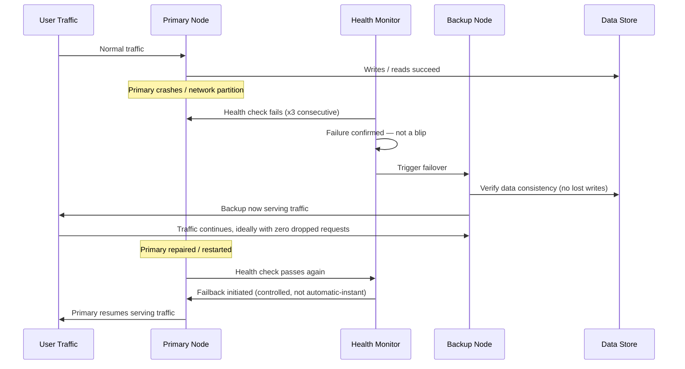

# Part 9: Reliability, Availability & Recovery Testing

> **Study Guide for QA Professionals** — Non-Functional Testing, from first principles
> Difficulty Level: Intermediate to Advanced | Estimated Reading Time: 45 minutes

---

## Table of Contents

1. [Reliability, Defined Properly](#91-reliability-defined-properly)
2. [From "Maturity" to "Faultlessness" — What the 2023 Shift Actually Means](#92-from-maturity-to-faultlessness--what-the-2023-shift-actually-means)
3. [The Core Metrics: MTBF, MTTF, MTTR, and Availability](#93-the-core-metrics-mtbf-mttf-mttr-and-availability)
4. [The Nines of Availability](#94-the-nines-of-availability)
5. [Failover Testing](#95-failover-testing)
6. [Recovery Testing](#96-recovery-testing)
7. [Disaster Recovery Testing — RTO vs. RPO](#97-disaster-recovery-testing--rto-vs-rpo)
8. [Graceful Degradation vs. Catastrophic Failure](#98-graceful-degradation-vs-catastrophic-failure)
9. [Reliability Testing Techniques & Tooling](#99-reliability-testing-techniques--tooling)
10. [📌 Fact Sheet — Part 9 in 60 Seconds](#-fact-sheet--part-9-in-60-seconds)
11. [Common Interview Questions](#common-interview-questions)

---

## 9.1 Reliability, Defined Properly

Most testers can recite a rough definition of reliability — "the system doesn't crash" —
without ever having to defend a precise one. Here's the precise one, because precision is
what turns "reliability" from a vibe into something you can actually test and report on:

**Reliability is the probability that a system will perform its required functions,
without failure, for a specified period of time, under specified conditions.**

Every clause in that sentence is load-bearing:

- **"Probability"** — reliability is not binary. A system isn't simply "reliable" or "not
  reliable"; it has a reliability figure, usually expressed as a percentage or a rate,
  measured over a window.
- **"Required functions"** — reliability is scoped to what the system is actually
  supposed to do. A reporting dashboard being down for ten minutes is a different
  reliability event than a payment authorization endpoint being down for ten minutes,
  even if both are technically "the system."
- **"Specified period of time"** — reliability is always measured over a window (a day,
  a month, a year). "99.9% reliable" means nothing without a time period attached.
- **"Specified conditions"** — reliability under normal load is a different claim from
  reliability during a Black Friday traffic spike. A system can be highly reliable under
  the conditions it was tested for and unreliable the moment those conditions change —
  which is exactly why reliability testing and performance testing (Parts 2–3) are
  siblings, not strangers. Load testing proves a system performs correctly at scale in
  the moment; reliability testing proves it keeps performing correctly, or fails and
  recovers gracefully, *over time*.

Reliability sits distinct from — but closely related to — **availability**, which is the
proportion of time a system is actually up and usable. A system can be highly reliable
(it almost never fails) but have mediocre availability if, on the rare occasions it does
fail, it takes hours to come back. Conversely, a system that fails often but recovers in
seconds each time might post decent availability numbers while still feeling flaky and
untrustworthy to the people using it. Section 9.3 makes this relationship precise with
actual math.

> [!TIP]
> **🎭 Meme Break — Drake Hotline Bling**
>
> ❌ *"The system hasn't crashed in the demo, so it's reliable."*  
> ✅ *"The system has a measured MTBF, a measured MTTR, a tested failover path, and a
> disaster recovery runbook that's actually been rehearsed — not just written."*

<details>
<summary>🧠 <strong>Quick Check:</strong> Two payment systems both claim "99.9% reliable." System A fails once a year for about 8.76 hours. System B fails once a month for about 43 minutes each time. Are they equally trustworthy to a merchant relying on them?</summary>

Mathematically their availability is close (both land near 99.9% uptime over a year), but
they are not equally trustworthy in practice. System B fails *twelve times more often*,
which means twelve separate incidents, twelve rounds of merchant support tickets, twelve
opportunities for a failure to land during a high-value window (like month-end
settlement). System A's single long outage is worse for any transaction caught in that
exact 8-hour window, but System B's frequency makes failure a routine, unpredictable
occurrence rather than a rare event — which is why reliability testing looks at MTBF
(how *often*) and MTTR (how *long*) as separate numbers, never just the combined
availability percentage.

</details>

---

## 9.2 From "Maturity" to "Faultlessness" — What the 2023 Shift Actually Means

Part 1 mentioned in passing that ISO/IEC 25010's 2023 revision renamed Reliability's core
sub-characteristic from **Maturity** to **Faultlessness**. It's a one-line footnote in a
quality-model table, but it's worth unpacking properly here, because it changes what you
should actually be testing for.

**Maturity**, the 2011-era term, framed reliability as an outcome of a system's
development lifecycle — the implicit idea being that a system becomes reliable the way a
product becomes mature: through age, through iteration, through having survived enough
production traffic to have its rough edges worn off. Under this framing, reliability
testing looks backward — "how has this system behaved in production so far?" — and
treats a newer, less battle-tested system as inherently a higher reliability risk almost
by definition.

**Faultlessness** reframes the question entirely: it asks about the **absence of defects
capable of causing failure**, independent of how long the system has been running. A
brand-new service, freshly deployed, can be highly faultless if its failure modes have
been rigorously tested, its error handling is airtight, and its recovery paths are
proven — even with zero production track record. Conversely, a five-year-old "mature"
system can still be riddled with untested failure paths that simply haven't been
triggered yet by bad luck.

The practical shift this creates for a tester:

| Under "Maturity" thinking | Under "Faultlessness" thinking |
|---|---|
| Reliability is proven by uptime history and time in production | Reliability is proven by deliberately testing failure paths *before* production sees them |
| A new microservice is assumed riskier until it "matures" | A new microservice is only as risky as its untested failure paths — test them, don't wait |
| Reliability testing is largely passive: monitor and wait | Reliability testing is active: inject failures, verify recovery, before go-live |
| "It hasn't failed yet" counts as evidence of reliability | "It hasn't failed yet" is treated as *absence of data*, not evidence — deliberately induce the failure and observe |

This is precisely the theoretical justification for everything in the rest of this
part — failover testing, recovery testing, and disaster recovery testing all exist
because "faultlessness" demands you go find the faults on your own terms, in a
controlled test, rather than letting production traffic find them for you at 2 AM.

> [!TIP]
> **🎭 Meme Break — Expanding Brain**
>
> 🧠 *Level 1: "It's been running fine for six months, it must be reliable."*  
> 🧠🧠 *Level 2: "It's been running fine for six months under normal conditions."*  
> 🧠🧠🧠 *Level 3: "Normal conditions never included the primary database dying mid-transaction — has anyone actually tested that?"*  
> 🧠🧠🧠🧠 *Level 4: ISO 25010's 2023 model calls this faultlessness, not maturity — go find and test the untested failure path before production finds it for you.*

<details>
<summary>🧠 <strong>Quick Check:</strong> A team says "our checkout service is reliable — it's been in production for two years without a major incident." Under the 2023 "faultlessness" framing, why is that claim weaker evidence than it sounds?</summary>

Because "no incident yet" is an absence of data, not proof of resilience — it only tells
you the specific failure conditions that would expose a weakness haven't happened to
occur yet in two years of normal traffic. Faultlessness asks a forward-looking, active
question instead: has anyone deliberately killed the payment gateway connection, cut
network access to the database, or corrupted a config to see whether the service
recovers correctly? If not, "two years without incident" just means the untested failure
paths haven't been unlucky yet — not that they don't exist.

</details>

---

## 9.3 The Core Metrics: MTBF, MTTF, MTTR, and Availability

Reliability testing lives or dies on a handful of metrics. They sound similar and get
confused constantly, so nail the distinctions first.

| Metric | Full name | What it measures | Applies to |
|---|---|---|---|
| **MTBF** | Mean Time Between Failures | Average time between one failure and the next, for a system that *can* be repaired | Repairable systems (a server, a service, a component that gets fixed and put back in service) |
| **MTTF** | Mean Time To Failure | Average time a system runs before it fails, for something *not* typically repaired | Non-repairable components (a disk that gets replaced, not fixed, when it fails) |
| **MTTR** | Mean Time To Recovery (or Repair) | Average time it takes to detect, diagnose, and fix a failure and restore service | Any incident — the "how fast do we bounce back" number |

The distinction between MTBF and MTTF trips people up because they sound almost
identical. The rule of thumb: **MTTF is for things you replace, MTBF is for things you
repair.** A hard drive that fails gets swapped for a new one — you measure MTTF, the time
until that failure. A web server that crashes gets restarted and rejoins the fleet — you
measure MTBF, the time between one crash and the next crash of a system that keeps
getting put back into service.

### Availability, calculated

Once you have MTBF and MTTR, availability isn't a vague target — it's arithmetic:

```
Availability = MTBF / (MTBF + MTTR)
```

**Worked example.** Picture a payment authorization service being reliability-tested
before a merchant onboarding push. Over a 30-day observation window, the service
experienced 3 failures. Between failures, it ran for an average of 240 hours before the
next one (MTBF = 240 hours). Each time it failed, the on-call engineer took an average of
15 minutes (0.25 hours) to detect the failure, restart the affected pod, and confirm
traffic was flowing again (MTTR = 0.25 hours).

```
Availability = 240 / (240 + 0.25)
             = 240 / 240.25
             = 0.99896
             ≈ 99.9%
```

That's a "three nines" service — and notice what the formula is actually telling you:
availability improves either by making failures **less frequent** (raising MTBF) or by
making recovery **faster** (lowering MTTR). A team chasing five nines doesn't necessarily
need to eliminate failures entirely — sometimes the faster, cheaper win is investing in
automated failover and faster detection to slash MTTR, rather than chasing an
unrealistic zero-failure MTBF. This is precisely why failover testing (Section 9.5) and
recovery testing (Section 9.6) matter as much as raw stability — they attack the MTTR
side of the equation directly.

<details>
<summary>🧠 <strong>Quick Check:</strong> A service has MTBF = 500 hours and MTTR = 5 hours. A competitor's service has MTBF = 100 hours and MTTR = 0.1 hours. Which one has higher availability, and what does that tell you about where each team should invest?</summary>

Service A: 500 / (500 + 5) = 500/505 ≈ 99.01%. Service B: 100 / (100 + 0.1) =
100/100.1 ≈ 99.90%. Service B — which fails *five times more often* — actually has
higher availability, because its recovery is nearly instant. This tells you Service A's
team should be investing in faster detection and automated failover (attacking MTTR)
rather than chasing a marginally higher MTBF, while Service B's team has already solved
the hard problem (fast recovery) and could now focus on reducing failure frequency for a
smoother, less alarm-heavy operational experience — even though its availability number
is already excellent.

</details>

---

## 9.4 The Nines of Availability

"99.9% uptime" sounds nearly identical to "99.99% uptime" until you convert both into
actual hours of downtime a year — at which point the gap becomes visceral, and it's the
single most useful table in this part to have memorized.

| Availability | Nickname | Downtime per year | Downtime per month | Downtime per day |
|---|---|---|---|---|
| 99% | "Two nines" | ~3.65 days | ~7.3 hours | ~14.4 minutes |
| 99.9% | "Three nines" | ~8.76 hours | ~43.8 minutes | ~1.44 minutes |
| 99.99% | "Four nines" | ~52.6 minutes | ~4.38 minutes | ~8.6 seconds |
| 99.999% | "Five nines" | ~5.26 minutes | ~26.3 seconds | ~0.86 seconds |

Look at the jump from 99% to 99.9% alone: going from "two nines" to "three nines" takes
you from **three and a half days of downtime a year** — enough to make national news if
it's a payment platform or a hospital system — down to **under 9 hours**, which is a bad
weekend, not a bad year. The jump from three nines to four nines takes annual downtime
from "a bad weekend" down to **under an hour**, total, across all twelve months
combined. Five nines means the system is effectively never allowed to be down for longer
than the time it takes to notice a coffee machine is out of order.

This table is also why "the nines" get expensive fast, and why demanding five-nines
availability for something that doesn't need it is a real anti-pattern. An internal
reporting dashboard used by three analysts does not need the multi-region active-active
architecture, automated failover, and 24/7 on-call rotation that five nines requires — it
needs three nines at most, and spending five-nines engineering effort on it is wasted
budget that should have gone toward the payment authorization path that actually needs
it.

> [!WARNING]
> **🎭 Meme Break — "This Is Fine" Dog**
>
> 🔥 *"We're targeting 99.9% uptime for the payment gateway."*  
> 🔥 *That's still nearly 9 hours a year the gateway can be completely down.*  
> 🔥 *Nobody has calculated what 9 hours of failed payment authorizations actually costs the business. This is fine.*

<details>
<summary>🧠 <strong>Quick Check:</strong> A stakeholder says "99% uptime is basically the same as 99.9%, it's only a fraction of a percent difference." How do you correct this using real numbers?</summary>

99% uptime allows roughly 3.65 days of downtime a year; 99.9% allows roughly 8.76
*hours* — about a 10x reduction in actual downtime for what looks like a tiny percentage
change. Framed as "your system could be completely unavailable for three and a half full
days this year versus under nine hours," the stakeholder immediately understands these
are not remotely the same commitment, and that the engineering cost difference between
them (redundancy, automated failover, faster on-call response) is proportionally real,
not cosmetic.

</details>

---

## 9.5 Failover Testing

**Failover testing** verifies that when a primary component fails, the system correctly
and automatically switches over to a backup or redundant component — without data loss,
without corrupting in-flight transactions, and within an acceptable time window. It is
the direct test of the MTTR-reduction strategy from Section 9.3: a well-tested failover
path is often the single biggest lever for pushing availability from three nines toward
four.



What a rigorous failover test actually checks, beyond "did traffic move" — each of these
is a distinct pass/fail criterion a naive failover test skips:

- **Detection time** — how long between the primary actually failing and the monitoring
  system recognizing it? A health check that only fires every 60 seconds means up to a
  minute of failed requests before failover even *starts*.
- **Failover time** — once detected, how long until the backup is actually serving
  traffic? This is the number that most directly determines your effective MTTR.
- **Data consistency during the handoff** — does the backup have the same data as the
  primary had at the moment of failure, or is there a replication lag window where
  in-flight writes are lost? For a payment platform, a failover that loses the last two
  seconds of transaction writes is not a successful failover, it's a data-loss incident
  wearing a failover costume.
- **No split-brain** — does the old primary, if it comes back online unexpectedly, ever
  briefly serve traffic *simultaneously* with the backup, causing two systems to accept
  writes for the same data at once?
- **Failback behavior** — when the primary recovers, does the system return to it in a
  controlled, verified way, or does an automatic instant failback risk flapping back and
  forth if the primary's recovery is flaky?

Testing this properly means actually pulling the plug — killing the primary database
connection, taking a node out of a load balancer pool, or simulating an availability-zone
outage in a staging environment — and watching every one of those five criteria, not just
confirming "the site is still up."

<details>
<summary>🧠 <strong>Quick Check:</strong> A failover test confirms the site stayed up when the primary database was killed. Is that a passing test?</summary>

Not on its own. "The site stayed up" only proves failover happened at all — it says
nothing about detection time (how many requests failed before failover kicked in), data
consistency (were any writes made to the primary in its last moments lost during the
handoff), or failback safety (does the system risk a split-brain state if the old primary
comes back unexpectedly). A complete failover test checks all five criteria — detection
time, failover time, data consistency, no split-brain, and controlled failback — not just
whether the homepage returned a 200 afterward.

</details>

---

## 9.6 Recovery Testing

**Recovery testing** is the deliberate, controlled induction of a failure — killing a
process, cutting network access, corrupting a configuration file, exhausting disk space —
followed by verifying the system detects the failure, recovers correctly, and does so
within an acceptable time. It is narrower and more targeted than full chaos engineering
(covered in depth in Part 13): recovery testing is usually a planned, single-fault
scenario run in a controlled test environment against a specific hypothesis ("if the
Redis cache goes down, does the app fall back to the database without erroring"), while
chaos engineering deliberately injects *unpredictable*, often production-adjacent
failures — sometimes multiple at once — to discover failure modes nobody thought to
hypothesize about in the first place. Think of recovery testing as the rehearsed fire
drill and chaos engineering as randomly triggering the alarm on an ordinary Tuesday to
see what actually happens when nobody was braced for it.

Common recovery test scenarios, and what "correct recovery" looks like for each:

| Induced failure | What correct recovery looks like |
|---|---|
| Kill the application process (`kill -9`) | Process supervisor (systemd, Kubernetes) restarts it automatically within a defined threshold; no orphaned locks or half-written files left behind |
| Cut network access to a downstream dependency | Circuit breaker trips, requests fail fast with a clear error or fallback instead of hanging until timeout; recovers automatically once connectivity returns |
| Corrupt or delete a config file | System either fails to start with a clear, actionable error (fail-safe) or falls back to a last-known-good config — never silently runs with undefined behavior |
| Exhaust available disk space | Writes fail gracefully with alerts fired, rather than the process crashing uncleanly or, worse, silently corrupting data mid-write |
| Kill the primary database connection mid-transaction | The in-flight transaction rolls back cleanly — no partial writes, no orphaned records; the application retries or surfaces a clear error, not a hang |

The worked example worth internalizing: a team running a recovery test against a
payments service deliberately severs the connection to a third-party bank API mid-request
during a test window, simulating exactly the kind of transient network failure that
happens for real during any large-scale outage. The test isn't asking "does the payment
succeed" — it's already failed by design. It's asking: does the service time out in a
bounded, configured window (say 5 seconds) rather than hanging indefinitely and tying up
a connection pool slot? Does it return a clear, retryable error to the caller rather than
a generic 500? Does the retry, when it eventually succeeds, correctly avoid processing
the same payment twice? That last question is the one that actually matters most in
fintech — a recovery test that only checks "did it come back up" and never checks "did it
come back up *without duplicating the transaction*" has tested half the problem.

> [!TIP]
> **🎭 Meme Break — "Is This a Pigeon"**
>
> 🦋 *Production traffic randomly hitting a network blip during a routine deploy.*  
> 🧑 *The team, watching the dashboard, pointing:* **"Is this the chaos engineering test we scheduled?"**  
> 🦋 *It is not. Nobody scheduled anything. This is what happens when recovery paths only ever get exercised by accident instead of on purpose.*

<details>
<summary>🧠 <strong>Quick Check:</strong> A recovery test kills the connection between a payment service and a third-party bank API mid-request. The service correctly times out after 5 seconds and returns an error. Is the test complete?</summary>

Not yet — timing out cleanly is necessary but not sufficient. The test also needs to
verify what happens on retry: does the retried request correctly avoid double-processing
the original payment if the bank API had actually received and partially processed it
before the connection was cut? A recovery test that stops at "it failed gracefully" and
never checks "the eventual successful retry didn't create a duplicate transaction" has
only tested the failure half of the recovery story, not the half that actually protects
the merchant's money.

</details>

---

## 9.7 Disaster Recovery Testing — RTO vs. RPO

Failover and recovery testing (Sections 9.5–9.6) deal with component-level failures —
one node dies, one dependency goes unreachable. **Disaster Recovery (DR) testing** operates
one level up: it verifies the plan for recovering an *entire system* after a large-scale
event — a full data center outage, a regional cloud provider failure, a catastrophic
data corruption event, or a security incident requiring a full restore from backup.

Two metrics anchor every DR conversation, and they get confused constantly because they
both sound like "how bad was it," but they measure genuinely different things:

- **RTO — Recovery Time Objective.** The maximum acceptable **time** the system can be
  down before it must be restored. This answers: "how long can we tolerate being
  offline?"
- **RPO — Recovery Point Objective.** The maximum acceptable amount of **data** that can
  be lost, measured as a point in time to which data must be restorable. This answers:
  "how much data can we afford to lose, measured in time since the last good backup?"

```mermaid
gantt
    dateFormat  X
    axisFormat %s
    section Disaster Timeline
    Last good backup taken           :milestone, m1, 0, 0min
    Normal operation (data at risk)  :active, op1, 0, 240
    DISASTER STRIKES                 :crit, milestone, m2, 240, 240
    RPO window (data that may be lost) :done, rpo, 0, 240
    Detection + decision to fail over  :active, det, 240, 260
    Restore from backup / DR site      :crit, rest, 260, 320
    Verification & traffic cutover     :active, ver, 320, 340
    Service restored                   :milestone, m3, 340, 340
    RTO window (total downtime)        :active, rto, 240, 340
```



**The distinction, made concrete.** Imagine a claims platform takes a full database
backup every 4 hours and has a documented DR plan promising the system will be back
online within 2 hours of a declared disaster.

- **RPO = 4 hours** means: if disaster strikes at 2:00 PM, the most recent usable backup
  is from 10:00 AM (worst case, right before the *next* backup would have run) — so up to
  4 hours of claims submitted, reviewed, or updated between 10:00 AM and 2:00 PM could be
  lost and need to be manually reconstructed or re-entered.
- **RTO = 2 hours** means: regardless of how much data was lost, the system itself —
  logins working, claims visible, portals reachable — must be functional again by 4:00
  PM, two hours after the 2:00 PM disaster declaration.

These are independent targets, and confusing them leads to badly designed DR strategies.
A team can hit a tight RTO (system's back up fast) while still having a terrible RPO (a
full day of data silently gone), or vice versa — a near-zero RPO (continuous replication,
no data lost) paired with a sluggish RTO because nobody rehearsed the actual cutover
procedure and it takes six confused hours to execute manually the first time it's tried
for real.

**DR testing** means actually rehearsing this — not just having the runbook written, but
periodically executing a real (or realistically simulated) restore-from-backup and
declared-disaster cutover, on a schedule, and timing it against the stated RTO/RPO. A
disaster recovery plan that has never been tested is a document, not a capability — plenty
of organizations discover their "2-hour RTO" is actually a 14-hour RTO the first time
they try to execute it for real, because the runbook assumed a person who left the
company eighteen months ago, or because the backup that was supposed to restore cleanly
had been silently failing for months and nobody noticed until the day it mattered.

<details>
<summary>🧠 <strong>Quick Check:</strong> A system has RTO = 1 hour and RPO = 15 minutes. During an actual outage, the team restores service in 45 minutes but loses 90 minutes of data. Which objective did they meet, and which did they miss?</summary>

They met RTO (restored in 45 minutes, under the 1-hour target) but missed RPO badly
(lost 90 minutes of data against a 15-minute target — six times worse than the objective).
This is exactly the kind of gap DR testing is designed to catch before it happens for
real: the team may have a fast restore procedure but backups running far less frequently
than the RPO target assumes, which only becomes visible when the full DR drill is
actually timed and measured end-to-end rather than assumed from the documented backup
schedule.

</details>

---

## 9.8 Graceful Degradation vs. Catastrophic Failure

The single most practically useful reliability question you can ask about any system
with external dependencies is: **when one piece breaks, does the rest keep working in a
reduced but usable state, or does the whole thing go down with it?**

**Graceful degradation** means the system identifies which capabilities depend on the
failed component and disables or downgrades *only those*, while everything else
continues functioning — often by serving cached or slightly stale data rather than an
error page. **Catastrophic failure** means a single failed dependency takes the entire
system down, even the parts that had nothing to do with the failure.

### Scenario: the claims platform during a partial outage

Picture a health insurance claims platform structured around four portals — one each for
Providers, Payers, Employers, and Members, all reading and writing against the same
underlying claim records as those claims move through submission, review, and
settlement. Now picture the Payer-side claim-review microservice — the component that
lets a Payer's staff approve or reject a claim — going down for twenty minutes because of
a bad deploy.

In a **catastrophically failing** design, that one service being down takes the whole
platform's shared API gateway with it, because the gateway synchronously calls every
downstream service to build a single combined health check before serving *any* request.
A Member trying to check whether their claim status says "Final" or "Need Review" gets a
500 error, even though the Member portal never actually needed the Payer review service
for that specific read.

In a **gracefully degrading** design, the Provider, Employer, and Member portals keep
working normally — a Member can still see their claim's last-known status (even if it's
now twenty minutes stale because the status hasn't been able to update while the review
service is down), a Provider can still submit new claims, and only the one specific
action that genuinely requires the broken service — a Payer approving or rejecting a
claim right now — is unavailable, with a clear "claim review is temporarily unavailable,
try again shortly" message instead of a generic crash. This matters enormously for a
platform where cross-portal consistency is already the highest-value defect category
described in the platform's own regression checklist — a claim showing "Final" to a
Member while still stuck mid-review on the Payer side is exactly the class of bug that a
poorly-designed failure mode makes worse, not better, because a full outage of the review
service with no graceful fallback means *nobody's* view updates, and the four portals
silently drift out of sync with each other for the duration of the outage.

→ Reference: <a href="https://github.com/ghanendra-sdet/healthcare-insurance-platform" target="_blank" rel="noopener noreferrer">Healthcare Insurance Platform</a>

### Scenario: the AI copilot when one upstream product goes quiet

Now picture a different shape of the same problem. An AI operations copilot sits across
six connected fintech products — Collection, Payout, Connected Banking, BBPS, Reseller,
and YOBO — reading data from all six with permission to answer questions, explain
transactions, and resolve support disputes conversationally. A merchant using the
Collection product asks the copilot, mid-conversation, "why is my settlement amount
different this month?" — a question that requires the copilot to correlate data from the
Collection service *and* the Connected Banking service to explain a bank-side deduction.

If the Connected Banking upstream is slow or fully down at that exact moment, what should
happen? In a catastrophic design, the copilot's whole response pipeline blocks waiting on
that one upstream call, eventually times out, and the merchant gets a generic "something
went wrong" message for a question the AI mostly *could* have answered from Collection
data alone. Worse, if the copilot's architecture treats any upstream failure as fatal to
the whole conversation, a slow Connected Banking API on a bad day silently degrades
support quality across all six products simultaneously — a six-times blast radius for
what should have been a contained, single-product hiccup, exactly the systemic risk this
platform's own testing strategy explicitly calls out as the top reliability concern for a
shared AI layer.

In a gracefully degrading design, the copilot recognizes it can't reach the Connected
Banking data right now, answers with what it *does* have ("your Collection-side settlement
figure looks correct; I can't currently pull the bank-side deduction detail — let me
either retry in a moment or escalate this specific sub-question to a human agent while
still resolving the rest of your query"), and — critically — this is exactly the same
escalation logic the platform already applies to its highest-risk actions: when
confidence or data availability is incomplete, hand off rather than guess or crash. A
reliability test for a system like this deliberately kills or artificially delays one of
the six upstream connections during a test conversation and verifies the AI still
resolves the parts of the question it can, degrades only the specific sub-answer it
can't, and never silently fabricates an answer using stale or missing upstream data
without flagging it.

→ Reference: <a href="https://github.com/ghanendra-sdet/ai-dispute-resolution-engine" target="_blank" rel="noopener noreferrer">AI Dispute Resolution Engine</a>

### A third scenario: cached data as a graceful-degradation pattern

The most common real-world graceful degradation pattern, worth naming explicitly because
it shows up in almost every architecture with a downstream dependency: **serve cached
data with a visible staleness indicator, rather than an error, when the live source is
unreachable.** A travel booking platform pulling real-time pricing from a third-party
airline supplier, for instance, can fall back to the last successfully fetched price
(clearly labeled "price last confirmed 4 minutes ago, may have changed") rather than
either blocking the entire search page behind a supplier timeout or — worse — silently
showing nothing at all. The test that validates this isn't a happy-path search test; it's
a deliberate supplier-timeout simulation that confirms the fallback path activates
correctly, the staleness is visibly communicated (not silently hidden), and the system
recovers automatically to live pricing the moment the supplier responds again.

> [!CAUTION]
> **🎭 Meme Break — Galaxy Brain**
>
> 🌌 *Small brain: "If any dependency fails, show an error page."*  
> 🌌🌌 *Glowing brain: "If any dependency fails, retry it a few times before giving up."*  
> 🌌🌌🌌 *Galaxy brain: design the system so a downstream failure degrades only the
> specific capability that genuinely needs it, serves cached or partial data everywhere
> else, and tests that boundary deliberately — because "the whole app crashed because one
> of six upstreams had a slow afternoon" is not a performance bug, it's an architecture
> bug wearing a performance bug's clothes.*

<details>
<summary>🧠 <strong>Quick Check:</strong> The AI dispute resolution engine's Connected Banking upstream goes down for 10 minutes. A merchant using the Payout product asks an unrelated question about their payout schedule. Should that question be affected?</summary>

No — and if it is, that's the reliability defect worth filing. The merchant's payout
schedule question has no dependency on the Connected Banking upstream at all; a
gracefully degrading design isolates the failure to only the specific sub-capabilities
that genuinely need the broken upstream (like explaining a bank-side settlement
deduction), while every other question the copilot can answer — including this one —
should resolve completely normally. A reliability test here deliberately takes one
upstream offline and verifies unrelated capabilities are *provably* unaffected, not just
assumed to be independent because the code is in different services.

</details>

---

## 9.9 Reliability Testing Techniques & Tooling

Putting the previous sections into a practical test approach:

- **Long-duration soak-style reliability runs** — running the system under realistic
  sustained load for extended periods (days, not minutes) to surface failures that only
  emerge from accumulation — memory leaks, connection pool exhaustion, log disk
  fill-up. This overlaps with soak testing (Part 3) but with a reliability lens: the
  question isn't "does performance degrade," it's "does the system eventually fail, and
  if so, does it fail safely and recover."
- **Fault injection** — deliberately triggering the specific failure modes covered in
  Section 9.6 (killed processes, cut network access, corrupted configs) in a controlled
  test environment, one fault at a time, with a specific hypothesis about correct
  recovery behavior for each.
- **Failover drills** — scheduled, rehearsed exercises (not just automated tests) where
  a team manually triggers a primary-to-backup failover in a staging or even production
  environment during a low-traffic window, to validate both the technical failover path
  and the human response procedure around it.
- **DR game days** — a full disaster recovery rehearsal, timed against RTO/RPO targets,
  ideally run by someone who *didn't* write the runbook, to catch the "this only works
  if you already know what I meant" gaps that the original author can't see in their own
  documentation.
- **Circuit breaker and timeout testing** — verifying that calls to external
  dependencies have sane, tested timeout values and that circuit breakers actually trip
  and reset correctly, rather than assuming a library default is good enough for the
  specific failure characteristics of a given dependency.

On tooling: reliability and DR testing lean less on a single dedicated tool category (the
way performance testing leans on k6/JMeter/Gatling or security testing leans on Burp
Suite/OWASP ZAP) and more on infrastructure-level fault injection combined with
observability. Kubernetes-native chaos tools, cloud-provider fault injection services,
and simple network-level fault simulation (blocking a port, adding artificial latency)
are the common building blocks — Part 13 covers this tooling landscape in depth once
chaos engineering itself is introduced as a discipline distinct from, but built on top
of, everything in this part.

---

## 📌 Fact Sheet — Part 9 in 60 Seconds

- **Reliability** = the probability a system performs its required functions, without
  failure, for a specified period, under specified conditions — always scoped to a time
  window and a set of conditions, never a binary yes/no.
- ISO 25010's 2023 shift from **Maturity to Faultlessness** reframes reliability from a
  backward-looking "how long has it run without incident" question to a forward-looking
  "have the failure paths been deliberately tested" question — "no incidents yet" is
  absence of data, not proof of resilience.
- **MTBF** (Mean Time Between Failures, repairable systems) and **MTTF** (Mean Time To
  Failure, non-repairable/replaced components) measure failure frequency; **MTTR** (Mean
  Time To Recovery) measures how fast the system bounces back.
- **Availability = MTBF / (MTBF + MTTR)** — worked example: MTBF 240 hours, MTTR 0.25
  hours → 240/240.25 ≈ 99.9% availability. Availability improves by raising MTBF
  *or* lowering MTTR — often the faster win is attacking MTTR through better failover.
- **The nines, memorized**: 99% ≈ 3.65 days/year down; 99.9% ≈ 8.76 hours/year;
  99.99% ≈ 52.6 minutes/year; 99.999% ≈ 5.26 minutes/year. The jump from two nines to
  three nines alone is roughly a 10x reduction in real downtime.
- **Failover testing** verifies automatic switchover to a backup component — check
  detection time, failover time, data consistency during the handoff, absence of
  split-brain, and controlled failback, not just "did the site stay up."
- **Recovery testing** deliberately induces a single failure (killed process, cut
  network, corrupted config) and verifies correct, timely recovery — narrower and more
  targeted than full chaos engineering (Part 13), which injects unpredictable,
  often multi-fault scenarios to find failure modes nobody hypothesized.
- **RTO** (Recovery Time Objective) = maximum acceptable downtime. **RPO** (Recovery
  Point Objective) = maximum acceptable data loss, measured as a point in time. They are
  independent targets — a system can meet one and badly miss the other, which is exactly
  what DR testing is designed to expose before a real disaster does.
- **Graceful degradation** disables or downgrades only the specific capability tied to a
  failed dependency while everything else keeps working (often via cached/stale data
  with a visible staleness indicator); **catastrophic failure** lets one failed
  dependency take the whole system down with it.
- A four-portal claims platform (Provider/Payer/Employer/Member) risks all four views
  silently drifting out of sync during a partial outage if there's no graceful fallback —
  cross-portal consistency during failure is a harder, higher-value reliability test than
  any single-portal happy path.
- A shared AI layer reading from six upstream products has a **6x blast radius** on any
  reliability gap — one slow or down upstream should degrade only the specific
  sub-capability that needs it, never the whole conversation or the other five products'
  support quality.
- A DR plan that has never been rehearsed is a document, not a capability — the number
  one thing DR game days catch is a runbook that assumes a person, credential, or backup
  integrity that quietly stopped being true months ago.

---

## Common Interview Questions

### Question 1: What's the difference between MTBF, MTTF, and MTTR, and how do they relate to availability?

**Model Answer:**

"MTBF is Mean Time Between Failures — the average time between one failure and the next
for a repairable system, like a server that crashes and gets restarted. MTTF is Mean Time
To Failure — the average time before failure for a component that gets replaced rather
than repaired, like a failed disk. MTTR is Mean Time To Recovery — how long it takes to
detect, diagnose, and fix an incident once it happens. They combine into availability as
MTBF / (MTBF + MTTR). For example, a service with MTBF of 240 hours and MTTR of 15
minutes works out to about 99.9% availability. The formula also shows you two separate
levers for improving availability — you can make failures less frequent by raising MTBF,
or you can make recovery faster by lowering MTTR — and in practice, investing in faster
detection and automated failover to cut MTTR is often the cheaper, faster win than
chasing a higher MTBF."

### Question 2: What's the difference between RTO and RPO, and why do people confuse them?

**Model Answer:**

"RTO, Recovery Time Objective, is about time — the maximum acceptable duration the system
can be down before service must be restored. RPO, Recovery Point Objective, is about
data — the maximum acceptable amount of data loss, measured as how far back in time the
restored data can safely be from. People confuse them because both sound like 'how bad
was the outage,' but they're independent targets. A system can restore quickly, meeting
its RTO, while still losing far more data than its RPO allows if backups don't run
frequently enough — or it can have near-zero data loss but a terrible RTO if nobody
rehearsed the actual cutover procedure. DR testing exists specifically to catch that gap
by timing a real restore-and-cutover drill against both targets rather than trusting the
documented backup schedule."

### Question 3: What's the difference between graceful degradation and a system that just has good uptime?

**Model Answer:**

"Good uptime numbers can hide a system that's actually fragile under partial failure —
availability percentages are usually measured at the whole-system level, so a system
that goes fully down for a few minutes a month can post excellent availability while
still being catastrophically brittle, in the sense that any single dependency failure
takes the entire system with it. Graceful degradation is a design and testing property
that operates below that top-line number: when one dependency fails, does the system
isolate the blast radius to only the specific capability that needed it, and keep
everything else working — ideally by serving cached or last-known-good data with a clear
staleness indicator — rather than the whole system failing as a unit? You test for this
by deliberately taking one dependency offline in isolation and verifying the rest of the
system provably keeps working, rather than assuming architectural isolation exists just
because the code lives in different services."
