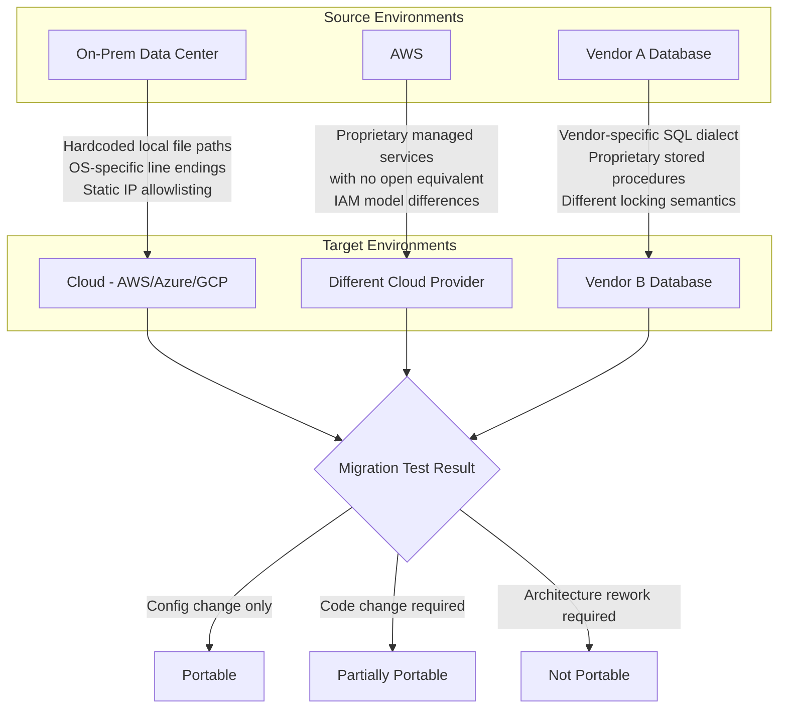

# Part 10: Maintainability & Portability Testing

> **Study Guide for QA Professionals** — Non-Functional Testing, from first principles
> Difficulty Level: Intermediate to Advanced | Estimated Reading Time: 40 minutes

---

## Table of Contents

1. [Why Test Something as Abstract as "Maintainability"?](#101-why-test-something-as-abstract-as-maintainability)
2. [The Sub-Characteristics of Maintainability (ISO 25010)](#102-the-sub-characteristics-of-maintainability-iso-25010)
3. [Concrete, Testable Maintainability Proxies](#103-concrete-testable-maintainability-proxies)
4. [Testability as a First-Class NFT Concern](#104-testability-as-a-first-class-nft-concern)
5. [Portability / Flexibility Testing](#105-portability--flexibility-testing)
6. [Scalability Under Flexibility vs. Performance Under Load](#106-scalability-under-flexibility-vs-performance-under-load)
7. [Installation, Uninstallation & Configuration Testing](#107-installation-uninstallation--configuration-testing)
8. [📌 Fact Sheet — Part 10 in 60 Seconds](#-fact-sheet--part-10-in-60-seconds)
9. [Common Interview Questions](#common-interview-questions)

---

## 10.1 Why Test Something as Abstract as "Maintainability"?

Every other module in this course tests something you can point at while it's failing.
A load test has a graph with a latency spike on it. A security test has a request that
returns data it shouldn't. An accessibility test has a screen reader that goes silent
on a button with no label. Maintainability doesn't hand you a failure like that. Nobody
files a bug titled "the codebase is hard to change." It just quietly costs more, every
single sprint, until someone finally asks why a one-line pricing fix takes three weeks
and touches nine files nobody remembers writing.

That's exactly why maintainability testing gets skipped more than almost any other NFT
characteristic — it doesn't produce an incident, it produces **drag**. And drag is easy
to rationalize away one sprint at a time, right up until a team discovers it's spending
70% of its capacity on code that fights back instead of features that move the business
forward.

ISO/IEC 25010 defines maintainability as **the degree of effectiveness and efficiency
with which a product can be modified** — to correct defects, improve performance, or
adapt to a changed environment. QA's job isn't to write a "maintainability test case"
in the traditional pass/fail sense. It's to apply **testable proxies** — measurable
stand-ins for a quality that resists direct measurement — the same way a doctor uses
blood pressure as a proxy for cardiovascular health instead of trying to "test" health
directly. None of these proxies is maintainability itself. All of them, together, tell
you whether a codebase can be safely and cheaply changed.

> [!TIP]
> **🎭 Meme Break — Distracted Boyfriend**
>
> 🚶 *The sprint plan, walking with:* **"Ship the new settlement rounding rule"**  
> 👀 *Looking back at:* **"The one function that calculates GST, has no tests, no
> comments, 400 lines, and three people are afraid to touch it"**

🧠 <strong>Quick Check:</strong> Why can't maintainability be tested the same way a login feature is tested — with a single pass/fail assertion?

Because maintainability isn't a behavior the system exhibits at runtime — it's a
property of how easy the system is to *change* over time, which only shows up when
someone actually tries to change it. There's no single request/response you can assert
on. Instead, QA relies on measurable proxies — cyclomatic complexity, test coverage,
coupling between modules, documentation completeness — that correlate strongly with how
expensive and risky future changes will be, even though none of them is a direct
measurement of "maintainability" itself.

---

## 10.2 The Sub-Characteristics of Maintainability (ISO 25010)

ISO 25010 breaks maintainability into five sub-characteristics. Treat this as a
checklist for design reviews and architecture discussions, not just a taxonomy to
memorize.

| Sub-characteristic | Plain-English question | What "bad" looks like in practice |
|---|---|---|
| **Modularity** | Can a change to one component avoid rippling into others? | Editing the pricing service also breaks the notification service, because they share a mutable global config object |
| **Reusability** | Can existing assets be reused instead of rebuilt? | Three different services each implement their own, slightly different GST rounding logic |
| **Analyzability** | How easy is it to diagnose a defect or identify exactly what needs to change? | A settlement mismatch takes two days to trace because there's no logging at any of the four services the money passed through |
| **Modifiability** | Can a change be made without introducing new defects or degrading existing quality? | A "simple" date-format change breaks three unrelated reports because they all silently depended on the old format string |
| **Testability** | How easily can test criteria be established and tests performed to determine whether those criteria are met? | A business rule is buried inside a monolithic controller with no seam to isolate it, so verifying it requires standing up the entire application |

These five aren't independent — they compound. Low modularity makes analyzability
worse (you have to read more code to find the fault). Low reusability makes
modifiability worse (the same bug has to be fixed in three copy-pasted places instead
of one). This is why maintainability testing works best as a **portfolio of proxies**
assessed together, not any single metric in isolation.

🧠 <strong>Quick Check:</strong> A team says "our test coverage is 85%, so maintainability is fine." What's wrong with that conclusion?

Coverage alone tells you almost nothing about the other four sub-characteristics.
85% coverage on a tightly coupled, poorly modularized codebase still means every
change ripples unpredictably — the tests will just tell you *that* it broke, not
help you avoid breaking it, and won't tell you how long it took someone to even find
where to make the change. Coverage is one proxy for one sub-characteristic
(modifiability/testability, loosely) — it says nothing about modularity, reusability,
or analyzability.

---

## 10.3 Concrete, Testable Maintainability Proxies

Here's where maintainability testing stops being philosophy and becomes something you
can actually run in a pipeline and report a number for.

### Cyclomatic complexity

Cyclomatic complexity counts the number of independent paths through a function — every
`if`, `for`, `while`, `case`, and boolean operator adds a path. It's not an academic
metric; it's a direct proxy for **how many test cases you need to exercise every branch**,
and a strong predictor of defect density.

| Cyclomatic complexity | Interpretation |
|---|---|
| 1–10 | Simple, low risk, easy to test thoroughly |
| 11–20 | Moderate complexity, more risk, needs deliberate test design |
| 21–50 | High complexity, high risk — a strong refactor candidate |
| 50+ | Effectively untestable by hand — every change here is a gamble |

Tools: SonarQube, ESLint's `complexity` rule (JavaScript/TypeScript), Checkstyle/PMD
(Java), Radon (Python) all compute this automatically and can gate a CI pipeline —
"no new function above complexity 15 without an explicit override" is a realistic,
enforceable rule, not an aspirational one.

### Test coverage as a maintainability signal — not a quality signal

This distinction matters enough to state plainly: **high coverage does not mean the
code is well-tested, but low coverage reliably means changing that code is
dangerous.** Coverage tells you what percentage of lines/branches execute during your
test suite — it says nothing about whether the assertions are meaningful. A test that
calls a function and asserts nothing about its output still counts toward "coverage."

What coverage *is* legitimately good for, in the maintainability context: it's a proxy
for **"can someone change this function tomorrow and find out immediately, not three
weeks later in production, if they broke it."** A module at 10% coverage isn't
necessarily buggy today — but it's expensive and risky to touch, because there's no
safety net telling you what you broke. That's a maintainability finding, not a quality
finding, and it's worth reporting as one explicitly rather than folding it into a
generic "coverage is low" comment that gets deprioritized.

### Documentation completeness testing

Yes, this is testable. Concrete checks QA can actually run:

- Does every public API endpoint have documented request/response schemas that match
  what the code actually does (drift between docs and behavior is its own defect
  class)?
- Do onboarding docs let a new engineer actually get a local environment running,
  end to end, without pinging someone on Slack? (Time this — literally hand the doc to
  someone new and clock how long it takes.)
- Are architectural decisions recorded anywhere, or does "why is it built this way"
  only live in one senior engineer's head?
- Do runbooks for common operational tasks (rotate a credential, roll back a
  deployment, replay a failed webhook) exist and actually work when followed literally?

### Modularity / coupling checks

Static analysis tools (e.g., dependency-cruiser for JS/TS, jdepend for Java) can
detect and fail a build on circular dependencies between modules, and can measure
**afferent/efferent coupling** — how many other modules depend on this one, and how
many this one depends on. A module with high efferent coupling (depends on many things)
is fragile — it breaks when anything around it changes. A module with high afferent
coupling (many things depend on it) is dangerous to change — everything downstream is
exposed to the change.

> [!WARNING]
> **🎭 Meme Break — "This Is Fine" Dog**
>
> 🔥 *The shared `utils.ts` file is 3,000 lines and imported by 40 modules.*
> 🔥 *Nobody knows which functions in it are actually still used.*
> 🔥 *This is fine.*

🧠 <strong>Quick Check:</strong> A function has cyclomatic complexity of 45 and 92% test coverage. Is it safe to change confidently?

Not necessarily. High coverage on a highly complex function often means the tests were
written to hit the coverage number, not to meaningfully exercise the 45 independent
paths through the logic — it's very easy to get high line coverage while still missing
entire combinations of branch conditions. The complexity score is telling you this
function is inherently risky to reason about; the coverage number alone doesn't cancel
that risk out. The honest read is "this function needs to be broken into smaller,
independently testable pieces," not "the coverage number says we're fine."

---

## 10.4 Testability as a First-Class NFT Concern

This is the section of this module QA engineers most often skip past, and it's the
most actionable one in the whole chapter: **testability is not something QA discovers
after the fact — it's something QA should be pushing back on during design review,
before a single line of code ships.**

A system with no logging has no analyzability — a defect that takes ten minutes to
diagnose with structured logs takes two days to diagnose by adding print statements
and redeploying repeatedly. A system with no feature flags means every change is a
production commitment with no rollback lever short of a full redeploy. A system with
no seams for mocking dependencies — no dependency injection, no interfaces to swap a
real payment gateway for a test double — means every test either hits a real
third-party system (slow, flaky, expensive) or doesn't get written at all.

None of these are abstract complaints. They are concrete, testable design
deficiencies, and QA is one of the few roles positioned to catch them early, because
QA is the role that will actually have to write and maintain tests against the
resulting system. The question "how would I test this?" asked in a design review,
before code exists, is itself a maintainability test — and it's cheaper by orders of
magnitude than discovering the answer is "you can't, without hitting production" six
months later.

Concrete testability checklist to raise in design review:

- **Logging**: Are the inputs, outputs, and decision points of this component
  observable, or is a defect here a black box?
- **Seams for test doubles**: Can the payment gateway, the database, the third-party
  API be swapped for a fake in a test environment, or is every test forced to be an
  integration test against a real dependency?
- **Feature flags**: Can this change be rolled out to 1% of traffic and rolled back
  instantly, or is "ship it" the only lever available?
- **Idempotency and determinism**: Given the same input, does this component produce
  the same output every time, or does hidden state (timestamps, random IDs, external
  calls) make it hard to write a reliable assertion?
- **Statelessness where possible**: Does this component carry hidden state between
  calls that a test has to know about and reset, or can it be tested in isolation?

A real, narrated scenario makes this concrete. In the Collection Engine — a merchant
payment platform with roughly 40 independently deployed services — settlement
reconciliation historically produced a recurring defect: a settlement would calculate
correctly, but the matching ledger entry would occasionally be missing, and nobody
could say why for hours. The root problem wasn't a logic bug in either service — it
was that the boundary between the Settlement Calculation Service and the Ledger
Service had no correlation ID threaded through the call, and neither side logged the
handoff in a way that let anyone reconstruct, after the fact, whether the ledger call
was even attempted. Diagnosing a single missing-ledger-entry incident meant manually
cross-referencing timestamps across two services' logs and guessing at which requests
lined up. That's a testability and analyzability failure hiding behind what looked,
on the surface, like "a settlement bug." Once the team added a correlation ID
propagated across that specific service boundary and logged on both sides, the same
class of defect went from a multi-hour investigation to a five-minute log query — the
underlying bug rate didn't even need to drop for the *cost* of that bug class to fall
by an order of magnitude, purely because the system became more analyzable.

🧠 <strong>Quick Check:</strong> A junior engineer says "testability isn't a QA concern, it's an engineering design choice." How do you respond?

Testability directly determines whether QA can do its job cheaply or expensively — a
system with no logging, no mockable seams, and no feature flags forces every test to
be slow, flaky, and expensive to write, which either balloons test-suite runtime or
means coverage quietly erodes because engineers stop bothering. QA has both the
standing and the obligation to raise testability gaps in design review, the same way
it would raise a missing input validation rule — it's a defect in the system's
design, discovered before it's expensive to fix, which is the entire point of
"shifting left."

---

## 10.5 Portability / Flexibility Testing

ISO 25010's 2023 revision renamed **Portability** to **Flexibility** — a name change
covered briefly in Part 1, worth returning to properly here because this is the part
of the course it actually governs. The rename reflects a real shift in what matters:
the original "portability" question was narrowly "can this software be moved from one
environment to another." The 2023 model broadens that to "can this software adapt —
move, scale, and be configured for new contexts — without disproportionate cost."

### The core portability questions

- **Can it move from on-premise to cloud, or between cloud providers, without a
  rewrite?** Hardcoded file system paths, assumptions about a specific VM's local
  disk, or a dependency on a proprietary cloud service with no abstraction layer
  (e.g., code calling AWS-specific APIs directly instead of through an interface) all
  fail this test the moment a migration or multi-cloud strategy is on the table.
- **Can it move between databases?** Vendor-specific SQL — Oracle's `ROWNUM`,
  SQL Server's `TOP`, MySQL-specific date functions, PL/SQL stored procedures with no
  equivalent elsewhere — locks a system to one database vendor as surely as a
  hardcoded IP address locks it to one server. Testing for this means literally
  attempting a migration in a lower environment and cataloguing every query that
  doesn't have a portable equivalent.
- **Does environment-specific configuration leak into code?** A base URL, an API key,
  a feature toggle, or a timeout value hardcoded into application logic instead of
  externalized into environment configuration means every environment move requires a
  code change and a redeploy — not a config change. This is one of the single most
  common and most avoidable portability defects, and it's directly testable: grep the
  codebase for hardcoded URLs, IPs, and credentials as a baseline sweep before any
  migration.
- **Does the system assume a specific OS, file path separator, or locale?** A path
  built with string concatenation and a hardcoded `/` breaks on Windows; a system that
  assumes a specific timezone or decimal separator produces silently wrong output the
  moment it's deployed somewhere with a different locale default.

### A portability testing matrix

The most useful artifact for a portability testing effort is a literal matrix: rows
are source environments, columns are target environments, and each cell records what
actually broke when the move was attempted.

Building this matrix for real doesn't require actually performing three cloud
migrations — it requires a structured audit: search for cloud-provider-specific SDK
calls, database-vendor-specific SQL syntax, hardcoded paths and URLs, and OS
assumptions, then classify each finding by how expensive it would be to fix (config
change vs. code change vs. architecture rework). That classification — not a
guess, a graded list — is the actual deliverable of a portability test pass.

> [!TIP]
> **🎭 Meme Break — Expanding Brain**
>
> 🧠 *Level 1: "It runs on my machine, ship it."*  
> 🧠🧠 *Level 2: "It runs in our one data center, ship it."*  
> 🧠🧠🧠 *Level 3: "It runs in AWS us-east-1 specifically, because half the code calls
> AWS SDK methods directly."*  
> 🧠🧠🧠🧠 *Level 4: Every environment assumption is externalized into config, every
> cloud-specific call sits behind an interface, and the migration matrix above has
> zero cells marked "architecture rework required."*

🧠 <strong>Quick Check:</strong> A codebase uses Oracle-specific `ROWNUM` syntax throughout its reporting queries. Why is this a portability defect worth flagging even if there's no current plan to change databases?

Because the absence of a *current* plan doesn't mean the constraint doesn't exist — it
means the cost is hidden until the day a database migration, a cost-driven vendor
switch, or a merger forces one, at which point every one of those `ROWNUM` queries
becomes a rewrite instead of a straightforward migration. Flagging it now, while it's
cheap to note in an architecture review, is far less expensive than discovering it
during a live migration project with a deadline attached. This is the same "cost
curve" argument that applies to every other NFT characteristic in this course — the
finding doesn't get cheaper by waiting.

---

## 10.6 Scalability Under Flexibility vs. Performance Under Load

This is one of the most common points of confusion in the entire ISO 25010 model, so
it's worth stating the distinction as precisely as possible.

**Performance efficiency (Parts 2–3 of this course)** asks: *given the system's
current architecture, how does it behave under a defined load?* Can it hold 500
transactions per second at an acceptable P95 latency? Does it degrade gracefully or
collapse at 2x expected peak? These are questions you answer by running a load test
against the system **as it exists today** and measuring what happens.

**Scalability under Flexibility (this part)** asks a structurally different question:
*can the architecture itself grow to handle more, without a fundamental redesign?* This
isn't about whether today's deployment survives today's traffic — it's about whether
adding capacity is a matter of turning a dial (adding more instances, more database
read replicas, more queue workers) or whether it requires re-architecting a system that
was built around an assumption that no longer holds.

| | Performance Efficiency (Parts 2–3) | Scalability / Flexibility (this Part) |
|---|---|---|
| **Core question** | Does it perform well under a given load, today? | Can capacity grow without redesigning the architecture? |
| **Method** | Run a load/stress/soak test, measure latency/throughput/errors | Audit the architecture for scaling bottlenecks: shared mutable state, single points of contention, vertical-only scaling assumptions |
| **Typical finding** | "P99 latency degrades past 800 concurrent users" | "This service can only ever run as a single instance because it holds session state in local memory" |
| **Fix** | Optimize queries, add caching, tune connection pools | Externalize state, decompose a monolith, introduce horizontal scaling, remove a shared bottleneck |
| **Time horizon** | This release's traffic profile | The next 2–3 years of business growth |

The clearest way to see the difference: a service can pass every load test you throw
at it this quarter and still be fundamentally unscalable, if the only way to handle
future growth is buying a bigger single server — because it was built as a monolith
with in-memory session state that can't be split across instances. Conversely, an
architecture can be *perfectly* scalable in design — cleanly decomposed, stateless,
horizontally scalable — and still fail a load test today because of a slow query that
has nothing to do with the architecture's ability to grow. These are genuinely
separate failure modes, and conflating them leads teams to run a load test, see it
pass, and wrongly conclude "we're scalable" — when scalability was never what that
test measured.

The Collection Engine's roughly 40-service architecture is a strong illustration of
what "designed for scalability" actually looks like structurally. Rather than one
monolithic "collection processor" that handles UPI, QR, virtual account, payment
link, and manual deposit collections behind an internal type flag, each collection
method is its own independently deployed service. The reasoning isn't aesthetic — it's
a direct scalability and flexibility decision. If UPI collection volume spikes ten-fold
during a festival sale while QR and payment-link volume stay flat, only the UPI
Collection Service needs additional instances; the other four scale independently, and
a failure or slowdown in one doesn't propagate into the others by construction, not by
hope. A monolithic collection processor with a type flag would have forced the entire
service to scale (and to share fate) based on whichever collection type happened to be
busiest — the architecture itself would have been the scalability ceiling, regardless
of how well any individual load test performed. That's the Flexibility characteristic
in concrete form: not "did it survive this month's traffic," but "does the shape of
the system let each part grow on its own terms."

→ Reference: <a href="https://github.com/ghanendra-sdet/fintech-collection-engine" target="_blank" rel="noopener noreferrer">fintech-collection-engine</a>

🧠 <strong>Quick Check:</strong> A payments service passes a load test at 2x expected peak traffic with no errors. Is it safe to conclude the service is scalable?

No — that conclusion answers the performance-efficiency question, not the scalability
one. A service can pass a load test today and still be architecturally unscalable if,
for example, it holds session state in local memory and can therefore never run as
more than one instance, or if it writes to a single database with no sharding strategy
and will hit a hard ceiling the moment traffic exceeds what that one database can
absorb, no matter how many application instances sit in front of it. Scalability
testing requires a separate architectural audit — looking for single points of
contention, shared mutable state, and vertical-only scaling assumptions — that a load
test, by itself, does not perform.

---

## 10.7 Installation, Uninstallation & Configuration Testing

The least glamorous corner of this module, and one of the most operationally expensive
to get wrong. Three concrete, testable questions:

### Does it install cleanly on a fresh environment?

Not "does it work on the environment we've been developing on for two years, with
accumulated manual fixes nobody remembers making" — does it work on a **genuinely
fresh** machine or container, following only the documented setup steps? This is
exactly the check described in the documentation-completeness section above: hand the
install doc to someone (or better, a fresh CI runner with nothing pre-installed) and
verify it produces a working system with zero undocumented manual intervention.

### Does it uninstall without leaving residue?

Orphaned database schemas, leftover cron jobs, stale config files, dangling
cloud resources (a load balancer or DNS entry nobody tears down) — every one of these
is a real, recurring cost, either as security exposure (an old, unmonitored resource
is an attack surface) or as billing waste (unused cloud infrastructure that nobody
remembers to decommission). Testing this means actually running the uninstall/teardown
process and verifying, item by item, that nothing was left behind — not assuming the
teardown script matches the install script's footprint.

### Can configuration change without a full redeploy?

A system where changing a rate limit, a feature toggle, or a third-party API endpoint
requires a full build-and-deploy cycle is a system where every small operational
adjustment carries the risk profile of a full release. Externalized configuration —
environment variables, a config service, feature flags read at runtime — should let
low-risk changes ship in seconds, not go through the same pipeline as a code change.
Testing this is concrete: pick five things that plausibly need to change in
production (a timeout value, a feature toggle, a rate limit, a third-party endpoint, a
logging level) and verify each one can change without a code deployment. Any that
can't is a finding, and it's a finding QA is well positioned to raise, because QA is
the role that will be asked to re-verify the entire system every time one of those
changes forces a full redeploy that shouldn't have been necessary.

> [!CAUTION]
> **🎭 Meme Break — "Is This a Pigeon"**
>
> 🦋 *A one-line change to a third-party API timeout value*  
> 🧑 *The deployment pipeline, staring:* **"Is this a full production release requiring
> the entire regression suite?"**

🧠 <strong>Quick Check:</strong> A system requires a full application redeploy to change a single feature flag. Why is this worth flagging as a maintainability/flexibility finding, not just an inconvenience?

Because it inflates the blast radius of every small operational change to match the
blast radius of a full release — a team that should be able to toggle a flag in
seconds instead has to go through build, test, and deploy for a change that carries
none of the risk a code change does. Over time this either slows the team down
directly, or — more dangerously — trains the team to treat flag changes as low-risk
even though they're going through a full-release pipeline, eroding the rigor applied
to the pipeline itself. It's a concrete, fixable design gap (externalize the flag into
runtime-readable config), not just friction to tolerate.

---

## 📌 Fact Sheet — Part 10 in 60 Seconds

- **Maintainability can't be tested directly** — QA uses testable proxies (cyclomatic
  complexity, test coverage, documentation completeness, coupling metrics) that
  correlate with how safely and cheaply a system can be changed.
- ISO 25010's five maintainability sub-characteristics: **modularity, reusability,
  analyzability, modifiability, testability** — they compound, so assess them together.
- **Cyclomatic complexity** counts independent paths through a function; complexity
  above ~20 is a strong refactor signal, and above ~50 is effectively untestable by
  hand.
- **Test coverage is a maintainability signal, not a quality signal** — high coverage
  doesn't prove the code is well-tested, but low coverage reliably means changing that
  code is dangerous.
- **Testability is a first-class NFT concern QA should raise in design review, before
  code exists** — no logging, no feature flags, no mockable seams all make a system
  expensively hard to test, and none of those gaps are inevitable.
- ISO 25010's 2023 revision **renamed Portability to Flexibility**, broadening it from
  "can this move environments" to "can this move, scale, and adapt without
  disproportionate cost."
- Portability testing looks for **hardcoded environment assumptions, leaked
  environment-specific config, and vendor-specific SQL** — all are cheap to fix early
  and expensive to discover mid-migration.
- **Scalability under Flexibility ≠ performance under load.** Performance efficiency
  asks "does it perform well today, at this load, on this architecture?" Scalability
  asks "can the architecture itself grow, or does adding capacity require a redesign?"
  A system can pass every load test and still be architecturally unscalable.
- The Collection Engine's ~40-service, one-service-per-collection-type architecture
  (UPI, QR, VAM, Payment Link, Manual Deposit) is a real example of designing for
  independent scaling and fault isolation — a monolithic "collection processor" would
  have made the busiest collection type the scaling ceiling for all of them.
- Installation/uninstallation testing checks a **fresh-environment install with zero
  undocumented manual steps**, and a **teardown that leaves no residue** — orphaned
  schemas, dangling cloud resources, stale cron jobs.
- Configuration changes (feature flags, rate limits, timeouts) that require a **full
  redeploy** are a concrete, fixable maintainability finding — they inflate small
  operational changes to full-release risk and cost.

---

## Common Interview Questions

### Question 1: How do you "test" maintainability when it's not a runtime behavior?

**Model Answer:**

"You can't assert on maintainability the way you assert on a login response, so
instead you use measurable proxies that correlate strongly with how safely and
cheaply the system can be changed — cyclomatic complexity to flag functions that are
inherently risky to modify, test coverage as a signal for how safe a change is to make
(not as a quality metric by itself), documentation completeness measured by literally
handing the docs to someone new and timing how far they get, and coupling analysis to
find modules that will ripple failures into unrelated parts of the system. None of
these is maintainability itself — together they give you a real, evidence-based
picture of it."

### Question 2: What's the difference between performance testing and scalability testing under the ISO 25010 Flexibility characteristic?

**Model Answer:**

"Performance testing asks whether the system, as currently architected, handles a
defined load acceptably — you run a load test and measure latency, throughput, and
error rate. Scalability asks a structurally different question: can the architecture
grow to handle more without a fundamental redesign? A service can pass every load
test this quarter and still be unscalable if it holds session state in local memory
and can therefore never run as more than one instance — that's an architectural
ceiling a load test won't surface, because a load test measures behavior at current
scale, not the system's capacity to be scaled."

### Question 3: A design review proposes a new service with no logging and no way to mock its external dependencies in tests. How do you respond as QA?

**Model Answer:**

"I'd flag it the same way I'd flag a missing input validation rule — as a concrete
design defect, not a nice-to-have. No logging means an analyzability gap: any defect
here becomes a multi-hour investigation instead of a five-minute log query. No
mockable seams means every test against this service either has to hit a real
dependency — slow, flaky, expensive — or simply won't get written. Both are testable,
fixable gaps, and it's far cheaper to raise them before the service is built than to
discover them the first time a production defect takes two days to trace."
