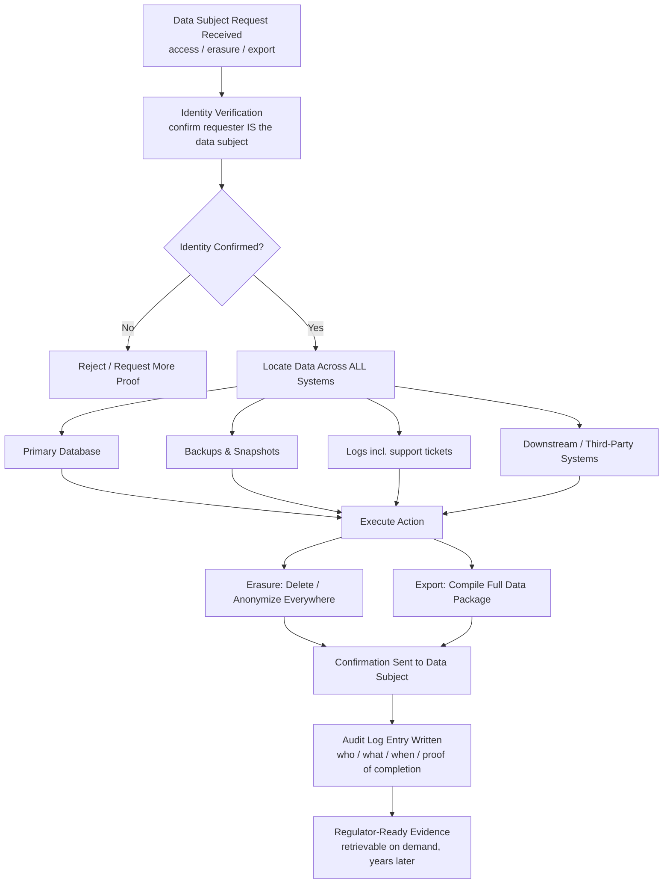

# Part 11: Compliance, Privacy & Localization Testing

> **Study Guide for QA Professionals** — Non-Functional Testing, from first principles
> Difficulty Level: Intermediate to Advanced | Estimated Reading Time: 45 minutes

---

## Table of Contents

1. [Why Compliance Testing Is Its Own Discipline](#111-why-compliance-testing-is-its-own-discipline)
2. [GDPR Testing](#112-gdpr-testing)
3. [HIPAA Testing](#113-hipaa-testing)
4. [PCI-DSS Testing](#114-pci-dss-testing)
5. [Data Privacy Beyond Named Regulations](#115-data-privacy-beyond-named-regulations)
6. [Internationalization vs. Localization](#116-internationalization-vs-localization)
7. [Localization Testing in Practice](#117-localization-testing-in-practice)
8. [Cultural and Legal Localization Beyond Translation](#118-cultural-and-legal-localization-beyond-translation)
9. [📌 Fact Sheet — Part 11 in 60 Seconds](#-fact-sheet--part-11-in-60-seconds)
10. [Common Interview Questions](#common-interview-questions)

---

## 11.1 Why Compliance Testing Is Its Own Discipline

By this point in the course you've tested whether a system resists attackers (Parts
4–5) and whether it keeps working under load and failure (Part 9). Compliance testing
asks a different question entirely, and it's worth being precise about the difference
because it's the single most common confusion new testers bring to this topic.

**Security testing asks "can this be broken into?" Compliance testing asks "does this
satisfy a specific external legal or regulatory requirement — provably, with an audit
trail a regulator or auditor can inspect?"** A system can be genuinely secure — well
encrypted, properly access-controlled, penetration-tested clean — and still fail a
compliance audit, because compliance isn't just "is it safe," it's "can you *prove* it
does the specific things a specific law says it must do, on demand, for a named
individual, at a named point in time." A GDPR right-to-erasure request isn't a security
question. Deleting one user's data on request when the system already has strong access
control is easy from a security standpoint — the hard, compliance-specific part is
proving that deletion actually happened *everywhere the data lived*, and having a
record that proves it, because "we're pretty sure we deleted it" is not a defensible
answer to a data protection regulator.

This distinction has teeth. GDPR fines have run into hundreds of millions of euros for
companies with otherwise solid security postures — the violations were about consent,
retention, and data-subject rights, not about being hacked. A company can pass every
penetration test it runs and still be sanctioned for keeping data six years past its
stated retention policy, or for silently sharing data with a partner outside the scope
a user actually consented to. That's the discipline this Part covers: not "is it
secure," but "does it satisfy the rule, and can we prove it."

Three properties make compliance testing distinct enough to warrant its own Part rather
than folding into Security:

- **It's provable, not just true.** A security control either works or it doesn't. A
  compliance control has to work *and* leave an auditable trail showing it worked —
  timestamps, logs, confirmations a regulator can inspect years later.
- **It's jurisdiction- and domain-specific.** The same platform might need GDPR
  compliance for EU users, HIPAA for US healthcare data, and PCI-DSS for anyone
  touching card numbers — three different rulebooks, sometimes with conflicting
  requirements (GDPR wants minimal retention; some financial regulations mandate
  multi-year retention of the exact same data).
- **The failure mode is legal and reputational, not just technical.** A performance
  bug embarrassing you in production is bad. A compliance failure can mean regulatory
  fines, a forced audit, breach-notification obligations to every affected user, and in
  healthcare specifically, exposure for the organization under statutes with criminal
  as well as civil penalties.

> [!TIP]
> **🎭 Meme Break — Drake Hotline Bling**
>
> ❌ *"We deleted the user's account — the profile page returns a 404 now."*  
> ✅ *"We deleted the user's account from the primary database, the search index, the
> analytics warehouse, the three most recent backup snapshots' eventual purge queue,
> and every downstream partner we'd shared their data with — and we have a signed audit
> log entry proving each step, timestamped, for the regulator who might ask in
> eighteen months."*

🧠 <strong>Quick Check:</strong> A platform passes a full penetration test with zero critical findings. Does that mean it's GDPR compliant?

Not necessarily, and this is the core distinction of this Part. Penetration testing
proves the system resists unauthorized access and common attack techniques — a
security property. GDPR compliance is a different, broader set of questions: does the
system have a lawful basis and explicit consent for every piece of data it holds, does
it honor access and erasure requests within the mandated timeframe, does it retain data
only as long as stated, and can all of that be proven with an audit trail? A perfectly
secure system that never lets a user export or delete their data, or that quietly keeps
data past its stated retention period, is not GDPR compliant — no attacker was
involved, but the law was still broken.

---

## 11.2 GDPR Testing

The EU's General Data Protection Regulation is the reference point most compliance
testing content in this industry is built around — not because it's the only privacy
law that matters (California's CCPA, India's DPDP Act, Brazil's LGPD all matter too),
but because GDPR's rights and obligations are the most complete and widely tested
version of the pattern. Test GDPR properly and you've built the muscle for the rest.

### Right to Access

A data subject can request a copy of every piece of personal data an organization
holds about them. Testing this isn't "does the export button produce a file" — it's
**does the exported file actually contain everything**, including data the user might
not think to ask about: inferred data (a recommendation engine's profile of them),
data held by third-party processors on the company's behalf, and metadata (login
timestamps, IP history, support ticket contents that mention them). A right-to-access
test suite that only checks the fields visible on a "my profile" page is testing the
UI, not the regulation.

### Right to Erasure ("Right to Be Forgotten")

This is the request that separates teams who understand compliance testing from teams
who don't, because the naive implementation — and the naive test — both stop one layer
too shallow.

**The naive test:** submit a deletion request, confirm the user's profile page now
returns "account not found" or a 404. Pass.

**Why that's not enough:** a soft-delete flag that hides a record from the UI is not
erasure. The data is still sitting in the primary database, still present in every
backup snapshot taken before the flag was set, still indexed in a search or analytics
system that may not even subscribe to deletion events, and — critically — potentially
still held by any third party the data was shared with under a now-revoked consent.
"The profile page 404s" proves the *UI* forgot the user. It proves nothing about
whether the *organization* did.

**What a real right-to-erasure test actually verifies:**

1. **Primary datastore** — the record is genuinely removed or irreversibly
   anonymized, not soft-deleted with a flag that still leaves the raw PII queryable.
2. **Logs** — application logs, support-ticket transcripts, and error logs that may
   contain the user's PII in free text (a support agent pasted a customer's card
   number into a ticket six months ago — does erasure reach that ticket?).
3. **Backups** — this is the one most teams skip, and regulators explicitly do not
   accept "it's still in last month's backup" as compliant. The test has to confirm
   there's a documented, working process for the data to be purged from backup
   rotation within the retention window GDPR permits, not just from the live system.
4. **Downstream/third-party systems** — anywhere the data was legitimately shared
   under consent (an analytics vendor, a marketing platform, a partner API) needs a
   corresponding deletion propagated to it — and the test needs to confirm that
   propagation actually fires, not just that an internal flag was set.
5. **Confirmation and audit trail** — the user receives confirmation, and the
   organization has a timestamped, immutable record that the request was received,
   processed, and completed within the regulatory window (30 days under GDPR).

Picture testing this against a consent-based account-aggregation platform — the kind
where a user has linked three bank accounts and granted five different lending apps
scoped, time-bound consent to view slices of that data. A right-to-erasure request here
isn't "delete the user row." It's: revoke every active consent immediately so no
further data can flow to any of those five apps; confirm the already-fetched data each
app received under a *now-deleted* consent doesn't get treated as if it never
happened — the historical fact that data was shared, and under what scope, has to stay
in the audit log even after the personal data itself is erased, because "prove what
happened" and "erase the personal data" are two different, sometimes competing
obligations; and confirm the linked-bank-account tokens are actually revoked at the
bank/FIP side, not just marked inactive in the aggregator's own database. A tester who
only checks "does the account disappear from the dashboard" would sign off on a system
that's still technically able to pull that user's bank data through a token nobody
actually invalidated.

→ Reference: <a href="https://github.com/ghanendra-sdet/yobo" target="_blank" rel="noopener noreferrer">yobo</a>

### Consent Management Testing

GDPR requires consent to be **freely given, specific, informed, and unambiguous** —
and testing consent management means testing all four of those properties, not just
"is there a checkbox."

- **Specific and informed**: does the consent screen state, in plain language, exactly
  what data is being requested, for what purpose, for how long? A consent artifact that
  bundles "we'll use your data to process this loan" with "...and for marketing,
  and shared with our partners" as one unchecked box is not specific consent — it's
  bundled consent, which GDPR explicitly disallows.
- **Freely given**: can the user say no to a non-essential data use and still use the
  core product? If declining marketing consent blocks account creation entirely,
  consent wasn't freely given.
- **Revocable, and revocation actually stops data flow**: this is the single highest-
  value test in consent management, and it deserves a fully narrated example, because
  a real defect in exactly this area is one of the best-documented compliance bugs in
  this account's portfolio of projects.

Consider a consent-governed data-sharing flow: a user links their bank account, a
lending app requests read access to three months of transaction history, the user
approves, and data starts flowing on a scheduled fetch. Now the user changes their
mind mid-session and hits "Revoke" while a data fetch is already in flight. The
naive implementation checks consent validity only at the *start* of a fetch — so a
fetch that began one second before the revoke click sails through to completion and
delivers data to the requesting app, even though by the time it lands, the user has
already revoked permission. That's not a hypothetical: it's the exact shape of a
critical, real defect logged against a consent-based account-aggregation platform,
where the revocation check ran only at fetch initiation instead of continuously
through the fetch's lifecycle — meaning data could be, and was, shared *after* the
user had explicitly said stop. The fix wasn't a UI change; it was moving the
revocation check to run immediately before data hand-off, so revocation could
interrupt an already-in-flight operation, not just block future ones. A tester who
only verifies "clicking Revoke stops *future* fetches" would have missed this
entirely — the test that actually catches it has to inject a revoke action while a
fetch is deliberately held in-flight, and assert the fetch is aborted or its result
discarded, not delivered.

→ Reference: <a href="https://github.com/ghanendra-sdet/yobo" target="_blank" rel="noopener noreferrer">yobo</a>

### Data Minimization Checks

GDPR's data minimization principle says an organization should only collect data it
actually needs for the stated purpose. Testing this is mostly a review-and-verify
exercise rather than a scripted test: for every field collected at signup or during a
flow, is there a documented purpose, and does the system actually use it for that
purpose? A common finding: a registration form collects a date of birth "for age
verification" but the field is never actually checked against any age gate anywhere in
the system — that's data collected without a live purpose, which is itself a
minimization violation worth flagging even though nothing is technically "broken."

🧠 <strong>Quick Check:</strong> A team implements "right to erasure" as: set a <code>deleted = true</code> flag on the user's row, which makes the profile page return 404. QA signs off because the 404 is correct. What did the test miss?

It verified the UI's behavior, not the regulation's requirement. A soft-delete flag
leaves the raw PII fully intact and queryable in the primary database, untouched in
every existing backup, still present in logs and any downstream system the data was
shared with, and — as the account-aggregation example shows — potentially still
usable via tokens or credentials nobody revoked. A correct test has to verify actual
data removal or irreversible anonymization across the primary store, backups, logs,
and third-party systems, plus a timestamped audit record proving it — a 404 on one
page proves none of that.

---

## 11.3 HIPAA Testing

HIPAA (the US Health Insurance Portability and Accountability Act) governs Protected
Health Information — PHI: anything that identifies a patient and relates to their
health condition, treatment, or payment for care. Testing HIPAA compliance centers on
three pillars.

### PHI Handling

The first question for any field or record in a healthcare system is simply: **is this
PHI?** Not just obvious fields like diagnosis codes, but anything that becomes
identifying in combination — a claim amount plus a date of service plus a provider
name can re-identify a patient even without a name field present. Testing PHI handling
means walking every screen, API response, log line, and export in the system and
asking whether PHI is present, and if so, whether it's handled at the standard the
regulation requires (restricted access, encryption, audit logging) rather than the
standard applied to ordinary business data.

A concrete failure mode worth testing for directly: **PHI leaking into a channel
nobody thought to protect.** Error messages that echo back a patient's diagnosis in a
stack trace shown to a support engineer without treatment authorization. A claim ID
in a URL query parameter that ends up in a browser's history or a proxy's access log.
An email notification that includes a service description ("MRI - Lumbar Spine") in
plain text, sent to an address that isn't verified as belonging to the actual patient.
None of these are "the database was hacked" — they're PHI escaping through an
unguarded side door, and they're exactly the class of defect HIPAA-focused testing
exists to catch.

### Access Logging Requirements

HIPAA requires that access to PHI be logged: who viewed what patient's data, when, and
(ideally) why. This isn't optional instrumentation — it's a named requirement, and
testing it means more than confirming a log line gets written. It means confirming the
log captures enough to answer "who looked at this patient's record on this date" months
later during an audit, and that the logging itself can't be bypassed by any access
path in the system.

This is where cross-portal healthcare platforms create a specific, easy-to-miss gap.
Picture a claims platform built around four different portals — one for the healthcare
Provider who delivered care, one for the Payer (the insurer) reviewing the claim, one
for the Employer whose group plan covers the patient, and one for the Member/patient
themselves — all rendering different views of the *same underlying claim*. Access
logging gets implemented carefully for the Member portal (the patient viewing their
own data is the obvious case) and the Provider portal (clinical staff viewing patient
records is the classic HIPAA scenario everyone remembers to instrument). But an
Employer-side administrator, checking on claim status for cost-management reporting
across their group plan, can often see enough claim detail — diagnosis-adjacent claim
categories, provider names, service dates — to constitute PHI access too, and that
access path is exactly the one a team is least likely to have wired into the same
audit-logging pipeline, because "the Employer portal" doesn't intuitively read as "a
place PHI gets viewed" the way a doctor's dashboard does. A HIPAA-aware test plan for a
platform like this has to explicitly enumerate every portal and role as a distinct
access-logging surface, then verify each one independently — asserting that an
Employer admin viewing a claim generates the same class of audit log entry a Provider
viewing that claim would, rather than assuming logging that works on one portal
implies it works on all four. Testing only the "obvious" PHI-access paths and
declaring access logging done is precisely the kind of compliance gap that looks fine
in a demo and fails an actual audit.

→ Reference: <a href="https://github.com/ghanendra-sdet/healthcare-insurance-platform" target="_blank" rel="noopener noreferrer">healthcare-insurance-platform</a>

### Encryption Verification (At Rest and In Transit)

HIPAA doesn't mandate a specific encryption algorithm, but it does require PHI be
protected both at rest (in the database, in backups, in exported files) and in transit
(over the network, including internal service-to-service calls, not just the public-
facing connection). From a testing perspective this is verified, not assumed:

- **In transit**: confirm every endpoint carrying PHI enforces TLS — including internal
  API calls between microservices, which teams sometimes leave on unencrypted internal
  networks under the assumption that "it's internal, it's fine." Test with a proxy or
  packet capture, don't just read the config and trust it.
  external endpoints. Internal traffic between a claims service and a member-data
  service carrying PHI needs the same encryption-in-transit as the customer-facing API.
- **At rest**: confirm the database, file storage, and — again, the commonly missed
  one — backups and exports are encrypted, not just the live table. A CSV export of
  claims data generated for a reporting job is PHI too, and if it lands in an
  unencrypted shared drive "temporarily," that's a real HIPAA exposure regardless of
  intent.

🧠 <strong>Quick Check:</strong> A claims platform has four portals — Provider, Payer, Employer, Member — all viewing the same claim. Access logging is verified and working correctly on the Provider and Member portals. Is that sufficient HIPAA-compliance testing coverage?

No. PHI access logging has to be verified independently on every portal that can
surface PHI, not just the two that intuitively look like "clinical" access points. An
Employer-side admin viewing claim details for group-plan cost reporting is still
viewing PHI, and that access needs to generate the same audit trail a Provider's
access does. Assuming logging that works on one or two portals implies it works
platform-wide is exactly the kind of gap that passes internal review and fails a real
compliance audit — each access surface is a distinct test target.

---

## 11.4 PCI-DSS Testing

PCI-DSS (Payment Card Industry Data Security Standard) governs anyone who stores,
processes, or transmits cardholder data — card numbers (PAN), expiry dates, CVVs, and
cardholder names in that context.

### Cardholder Data Environment (CDE) Scoping

The first and most consequential compliance-testing task on any payment system isn't a
test case at all — it's **scoping**: identifying every system, service, and log store
that touches cardholder data, because that boundary defines what falls under PCI-DSS
audit requirements at all. A common, expensive mistake is scope creep: a debugging
tool, an analytics pipeline, or a customer-support screen-sharing session inadvertently
touches raw card data and pulls a system that was never designed for PCI compliance
into the CDE, multiplying audit scope and cost. Compliance testing here means actively
trying to find every place card data flows to, including places engineering didn't
intend it to — the same "attacker mindset" from Part 4, redirected at finding
unintended data flows rather than unintended access.

### Card Numbers Never Logged in Plaintext

This is the single highest-value, most mechanically testable PCI-DSS check, and it
deserves to be run as an explicit, repeatable test rather than a one-time code review.
The test: submit a payment through every entry point the system exposes (UI, API,
webhook, batch import if one exists), then grep every log store the transaction could
have touched — application logs, error logs, third-party logging/monitoring services,
message queues, even browser console output in dev builds — for the literal card
number used in the test. PCI-DSS requires the PAN be masked wherever it's displayed or
logged (typically showing only the first six and last four digits), and a genuinely
useful regression test asserts this automatically on every build: fail the pipeline if
a 16-digit sequence matching a test card number's pattern shows up anywhere in log
output. This is cheap to automate and catches a defect class that's otherwise
invisible until an auditor — or an attacker with log access — finds it.

### Tokenization Verification

Modern payment architectures avoid storing raw card numbers at all: a payment gateway
exchanges the card number for an opaque token on first use, and every subsequent
reference to "this card" in the merchant's own systems uses that token instead of the
PAN. Testing tokenization means verifying the substitution is complete and has no
leaks:

- After the first card entry, confirm the raw PAN doesn't persist anywhere in the
  merchant's own database — only the token should be stored.
- Confirm the token is scoped correctly (usable only by the merchant/context it was
  issued for — a token leaking across merchant boundaries is its own severe defect).
- Confirm refund and dispute flows, which need to reference "the original card," work
  entirely off the token without ever needing the raw PAN to re-enter the system.

> [!WARNING]
> **🎭 Meme Break — "This Is Fine" Dog**
>
> 🔥 *The payment gateway integration tokenizes card numbers correctly.*
> 🔥 *The debug logging middleware, added by a different team six months later, logs
> the full raw request body on every 500 error — including the plaintext PAN from the
> one request in a thousand that hits an edge case and errors out.*
> 🔥 *This is fine, until the PCI auditor's log-scanning tool finds it in five minutes.*

🧠 <strong>Quick Check:</strong> A team tokenizes card numbers correctly at the payment gateway and confirms the PAN is never stored in their primary database. Have they completed PCI-DSS "no plaintext card data" testing?

Not fully. Tokenization at the gateway and database-level non-storage cover the
primary, intentional data path — but PCI-DSS testing has to also verify the PAN
doesn't leak through unintended side channels: application and error logs, debug
middleware that dumps raw request bodies, third-party monitoring tools, message
queues, or browser console output. A complete test submits real (test) card numbers
through every entry point and then actively searches every log store the transaction
could have touched for the literal number — verifying the database is clean isn't the
same as verifying nowhere in the system is.

---

## 11.5 Data Privacy Beyond Named Regulations

Not every data-handling obligation maps to a specific named law, and testing privacy
properly means going beyond a GDPR/HIPAA/PCI checklist to the underlying principles.

### Data Retention Policies Actually Work

Almost every privacy regulation and most internal data-governance policies state a
retention period — "we keep transaction logs for 7 years, then delete them" or "we
keep marketing consent records for 2 years past last activity." The gap between
*stating* a retention policy and *enforcing* it is enormous, and it's rarely tested
because it requires testing something that happens on a timescale QA cycles don't
naturally cover. Practical approaches: seed test data with backdated timestamps that
simulate records past their retention window, then verify a scheduled purge job
actually removes them (not just flags them); audit a production or staging environment
for records that are demonstrably older than the stated policy and treat any hit as a
defect regardless of how it got there.

### Data Shared With Third Parties Respects Original Consent Scope

This is the test most teams skip because it requires thinking past their own system's
boundary. If a user consents to share transaction data with Lending App A for the
specific purpose of a loan application, and that data later shows up being used by
Lending App A for an unrelated marketing campaign — or worse, gets passed along by App
A to *its* own downstream partner — the original consent scope has been violated, even
though the platform that collected the original consent didn't do anything wrong on
its own systems. Testing this fully requires either contractual/API-level verification
that downstream consumers only use data within the declared purpose (data-use
attestations, scoped API tokens that literally can't be used outside the granted
purpose), or, at minimum, an audit mechanism that can trace *which consent authorized
which specific data flow* — so that if a violation is ever reported, the platform can
prove which downstream party breached the terms rather than facing blanket liability
for something a partner did with data it lawfully received.

---

## 11.6 Internationalization vs. Localization

This is the distinction that trips up almost everyone new to the topic, and getting it
precise matters because the two require genuinely different testing approaches.

**Internationalization (i18n)** is an *engineering* property: building the system so
that it *can* support multiple languages, regions, and formats — externalizing all
user-facing strings instead of hardcoding them, using locale-aware date/currency/number
formatting libraries instead of manual string concatenation, supporting Unicode
throughout instead of assuming ASCII or Latin-1, and designing layouts that don't
assume a fixed text length. i18n is largely an architecture and code-review concern —
you test it by trying to *break* the assumption that the system only ever runs in one
locale.

**Localization (l10n)** is a *content and verification* activity: actually testing the
system *in* a specific locale — is the German translation accurate and correctly
placed, does the date render as DD.MM.YYYY the way German users expect rather than the
US MM/DD/YYYY, does the currency symbol and thousands-separator convention match
regional norms, does a right-to-left layout actually flow right-to-left.

The relationship: **you can't localize a system that wasn't internationalized.** If
date formatting is hardcoded as `MM/DD/YYYY` string concatenation somewhere deep in the
codebase, no amount of translating UI strings will make the German locale correct — the
i18n foundation has to exist first. This is also why i18n bugs are architectural and
expensive to fix late (same 1-10-100 pattern from Part 1), while l10n bugs are usually
content/config fixes once the i18n foundation is sound.

> [!TIP]
> **🎭 Meme Break — Expanding Brain**
>
> 🧠 *Level 1: "We support multiple languages, we translated all the button labels."*  
> 🧠🧠 *Level 2: "We also formatted dates and currency per locale."*  
> 🧠🧠🧠 *Level 3: "We tested German, which is 30% longer than English, and found
> three buttons where the label now wraps onto a second line and clips."*  
> 🧠🧠🧠🧠 *Level 4: We tested Arabic in full RTL layout, confirmed the entire page
> mirrors correctly including icon direction and form-field alignment, not just that
> the text itself reads right-to-left inside an otherwise LTR page.*

🧠 <strong>Quick Check:</strong> A team translates every UI string into French, German, and Japanese and calls the feature "internationalized." Is that accurate terminology?

No — that's localization content, not internationalization. i18n is the underlying
engineering capability (externalized strings, locale-aware formatting, Unicode
support, layout that tolerates variable text length) that makes translation possible
in the first place. Producing translated strings is one *output* you get once i18n
is done correctly — but if the date fields, currency formatting, or layout weren't
built to be locale-aware, having translated button labels sitting on top of hardcoded
`MM/DD/YYYY` dates and US-only currency formatting is a system that's been partially
localized without ever being properly internationalized, and it'll keep producing
locale bugs everywhere the underlying i18n gap wasn't actually addressed.

---

## 11.7 Localization Testing in Practice

### Text Expansion and Contraction

English is often the shortest rendering of a given piece of UI text. German commonly
runs 30%+ longer for the same meaning ("Passwort vergessen?" vs. "Forgot password?"),
Finnish and other agglutinative languages can run even longer, while some Asian
languages (Chinese, Japanese) render more *compactly* in character count but need
different line-height and font handling since CJK glyphs are visually denser. A UI
built and tested only in English routinely ships buttons, labels, and nav items that
look fine in the source language and then truncate, wrap unexpectedly, or overflow
their container the moment they're localized. The practical test technique: **pseudo-
localization** — programmatically wrapping every UI string with padding characters
(e.g., turning "Save" into "[!!! Save !!!]") before a single real translation exists,
specifically to catch layout breakage early, without waiting for translators to
deliver actual German or Finnish copy. This is cheap, fast, and catches the large
majority of expansion-related layout bugs before localization content even exists.

### Date, Time, Currency, and Number Formatting

Every locale has its own conventions, and getting even one wrong produces genuinely
dangerous ambiguity, not just cosmetic wrongness:

| Element | US (en-US) | Germany (de-DE) | India (en-IN) |
|---|---|---|---|
| Date | 07/29/2026 | 29.07.2026 | 29-07-2026 |
| Decimal separator | 1,234.56 | 1.234,56 | 1,23,456.78 (lakh/crore grouping) |
| Currency | $1,234.56 | 1.234,56 € | ₹1,23,456.78 |
| First day of week | Sunday | Monday | Monday |

That date row is worth pausing on: `07/29/2026` is unambiguous in the US format, but a
system that renders dates as `MM/DD/YYYY` regardless of locale will show a French user
"07/29/2026" — which they'll read as day 7, month 29, an invalid date, or worse, will
silently misparse a genuinely ambiguous date like `03/04/2026` as April 3rd when the
user meant March 4th. In a healthcare or financial context, a date-of-birth or
transaction-date misparse from a locale-formatting bug isn't a cosmetic defect, it's a
data-integrity and potentially a compliance defect (an incorrect date of service on a
health claim, for instance). Localization testing has to explicitly test *ambiguous*
dates (days 1–12, where both interpretations are valid dates) rather than only testing
with an unambiguous day like the 29th, which will pass even on a broken implementation.

The Indian number-grouping convention (lakh/crore: `1,23,456.78` rather than the
Western `123,456.78`) is a good non-obvious example for testers used to only Western
locales — it groups the first three digits from the right, then in pairs after that,
which is a genuinely different grouping *algorithm*, not just a different separator
character, and a formatting library configured only for comma-every-three-digits will
render Indian currency values wrong even with the right ₹ symbol attached.

### Right-to-Left (RTL) Language Support

Arabic, Hebrew, and a handful of other languages read right-to-left, and RTL support
is not "flip the text direction" — it's a full layout mirror. Testing RTL properly
covers: overall page flow (navigation, content order mirrors, not just text
alignment), icon direction (a "next" arrow pointing right in LTR should point left in
RTL, or it now means "back"), form field label/input alignment, and — a commonly
missed case — **mixed-direction content**, where an RTL page contains an LTR element
(an English brand name, a numeric ID, an email address) and that element needs to
render correctly embedded in the surrounding RTL flow rather than getting garbled by
naive direction-reversal logic. A checkout flow that mirrors correctly for Arabic
navigation and labels, but renders a transaction ID or card number backwards because a
numeric string got swept up in the same RTL transform as the surrounding text, is a
real and recurring class of RTL bug.

### Character Encoding

Every input field and every rendering surface has to correctly handle Unicode beyond
basic Latin: accented characters (é, ü, ñ), non-Latin scripts (Cyrillic, Devanagari,
Han characters, Arabic script), and emoji — which are Unicode too, and which
surprisingly often break naive character-counting logic (an emoji can consume multiple
UTF-16 code units, so a "255 character max" field built on a naive `string.length`
check can silently truncate mid-emoji, corrupting it into a broken glyph, or reject
valid input that's actually well under the intended limit). Testing character encoding
means deliberately entering non-Latin names, addresses with accented characters, and
emoji into every text field in the system, then verifying the value round-trips
correctly through storage, any export (PDF, CSV, print), and back into the UI without
corruption — a classic and still-common failure is the "mojibake" pattern, where
`café` round-trips as `café` because a system boundary somewhere assumed Latin-1
encoding instead of UTF-8.

🧠 <strong>Quick Check:</strong> A localization test suite verifies dates render correctly for the 25th of every month across five locales. Is that adequate date-formatting test coverage?

No — the 25th is unambiguous in every common date format, so this test would pass
even on a broken implementation. The real risk is with days 1 through 12, where
DD/MM and MM/DD produce two different, both-valid dates for the same input — a date
like the 3rd of April can silently misparse as March 4th if the locale format is
wrong, and nothing about that failure would show up in a test suite that only ever
uses unambiguous days. Good localization test data deliberately targets the
ambiguous range, not the safe range.

---

## 11.8 Cultural and Legal Localization Beyond Translation

Localization done well goes past language and formatting into meaning and law.

### Color and Symbol Meaning

Colors and symbols carry different — sometimes opposite — meaning across cultures.
Red signals danger or a negative value (a stock down, an error) in most Western
contexts, but is associated with luck and celebration in Chinese culture; a checkmark
reads as "correct/approved" broadly, but iconography around religious symbols,
specific hand gestures, or even certain animals can be considered inappropriate or
offensive in some markets and need review by someone with actual cultural context, not
guessed at by an engineering team translating strings. This isn't usually a scripted
"test case" — it's a review step that belongs in the localization QA process
explicitly, ideally with a native reviewer for each target market, not assumed away
because "the strings are translated."

### Region-Specific Legal Requirements

Localization isn't only about language — it's also about which legal requirements
apply in which region, and a global product needs to test that the *right* legal
behavior appears in the *right* region rather than either a one-size-fits-all
approach or, worse, defaulting to the least protective option everywhere.

The clearest example: **cookie consent banners are a legal requirement in the EU**
(and increasingly other jurisdictions) under ePrivacy/GDPR rules, but are not
universally required — showing an EU-style consent banner to every user everywhere is
over-compliance that hurts UX for no legal benefit, while *not* showing one to an
EU-located user is a genuine compliance gap. Testing this means verifying
geolocation-based (or otherwise correctly determined) display logic actually gates the
banner correctly — test explicitly with EU-region test accounts/IPs and non-EU ones,
and confirm the banner's actual behavior (does declining non-essential cookies
actually stop those cookies from being set, or is the banner cosmetic) matches the
legal requirement, not just that a banner exists somewhere in the codebase. Other
region-specific legal localization to test for: some countries mandate specific
data-residency (certain financial or health data must stay stored within national
borders — a global cloud deployment that transparently routes data cross-border for
performance reasons can silently violate this), and some regions have specific
mandatory disclosures (interest rate disclosure formats in lending products, for
instance) that differ by jurisdiction even when the underlying product is identical.

> [!CAUTION]
> **🎭 Meme Break — "Is This a Pigeon"**
>
> 🦋 *A localization test suite that translated all the strings and checked the dates
> render in DD/MM/YYYY format.*  
> 🧑 *The QA engineer, pointing:* **"Is this full localization testing coverage?"**  
> *(It is not RTL-tested, not pseudo-localization-tested for text overflow, not
> tested for ambiguous-date parsing, and never had a native reviewer check the color
> and iconography choices for the target market.)*

---

## 📌 Fact Sheet — Part 11 in 60 Seconds

- **Compliance testing asks "does this provably satisfy a specific external
  legal/regulatory requirement, with an audit trail" — a distinct question from
  security's "can this be broken into" or functional testing's "does it work."**
- **GDPR right to erasure** is not "the profile page 404s." A real test verifies
  deletion across the primary database, backups, logs, and every downstream/third-
  party system the data was shared with — plus a timestamped audit record proving it.
- **Consent must be revocable, and revocation must stop data flow immediately** —
  including data fetches already *in flight* when revocation happens, not just future
  fetches. A revocation check that only runs at fetch-initiation, not continuously
  through the fetch lifecycle, can let data ship after a user has explicitly said stop.
- **HIPAA access logging** has to be tested independently on every portal/role that can
  surface PHI — a multi-portal healthcare platform with logging verified on the
  clinical-facing portals can still have a completely uninstrumented PHI-access gap on
  an administrative-facing portal nobody thought to check.
- **PCI-DSS "no plaintext card data"** is best tested as an automated regression: submit
  real test-card numbers through every entry point, then grep every log store the
  transaction could touch for the literal number — database non-storage alone doesn't
  prove logs, debug middleware, and monitoring tools are clean too.
- **Data retention policies need to be tested as enforcement, not just documentation** —
  seed backdated test data and verify the purge job actually deletes it, don't just
  trust the stated policy.
- **i18n (internationalization) is an engineering capability; l10n (localization) is
  content and verification in a specific locale.** You can't localize a system that
  wasn't internationalized — hardcoded date formats and non-Unicode-safe fields will
  keep breaking regardless of how good the translations are.
- **Pseudo-localization** (padding strings before real translations exist) catches most
  text-expansion layout bugs early and cheaply — German commonly runs 30%+ longer than
  English for equivalent meaning.
- **Test ambiguous dates (days 1–12), not just unambiguous ones (the 25th)** — that's
  the range where DD/MM vs. MM/DD format bugs actually produce a different, wrong,
  valid-looking date instead of an obvious error.
- **RTL testing means full layout mirroring** — navigation order, icon direction, and
  correctly embedded LTR content (IDs, emails, numbers) inside RTL flow — not just
  flipping text alignment.
- **Cookie consent banners are an EU-driven legal requirement, not a universal one** —
  localization testing has to verify the banner (and its actual blocking behavior, not
  just its presence) is correctly gated by region.
- Cultural review (color meaning, iconography, symbols) belongs in localization QA as
  an explicit step with native-market reviewers — it's not something a translated
  string set can self-verify.

---

## Common Interview Questions

### Question 1: How is compliance testing different from security testing?

**Model Answer:**

"Security testing asks whether the system resists unauthorized access and attack —
penetration testing, authentication/authorization checks, vulnerability scanning.
Compliance testing asks a narrower but differently-shaped question: does the system
provably satisfy a specific external legal or regulatory requirement, with an audit
trail that holds up months or years later? A system can pass every security test and
still fail a compliance audit — for example, if it doesn't honor a GDPR erasure
request across backups and third-party systems, or doesn't log PHI access on every
portal HIPAA requires. The two disciplines overlap in places, especially around access
control and audit logging, but compliance testing is fundamentally about proving
adherence to a specific rulebook, not just about resisting attackers."

### Question 2: Walk me through how you'd test a GDPR "right to be forgotten" request end to end.

**Model Answer:**

"I wouldn't stop at confirming the UI shows the account as deleted. I'd verify the
record is actually removed or irreversibly anonymized in the primary database, not
just flagged; I'd check that logs and support-ticket transcripts that might contain
that user's PII in free text are covered by the process; I'd confirm there's a
documented, working mechanism for the data to age out of backup rotation within the
regulatory window, since 'it's still in an old backup' isn't compliant; and, if the
platform shared that user's data with any third party under consent, I'd confirm a
corresponding deletion request actually propagates downstream rather than stopping at
the platform's own boundary. Finally, I'd confirm the whole request generates a
timestamped audit log entry, because compliance testing isn't just about the deletion
happening — it's about being able to prove it happened, on demand, later."

### Question 3: What's the difference between internationalization and localization testing, and why does the order matter?

**Model Answer:**

"Internationalization is the engineering foundation — externalized strings, Unicode
support throughout, locale-aware date/currency/number formatting, layouts that
tolerate variable text length. Localization is testing the system in an actual target
locale — correct translations, correct date and currency formatting, correct RTL
layout where applicable, culturally appropriate color and iconography choices. The
order matters because localization testing assumes the i18n foundation is already
sound — if dates are hardcoded as MM/DD/YYYY string concatenation somewhere in the
codebase, no amount of translated button labels will make the German or French locale
actually correct. I'd always verify i18n architecture first — ideally with pseudo-
localization to catch layout and encoding issues before real translations even
exist — before treating locale-specific content testing as the finish line."
