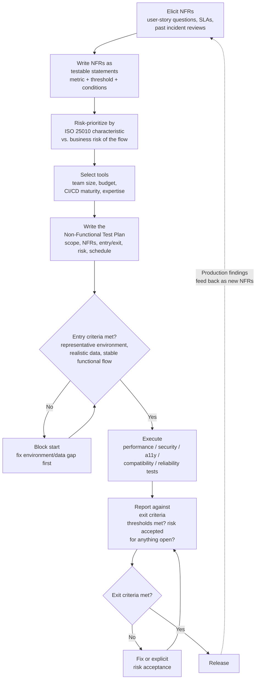

# Part 12: NFT Test Planning & Strategy

> **Study Guide for QA Professionals** — Turning Parts 1–11 into a Plan You Can Actually Execute
> Difficulty Level: Advanced | Estimated Reading Time: 50 minutes

---

## Table of Contents

1. [Why This Part Exists](#121-why-this-part-exists)
2. [Gathering Non-Functional Requirements](#122-gathering-non-functional-requirements)
3. [Writing Testable NFRs](#123-writing-testable-nfrs)
4. [A Tool-Selection Matrix](#124-a-tool-selection-matrix)
5. [Risk-Based NFT Prioritization](#125-risk-based-nft-prioritization)
6. [Writing an Actual Non-Functional Test Plan](#126-writing-an-actual-non-functional-test-plan)
7. [Entry & Exit Criteria for NFT](#127-entry--exit-criteria-for-nft)
8. [The Planning Process, End to End](#128-the-planning-process-end-to-end)
9. [📌 Fact Sheet — Part 12 in 60 Seconds](#-fact-sheet--part-12-in-60-seconds)
10. [Common Interview Questions](#common-interview-questions)

---

## 12.1 Why This Part Exists

Parts 2 through 11 gave you the depth: how to run a load test, how to think like an
attacker, how to test with a screen reader, how to prove a system survives a supplier
timeout. What none of those parts answered is the question every QA lead actually gets
asked two weeks before a release: **"Given everything you know how to do, what are we
actually doing this release, with what tools, by when, and how will we know we're
done?"**

That's not a testing-technique question. It's a planning question, and it's a
completely different skill. A QA engineer who can run a flawless k6 load test but can't
answer "why are we spending three days on this instead of security testing" hasn't
finished the job — they've built a hammer without deciding what needs hammering.

This part is deliberately different in shape from Parts 2–11. There's no new testing
technique here. Instead it's about **process**: how NFRs get discovered instead of
handed to you, how to decide what gets deep coverage versus a light pass, how to pick
tools without a vendor brochure doing the thinking for you, and how to write a test plan
a stakeholder will actually read and sign off on — with a worked, narrated example, not
a blank template.

> [!TIP]
> **🎭 Meme Break — Expanding Brain**
>
> 🧠 *Level 1: "I ran a load test, ship it."*  
> 🧠🧠 *Level 2: "I ran a load test AND a security scan, ship it."*  
> 🧠🧠🧠 *Level 3: "I have a checklist of every NFT category from Parts 2–11."*  
> 🧠🧠🧠🧠 *Level 4: I decided, on purpose, which categories get deep coverage this
> release and which get a light pass — and I can defend that decision to a
> stakeholder in one sentence.*

---

## 12.2 Gathering Non-Functional Requirements

Here's the uncomfortable truth Part 1 already hinted at: **almost nobody hands QA a
document that says "the P95 response time must be under 500ms."** Functional
requirements arrive in user stories, acceptance criteria, Figma files. Non-functional
requirements mostly arrive as *silence* — an assumption everyone is making but nobody
wrote down, right up until the system fails to meet it in production.

Gathering NFRs is therefore an active job, not a passive one. Three techniques that
actually work on real projects:

### Technique 1 — Interrogate every user story at requirements time

For every functional user story, ask the same four questions before design even starts:

- **"How many?"** — how many records, how many concurrent sessions, how many rows in
  the report, how many items in the list. (Volume/Scalability)
- **"How fast?"** — what response time makes this feel broken to the person using it.
  (Performance)
- **"How many at once?"** — is this one user's problem, or does it need to survive 500
  people doing it in the same three-minute window. (Load/Concurrency)
- **"Who's allowed to see this?"** — every field, every screen, every export. (Security
  / Access Control)

A story that says "merchants can view their transaction history" looks functionally
complete on its own. Run it through those four questions and it splits into a real
requirement set: *how many* transactions could one merchant have (thousands, so the
query needs to be efficient, not a full table scan), *how fast* does the list need to
render (under 2 seconds or it reads as broken), *how many* merchants might query it in
the same minute (post-settlement-run mornings are a predictable spike), and *who* is
allowed to see it (only that merchant's own authorized users — a permission boundary
that, if it slips, is a data breach, not a UI bug). None of that was in the original
sentence. All of it is a real requirement the system has to meet regardless.

### Technique 2 — Mine SLAs and compliance obligations

Contracts, SLAs, and regulatory obligations are a goldmine of NFRs that already exist in
writing — they just live outside the backlog. A merchant SLA that promises "99.9%
platform availability" is a Reliability NFR. A data-residency clause in a compliance
agreement is a Portability/Flexibility NFR. A "settlement reports must reconcile to the
bank statement to the paisa" clause is as much a testable non-functional accuracy
requirement as it is a functional one. If your organization has signed anything with a
number or a guarantee in it, that document already contains NFRs — go read it before
inventing requirements from scratch.

### Technique 3 — Review past incidents for recurring gaps

Every production incident is a free NFR, already validated by the worst possible
teacher. If a past incident review shows the database connection pool saturating under
sustained load before the application logic became the bottleneck, that's not a
one-time postmortem footnote — it's a standing NFR ("the system must not exhaust its
connection pool below N concurrent transactions") that belongs in every future load
test's pass/fail criteria. Teams that treat incident reviews as one-off fire drills
instead of a recurring source of NFRs end up re-discovering the same ceiling every
eighteen months.

> [!WARNING]
> **🎭 Meme Break — "This Is Fine" Dog**
>
> 🔥 *PM: "The requirements doc doesn't mention performance, so I guess there's no
> performance requirement."*  
> 🔥 *The requirements doc also doesn't mention "the app shouldn't crash," and yet.*  
> 🔥 *This is fine.*

🧠 <strong>Quick Check:</strong> A user story says "Admins can export the audit log." Using the four-question technique, name one NFR hiding in that sentence beyond "the export works."

Several are hiding there. "How many?" — an audit log on a live platform could run into
millions of rows; the export must not time out or crash the browser at real scale
(Performance/Volume). "Who's allowed to see this?" — audit logs often contain
sensitive account and access data, so the export must be restricted to authorized admin
roles only, and the export action itself should probably be logged (Security). "How
fast?" — a multi-million-row export needs an asynchronous/background generation pattern
rather than a synchronous request, or it will simply fail (Performance/Reliability). None
of these were written in the story; all of them are real requirements once you ask.

---

## 12.3 Writing Testable NFRs

An NFR you can't fail is not a requirement — it's a wish. "The system should be fast"
gives QA nothing to test against: fast compared to what, measured how, under what
conditions? A testable NFR names a **metric, a threshold, and the conditions under
which the threshold applies.**

| Category | Vague (not testable) | Testable |
|---|---|---|
| Performance | "The dashboard should load quickly." | "The merchant dashboard renders summary tiles within 2 seconds at P95, for merchants with up to 50,000 transactions, at 200 concurrent logged-in users." |
| Performance | "The system should handle high traffic." | "The collection API sustains 45 TPS with an error rate below 0.1% and P99 latency under 1 second, for a 3-hour sustained load test." |
| Security | "The system should be secure." | "No OWASP Top 10 category A01–A10 finding rated Medium or above may be open at release; authentication endpoints must reject brute-force attempts after 5 failed tries within 60 seconds." |
| Security | "Only authorized users can access sensitive data." | "A merchant's transaction and settlement data is retrievable only by that merchant's own authenticated, authorized users — verified by attempting cross-merchant access with a valid session token for a different merchant and expecting a 403, not a 200 with someone else's data." |
| Accessibility | "The app should be accessible." | "All primary user flows (login, collection initiation, settlement view) meet WCAG 2.1 AA, verified by an automated axe/Lighthouse scan with zero Critical/Serious violations plus a manual keyboard-only and screen-reader walkthrough of each flow." |
| Reliability | "The system should be reliable." | "The platform maintains 99.9% uptime measured monthly; a single downstream banking API outage must degrade gracefully (queued retry, clear pending status) rather than causing a false SUCCESS or FAILED status on affected transactions." |

Notice the pattern in every "testable" column: a **number or a binary pass/fail
condition**, a **measurement method**, and a **stated context** (how many users, which
flows, which threat model). Strip any one of those three out and the requirement drifts
back toward unfalsifiable. "P95 under 500ms" without "at how many concurrent users" is
still not fully testable — 500ms at 10 users and 500ms at 10,000 users are different
engineering problems, and the requirement needs to say which one it's promising.

> [!TIP]
> **🎭 Meme Break — Drake Hotline Bling**
>
> ❌ *"The report export should work well for large datasets."*  
> ✅ *"The report export completes in under 30 seconds for a merchant with 100,000
> transactions in the selected date range, and the exported CSV/PDF totals match the
> on-screen dashboard totals to the paisa."*

🧠 <strong>Quick Check:</strong> Rewrite this NFR to be testable: "The settlement report should be accurate."

"Accurate" needs a metric and a verification method. A testable version: "The
settlement report's total settled amount equals the sum of all SUCCESS-status
transactions in the selected period, minus the commercial fee and GST, correct to the
paisa — verified by an automated check comparing the report output against the ledger
service for every regression run." That's now something a test can actually pass or
fail, instead of a feeling.

---

## 12.4 A Tool-Selection Matrix

Parts 2–11 covered the tools in depth: k6, JMeter, Gatling, and Locust for performance;
Burp Suite and OWASP ZAP for security; axe DevTools and Lighthouse for accessibility;
BrowserStack and Playwright for compatibility. What none of those parts answered is:
**which one do you actually pick, for this team, on this project, this quarter?**

"Which tool is best" is the wrong question — it has no stable answer, because the best
tool depends entirely on constraints that have nothing to do with the tool's feature
list. The right question is a small set of team-shaped factors:

| Factor | What it changes |
|---|---|
| **Team size** | A one-person QA function cannot maintain a JMeter GUI test plan alongside manual regression — it needs something scriptable and low-maintenance (k6). A dedicated performance engineering team can justify JMeter or Gatling's steeper learning curve for its richer protocol support and reporting. |
| **Budget** | Burp Suite Professional and BrowserStack are paid; OWASP ZAP and Playwright's built-in browser matrix are free. A budget-constrained team doesn't get a worse tool by default — ZAP covers OWASP Top 10 fundamentals well — but it does mean deep, automated crawl-based pentesting features stay out of reach without the paid tier. |
| **CI/CD maturity** | If nothing runs in a pipeline yet, a GUI-first tool (JMeter, BrowserStack manual sessions) is fine as a starting point. If the team already has GitHub Actions/Jenkins wired up for functional Playwright tests, a code-first tool (k6, ZAP's CLI/baseline scan, axe-core as an npm dependency) slots into the exact same pipeline with far less new tooling to maintain. |
| **In-house expertise** | A team already writing TypeScript/JavaScript for functional Playwright tests picks up k6 (JS-based scripting) and axe-core (JS library) far faster than a team with zero JS depth would pick up Gatling's Scala DSL. Existing skill is a real, first-class input — not a tie-breaker after "best tool," but often the deciding factor. |

### A worked decision, not an abstract one

Take a five-person QA team, already automating in Playwright/TypeScript, on a
CI/CD-mature project (GitHub Actions running on every merge), with a moderate budget
and no dedicated security specialist. Running the matrix:

- **Performance:** k6 — JavaScript-based, so the same engineers who write Playwright
  specs can write load scripts without learning a new language; scriptable and CLI-first,
  so it drops straight into the existing GitHub Actions pipeline; no GUI test plan file
  to maintain and merge-conflict over, unlike JMeter's XML.
- **Security:** OWASP ZAP — free, has a baseline scan mode that runs unattended in CI,
  and covers OWASP Top 10 fundamentals without needing a dedicated pentester on staff;
  Burp Suite stays on the wishlist for the day the team can justify a specialist role
  or an external pentest engagement.
- **Accessibility:** axe-core as an npm dependency inside the existing Playwright
  suite — same language, same pipeline, zero new infrastructure — with Lighthouse run
  separately for the performance/SEO/best-practices scores it adds on top, plus manual
  keyboard and screen-reader passes on the highest-traffic flows (Part 7 was explicit:
  automated tools catch roughly 30–40% of WCAG violations, so neither tool is a
  substitute for the manual pass).
- **Compatibility:** Playwright's own built-in browser matrix (Chromium, Firefox,
  WebKit) for the CI-run cross-browser suite, with BrowserStack reserved for the small
  set of real-device checks (specific Android/iOS versions) Playwright's emulation
  can't fully replace — not the whole compatibility suite, because BrowserStack's
  per-seat cost doesn't scale to "run on every commit."

That's a tool-selection decision grounded in the team's actual shape, not a feature
comparison table read in isolation.

> [!TIP]
> **🎭 Meme Break — Distracted Boyfriend**
>
> 🚶 *QA lead, walking with:* **"The tool with the most features on its marketing
> page"**  
> 👀 *Looking back at:* **"The tool my team can actually script, budget, and run in
> the CI pipeline we already have"**

🧠 <strong>Quick Check:</strong> A two-person QA team with no dedicated performance engineer, already writing Playwright/TypeScript, needs to add load testing. Why is k6 usually the better starting recommendation over JMeter here, independent of raw feature comparisons?

Because the deciding factors are team size and existing expertise, not feature depth.
k6 scripts in JavaScript, so the same two engineers already writing Playwright specs
can write load tests with minimal new syntax to learn, and its CLI-first design fits a
small team without dedicated capacity to maintain a separate GUI test-plan file (which
is exactly the kind of asset that rots when only one person understands it and they
leave). JMeter isn't a worse tool — for a team with an existing JMeter specialist and a
need for its more mature protocol/plugin ecosystem, it would be the right call instead.

---

## 12.5 Risk-Based NFT Prioritization

Running every NFT category from Parts 2–11 exhaustively on every release isn't
realistic on any real project — the schedule doesn't allow it, and most releases don't
need it. The skill that actually matters is deciding, deliberately, **what gets deep
coverage and what gets a light pass**, and being able to justify that decision instead
of defaulting to "whatever we had time for."

The framework: cross the **ISO 25010 characteristic** against the **business risk of
the specific feature or flow being released**, not the product as a whole. A single
platform can and should have different NFT depth on different modules within the same
release.

| ISO 25010 characteristic | Payment/money-moving flow | Internal admin/reporting tool |
|---|---|---|
| Performance Efficiency | Deep — full load test against production-representative volume every release | Light — smoke-level check; a slow internal report is an annoyance, not an incident |
| Security | Deep — every release; OWASP Top 10 + auth/authorization boundary checks are non-negotiable | Moderate — access control still matters (internal tools leak data too) but the attack surface and blast radius are smaller |
| Reliability | Deep — failure/retry/idempotency behavior tested explicitly; a duplicate payment is a financial incident | Light — a crashed internal dashboard is inconvenient, rarely urgent |
| Interaction Capability (Usability/Accessibility) | Moderate to deep depending on customer-facing exposure — a customer-facing checkout needs real accessibility coverage; an ops-only screen needs less | Light — internal users get trained; external customers don't |
| Compatibility | Deep if customer devices are unknown and varied; light if the audience is a controlled set of company laptops | Light — usually a small, known set of browsers/devices |

### A real, narrated example: "financial correctness first" in a merchant collection engine

Picture a merchant payment collection platform — the kind of system that takes a
customer's UPI, QR, virtual-account, or payment-link payment, then has to prove exactly
where that money went. The regression flow runs through Login, Dashboard, Collection,
Transaction Search, Transaction Details, Settlement, and Reports — seven screens, and
on paper every one of them looks like it deserves equal NFT attention.

It doesn't. The QA strategy on this kind of platform deliberately prioritizes
**financial correctness first** — commercial (fee) calculation accuracy, GST rounding,
ledger consistency, and settlement reconciliation — ahead of purely cosmetic UI issues,
and that same risk ordering carries straight into non-functional planning. A settlement
figure that's off by one paisa because of a rounding defect isn't a cosmetic bug; run at
real volume, it's a reconciliation break against the actual bank statement, and
production-scale performance testing exists specifically to catch the conditions under
which that kind of drift shows up (a settlement calculation service and a ledger
service that agree at 10 transactions a minute but silently disagree at 45 TPS under
sustained load, because a batching or async-write edge case only appears at volume).
Security testing on this same platform is treated with equal seriousness for a related
reason: transaction search and transaction detail screens expose exactly the kind of
data — amounts, bank references, customer identifiers — that turns a broken permission
boundary into a real breach, not an inconvenience. Meanwhile, something like the visual
alignment of a status badge on the dashboard gets a normal functional regression pass,
not a dedicated non-functional test cycle — it's real, but it isn't where the financial
or security risk lives.

Under sustained load testing on this same kind of platform, a common and genuinely
useful finding is that the database connection pool saturates *before* application
logic becomes the bottleneck — not a code defect, but a capacity-planning signal worth
raising with engineering long before a real merchant volume spike finds it first. That's
risk-based prioritization paying for itself: the load test wasn't run because "we always
load test," it was run because the financial-correctness risk assessment flagged
settlement and transaction throughput as the two things that could not be allowed to
silently drift at scale.

→ Reference: <a href="https://github.com/ghanendra-sdet/fintech-collection-engine" target="_blank" rel="noopener noreferrer">fintech-collection-engine</a>

### A real, narrated example: NFT priorities differ by domain, not just by feature

The same planning question — "what gets deep NFT coverage this release?" — produces a
genuinely different answer depending on the domain, even holding team size and tooling
constant. Across a portfolio spanning fintech, healthcare, travel, and HR/edtech
products, the risk-weighted answer moves around the ISO 25010 wheel:

On a **payout engine** — the platform that actually sends money out to beneficiaries via
IMPS/NEFT/RTGS, in bulk, with retry logic — Reliability and Security dominate the
priority list in a way Performance alone doesn't capture. The single highest-risk
non-functional scenario isn't "is it fast," it's "does a retried request after a network
timeout create a *second* payout instead of confirming the first" — an idempotency
failure. Picture a bulk payout batch that times out mid-request against a bank's API; a
naive retry resends the whole beneficiary transfer, and now two payments have gone out
for one intended disbursement. That's not a performance defect and it's not quite a
pure security defect either — it's a Reliability requirement (idempotent retries) with
security-adjacent consequences (unauthorized/duplicate fund movement), and it gets
tested with the same seriousness as encryption-at-rest on that same platform, because
the cost of getting it wrong is identical: money leaves the building that shouldn't
have.

On a **healthcare insurance platform**, the highest non-functional priority shifts again
— toward Reliability expressed as *cross-portal consistency* rather than raw throughput.
The same insurance claim is viewed through four different portals (Provider, Payer,
Employer, Member), and the non-functional risk that matters most is a claim showing
"Approved" in the Payer portal while still showing "Pending Review" in the Member
portal — a data-consistency failure that, in a regulated healthcare context, isn't just
a UX papercut, it's a compliance and trust problem. Performance testing still happens,
but it's not the release-blocking category the way it is for a payment collection engine
under flash-sale-style load; Reliability and Compliance/Privacy (HIPAA-adjacent data
handling, since these are health claims) are where the deep coverage goes instead.

On a **travel marketplace platform**, Reliability shows up as a different failure mode
again: third-party supplier timeouts. A price comparison engine pulling live
availability from multiple airline and hotel booking APIs has to decide what happens
when one supplier is slow or down — does the whole search fail, or does it degrade
gracefully and show results from the suppliers that responded. That's a graceful-
degradation NFT scenario, and it's paired with Compatibility as the other deep-coverage
characteristic, because a booking flow's customer base spans an unpredictable range of
devices and browsers in a way an internal enterprise tool never does.

On an **HRMS platform's Employee Self-Service module**, the highest non-functional
priority is neither raw performance nor supplier reliability — it's fine-grained
**Security expressed as field-level access control**: which personal fields an employee
can edit themselves (contact details, emergency contacts) versus which stay locked to
HR-managed changes only (salary, employment status, tax details). A permission bug here
doesn't crash anything or move any money; it lets an employee silently edit a field they
were never supposed to touch, which is a quieter but real integrity failure — the kind
of NFT risk a pure load test would never catch, because nothing about it is slow.

The pattern across all four: **the ISO 25010 characteristic that deserves deep coverage
is a function of what actually goes wrong in that domain when nobody's watching** — not
a fixed checklist applied identically everywhere.

→ Reference: <a href="https://github.com/ghanendra-sdet/project-central" target="_blank" rel="noopener noreferrer">project-central</a>

> [!CAUTION]
> **🎭 Meme Break — Galaxy Brain**
>
> 🌌 *Small brain: "Run every NFT category on every release, same depth, every time."*  
> 🌌🌌 *Glowing brain: "We don't have time for that, so we just skip whatever we
> ran out of hours for."*  
> 🌌🌌🌌 *Galaxy brain: map ISO 25010 characteristics against this specific
> release's business risk, on purpose, in writing — so what gets skipped is a decision,
> not an accident.*

🧠 <strong>Quick Check:</strong> Why does a payment collection engine's regression strategy deliberately rank commercial/GST/ledger accuracy above cosmetic UI polish, and how does that ordering carry into non-functional test planning specifically?

Because the business risk isn't symmetric — a misaligned status badge is a papercut,
while a rounding or reconciliation defect in commercials, GST, or the ledger is a
financial-correctness failure that can mean a merchant is paid the wrong amount or a
settlement report doesn't match the bank statement. That same risk ordering carries
directly into NFT planning: settlement and transaction-throughput performance testing,
and permission-boundary security testing around transaction/settlement data, get deep,
every-release coverage, while purely cosmetic screens get a normal functional pass
instead of a dedicated non-functional test cycle.

---

## 12.6 Writing an Actual Non-Functional Test Plan

A Non-Functional Test Plan is the document that turns everything above — elicited
NFRs, risk-based scope, chosen tools — into something a stakeholder can read, question,
and sign off on before the schedule gets locked. Below is a real template with every
section filled in as a worked example, not left blank, based on the kind of payment
collection release described in the previous section.

### Section 1 — Scope

> This test plan covers non-functional validation for the Q3 Collection Engine release,
> specifically the new Payment Link collection type and its integration with existing
> Settlement and Reporting flows. In scope: Performance (load/throughput on the
> Collection and Settlement APIs), Security (authentication, authorization, and OWASP
> Top 10 fundamentals on all new endpoints), Reliability (retry/idempotency behavior for
> Payment Link generation and payment confirmation). Out of scope this release:
> Accessibility (no UI changes to existing screens), Compatibility (no new
> device/browser support claims), full penetration testing (scheduled as a separate
> quarterly engagement with an external specialist, not part of this release cycle).

### Section 2 — NFRs Being Validated

| ID | NFR | Characteristic |
|---|---|---|
| NFR-01 | Payment Link generation API responds within 800ms at P95 under 100 concurrent requests | Performance |
| NFR-02 | Collection + Settlement pipeline sustains 45 TPS with error rate under 0.1% over a 3-hour soak | Performance / Reliability |
| NFR-03 | A paid Payment Link cannot be paid a second time — verified by attempting reuse within 1 second of the original success | Reliability |
| NFR-04 | No OWASP Top 10 finding rated Medium or above on new Payment Link endpoints | Security |
| NFR-05 | A Payment Link's amount cannot be tampered with client-side before payment confirmation | Security |

### Section 3 — Tools & Environment

> Performance: k6, scripted against the staging environment provisioned at 80% of
> production database and compute sizing (see Entry Criteria below — this is a hard
> gate, not a nice-to-have). Security: OWASP ZAP baseline scan in CI on every merge to
> the feature branch, plus a manual authenticated walkthrough of authorization
> boundaries. Reliability: custom Playwright-based test harness simulating duplicate/
> retried requests against the Payment Link confirmation endpoint.

### Section 4 — Entry Criteria

- Staging environment is provisioned at a scale representative of production (see
  §12.7) — not a shared, under-sized dev environment.
- Functional testing of the Payment Link flow has reached at least Sanity-pass status;
  non-functional testing does not start against a build where the happy path itself is
  broken.
- Test data (dummy merchants, dummy VPAs, seeded transaction history at realistic
  volume) is available and refreshed, not hand-typed one row at a time.

### Section 5 — Exit Criteria

- All five NFRs in Section 2 pass against their stated thresholds.
- Zero open Critical or High severity non-functional defects.
- Any Medium-severity finding has an explicit, stakeholder-signed-off risk acceptance
  if it isn't fixed before release — silence is not acceptance.
- The load test's connection-pool and resource-utilization graphs have been reviewed
  with engineering, not just filed.

### Section 6 — Risk Assessment

| Risk | Likelihood | Impact | Mitigation |
|---|---|---|---|
| Staging DB sized smaller than production skews load-test results optimistically | Medium | High | Provision staging at 80%+ of production scale before testing begins; treat any smaller environment's results as directional only, not a pass/fail gate |
| New Payment Link retry logic introduces a duplicate-payment path under network failure | Medium | Critical | Dedicated reliability test harness (NFR-03) specifically targeting rapid-retry and duplicate-submission scenarios |
| OWASP scan produces false positives that consume triage time | High | Low | Baseline scan first (fast, low false-positive rate), full active scan only on flagged endpoints |

### Section 7 — Schedule

| Activity | Duration | Owner |
|---|---|---|
| NFR elicitation & sign-off | 2 days | QA Lead + Product |
| Tool/script setup (k6 scripts, ZAP baseline config) | 2 days | QA Engineer |
| Load & soak testing | 1 day execution + 1 day analysis | QA Engineer |
| Security scan + manual authorization walkthrough | 2 days | QA Engineer |
| Reliability/idempotency test harness | 1 day | QA Engineer |
| Report-out & exit criteria review | 1 day | QA Lead + Engineering |

### Section 8 — Roles & Responsibilities

| Role | Responsibility |
|---|---|
| QA Lead | Owns the test plan, facilitates NFR elicitation, chairs the exit-criteria review |
| QA Engineer | Scripts and executes load/security/reliability tests, files and triages defects |
| Engineering | Reviews resource-utilization findings, fixes Critical/High defects, participates in risk acceptance decisions |
| Product | Signs off on scope and any accepted Medium-risk findings |

> [!TIP]
> **🎭 Meme Break — "Is This a Pigeon"**
>
> 🦋 *A one-line Slack message: "load test looks fine btw"*  
> 🧑 *Stakeholder trying to sign off a release on it:* **"Is this a Non-Functional
> Test Plan?"**

🧠 <strong>Quick Check:</strong> Section 4 (Entry Criteria) blocks non-functional testing from starting until staging is provisioned at production-representative scale. Why is that specifically an NFT entry criterion, and not something functional testing needs to worry about equally?

Because functional correctness ("does clicking Pay charge the right amount") doesn't
depend on environment scale — it's true or false on a tiny staging box exactly as it
would be in production. Non-functional results, especially performance and reliability
findings, are only meaningful relative to the environment they were measured in. A load
test against an undersized staging database will show optimistic throughput numbers
that don't transfer to production — so starting NFT before the environment is
representative doesn't just waste time, it produces a false sense of confidence that's
arguably worse than not testing at all.

---

## 12.7 Entry & Exit Criteria for NFT

Functional test plans usually treat entry/exit criteria as a formality — "code is
deployed to test environment" and "all planned test cases executed." NFT entry/exit
criteria need to be stricter and more specific, because non-functional results are
**only as trustworthy as the conditions they were measured under.**

### Entry criteria specific to NFT

- **Environment representativeness.** You cannot meaningfully load-test against an
  environment that isn't sized like production — a load test that passes against a
  staging database a fraction of production's size proves nothing except that the
  staging database can handle a fraction of the load. This is the single most common
  NFT planning mistake: treating "we ran a load test" as equivalent to "we validated
  the NFR," when the environment silently invalidated the result.
- **Test data at realistic volume and shape.** Security and performance testing
  against a database seeded with ten rows behaves differently than against one with
  realistic volume and realistic data distribution (some merchants with 5 transactions,
  some with 500,000). Query plans, index usage, and pagination behavior all change with
  real data shape in ways ten seeded rows will never expose.
- **Functional stability of the flow under test.** Non-functional testing on top of a
  functionally broken flow produces noise, not signal — a load test that fails because
  the happy path itself errors out under single-user conditions isn't telling you
  anything about performance.

### Exit criteria specific to NFT

- **Thresholds met, not "test executed."** A functional exit criterion can reasonably
  be "all planned cases run, criticals fixed." An NFT exit criterion has to be
  quantitative: did P95 latency actually come in under the stated threshold at the
  stated concurrency, not just "we ran the load test."
- **Resource-utilization review, not just pass/fail.** A load test that technically
  passes its latency threshold while database CPU or connection pool usage is trending
  toward saturation is a pass today and a production incident at the next volume spike.
  Exit criteria should include a look at the trend lines, not just the final number.
- **Explicit risk acceptance for anything unresolved.** Unlike a functional defect,
  which is usually unambiguously "fix it or don't ship," a non-functional finding
  (say, a Medium-severity security finding, or a performance number that's borderline
  but not failing) often gets shipped anyway under time pressure. NFT exit criteria
  should force that to be a **documented, named decision** — a stakeholder signing off
  on the specific risk being accepted — rather than a finding that quietly falls off a
  spreadsheet.

🧠 <strong>Quick Check:</strong> A team runs their full load test suite against a staging environment with half the production database's data volume and a smaller compute tier, and it passes cleanly. Should NFT sign-off be granted on that result alone?

No — that result should be treated as directional at best, not a valid exit-criteria
pass. The environment-representativeness entry criterion exists precisely because a
smaller staging environment can pass a load test that a production-scale environment
would fail; the passing result doesn't validate the NFR, it validates that the smaller
environment can handle a smaller load. The correct move is either to provision staging
closer to production scale before treating results as gating, or to explicitly flag the
result as unverified-at-scale in the exit report rather than signing off as if the NFR
were confirmed.

---

## 12.8 The Planning Process, End to End

Pulling every section of this part together into one repeatable process:

This loop is the practical answer to the question this part opened with: not "run
every tool from Parts 2–11 on every release," but a repeatable process that decides,
each time, what actually needs testing, how deeply, with what tools, against what
criteria — and closes the loop by feeding production reality back into the next
release's NFR elicitation.

---

## 📌 Fact Sheet — Part 12 in 60 Seconds

- **NFRs are almost never handed to QA explicitly.** They have to be actively
  elicited — by interrogating every user story ("how many, how fast, how many
  concurrent, who's allowed to see this"), mining SLAs/compliance obligations, and
  reviewing past incidents for recurring gaps.
- **A testable NFR names a metric, a threshold, and the conditions it applies under.**
  "The system should be fast" is a wish. "P95 under 500ms at 200 concurrent users" is a
  requirement.
- **Tool selection is a team-fit decision, not a feature-comparison exercise.** Team
  size, budget, CI/CD maturity, and in-house expertise decide the right tool far more
  reliably than an abstract "which tool is best."
- **Not every NFT category gets equal depth on every release.** Map ISO 25010
  characteristics against the specific business risk of the flow being released — a
  payment flow needs deep Performance and Security coverage every time; an internal
  admin tool usually doesn't.
- A fintech collection engine's regression strategy that prioritizes **financial
  correctness first** — commercials, GST, ledger, settlement — over cosmetic UI issues
  is risk-based NFT prioritization in practice, not just a functional testing
  philosophy.
- **NFT priorities shift by domain**, not just by feature: payout engines weight
  Reliability/idempotency (duplicate-payment prevention) heavily; healthcare platforms
  weight cross-portal data consistency and compliance; travel platforms weight
  supplier-timeout graceful degradation and device Compatibility; HR self-service tools
  weight field-level access control Security.
- **A real Non-Functional Test Plan** has scope, the specific NFRs being validated,
  tools/environment, entry/exit criteria, a risk assessment, a schedule, and named
  roles — and every section should be filled in with real specifics, not left as a
  fill-in-the-blank template.
- **NFT entry criteria are stricter than functional entry criteria** — you cannot
  meaningfully load-test against an environment that isn't representative of
  production scale, and doing so anyway produces a false sense of confidence.
- **NFT exit criteria require quantitative thresholds met, resource-trend review, and
  explicit documented risk acceptance** for anything left open — "we ran the tests" is
  not the same as "we met the bar."
- The planning loop closes: production findings become next release's elicited NFRs —
  NFT is never a one-time gate, it's a cycle.

---

## Common Interview Questions

### Question 1: How do you gather non-functional requirements when the project has none written down?

**Model Answer:**

"I treat it as an active elicitation task, not something I wait to be handed. For every
user story, I ask four questions at requirements time: how many (volume/scalability),
how fast (performance), how many concurrent (load), and who's allowed to see this
(security). I also mine existing SLAs and compliance obligations — those documents
already contain testable NFRs, they just live outside the backlog. And I treat past
production incidents as a standing source of NFRs: if a load test once revealed a
database connection pool saturating before the application logic did, that becomes a
permanent pass/fail criterion for every future load test, not a one-time postmortem
note."

### Question 2: How do you decide which non-functional testing categories get full coverage versus a lighter pass on a given release?

**Model Answer:**

"I map ISO 25010 characteristics against the actual business risk of the specific flow
being released, not the product as a whole. A payment or money-moving flow gets deep
Performance and Security coverage every release, because the blast radius of a miss is
financial. An internal admin tool touched in the same release might get a much lighter
pass, because a slow or briefly-broken internal screen is an inconvenience, not an
incident. The same characteristic can warrant very different depth depending on the
domain — a payout engine cares intensely about Reliability expressed as idempotent
retries to prevent duplicate payments, while a healthcare platform cares about
Reliability expressed as cross-portal data consistency. The prioritization has to be
risk-based and explicit, because running everything at full depth on every release
isn't realistic."

### Question 3: What makes entry and exit criteria for non-functional testing different from functional testing?

**Model Answer:**

"Functional correctness is true or false regardless of environment scale — a login
either authenticates the right user or it doesn't, on a tiny staging box exactly as it
would in production. Non-functional results, especially performance, are only
meaningful relative to the environment they were measured in, so NFT entry criteria
have to include environment representativeness — you cannot validate a load-related NFR
against an environment that isn't sized like production, because a smaller environment
will pass tests production wouldn't. Exit criteria have to be quantitative — thresholds
actually met, not just 'the test ran' — and any finding that isn't resolved needs an
explicit, documented risk acceptance from a stakeholder, rather than quietly falling off
a spreadsheet under release pressure."
