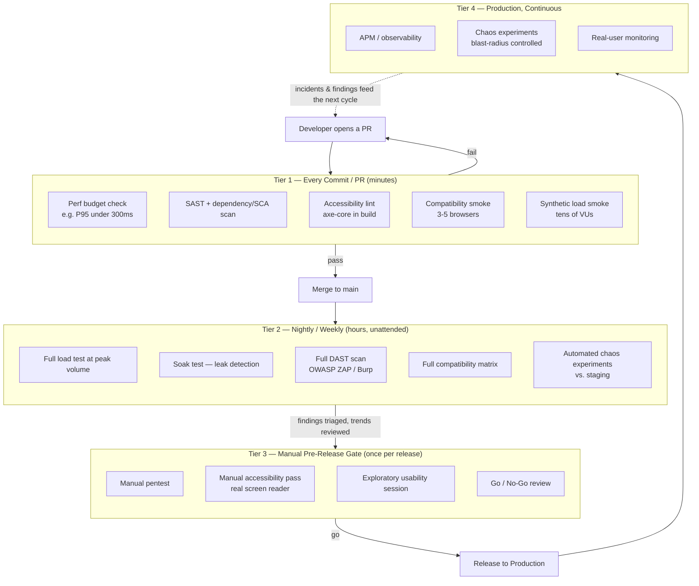

# Part 13: NFT in CI/CD, Chaos Engineering & Modern Trends

> **Study Guide for QA Professionals** — Non-Functional Testing, from first principles
> Difficulty Level: Advanced | Estimated Reading Time: 50 minutes
> **This is the capstone module of the 13-part course.**

---

## Table of Contents

1. [Shift-Left, Revisited: One Principle, Every Discipline](#131-shift-left-revisited-one-principle-every-discipline)
2. [A Practical Tiered CI/CD Pipeline for NFT](#132-a-practical-tiered-cicd-pipeline-for-nft)
3. [Chaos Engineering: From Recovery Testing to Continuous Failure Injection](#133-chaos-engineering-from-recovery-testing-to-continuous-failure-injection)
4. [AI-Assisted NFT in 2026](#134-ai-assisted-nft-in-2026)
5. [Observability as Continuous NFT](#135-observability-as-continuous-nft)
6. [Closing Synthesis — NFT as a Continuous Discipline](#136-closing-synthesis--nft-as-a-continuous-discipline)
7. [📌 Fact Sheet — Part 13 in 60 Seconds](#-fact-sheet--part-13-in-60-seconds)
8. [Common Interview Questions](#common-interview-questions)

---

## 13.1 Shift-Left, Revisited: One Principle, Every Discipline

Twelve parts ago, this course opened with a single claim: non-functional defects are
architectural, which makes them expensive to fix late. Every part since has quietly
built toward the same conclusion from a different angle — Part 2's load tests, Part
4's OWASP checks, Part 7's accessibility audits, Part 9's failover drills all get
cheaper and more effective the earlier they run. This final part makes that conclusion
explicit and gives it a shape you can actually wire into a pipeline.

"Shift-left" gets used as a buzzword so often it's lost its teeth. Here's the concrete
version, discipline by discipline — the same move applied ten different ways:

| NFT discipline (course part) | Pre-release-only version | Shift-left version |
|---|---|---|
| Performance (Parts 2–3) | One load test, run by a specialist, the week before release | A performance budget checked on **every pull request** — "this endpoint must not regress past 300ms P95" as an automated CI gate, not a spreadsheet someone reads once |
| Security (Parts 4–5) | An annual pentest engagement | SAST and dependency/SCA scanning on **every commit**, plus fast OWASP-fundamentals checks in CI; the pentest still happens, but it's the last gate, not the only one |
| Accessibility (Part 7) | A manual audit before a big launch | Automated accessibility linting (axe-core or equivalent) in the build pipeline on every PR, catching the 30–40% of WCAG violations tools can catch, before a human ever needs to look |
| Compatibility (Part 8) | Manual cross-browser testing before release | A fast compatibility smoke suite (3–5 critical browser/device combinations) on every merge to main, with the full matrix reserved for pre-release |
| Reliability (Part 9) | A disaster-recovery drill once a year | Automated chaos experiments running continuously against a production-like environment (Section 13.3) |

The throughline across all five rows is the same shape: **a small, fast, automated
version of the check runs constantly; a large, expensive, sometimes-manual version of
the same check runs less often, as a deeper gate.** That shape is what the rest of
this part turns into an actual pipeline design.

> [!TIP]
> **🎭 Meme Break — Expanding Brain**
>
> 🧠 *Level 1: "Shift-left means writing test cases earlier."*
> 🧠🧠 *Level 2: "Shift-left means testing in a lower environment."*
> 🧠🧠🧠 *Level 3: "Shift-left means a fast automated check on every commit, for every
> single NFT discipline — performance, security, accessibility, compatibility."*
> 🧠🧠🧠🧠 *Level 4: Shift-left means the checklist stops being a checklist and becomes
> a pipeline stage nobody can forget to run, because the merge button won't work
> without it.*

🧠 <strong>Quick Check:</strong> A team says "we shift left — we write our test cases during sprint planning instead of after development." Is that shift-left in the sense this section means?

Partially, and it's a common half-measure. Writing test cases earlier is genuinely
useful, but the shift-left principle this part is building toward is about **when
checks actually execute**, not just when they're planned. If the performance budget,
SAST scan, and accessibility lint still only run manually before release, the team has
shifted left their *planning* but not their *execution* — the non-functional defect
still gets discovered at the same late point in the pipeline it always did. Real
shift-left means the check runs automatically on every commit or PR, not that someone
thought about it earlier.

---

## 13.2 A Practical Tiered CI/CD Pipeline for NFT

You cannot run a full load test, a deep security scan, and a manual accessibility pass
on every commit — they're too slow and too expensive to gate a five-minute PR merge.
Nor can you defer everything to pre-release — that's exactly the anti-pattern Part 1
opened with. The answer is a **tiered model**: fast-cheap checks gate every commit,
expensive-thorough checks run on a schedule, and the most expensive, least automatable
checks stay a deliberate manual gate before release.

| Tier | Cadence | What runs | Why here, not elsewhere |
|---|---|---|---|
| **Tier 1 — Every commit / PR** | Seconds to a few minutes | Unit-level perf assertions, SAST + dependency/SCA scan, accessibility linting (axe-core), a 3–5 browser compatibility smoke suite, a lightweight synthetic load smoke test (tens, not thousands, of virtual users) | Fast enough not to block developer flow; catches the majority of regressions at the cheapest possible point in the cost curve |
| **Tier 2 — Nightly / weekly** | Hours | Full load test at realistic peak volume (Part 2), soak test for memory/connection leaks (Part 3), full OWASP ZAP/Burp dynamic scan, full cross-browser/device compatibility matrix (Part 8), automated chaos experiments against staging (Section 13.3) | Too slow or too resource-intensive for every commit, but still fully automatable — runs unattended overnight and reports findings by morning |
| **Tier 3 — Manual pre-release gate** | Once per release | Full manual penetration test (Part 5), manual accessibility pass with an actual screen reader (Part 7), exploratory usability testing with real users (Part 6), a go/no-go review of Tier 1/2 trend data | Needs human judgment, adversarial creativity, or lived disability experience that no automated check replicates — this is the gate the earlier tiers exist to make smaller and less frantic, not to replace |
| **Tier 4 — Production, continuous** | Always on | APM/observability (Section 13.5), automated chaos experiments in production with blast-radius control, real-user monitoring | Not a "test phase" at all in the traditional sense — this is the discipline that closes the loop back into Tier 1 |

The fintech-collection-engine's automation setup is a small, honest example of Tier 1
already half-built in a real portfolio project: its Playwright/TypeScript regression
suite is "designed to run headless in Jenkins/GitHub Actions on every merge to main" —
that's the functional half of Tier 1. The natural next step, and exactly the kind of
thing this part argues for, is putting its JMeter load profile through the same
door — not the full 3-hour, 180,000-transaction run on every merge, that belongs in
Tier 2, but a 5-minute slice of it (say, 20 merchants for 3 minutes, checking that P95
latency hasn't regressed past a fixed budget) sitting right next to the functional
suite in Tier 1. The full run — the one that actually surfaced database connection
pool saturation as the real bottleneck — stays a Tier 2 nightly job, because a 3-hour
gate on every PR would make the team route around it within a week.

Here's the full tiered pipeline as one diagram — the capstone view of everything this
course has built toward:

> [!TIP]
> **🎭 Meme Break — Drake Hotline Bling**
>
> ❌ *"We have a full NFT test plan — it runs once, three days before release."*  
> ✅ *"We have a tiered NFT pipeline — a fast slice of every discipline runs on every
> commit, the expensive version runs nightly, and the pre-release gate only has to
> catch what automation genuinely can't."*

🧠 <strong>Quick Check:</strong> Why shouldn't the fintech-collection-engine's full 3-hour, 180,000-transaction JMeter load test run on every pull request?

Because it would make CI too slow to be usable — a 3-hour gate on every PR either
trains developers to batch changes into rare, huge merges (defeating the point of
continuous integration) or gets bypassed entirely the first time someone needs to ship
a hotfix. The tiered model puts a cheap slice of the same test (a few minutes, a
fraction of the load, checking against a fixed latency budget) in Tier 1 so regressions
are still caught fast, while the full realistic-volume run — the one that actually
found database connection pool saturation as the bottleneck — stays in Tier 2, running
unattended overnight where its cost doesn't block anyone.

---

## 13.3 Chaos Engineering: From Recovery Testing to Continuous Failure Injection

Part 9 covered recovery testing: verify the system comes back correctly after a
failure you deliberately caused — kill a node, drop a database connection, cut network
access to a dependency — usually as a planned, occasional exercise in a controlled
environment. **Chaos engineering is that same idea, generalized and made continuous.**
The formal definition: chaos engineering is the discipline of **deliberately injecting
failure into a system — often in production or a production-like environment — to
build confidence in its ability to withstand turbulent, real-world conditions**,
before those conditions happen to you unannounced at 2 AM.

The practice was popularized by Netflix, whose "Chaos Monkey" concept — randomly
terminating instances in production to force engineering teams to build systems that
tolerate individual failures as a matter of course, not a special case — became the
namesake for an entire category of chaos-engineering tooling that followed. The exact
tools an org uses matter less than the five principles underneath the practice:

1. **Start with a steady-state hypothesis.** Before injecting anything, define what
   "normal" looks like in measurable terms — e.g. "checkout success rate stays above
   99.5% and P95 latency stays under 400ms." Without this, you can't tell whether the
   chaos you injected actually mattered.
2. **Vary real-world events.** Inject the failures that actually happen to real
   systems — server crashes, network latency spikes, dependency timeouts, disk
   exhaustion, malformed responses from a third party — not arbitrary or unrealistic
   faults.
3. **Run experiments in production (carefully).** Staging environments rarely
   replicate production's real traffic patterns, data shape, and scale — a chaos
   experiment that only ever runs in staging is testing a hypothesis about staging,
   not about the system your users actually depend on. This is the most
   counter-intuitive principle for teams used to treating production as sacred, and
   it's also the one that matters most.
4. **Automate experiments to run continuously.** A chaos experiment run once, by hand,
   the week before a big launch is closer to Part 9's recovery testing than to chaos
   engineering proper — the discipline's real value shows up when experiments run
   continuously, catching regressions in resilience the same way a regression suite
   catches regressions in functionality.
5. **Minimize blast radius.** Every principle above sounds reckless without this one.
   Real chaos engineering practice starts small — a tiny percentage of production
   traffic, one instance, one region — with an automatic abort mechanism if the
   steady-state hypothesis breaks, and only expands scope once confidence is earned at
   each smaller scale.

### A chaos experiment worth running: what happens when the AI Dispute Resolution Engine's data source goes down?

Here's a scenario built from a real architecture in this account's own portfolio,
narrated as the chaos experiment it deserves to be.

The AI Dispute Resolution Engine is a shared AI operations layer sitting across six
connected fintech products — Collection, Payout, Connected Banking, BBPS, Reseller,
and YOBO — reading data from each of them (with permission) to answer questions,
resolve disputes, and in low-risk cases act directly. About 80% of raised issues get
resolved by the AI without a human ever getting involved; a merchant asking "why is my
collection still processing?" gets an answer pulled live from Collection Engine data,
correlated against transaction status, in seconds instead of the 24–72 hour baseline a
human-only support queue used to take.

Now run the chaos experiment: **what happens when Connected Banking — one of the six
upstream products the Copilot depends on for data — becomes slow or unavailable while
a merchant is mid-conversation asking about a stuck transfer?** Does the AI engine
detect the timeout and gracefully say "I can't reach that system right now, let me
escalate this to a human agent," carrying the full conversation context forward the
way its documented escalation path already promises for low-confidence cases? Or does
it hang waiting on a call that never returns, guess at an answer using stale or
incomplete data, or — worse — silently misattribute a Connected Banking data gap to
the merchant's transaction actually being stuck, generating a false alert? Because this
engine is shared across six products, the blast radius of getting this wrong isn't
one product's support quality degrading — it's all six simultaneously, which is
exactly the "6x blast radius" the engine's own documentation already flags for
regression testing. A chaos experiment injecting latency or timeouts into one upstream
product's data feed, run automatically against a staging instance of the engine on a
schedule, is the direct extension of that same risk awareness into Section 13.3's
territory: don't just test that a regression in intent recognition breaks all six
products at once — test that an upstream *outage* does the same, before a real
Connected Banking incident finds out for you, live, mid-conversation, with a real
merchant on the other end.

→ Reference: <a href="https://github.com/ghanendra-sdet/ai-dispute-resolution-engine" target="_blank" rel="noopener noreferrer">AI Dispute Resolution Engine</a>

> [!WARNING]
> **🎭 Meme Break — "This Is Fine" Dog**
>
> 🔥 *The AI Copilot's escalation path is documented and tested for low-confidence
> answers.*
> 🔥 *Nobody has tested what it does when Connected Banking, one of its six data
> sources, just... doesn't respond.*
> 🔥 *This is fine, probably, we'll find out during the actual outage.*

🧠 <strong>Quick Check:</strong> A team runs a chaos experiment exactly once, manually, the week before a major launch, and calls it "chaos engineering." What's missing from that claim, per the five principles in this section?

Mainly principle 4 — automation and continuity. A single, hand-run experiment before a
launch is a valuable exercise, but it's really Part 9's recovery testing under a
trendier name, not chaos engineering as a discipline. Real chaos engineering runs
experiments continuously and automatically, the same way a regression suite runs on
every build, so that a resilience regression introduced by an unrelated code change
three weeks after launch gets caught the same week it was introduced — not
rediscovered by accident during the next real incident.

---

## 13.4 AI-Assisted NFT in 2026

AI tooling has genuinely changed the day-to-day mechanics of non-functional testing —
but the framing that's held throughout this course applies here with full force:
**supervise, don't blindly trust.** Every category below is real and useful; none of
them removes the need for a human who understands what the tool actually checked.

**AI-assisted test data generation for load tests.** Generating tens of thousands of
realistic-but-synthetic merchant profiles, transaction amounts, and timing patterns
for a load test used to be a slow, manual scripting task. AI-assisted generation can
produce data that better mimics real-world distributions (realistic amount
clustering, plausible retry patterns, believable merchant-category mixes) far faster
than hand-written data generators — genuinely useful for Part 2 and 3's load and
scalability work. The supervision point: generated data still needs a human to sanity
check it against real production shape before it's trusted as representative — a load
test run against data that "looks plausible" but doesn't match real transaction-size
distributions tells you about a system that doesn't exist.

**AI-powered visual regression tools.** Traditional pixel-diff visual regression
tools flag every pixel that changed, drowning teams in false positives from anti-aliasing
and font-rendering noise. AI-powered visual regression tools instead learn to
distinguish a meaningful layout break from harmless rendering noise, cutting false
positives significantly — useful for Part 8's compatibility work across browser/device
combinations. The supervision point: "meaningful" is still a judgment call trained on
past examples, and a genuinely new kind of visual bug the model hasn't seen before can
still slip through as "probably fine."

**Self-healing compatibility tests.** When a locator breaks because of a minor DOM
change, self-healing frameworks attempt to find the "same" element using alternate
signals (text content, relative position, accessibility attributes) rather than
failing outright — reducing the maintenance burden of Part 8's cross-browser
compatibility suites. The supervision point: a self-healing test that silently
re-locates the wrong element and keeps passing is worse than a test that fails loudly
— any self-healing action should be logged and reviewed, not treated as invisible
infrastructure.

**LLM-assisted security finding triage and summarization.** A full DAST scan (Part 5)
against a real application can produce hundreds of findings, many of them
low-severity or outright false positives. LLM-assisted triage can cluster related
findings, draft a plain-language summary of what each one actually means, and suggest
a priority ordering — genuinely valuable for making a Tier 2 nightly scan's output
digestible the next morning instead of an unread wall of XML. The supervision point,
stated as directly as the rest of this course states it: an LLM summarizing "this
looks like a false positive" is a starting hypothesis for a security engineer to
verify, never a finding to close unread. The cost asymmetry is brutal and one-sided —
a wrongly dismissed true positive is a breach; a wrongly investigated false positive is
twenty minutes.

> [!CAUTION]
> **🎭 Meme Break — Is This a Pigeon**
>
> 🦋 *A DAST scan finding correctly summarized by an LLM as "likely a false positive,
> low confidence, please verify manually."*
> 🧍 *A team that closes it without the manual verification step.*
> 🦋 *"Is this... a resolved finding?"*

🧠 <strong>Quick Check:</strong> An LLM-assisted triage tool summarizes a security finding as "low severity, likely a false positive." What's the correct next action?

A human security-aware reviewer verifies it before closing — the summary is a
prioritization aid, not a verdict. The framing this whole course has used for AI
tooling applies directly: the model can meaningfully speed up triage of a large
findings list, but "the AI said it's probably fine" is not evidence the finding is
actually fine, and the asymmetric cost of being wrong (a missed real vulnerability vs.
a few minutes double-checking a true false positive) makes skipping verification a bad
trade even when the AI is right most of the time.

---

## 13.5 Observability as Continuous NFT

Here's a claim most QA curricula don't say out loud: **production monitoring and APM
(Application Performance Monitoring) is itself a non-functional testing activity,
running continuously, not a separate discipline that starts where testing ends.** The
line between "testing" and "monitoring" that most org charts draw — QA owns
pre-release, SRE/Ops owns production — describes who's on call, not where NFT
actually happens.

Think about what APM tooling actually does: it continuously measures response times
against a baseline (a live version of Part 2's performance testing), watches error
rates and dependency health (a live version of Part 9's reliability testing), and
often includes real-user monitoring that captures actual device/browser/network
conditions in the wild (a live version of Part 8's compatibility testing, at a scale
no pre-release test matrix can match — because it's not a matrix of combinations
someone guessed mattered, it's literally every combination your real users actually
have). A performance regression alert firing in production because P95 latency
crossed a threshold is functionally the same signal as a load test failing a budget
check in Tier 1 — it's just running against real traffic instead of synthetic traffic,
continuously instead of on a schedule.

This reframing has a practical consequence for how a QA-minded engineer should think
about their own scope: the job isn't done at the Tier 3 go/no-go gate in Section 13.2.
The steady-state hypothesis from a chaos experiment (Section 13.3) and the performance
budget checked in Tier 1 are both just narrower, more deliberate versions of the same
question APM asks continuously in production: **is the system still behaving the way
we expect, right now?** Tier 4 in the pipeline diagram earlier in this part isn't a
polite nod to "ops does monitoring too" — it's the mechanism that closes the loop,
feeding real production findings back into what Tier 1 and Tier 2 test for next.

> [!TIP]
> **🎭 Meme Break — Distracted Boyfriend**
>
> 🚶 *QA, walking with:* **"My job is testing before release."**  
> 👀 *Looking back at:* **"The APM dashboard that's been running a live performance
> and reliability test on production, continuously, this whole time."**

🧠 <strong>Quick Check:</strong> Why does this section argue that "monitoring" and "non-functional testing" aren't actually two separate disciplines, despite usually sitting in different org charts?

Because they ask the same underlying question — "is the system still meeting its
non-functional requirements right now?" — just at different points in the lifecycle
and with different traffic sources. A load test checks performance against synthetic
traffic before release; APM checks the same performance characteristic against real
traffic continuously after release. Treating them as unrelated disciplines owned by
different teams risks losing the feedback loop between them — production findings
should directly reshape what the next release's Tier 1/Tier 2 checks look for, which
only happens naturally if the people running both see them as the same activity at
different points in time, not two separate jobs.

---

## 13.6 Closing Synthesis — NFT as a Continuous Discipline

Part 1 opened this course with the ISO/IEC 25010 quality model and a promise: thirteen
parts covering every characteristic in it, properly. Twelve parts later, that promise
is kept — Performance Efficiency (Parts 2–3), Security (Parts 4–5), Interaction
Capability (Parts 6–7), Compatibility (Part 8), Reliability (Part 9),
Maintainability and Flexibility (Part 10), and the compliance/privacy/localization
corner of Security and Flexibility (Part 11), tied together by planning strategy
(Part 12) and now this part's cross-cutting theme. The one characteristic this course
never taught in isolation is the one this final part has been arguing for the whole
time: **NFT itself isn't a phase, a checklist, or a pre-release gate — it's a
continuous discipline threaded through the entire SDLC and into production, the same
way this part's Tier 4 loops back into Tier 1.**

Return to the two scene-setting failures Part 1 opened with, and ask the question this
whole course has been building toward: **what would have actually prevented them?**

Ticketmaster's 2022 Eras Tour sale collapsed under real-world concurrent load that
nobody had proven the system could survive. Not "a load test would have helped" in
the vague, hand-wavy sense — specifically: a Tier 1 performance budget on checkout
endpoints would have caught a regression the moment it was introduced, not three days
before a headline sale. A Tier 2 nightly load test at realistic peak volume, run
continuously against a staging environment shaped like the real system, would have
surfaced the actual ceiling weeks in advance instead of discovering it live, in front
of the U.S. Senate. And if the team had run chaos experiments varying real-world
events — a payment gateway slowing under its own load, a queueing service behaving
unexpectedly at scale — Section 13.3's principle of "vary real-world events" would
have forced the steady-state hypothesis to be tested against exactly the kind of
demand spike that actually happened, instead of assuming the happy path scaled
linearly.

Flipkart's repeated Big Billion Day crashes tell the same story from a different
angle: a launch-day traffic spike is not a novel event, it is an entirely
predictable, recurring, scheduled event — which makes it one of the easiest possible
candidates for a scheduled Tier 2 load test calibrated to the specific date, plus a
chaos experiment that deliberately simulates the exact spike shape the event is known
to produce. The failure wasn't a testing gap in the sense of "nobody thought to test
performance" — by 2026 every team knows to load test. It's a **cadence** gap: a
once-a-year load test run the week before the sale is a Tier 3 manual gate wearing a
Tier 2 costume, disconnected from the continuous performance-budget checks that would
have caught a creeping regression introduced in the eleven months since the last one.

That's the whole argument of this course, restated one final time: **every quality
characteristic in ISO 25010 degrades continuously, under continuous change, so the
testing that protects it has to be continuous too.** A system that passed its
performance budget, its security scan, its accessibility lint, and its compatibility
smoke suite on the day it shipped has told you nothing about whether it still does
either of those things after the fortieth unrelated commit lands three months later —
which is exactly why this course ends not with a checklist, but with a pipeline: fast
checks on every commit, thorough checks on a schedule, human judgment where automation
genuinely can't substitute for it, and production monitoring that never stops asking
the same question every other tier already asked. Non-functional testing was never
really a phase of the SDLC. It's the SDLC's immune system — and like any immune
system, it only works if it's always on.

---

## 📌 Fact Sheet — Part 13 in 60 Seconds

- **Shift-left applies to every NFT discipline in this course**, not just performance:
  a fast performance budget on every PR, SAST/dependency scanning on every commit,
  accessibility linting in the build, and a compatibility smoke suite on every merge
  are the "every commit" versions of Parts 2–3, 4–5, 7, and 8 respectively.
- **The tiered CI/CD model**: Tier 1 (every commit — fast, cheap), Tier 2
  (nightly/weekly — full load tests, deep security scans, full compatibility
  matrices), Tier 3 (manual pre-release gate — pentest, manual accessibility pass,
  exploratory usability), Tier 4 (production, continuous — APM, chaos, real-user
  monitoring) — each tier feeds findings back to the ones before it.
- **Chaos engineering** = deliberately injecting failure into a system, often in
  production, to build confidence in its resilience. Five principles: steady-state
  hypothesis, vary real-world events, run in production carefully, automate
  continuously, minimize blast radius.
- Chaos engineering **extends** Part 9's recovery testing from an occasional, manual
  drill into an automated, continuous practice — popularized industry-wide by
  Netflix's Chaos Monkey concept.
- **AI-assisted NFT, 2026-realistic**: synthetic load-test data generation,
  AI-powered visual regression (fewer false positives than raw pixel diffing),
  self-healing compatibility tests, and LLM-assisted security-finding triage — all
  genuinely useful, all requiring human supervision before any finding is trusted or
  dismissed.
- **Observability is continuous NFT**, not a separate discipline: APM measures
  performance and reliability against real traffic continuously, the same way a load
  test measures it against synthetic traffic on a schedule — the org-chart split
  between QA and Ops describes ownership, not where testing actually happens.
- **The closing argument of the whole course**: ISO 25010's quality characteristics
  degrade continuously under continuous change, so NFT has to run continuously too —
  a pre-release checklist tells you the system was fine on release day, and nothing
  about the day after.
- Ticketmaster's 2022 collapse and Flipkart's repeated Big Billion Day crashes both
  had a **cadence gap**, not a total testing gap — the fix was never "test
  performance," it was "test it continuously, on every change, not once before a
  known, predictable spike."

---

## Common Interview Questions

### Question 1: How would you design a CI/CD pipeline that includes non-functional testing without slowing down every deployment?

**Model Answer:**

"I'd use a tiered model. Tier 1 runs on every commit or PR — fast, cheap checks: a
performance budget assertion against a fixed latency threshold, a SAST and dependency
scan, an accessibility lint like axe-core, and a small compatibility smoke suite
across 3–5 browsers. None of that should take more than a few minutes. Tier 2 runs
nightly or weekly, unattended — the full load test at realistic peak volume, a soak
test for leaks, a full DAST scan, and the complete compatibility matrix. Tier 3 stays
a manual pre-release gate for things automation genuinely can't replace — a real
penetration test, a manual accessibility pass with a screen reader, exploratory
usability testing. And Tier 4 is production itself — APM and chaos experiments running
continuously, feeding findings back into what Tier 1 and Tier 2 check for next. The
goal is that every discipline has both a fast version and a thorough version, and
neither one blocks the other."

### Question 2: What's the difference between the recovery testing covered earlier in an NFT curriculum and chaos engineering?

**Model Answer:**

"Recovery testing is usually a planned, occasional exercise — deliberately fail a
component in a controlled environment and verify the system recovers correctly.
Chaos engineering is the same underlying idea generalized into a continuous practice:
automated experiments, often running against production or a production-like
environment, that continuously validate a steady-state hypothesis under real-world
failure conditions, with blast radius carefully controlled. The practical difference
is cadence and automation — a resilience check run once before a launch tells you the
system was resilient that day; continuous chaos experiments tell you it's still
resilient after every change since."

### Question 3: How should a QA engineer supervise AI-assisted NFT tooling rather than trust it outright?

**Model Answer:**

"Treat every AI output in this space as a strong first draft, not a verdict. AI-powered
visual regression tools cut false positives dramatically compared to raw pixel diffing,
but a genuinely novel visual bug can still slip past a model trained on past examples.
Self-healing compatibility tests reduce maintenance overhead, but a silently
re-located locator can mask that the test is no longer checking what it originally
checked, so healing actions need to be logged and reviewed. And LLM-assisted security
triage is the highest-stakes case — a finding summarized as 'likely a false positive'
is a hypothesis for a security-aware reviewer to verify, never something to close
unread, because the cost of wrongly dismissing a true vulnerability is wildly higher
than the cost of double-checking one that turns out to be nothing."

### Question 4: This is the final module of a 13-part NFT course. How would you summarize the single biggest idea it's been building toward?

**Model Answer:**

"That non-functional testing was never really a separate phase from development or
release — it's a continuous discipline that has to run for the life of the system, not
just before it ships. Every quality characteristic in ISO 25010 can degrade with any
change, which is exactly why this course kept coming back to the same shape in every
part: a fast check that runs constantly, and a thorough check that runs periodically,
feeding into a human gate only where automation genuinely can't substitute for
judgment. Ticketmaster and Flipkart didn't fail because nobody tested performance —
they failed because the testing that existed wasn't continuous enough to catch a
regression introduced between one check and the next. Building that continuous loop —
CI/CD gates, chaos experiments, and production observability all feeding back into each
other — is what turns NFT from a checklist you complete into an immune system that's
always on."
